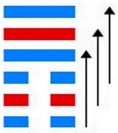

# 否 ䷋ pǐ

- No.12

> 否之匪人，不利君子貞，大往小來。
>《彖》曰：否之匪人，不利君子貞，大往小來，則是天地不交而萬物不通也，上下不交而天下无邦也。內陰而外陽，內柔而外剛，內小人而外君子，小人道長，君子道消也。
>《象》曰：天地不交，否。君子以儉德辟難，不可榮以祿。

> 初六，拔茅茹，以其彙。貞吉，亨。
>《象》曰：拔茅貞吉，志在君也。

> 六二，包承，小人吉，大人否亨。
>《象》曰：大人否亨，不亂群也。

> 六三，包羞。
>《象》曰：包羞，位不當也。

> 九四，有命无咎，疇離祉。
>《象》曰：有命无咎，志行也。

> 九五，休否，大人吉。其亡其亡，繫于苞桑。
>《象》曰：大人之吉，位正當也。
>《繫辭》：子曰：危者安其位者也，亡者保其存者也，亂者有其治者也，是故，君子安而不忘危，存而不忘亡，治而不忘亂，是以身安而國家可保也。易曰：「其亡其亡，繫于苞桑。」

> 上九，傾否，先否後喜。
>《象》曰：否終則傾，何可長也。

内象阴长，
> 纯用阴事。

天气上腾，地气下降，二象分离，万物不交也。小人道长，君子道消。
> 阴小人，阳君子。

《易》云：“否之匪人。”与坤为飞伏，三公居世。
> 乙卯木，甲辰土。

上九宗庙为应。君子以俟时，小人为灾。
> 乙卯泰来。 

建壬申至丁丑，阴气浸长。
> 七月立秋，至十二月大寒。

积筭起丁丑至丙子，周而复始。
> 金、丑土同宫，吉凶见矣。

五星从位起岁星，
> 木星入卦用事。

柳宿从位降乙卯。
> 乙卯临三公。

气分气候三十六。
> 六六三十六，积筭吉凶。 

阴阳升降，阳道消铄，阴气凝结，君臣父子各不迨及。
> 阴荡阳来道行矣。

《易》曰：“其亡其亡，系于苞桑。”
> 苞桑则丛桑也。

天地清浊，阴薄
> 音搏。

阳消，天地盈虚，与时消息。危难之世，势不可久。五位既分，四时行矣。
> 君子当危难世，独志，难不可久。立特处不改其操，将及泰来。

上九云：“否极则顷，何可长也。”
> 否极则泰来。

阴长降入于观。
> 九四被阴逼入观卦。
　　　　　　　　
# [Pǐ ䷋](e590a6pi.md)
