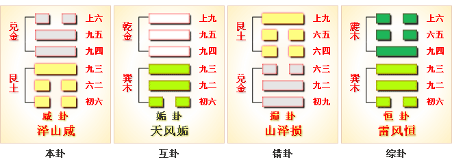

# 咸 ䷞ xián

- No.31

> 咸，亨，利貞，取女吉。
>《彖》曰：咸，感也。柔上而剛下，二氣感應以相與，止而說，男下女，是以亨，利貞，取女吉也。天地感而萬物化生，聖人感人心而天下和平。觀其所感，而天地萬物之情可見矣。
>《象》曰：山上有澤，咸，君子以虛受人。

> 初六，咸其拇。
>《象》曰：咸其拇，志在外也。

> 六二，咸其腓，凶，居吉。
>《象》曰：雖凶居吉，順不害也。

> 九三，咸其股，執其隨，往吝。
>《象》曰：咸其股，亦不處也。志在隨人，所執下也。

> 九四，貞吉，悔亡。憧憧往來，朋從爾思。
>《象》曰：貞吉悔亡，未感害也；憧憧往來，未光大也。

> 九五，咸其脢，无悔。
>《象》曰：咸其脢，志末也。

> 上六，咸其輔頰舌。
>《象》曰：咸其輔頰舌，滕口說也。

山下有泽，虚已畜物，阳中积阴，感于物也。阳下于阴，男女之道，内外相应，感类于象也。六二待聘，九五见召，二气交感，夫妇之道，体斯合也。《易》曰：“咸，感也，利取女，吉。”
> 艮少男，兑少女，男下于女，取妇之象。

与艮为飞伏。
> 丙申金，丁丑土。

九三三宫居世，上六宗庙为应。建始戊午之癸亥，
> 芒种，小雪。

积筭起癸亥至壬戌，周而复始。火土入艮兑。
> 分火土象入艮兑也。

五星从位起荧惑，
> 火星南方入金宫。

柳宿从位降丙申，
> 二十八宿，分柳宿入咸九三丙申金爻上。

分气候三十六。
> 积筭起数，分三十六位起吉凶。

土上见金，母子气和，阴阳相应，刚柔定位。吉凶随爻，受气出则吉，刑则凶。阴阳等降入外险，止于内象，为山水蹇卦。
> 九四爻之入阴中刚。
　　　　　　　　　　　　　　　　　　　　　　　　　　　　　　　　
# [Xián ䷞](e592b8xian.md)
