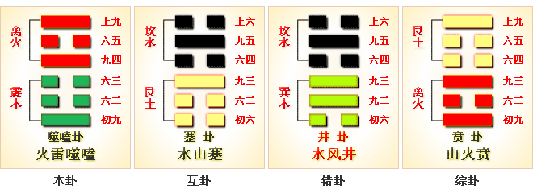
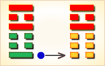
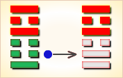
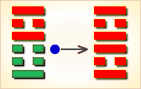
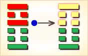
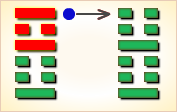

# 噬嗑 ䷔

噬嗑（䷔ shì kè）卦的代号是`4:5`。主卦是`4`卦，震卦，阳数是`4`；客卦是`5`卦，离卦，阳数是`5`，客方稍强于主方，主方处境不易，就像是被客方噬嗑。噬嗑为上下颚咬合，咀嚼。火雷噬嗑，刚柔相济。这个卦是异卦，下震上离，相叠。离为阴卦；震为阳卦。此卦是阐释刑罚的原则：法治是政治的根本，为排除障碍，保障善良，建立及保持秩序，往往不得不采取不得已的刑罚手段。罪恶必须及早加以阻止，以防止蔓延。应当采重罚主义，以“小惩大戒”。运拙如同身受饥，幸得送饭又送食，适口充腹心欢喜，忧愁从此渐消移。

图中，红色表示当位的爻，天蓝色表示不当位的爻，箭头表示有应。

- 卦序：21

> 噬嗑，亨，利用獄。
>《彖》曰：頤中有物，曰噬嗑。噬嗑而亨，剛柔分動而明，雷電合而章，柔得中而上行，雖不當位，利用獄也。
>《象》曰：雷電，噬嗑，先王以明罰敕法。
>《繫辭》：「日中為市，致天下之民，聚天下之貨，交易而退，各得其所，蓋取諸噬嗑。」

> 初九，履校滅趾，无咎。
>《象》曰：屨校滅趾，不行也。
>《繫辭》：「子曰：小人不恥不仁，不畏不義，不見利不勸，不威不懲，小懲而大誡，此小人之福也。易曰履校滅趾，无咎，此之謂也。」

> 六二，噬膚滅鼻，无咎。
>《象》曰：噬膚滅鼻，乘剛也。

> 六三，噬腊肉，遇毒，小吝，无咎。
>《象》曰：遇毒，位不當也。

> 九四，噬乾胏，得金矢，利艱貞，吉。
>《象》曰：利艱貞吉，未光也。

> 六五，噬乾肉，得黃金。貞厲，无咎。
>《象》曰：貞厲无咎，得當也。

> 上九，何校滅耳，凶。
>《象》曰：何校滅耳，聰不明也。

> 噬嗑（䷔ shì kè）卦是异卦，下震上离，相叠。离为阴卦；震为阳卦。阴阳相交，咬碎硬物。喻恩威并施，宽严结合，刚柔相济。噬嗑为上下颚咬合，咀嚼。

>《象传》：上唇与下唇间有物，必须咬断，方能合拢，乃诸事被阻，务必去除，方可成功。

> 诸事阻隔，纷争难免，宜守常规，不为利诱，问题可解决。

- 事业：困难与阻力非常大，应以坚强的意志，果敢的行为，公正无私的态度去战胜种种厄运，争取事态好转。为了早日化险为夷，必要时可采取强硬手段，甚至诉诸法律。
- 经商：处于不利的时候，头脑冷静，明察形势，寻求机遇，不为眼前小利所诱，不发非分之财。认真听取忠告，遵守法纪，秉公办事，不得徇私情，更警惕不得触犯刑律。
- 求名：自己的努力尚不为人所知，不可急于求成，受到挫折应看作是对自己的考验，持之以恒，必能成功。
- 婚恋：初不顺利，须有顽强精神可以取得满意的结果，不可以个人的情绪左右家庭事务。
- 决策：一生不平坦，会遇到挫折和磨难，但应看作是对个人的考验，应认真总结经验教训，以更为坚强的意志，不屈不挠，继续前进。经过锻炼，各方面都会有较大的进展，终将进入光明境地，取得重大成就。

噬嗑卦离上震下，为巽宫五世卦。噬嗑为咬合之意，象征物品咬碎之后才能通过。此卦于诉讼有利。

咬碎硬骨，强硬态度；事多困阻，积极谋求。得此卦者，事不遂心，纷争难免，诸事被阻，宜坚守常规，不为利诱，可保平安。

- 时运：好运初动，声名直上。
- 财运：买卖皆成，货物畅销。
- 家宅：小心火灾；百年好合。
- 身体：须防郁热，失物不保。

> 噬嗑：表示如鲠在喉、难以决策。主吉凶未定，是个状况卦，有点偏小凶。也如同「鸡肋」一般，食之无味、弃之又可惜！是需要坚决下个决心的时候了！

> 解释：被吞没掉。

> 特性：生命力强，坚守奋斗，百折不挠，对自己要求很高，不断充实自己，突破超越提升。克服困难，宜往大企业大单位任职，较能有所表现。

> 运势：诸事不遂心，多受阻害。有纷争，无法前进之时，宜守原则，不为利诱，以免被人中伤。然而一般人多有无法逃避利诱者，故必受祸，若能和气处事为安，更须突破困难方可通达。

- 家运：家庭有不和现象，亦常有无法沟通之阻碍。除非彼此能够排除成见，否则无法融洽相处。
- 疾病：病情严重，注意足部，心脏、神经系统病变。
- 胎孕：胎有惊。
- 子女：儿女倔强、反抗。
- 周转：卦已明示有困难，但诚心或可圆满。
- 买卖：多阻挠且多是非。但若积极推进，不要放弃，则有利，可成。
- 等人：受到阻碍，不能来。
- 寻人：必因发生争端或涉嫌重大事件而出走。去庙观市井求之，东、南方。
- 失物：有被人捷足捡走的可能，寻回的机会不大。
- 外出：另择他日为佳。若非出门不可，务必充分准备，小心为是。
- 考试：不佳。
- 诉讼：宜采取主动，据理力争。
- 求事：多生枝节，不利。唯有积极去谋求方有所成就。
- 改行：有碍，但耐心排除可成。
- 开业：开业吉，中途有是非，宜耐心解决。

### 初九：屦校灭趾，无咎。《象》曰：屦校灭趾，不行也。

拖着刑具，磨破了脚趾，但没有大的灾难。《象传》：拖着刑具，磨破了脚趾，小惩则可大戒，使之不重犯过错。

凶：得此爻者，宜谨慎行事，以免生祸端。做官的会遭到贬职。

- 时运：须防小灾，慎免大患。
- 财运：谨慎交易，避开木业。
- 家宅：兴工改造；婚嫁不宜。
- 身体：足病初发，宜早医治。

初九爻动变得[第35卦：火地晋](e6998bjin_cn.md)。

火地晋䷢是异卦，下坤上离，相叠。离为日，为光明；坤为地。太阳高悬，普照大地。大地卑顺，万物生长，光明磊落，柔进上行，喻事业蒸蒸日上。

### 六二：噬肤灭鼻，无咎。《象》曰：噬肤灭鼻，乘刚也。

大吃鲜鱼嫩肉，遭受割鼻之刑，但没有大难。《象传》：大吃鲜鱼嫩肉，遭受割鼻之刑，因为六二之爻居于阳爻之上，像人享受非分之福。

平：得此爻者，进退艰难，是非不断，或生暗疾，骨肉有伤。做官的不会顺利，会有所纠结。

- 时运：才力尚浅，须借人助。
- 财运：暂时保存，待价出手。
- 家宅：老宅不利；婚嫁兴家。
- 身体：肌肤有病，小心深入。

六二爻动变得[第38卦：火泽睽](e79dbdkui_cn.md)。

火泽睽䷥是异卦，下兑上离，相叠。离为火；兑为泽。上火下泽，相违不相济。克则生，往复无空。万物有所不同，必有所异，相互矛盾。睽即矛盾。

### 六三：噬腊肉，遇毒。小吝，无咎。《象》曰：遇毒，位不当也。

吃腊肉，中毒。碰上了麻烦，但不十分严重。《象传》：中毒，因为六三阴爻居于阳位，像人不称其位。

凶：得此爻者，不易成事，运气不顺，或生心腹之疾，或有惊险。做官的才力不及，有失。

- 时运：气运不佳，反遭人怨。
- 财运：处置不当，反受损失。
- 家宅：小有不安。
- 身体：药不对症，幸无大碍。

六三爻动变得[第30卦：离为火](e7a6bbli_cn.md)。

离为火䷝是同卦，下离上离，相叠。离者丽也，附着之意。一阴附丽，上下二阳。该卦象征火，内空外明。离为火、为明，太阳反复升落，运行不息，柔顺为心。

### 九四：噬干胏，得金矢。利艰贞，吉。《象》曰：利艰贞吉，未光也。

啃吃骨头，发现骨头中有金属箭头。卜问艰难之事，结果是吉利的。《象传》：卜问艰难之事，结果是吉利的，但目前仍处于艰难之中，尚未进入光明之境。

吉：得此爻者，经商必获利。做官的会升迁，读书人会成名。

- 时运：改旧促新，万事皆吉。
- 财运：小本大利，自然可喜。
- 家宅：保家有道；婚嫁勤俭。
- 身体：难治之症，宜多调养。

九四爻动变得[第27卦：山雷颐](e9a290yi_cn.md)。

山雷颐䷚是异卦，下震上艮，相叠。震为雷，艮为山。山在上而雷在下，外实内虚。春暖万物养育，依时养贤育民。阳实阴虚，实者养人，虚者为人养。自食其力。

### 六五：噬干肉，得黄金。贞厉，无咎。《象》曰：贞厉无咎，得当也。

吃干肉，发现金属箭头。卜问得危险之兆，但最终可以无灾祸。《象传》：卜问得危险之兆，但最终可以无灾祸，因为六五之爻居上卦中位，位象得当，可以化险为夷。

吉：得此爻者，行好运，有病的会痊愈，有冤的会昭雪，读书人进取成名，做官的会剪除小人。

- 时运：正当行运，无不如意。
- 财运：上品货物，自然得利。
- 家宅：方位合宜。
- 身体：忌食肉类，小心调养。

六五爻动变得[第25卦：天雷无妄](e697a0e5a684wuwang_cn.md)。

天雷无妄䷘是异卦，下震上乾，相叠。乾为天为刚为健；震为雷为刚为动。动而健，刚阳盛。人心振奋，必有所得，但唯循纯正，不可妄行。无妄必有获，必可致福。

### 上九：何校灭耳，凶。《象》曰：何校灭耳，聪不明也。

肩上扛着大枷，磨破了耳朵，凶险。《象传》：肩上杠着大枷，磨破了耳朵，因为其人不听劝阻，触犯了刑律。

凶：得此爻者，须防争诉，不良者，耳目不明，血气不顺，或有生命之忧。做官的须防止小人的谗言而遭致贬职。

- 时运：柔和处世，可保无虞。
- 财运：得利即止，可无大损。
- 家宅：须防意外。
- 身体：眼耳之疾；保养头部。

上九爻动变得[第51卦：震为雷](e99c87zhen_cn.md)。

震为雷䷲是同卦，下震上震，相叠。震为雷，两震相叠，反响巨大。可消除沉闷之气，亨通畅达。平日应居安思危，怀恐惧心理，不敢有所怠慢，遇到突发事变，也能安然自若，谈笑如常。

# [Shì Kè ䷔](e599ace59791shike.md)
