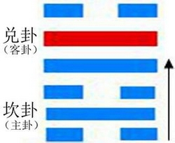
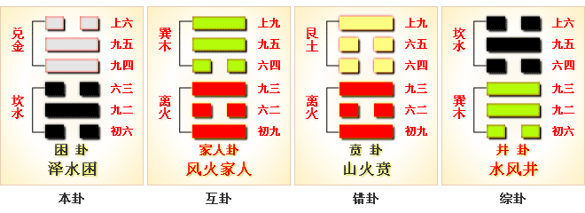
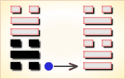
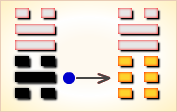
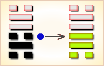
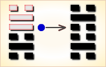
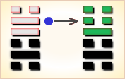
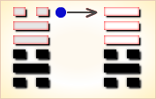

# 困 ䷮



本卦为异卦相番(坎下兑上)。上卦为兑，兑为阴，为泽；下卦为坎，坎为阳，为水，大泽漏水，水草鱼虾，处于穷困之境。
阳处阴下，刚为柔掩，像君子才智难展，处于困乏之地。所以卦名曰困。

困卦代号是`2:6`，主卦是坎卦，卦象是水，阳数是`2`；客卦是兑卦，卦象是泽，阳数是`6`。
《困》卦谈的是君侯遭遇困境的卦。此卦与《需》卦《坎》卦颇有些类似之处。
所区别的是《需》卦是承《乾》卦的“潜龙勿用”而来，谈的是如何等待；《坎》卦是沦入坎陷囚笼之中，谈的是如何处理这些问题；
而《困》卦谈的则是陷入困境以及如何处理困境中的问题。

还有一个值得一提的是，就是其作者申述的《困》卦虽“困”，
但它却有令人“有言不信”的亨通的无灾祸的利于“大人”出现与崛起的一面，这种深邃的辩证观点实在是颇有见地的。
图中，红色表示当位的爻，天蓝色表示不当位的爻，箭头表示有应。

- 卦序：47

## 简要介绍
### 泽水困（困卦）困境求通
### 中上卦

《象》曰：时运不来好伤怀，撮上押去把梯抬，一筒虫翼无到手，转了上去下不来。

这个卦是异卦（下坎上兑）相叠。兑为阴为泽喻悦；坎为阳为水喻险。泽水困，陷入困境，才智难以施展，仍坚守正道，自得其乐，必可成事，摆脱困境。

## 哲学解读
### 起卦

困是`2:6`卦的卦名，`2:6`是困卦的代号。
`2:6`卦的主卦是`2`卦坎卦，卦象是水，特性是危险和困难；
客卦是`6`卦兑卦，卦象是泽，特性是愉快。
水在江河中，从上游流向下游，到了湖泽中，水流就减缓了，甚至停止流动，水遇到了困境。
“困”（kùn），陷在艰难痛苦或无法摆脱的环境中：困厄（处境困苦危险）。

起卦前需要客观地、全面地、准确地分析主方和客方情况，必须至少符合下列条件之一，此卦才有参考价值：

1. 主方与水很相似，客方与泽很相似。
2. 主方阳数是`2`，客方阳数是`6`。
3. 主方的行动是阴，素质是阳，态度是阴；客方的行动、素质和态度是阳、阳和阴。

切勿用任何随机数方式起卦，否则此卦不能用作决策工具。

### 结构和卦爻辞

图中，左边是困卦的结构，右边是其卦爻辞，爻辞与爻一一对应，由下而上。
结构图中，天蓝色表示不当位的爻，是对主方的潜在不利因素；红色表示当位的爻，是对主方的潜在有利因素。
困卦中，不当位 的爻有五条，当位的爻只有一条。

五条不当位的爻之中，主卦的三条爻全部不当位，这说明主方情况不妥当，主方的困难是主方自己造成的，解决困难须要从主方本身着手。
客卦中不当位的爻是代表客方行动的第四爻和代表客方态度的第六爻，这两条爻不当位，说明客方的积极主动和强硬的态度，加重了主方困难。
实际上，就客方行动和态度而言，主方做不了什么，这些决定于客方自己。

在结构图的右边有一个箭头，表示第一爻与第四爻有应，处于阴阳和谐状态。但是，阴阳和谐并不是对双方都有利，在当前情况下，阴阳和谐只对客方有利，对主方并不有利，因为，主方行动不当位，这阴阳和谐是主方在客方控制下的阴阳和谐。

主方应当极力改变第一爻和第三爻的状态，变被动为主动，变态度随和为态度强硬。不过，这些变化很难，因为事物本身是按螺旋型规律发展的，主方已经从乾卦衰落到巽卦，又从巽卦衰落到坎卦，要逆转这种变化趋势，不是不可能，但是很难，要有很大的决心和付出。比较现实的做法是在可能的范围内，阴中有阳，采取一些主动。至于态度随和，那是实力不足的表现，没有很强的实力支撑，强硬态度很难维持，所以也只能在适当场合，态度少许强硬些，以维护自己的利益。

困卦的6条爻辞，条条有“困”，描述了困境。
主卦的三条爻辞中的“困”，表示困难来自于主方，起居困难，“臀困于株木”；
饮食有困难，“困于酒食”；行动也有困难，“困于石”。
客卦中的三条爻辞表示困难来自客方制约，受客方驱使，“来徐徐，困于金车”；受到客方迫害，“劓刖，困于赤绂”；
被客方置于险恶境地，“困于葛藟，于臲兀危”。
主方自身的困难是最危险的，“征凶”；来自客方的困难是有希望解脱的，“征吉”。

爻辞中的判断词是根据爻在卦中状态加入的，删去判断词，六条爻辞就是一首完整的围绕主题“困”的散文诗。

```
（他的）臀部受困于树木之中，进入幽深的山谷，三年见不到人，
（他）困于酒食交往中，当官的来了，利用酒与食物作祭祀，
（他）像是困于石头之间，缠于有刺的草丛之中；
并且，回到自己的家中，见不到自己的妻子。
（他）受困于囚车中，慢慢地到来，
（他）受困于红色的官印下；割了鼻断了足，慢慢地被释放，应当作祭祀。
（他）受困于草丛之中，感受到不安，危险凸出；
（他）开始检讨是否应当悔恨的地方。
```

卦辞中没有“困”，强调如何摆脱困境。下面逐条说明卦爻辞：

### 卦辞
```
〖卦辞原文〗亨；贞，大人吉，无咎；有言不信。

〖译文〗顺利；表现像大人物吉利，无所怪罪；不要听信流言蜚语。
〖解说〗“亨”，由于主方素质良好，尽管处境艰难，还可以维持。
“贞”，坚持下去。“大人吉”，高瞻远瞩，
像伟大人物那样高瞻远瞩，就吉利，否则不一定吉利。
如果高瞻远瞩，尽力而为，无所怪罪。坚定信心，不要相信流言蜚语。
困卦的卦名和卦的结构都表明主方面临困境，
然而卦辞中没有提困难，反而有“亨”，“吉”等正面判断辞，
这表明卦辞在说明卦名和卦的结构的意思的同时，
更着重指出摆脱困境的方向，“大人吉”“有言不信”，
高瞻远瞩，坚定信心，困境是可以摆脱的。
```

### 卦辞解释
```
坎下兑上。
困：亨，虞翻曰：否二之上，乾坤交，故通也。
贞大人吉，无咎。有言不信。
《彖》曰：困，刚弇也。
荀爽曰：谓二五为阴所弇也。
险以说，困而不失其所亨，其唯君子乎？
荀爽曰：谓二虽弇阴陷险，犹不失中，与正阴合，故通也。
喻君子虽陷险中，不失中和之行也。
贞大人吉，以刚中也。有言不信，尚口乃穷也。
虞翻曰：兑为口，上变口灭，故“尚口乃穷”。
《象》曰：泽无水，困。
王弼曰：泽无水，则水在泽下也。水在泽下，困之象也。
处困而屈其志者，小人也。君子固穷，道可忘乎？
君子以致命遂志。
虞翻曰：君子谓三，伏阳也。
否坤为致，巽为命，坎为志，三入阴中，故“致命遂志”也。
```

## 爻辞
### 一阴
```
〖原文〗臀困于株木，入于幽谷，三岁不觌。

〖译文〗臀部受困于树木之中，进入幽深的山谷，三年见不到人。

〖解说〗第一爻是主卦下爻，代表主方行动，
阴，表示主方消极被动，
比如说，防守、退却、不想冒险、
不想探索或开辟新发展领域、只求保持现状，等等。
消极被动的主方受到积极主动的客方控制。
爻辞形象地描述主方受到客方控制的困难境界。
“觌”（dí），相见：觌面（见面或当面）。

〖结构分析〗第一爻的位置是阳位，这条爻是阴爻，
阴爻在阳位，不当位,不过与四阳有应。
不当位表明主方消极被动是不正确的，
可能存在对主方不利的因素；
有应表明这种对主方不利的潜在因素，
已经被客方利用，成为真正的对主方不利的因素，
主方受客方操纵，就如同“臀困于株木，入于幽谷”，
困难很不容易解脱，“三岁不觌”。
```

### 二阳
```
〖原文〗困于酒食，朱绂方来，利用享祀；征凶，无咎。

〖译文〗酒与食物有困难，当官的来了，
利用酒与食物作祭祀；征伐有凶险，无所怪罪。

〖解说〗第二爻是主卦中爻，代表主方素质，阳，表示主方素质良好，
比如说，主方有资金、有地位、有权力、有实力、有技术，等等。
同时，客方素质也良好，主方与客方冲突。
由于主方受到客方控制，主方的优势发挥不出来，
以致，没有酒饮，没有饭吃。而客方则可以用酒食作享祀。
主方不可以冒犯客方，“征凶”。主方只能消极被动地忍受，“无咎”。
“朱绂”（zhū fú），古代礼服上的红色蔽膝。后多借指官服。

〖结构分析〗第二爻的位置是阴位，这条爻是阳爻，
阳爻在阴位，不当位，并且和五阳不有应。
不当位，这不是说主方的素质不应当良好，
而是说，由于主方素质良好，没有利用客方良好素质的需要，
相反地，主方的良好素质可能被客方利用，以致主方受损失；
不有应，由于客方的素质也良好，
客方用不着利用主方的力量，主方因此避免了损失。
在当前形势下，主方良好素质发挥不了作用，
“困于酒食”，这是由主方消极被动造成的。
相比之下，客方积极主动，良好素质发挥作用，“朱绂方来，利用享祀”。
由于不有应，主方不能利用客方的良好素质，“征凶”。
```

### 三阴
```
〖原文〗困于石，据于蒺藜；入于其宫，不见其妻，凶。

〖译文〗像是困于石头之间，缠于有刺的草丛之中；
并且，回到自己家中，见不到自己的妻子，有凶险。

〖解说〗这条爻代表主方态度，卦的第三爻，
阴，表示主方态度随和。
而同时，客方态度也随和。
爻辞形象地描述主方受到客方控制的困境。
“蒺藜”（jí lí），一年生草本植物，茎横生在地面上，
开小黄花，果实也叫蒺藜，有刺，可以入药。

〖结构分析〗第三爻的位置是阳位，这条爻是阴爻，
阴爻在阳位，不当位，并且和六阴不有应。
主方过于随和的态度使得自己处境困难，
“困于石，据于蒺藜”。主方不能保护自己的利益，
“入于其宫，不见其妻”。主方的随和态度对主方不利，“凶”。
```

### 四阳
```
〖原文〗来徐徐，困于金车，吝，有终。

〖译文〗慢慢地到来，受困于囚车中，难受，有终了。

〖解说〗第四爻是客卦下爻，代表客方行动，
阳，表示客方积极主动地谋取和扩大自己的利益，
比如说，创新、创业、投资、进攻、求职、示爱，等等。
消极被动的主方受到客方控制，如同“来徐徐，困于金车”。
主方很难忍受这种情况，“吝”。
由于主方有良好的素质，只要耐心等待，这困难情况会有终了的。
“金车”，用铜作装饰的车子。

〖结构分析〗第四爻的位置是阴位，这条爻是阳爻，
不当位，不过与一阴有应。
客方积极行动对于主方来说不利，
客方积极主动使主方受到控制，如同“来徐徐，困于金车”。
```

### 五阳
```
〖原文〗劓刖，困于赤绂；乃徐有说，利用祭祀。

〖译文〗割鼻断足，困于红色的官印下；
慢慢地被释放，有利于作祭祀。

〖解说〗第五爻是客卦中爻，代表客方素质，
阳，表示客方素质良好，
比如说，客方有资金、有地位、有权力、有实力、有技术，等等。
客方良好素质与主方良好素质冲突。
由于客方可以积极主动地让良好素质发挥作用，
使得主方受控制，置主方于困境，“劓刖，困于赤绂”。
主方的良好素质有可能对客方有好处，
客方逐渐放松对主方的控制，主方“乃徐有说”。
客方是否放松对主方的控制，取决于客方，主方只能作祭祀，祈求鬼神保佑。
“劓刖”（yìyuè），割鼻断足。
“绂”（fú）古代系印纽的丝绳，亦指官印：印绂。

〖结构分析〗第五爻的位置是阳位，这条爻是阳爻，
阳爻在阳位，当位，不过和二阳不有应。
当位表明主方有可能利用客方良好素质，这是对主方有利的潜在因素；
不有应表明这种对主方有利的潜在因素，没能变成现实，
因为主方素质也良好，不需要利用客方的良好素质。
可是，积极主动谋取自己利益的客方，却用自己的良好素质，
比如说权力，加强对主方的控制，使得主方“劓刖，困于赤绂”。
在利用主方的良好素质谋取利益过程中，客方也可能放松对主方的控制，
“乃徐有说”，不过，这取决于客方的需要，主方不能指望于此，只得“利用祭祀”。
```

### 六阴
```
〖原文〗困于葛藟，于臲兀危；曰动悔有悔，征吉。

〖译文〗受困于草丛之中，感受到不安，危险凸出；
这时开始认识是否应当悔恨的地方，征伐吉利。

〖解说〗第六爻是客卦上爻，代表客方态度，
阴，表示客方态度随和。
客方的灵活态度，使得主方难以摆脱受控制的状态，“困于葛藟”。
主方在困境中，在感受到不安与危险的时候，
如果能够吸收教训，改变自己处理不妥的地方，继续前进则吉利。
“葛藟”（gélěi）植物名，又称“千岁藟"。
“臲”（niè），不安。
“兀”（wù），高而上平，形容秃山，泛指秃：兀鹫。

〖结构分析〗第六爻的位置是阴位，这条爻是阴爻，
阴爻在阴位，当位，不过，和三阴不有应。
当位表明客方随和态度是对主方有利的潜在因素，
主方有可能控制客方，改善自己的处境；
不有应表明这种对主方有利的潜在因素并没有变为现实，
因为主方态度也随和，主方没有能够趁客方随和的机会维护自己的利益，
以致不能摆脱困境，“困于葛藟，于臲兀危”。
如果主方认识到困难来自自己的消极被动和态度随和，
有所悔改，则希望还是有的，“曰动悔有悔，征吉”。
```

### 爻辞解释
```
坎下兑上
困①：亨，贞，大人吉，无咎：有言不信②。
初六，臀困于株木③，入于幽谷④，三岁不觌⑤。
九二，困于洒食⑥，朱绂方来⑦，利用享祀⑧；征凶⑨，无咎。
六三，困于石，据于疾藜⑩，入于其宫，不见其妻⑾，凶。
九四，来徐徐⑿，困于金车⒀，吝；有终。
九五，劓刖⒁，困于赤绂⒂；乃徐徐有说⒃，利用祭祀。
上六，困于葛藟⒄，于臲卼⒅，曰动悔有悔⒆；征吉⒇。

注释：
① 困：六十四卦卦名之一。
乃论述“君子”“大人”处于困境及如何摆脱困境之卦。
② 有言不信：指一般普通人不相信这个道理。
③ 臀困于株木：屁股卡在树木之中。
④ 入于幽谷：困在深山幽谷之中。
⑤三岁不觌：“觌”（di敌），见面。
指三年不得见人面，形容困陷之深。
⑥ 困于酒食：实犹今天说的陷于酒色享受之中。
⑦ 朱绂方来：“绂”（fu服），古指祭服；又指祭服的蔽膝。
“方”， 古祭祀名，如《诗.小雅.莆田》“以社以方”。“朱绂方来”一语指祭祀。
⑧ 利用享祀：指利用祭祀这种仪式摆脱“困于酒食”一事。
⑨ 征凶：此处“征”当按征象讲比较妥，即此种迹象很凶险。
⑩ 困于石，据于疾藜：困于石缝之中，卡于疾藜之内。
亦实“初六”爻 的“困于株木，入于幽谷”之义。
⑾ 入于其宫，不见其妻：言老窝被人抄没。
⑿ 来徐徐：悠然自得之貌。
⒀ 困于金车：犹困于财帛之中，言胸无大志。
⒁ 劓刖：割掉鼻了；剁掉脚。
⒂ 困于赤绂：指整日困于祈祷祭祀之中。
它有别于“利用享祀”一义。前一种是浑浑噩噩的迷信之义；
后一种虽也有虔诚之义，但可以说把祭祀仅当作一种仪式。
⒃ 说：脱。
⒄ 困于葛藟：“葛藟”（lei垒），植物各，一种葡萄类藤木。
此句为困绕于藤条之内。
⒅ 臲（nie聂）卼（wu务）：荡动不安。
⒆ 曰动悔有悔：重复词，实动有悔，即被葛藤缠绕，愈动愈紧之义。
⒇ 征吉：此处指当出征才能摆脱困境之义。
```

### 全卦内容

此卦由水下泽上组成。

卦辞的“困：亨，贞，大人吉，无咎：有言不信”，
前半句是说作为围困、急难、窘迫的《困》卦，
但它实际上却有亨通、贞正，并对“大人”很吉祥以及无有灾祸的一面。
这里有一个辩证性的东西。后半句是说，可惜的是这种道理一般人并不相信。

1. “初六”爻辞的“臀困于株木，入于幽谷，三岁不觌”，是说《困》卦 所阐述的困境就如屁股被卡在树木中间，也有如深隐于幽谷之内，其时有长达三年之久不得见人。
2. “九二”爻辞的“困于酒食，朱绂方来，利用为享祀；征凶，无咎”， 前半句是说当国君困于酒色享受之中，就不妨取来祭服去作祭祀，好利用在神灵面前向神灵设盟誓的办法来约束自己的摆脱“困于酒食”这种困境；后半句是说“困于酒色”的迹象虽凶险，但经“享祀”之后，还是没有多大灾祸。
3. “六三”爻辞的，“困于石，据于疾藜，入于其宫，不见其妻，凶”， 是说君王若卡于石缝之中，处在荆棘之内，并且回到自己的王宫里面看不到自己的妻室，这就凶险异常。
4. “九四”爻辞的“来徐徐，困于金车，吝；有终”，是说一个国君，胸无大志，被囚困于眼前的珠宝财富之中，欣赏不已，不思进取，这样难免会后悔和惋惜；但是其结局还是可以的。这一爻辞类实类同“困于酒食”一爻，不过是这一爻中间缺少了一个“九二”爻的“利用享祀”的这一措施用语，就使人感到“有终”一辞无有着落。
5. “九五”爻辞的“劓刖，困于赤绂；乃徐徐有说，利用祭祀”，是说当 受到割掉鼻子和剁掉脚的困境，并且在这时更受困于迷信神灵保佑，整日困于祈祷祭祀之中，这也很危险；这里最好的办法就是徐徐的予以解脱，其解脱的办法还是利用祭祀这一种仪式。解释此一爻必须注意区分“困于赤绂” 与“利用祭祀”的不同含义。
6. “上六”爻辞的“困于葛藟，于臲卼，曰动悔有悔；征吉”，是说如若 被葛藤缠绕，处于动荡不安之中，而且一动就有后悔，愈缠愈紧；那这时为了摆脱这种被困局面，只有出击征伐才能获得吉祥。最后这一爻看来只有这么解释，对于“征吉”一语，这里是否还有其它用义，也即是否还与当时某些政局或与策略有关，不祥。



### 《断易天机》解

困卦兑上坎下，为兑宫初世卦。此卦君子受困于小人，阳为阴蔽，大人则吉而无咎。所闻之言没有诚信。

### 北宋易学家 邵雍 解

泽上无水，受困穷之；万物不生，修德静守。

得此卦者，陷入困境，事事不如意，宜坚守正道，等待时机。

### 台湾国学家 傅佩荣 解

- 时运：身名皆困，不如安命。
- 财运：财乏势危，不如归去。
- 家宅：安全第一；女寡之象。
- 身体：肾水已亏，险在眼前。

### 传统解卦
```
这个卦是异卦（下坎上兑）相叠。
兑为阴为泽喻悦；坎为阳为水喻险。
泽水困，陷入困境，才智难以施展，
仍坚守正道，自得其乐，必可成事，摆脱困境。

大象：水在泽下，万物不生，喻君子困穷，小人滥盈之象。
```

运势：诸事不如意，所谓龙游浅水遭虾戏。

- 事业：境况十分不佳，遭受到很大的困难。人生面临巨大的考验，如采取不正当的手段，会愈陷愈深。相反，如身陷困逆境地而不失节操，自勉自坚，泰然处之，不失其志，终能成事。
- 经商：面临激烈竞争，很有破产的可能。切勿失望，而应在困境中奋斗。为此，只能靠平日加强修养。认真反省自己的行为，总结教训，重新奋起，但也不宜浮躁，应缓慢而进。同时，更要警惕因致富发财，得意忘形而陷入新的困境。
- 求名：欲速则不达。应以谦虚的态度，缓慢前进，应有坚定的志向，唯有志才能促成事业的成功。
- 婚恋：以乐观态度冷静处理，尤应注重人品。
- 决策：聪明智慧，但怀才不遇。若不因困境而失去信心，坚持努力上进，放弃侥幸心理，锲而不舍，虽不一定能守全实现自己的理想，但终会有所成。

### 台湾 张铭仁 解卦
```
困：表示很大的困难被困住了，
主大凶象，四大难卦第四卦。
四处无援，最困难之时。事事很难再有进展，
只好静待时机，是此时最好的选择。

解释：被困住。

特性：不满足感，不喜平淡生活，生活过于理想化，爱变化。
自立自强，辛勤工作，善于用脑工作，不适合领导工作。
```

运势：不如意，被小人欺，劳而无功，破损之灾。一事难成，运衰也。宜守己待时。

- 家运：家庭之主有屈于下风，被内助压迫者，亦常生反弹，吵架滋事。为黑暗时期，宜忍辱负重，期待黎明到来。若不谨守正道者，有失和、破??兆也。
- 疾病：危重之象，注意口腔咽喉，泌尿系统，甚至性病。
- 胎孕：胎安。将来劳碌命格。
- 子女：劳苦之命，但行为端正者，终可得福也。
- 周转：求人不如求己，凡事需量入为出。若为女色破财，当然求助无门。
- 买卖：不能如愿，有挫折。
- 等人：受到阻碍，不来或迟到。
- 寻人：途中可遇，来者自来也。
- 失物：不能寻回。
- 外出：困难多，慎重考虑。
- 考试：不理想。
- 诉讼：凡事不宜过于执着，防牢狱之灾。
- 求事：不得时亦不得意，再待时机。
- 改行：不宜。
- 开业：开业者须再待时。

## 初六爻详解
### 初六爻辞

初六。臀困于株木，入于幽谷，三岁不见。

《象》曰：入于幽谷，幽不明也。

### 白话文解释

初六：臀部被狱吏的刑杖打伤，被投入黑暗的牢房中，三年不见其人。

《象辞》说：进入了幽深的山谷，自然幽暗不明。

### 北宋易学家 邵雍 解

凶：得此爻者，有惊忧，或有丧服之灾。做官的会退职。

### 台湾国学家 傅佩荣 解

- 时运：渐入逆境，三年才转。
- 财运：材木生意，运送不易。
- 家宅：来往人少；男家卑微。
- 身体：大凶之兆。

### 初六变卦：泽水困 变卦 兑为泽



初六爻动变得[第58卦：兑为泽](e58591dui_cn.md)。

这个卦是同卦（下泽上泽）相叠。

泽为水。

两泽相连，两水交流，上下相和；
团结一致，朋友相助，欢欣喜悦。

兑为悦也。

同秉刚健之德，外抱柔和之姿，
坚行正道，导民向上。

## 九二爻详解

九二爻辞

九二。困于洒食，朱绂方来，利用享祀。征凶，无咎。

《象》曰：困于洒食，中有庆也。

### 白话文解释

九二：酒醉未醒，穿着红色服装的蛮夷前来进犯，忧患猝临，宜急祭神求佑。至于占问出征，则有危险。其他事无大的灾祸。

《象辞》说：酒醉未醒，天予命赐公卿之服，因为九二之爻居下卦中位，这是将有喜庆之事的兆头。

### 北宋易学家 邵雍 解

平：得此爻者，得贵人提携，营谋获利，静吉动凶。做官的有晋升之机。

### 台湾国学家 傅佩荣 解

- 时运：有名有利，反为利用。
- 财运：由商起家，往前则凶。
- 家宅：富贵祭拜；婚姻即成。
- 身体：饮食无度，收心祷告。

### 九二变卦：泽水困 变卦 泽地萃



九二爻动变得[第45卦：泽地萃](e89083cui_cn.md)。

这个卦是异卦（下坤上兑）相叠。

坤为地、为顺；兑为泽、为水。

泽泛滥淹没大地，人众多相互斗争。

危机必四伏，务必顺天任贤，未雨绸缪，
柔顺而又和悦，彼此相得益彰，安居乐业。

萃，聚集、团结。

## 六三爻详解
### 六三爻辞

六三。困于石，据于疾藜。入于其宫，不见其妻，凶。

《象》曰：据于疾藜，乘刚也；入于其宫，不见其妻，不祥也。

### 白话文解释

六三：被石头绊倒，被蒺藜刺伤，历难归家，妻子又不见了，这是凶险之兆。

《象辞》说：被石头绊倒，被蒺藜刺伤，之所以屡遇艰难，因为六三阴爻居于九二阳爻之上，像弱者攀附于强暴之人，必受其挟持威凌。回到家中，妻子又不见了，这是不祥之兆。

### 北宋易学家 邵雍 解

凶：得此爻者，多难之时，宜守正谨慎。

### 台湾国学家 傅佩荣 解

- 时运：进退不得，身将不保。
- 财运：财去命弱，下场堪虑。
- 家宅：悼亡之屋。
- 身体：无可救药。

### 六三变卦：泽水困 变卦 泽风大过



六三爻动变得[第28卦：泽风大过](e5a4a7e8bf87daguo_cn.md)。

这个卦是异卦（下巽上兑）相叠。

兑为泽、为悦，巽为木、为顺。

泽水淹舟，遂成大错。

阴阳爻相反，阳大阴小，
行动非常，有过度形象，内刚外柔。

## 九四爻详解
### 九四爻辞

九四。来徐徐，困于金车，吝，有终。

《象》曰：来徐徐，志在下也。虽不当位，有与也。

### 白话文解释

九四：其人被关押在囚车里，慢慢地走来。真不幸，但最后还是被释放。

《象辞》说：行走缓慢，不求速进，志向卑微的表现。九四之爻居于九五之下，像人甘居下位，因为态度谦卑，倒能得人帮助。

### 北宋易学家 邵雍 解

凶：得此爻者，谋事虽然不利，但终有出险之时，从商者或周转不利。做官的闲职者会被起用。

### 台湾国学家 傅佩荣 解

- 时运：地位不当，受人所鄙。
- 财运：货物失去，急救可保。
- 家宅：慢些入住；事缓可成。
- 身体：长期劳累，恐得归天。

### 九四变卦：泽水困 变卦 坎为水



九四爻动变得[第29卦：坎为水](e59d8ekan_cn.md)。

这个卦是同卦（下坎上坎）相叠。

坎为水、为险。

两坎相重，险上加险，险阻重重。

一阳陷二阴。

所幸阴虚阳实，诚信可豁然贯通。
虽险难重重，却方能显人性光彩。

## 九五爻详解
### 九五爻辞

九五。劓刖，困于赤绂。乃徐，有说，利用祭祀。

《象》曰：劓刖，志未得也。乃徐有说，以中直也。利用祭祀，受福也。

### 白话文解释

九五：割了鼻子，断了腿，被身着红色服装的蛮夷虏去。
后来慢慢找到脱身的机会，终于逃脱回家。宜急祭神酬谢。

《象辞》说：割了鼻子，断了腿，是说其人不得志，身处险境。
后来慢慢地脱离了险境，因为九五之爻居上卦中位，像人立身正直，自能化险为夷。
宜祭祀鬼神，因为爻象指示：祈求鬼神保佑，承受其福荫。

### 北宋易学家 邵雍 解

凶：得此爻者，先难后易，不良者有诉刑之扰，丧服之忧。做官的先阻后顺。

### 台湾国学家 傅佩荣 解

- 时运：过刚必折，小心免祸。
- 财运：货物清理，慢慢售出。
- 家宅：鼻足之患；先疑后成。
- 身体：头脚之病，调养祷告。

### 九五变卦：泽水困 变卦 雷水解



九五爻动变得[第40卦：雷水解](e8a7a3xie_cn.md)。

这个卦是异卦（下坎上震）相叠。

震为雷、为动；坎为水、为险。
险在内，动在外。

严冬天地闭塞，静极而动。
万象更新，冬去春来，一切消除，是为解。

## 上六爻详解
### 上六爻辞

上六。困于葛藟，于臲卼，曰动悔。有悔，征吉。

《象》曰：困于葛藟，未当也。动悔有悔，吉行也。

### 白话文解释

上六：被葛藟绊倒，被小木桩刺伤，处境如此艰难，不宜有所行动，否则悔上加悔。至于占问出征则吉利。

《象辞》说：被葛藟绊倒，因为行为不得当。悔悟到动则招悔，必能谦慎行事丽逢吉利。

### 北宋易学家 邵雍 解

平：得此爻者，防惊忧丧服，惟商人、旅行者利有攸往。做官的会有刑罚束缚之忧。

### 台湾国学家 傅佩荣 解

- 时运：厄运将终，收心努力。
- 财运：久货可出，方可获利。
- 家宅：修整旧宅；厘清瓜葛。
- 身体：心神不安，迁地静养。

### 上六变卦：泽水困 变卦 天水讼



上六爻动变得[第6卦：天水讼](e8aebcsong_cn.md)。

这个卦是异卦（下坎上乾）相叠。

同需卦相反，互为“综卦”。

乾为刚健，坎为险陷。

刚与险，健与险，彼此反对，定生争讼。

争讼非善事，务必慎重戒惧。

# [Kùn ䷮](e59bb0kun.md)
