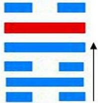

# 困 ䷮ kùn

- No.47

> 困，亨，貞，大人吉，无咎，有言不信。
>《彖》曰：困，剛揜也。險以說，困而不失其所亨，其唯君子乎。貞大人吉，以剛中也；有言不信，尚口乃窮也。
>《象》曰：澤无水，困。君子以致命遂志。

> 初六，臀困于株木，入于幽谷，三歲不覿。
>《象》曰：入于幽谷，幽不明也。

> 九二，困于酒食，朱紱方來，利用亨祀，征凶，无咎。
>《象》曰：困于酒食，中有慶也。

> 六三，困于石，據于蒺蔾。入于其宮，不見其妻，凶。
>《象》曰：據于蒺蔾，乘剛也。入于其宮，不見其妻，不祥也。

> 九四，來徐徐，困于金車，吝，有終。
>《象》曰：來徐徐，志在下也。雖不當位，有與也。

> 九五，劓刖，困于赤紱。乃徐有說，利用祭祀。
>《象》曰：劓刖，志未得也；乃徐有說，以中直也；利用祭祀，受福也。

> 上六，困于葛藟，于臲卼，曰動悔有悔，征吉。
>《象》曰：困于葛藟，未當也；動悔有悔，吉行也。

泽入坎险，水不通，困。外禀内刚，阴道长也，阴阳不顺，吉凶生也。《易》云：“困于石，据于蒺藜，入于其宫，不见其妻，凶。”上下不应，阴阳不交，二气不合。
> 困卦上下无应，阴阳不交。六三阴，上六亦阴，无匹。入九五求阳，阳亦无纳也。

五行配六位，生悔吝，四时休王。金木交争，万物之情在乎几微。与坎为飞伏。
> 戊寅木，丁巳火。

初六元士为世，九四诸侯在应。建始丙辰至辛酉，
> 清明，秋分。

积筭起辛酉至庚申，周而复始。土金入坎兑。
> 分土金入坎兑，配金宫起筭。

五星从位起太阴，
> 水宿入兑卦起筭。

井宿从位起太阴，降戊寅，
> 二十八宿，分井宿入困卦初六戊寅木。

分气候其数二十八。
> 二十八起宫入积筭，定吉凶。

坎象互见离火入兑，金水见运，配吉凶。阴阳升降，坎入坤，阴气凝盛，降入萃。
> 变通入萃卦。[䷬](e89083cui_cn.md)

# [Kùn ䷮](e59bb0kun.md)
