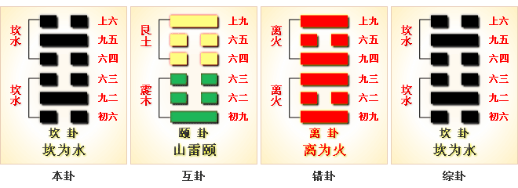

# 坎 ䷜ kǎn

- No.29

> 習坎，有孚，維心亨，行有尚。
>《彖》曰：習坎，重險也。水流而不盈，行險而不失其信。維心亨，乃以剛中也；行有尚，往有功也。天險不可升也，地險山川丘陵也，王公設險以守其國，險之時用大矣哉。
>《象》曰：水洊至，習坎。君子以常德行，習教事。

> 初六，習坎，入于坎窞，凶。
>《象》曰：習坎入坎，失道凶也。

> 九二，坎有險，求小得。
>《象》曰：求小得，未出中也。

> 六三，來之坎坎，險且枕，入于坎窞，勿用。
>《象》曰：來之坎坎，終无功也。

> 六四，樽酒，簋貳，用缶，納約自牖，終无咎。
>《象》曰：樽酒簋貳，剛柔際也。

> 九五，坎不盈，祗既平，无咎。
>《象》曰：坎不盈，中未大也。

> 上六，係用徽纏，寘于叢棘，三歲不得，凶。
>《象》曰：上六失道，凶三歲也。

积阴，以阳处中。柔顺，不能履重刚之险。故以刚克柔而履险。而曰阳，是以坎为属中男。分北方之卦也，与离为飞伏。
> 戊子水，己巳火。

世立宗庙，居于阴位。比近九五，全于坎道，远于祸害。三公居应，亦为阴暗。成坎之德，在于九五、九二也。
> 内外居坎，阳处中而为坎。主纯阴得阳，为明臣得君，而安其居也。君得一作臣而显其道也。

建起戊寅至癸未，
> 大暑大雪。

积筭起癸未至壬午，周而复始。
> 金水入卦本同宫，气候起筭时日岁月吉凶。

五星从位起太白，
> 太白金星入水宫。

牛宿从位降戊子。
> 二十八宿，从位八卦，周而复始。

岁候运数三十六。
> 配六位，分阴阳，三百五十六余日四分之一。分五行，配运气，吉凶见矣。

内外具坎，是重刚之位。《易》曰：“坎，陷也。”
> 坎水能深陷于物；处坎之险，不可不习。故曰：习坎。便习之习，后可得履于险而不陷没者。不以刚履柔，不能成坎之道也。

震以阳居初，能震动于物，能为动主。
> 乾生震，一阳居于初，震为长男。

坎以阳居中，为重刚之主，故以坎为险。阳变阴，成于险道。今以阴变阳，止于为节。
> 次入于节卦。

# [Kǎn ䷜](e59d8ekan.md)
