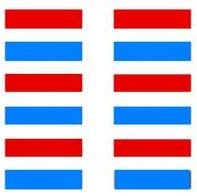

# 坤 ䷁ kūn

- No.2

> 坤，元亨，利牝馬之貞。君子有攸往，先迷，後得主利。西南得朋，東北喪朋，安貞吉。
>《彖》曰：至哉坤元，萬物資生，乃順承天。坤厚載物，德合无疆，含弘光大，品物咸亨。牝馬地類，行地无疆，柔順利貞。君子攸行，先迷失道，後順得常。西南得朋，乃與類行，東北喪朋，乃終有慶。安貞之吉，應地无疆。
>《象》曰：地勢坤，君子以厚德載物。

> 初六，履霜，堅冰至。
>《象》曰：履霜堅冰，陰始凝也。馴致其道，至堅冰也。

> 六二，直方大，不習无不利。
>《象》曰：六二之動，直以方也。不習无不利，地道光也。

> 六三，含章可貞，或從王事，无成有終。
>《象》曰：含章可貞，以時發也；或從王事，知光大也。

> 六四，括囊，无咎无譽。
>《象》曰：括囊无咎，慎不害也。

> 六五，黃裳，元吉。
>《象》曰：黃裳元吉，文在中也。

> 上六，龍戰于野，其血玄黃。
>《象》曰：龍戰于野，其道窮也。

> 用六，利永貞。
>《象》曰：用六永貞，以大終也。

纯阴用事，象配地，属土，柔道光也。阴凝感，与乾相纳，臣奉君也。易》云：“黄裳，元吉”。六二内卦阴处中，臣道正也。与乾为飞伏，
> 癸酉金，壬戌土。

宗庙居世，三公为应。未免龙战之灾，无成有终。
> 阴成阳君，臣不敢为物之始。阳唱阴和，君命臣终其事也。

初六起履霜，至于坚冰。阴虽柔顺，气亦坚刚，为无邪气也。建始甲午至己亥，
> 芒种，小满。

积筭起己亥至戊戌，周而复始。
> 纯土用事，入积筭，定吉凶。

五星从位起太阴，
> 太阴水星入卦。

西南方之卦。
> 镇星入卦配坤，西南。

星宿从位降癸酉金。
> 二十八宿，八卦星宿，降坤上六癸酉金。

分气候三十六。
> 起积为数三十六。

阴中有阳，气积万象，故曰阴中阴。阴阳二气，天地相接，人事吉凶，见乎其象。六位适变，八卦分焉。
> 六位变动，八卦显著。

阴虽虚纳，于阳位称实。
> 六五，六三之类也。

升降反复，不能久处，千变万化，故称乎易，易者变也。阴极则阳来，阴消则阳长，衰则退，盛则战。《易》云：“上六，龙战于野，其血玄黄”。阳属。
> 乾配西北积阴之地，阴盛故战，乾坤并处，天地之气杂，称玄黄也。

阳荡阴，坤内卦初六适变入阳，曰震。阴盛阳微，渐来之义，故称复。次降阳，入地雷复卦。
　　　　　　　　　　　　　　　　　　　　　　　　　　　　　　　　　
# [Kūn ䷁](e59da4kun.md)
