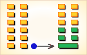

# 坤 ䷁


坤（kūn）卦， 坤为地，柔顺伸展。代号是`0:0`。
坤卦展示像“坤”的形势下各种变化的可能性。
形象说明当前主客关系状态。

相对于我们所在位置来说，地是静止的，代表当前关系是静止状态，变化较少；
地是广大的，地上万物生长，象征当前关系比较宽松而悠闲。

坤卦的主卦和客卦都是经卦坤卦，阳数都是`0`。
静止而广大的两方面，组合在一起，形成一种比较稳定而宽松的关系。

主方应当珍视这种关系，顺应形势，努力维持目前的状态。
不过要注意，静止是暂时的，主方应当作应对变化的准备。

- 卦象：上坤下坤
- 特征：柔顺伸展
- 代号：`0:0`
- 卦序：2

> 元亨，利牝馬之貞。君子有攸往，先迷，後得主利。西南得朋，東北喪朋，安貞吉。初六，履霜，堅冰至。六二，直方大，不習无不利。六三，含章可貞，或從王事，无成有終。六四，括囊，无咎无譽。六五，黃裳，元吉。上六，龍戰于野，其血玄黃。用六，利永貞。
> 《彖》曰：至哉坤元，萬物資生，乃順承天。坤厚載物，德合无疆，含弘光大，品物咸亨。牝馬地類，行地无疆，柔順利貞。君子攸行，先迷失道，後順得常。西南得朋，乃與類行，東北喪朋，乃終有慶。安貞之吉，應地无疆。
> 《象》曰：地勢坤，君子以厚德載物。

### 概述

《乾》为天，《坤》为地，《乾》为阳，《坤》为阴，《乾》为父，《坤》为母，《周易》将《乾》《坤》两卦安排在六十四卦之首，确实有些天地阴阳互生万物之含义。但是，统观《坤》卦各爻辞的含义和《坤》卦各爻辞之间的演变关系，我们还将会发现，简单地将《坤》卦理解为只是一种阴卦将是不恰当的。《坤》卦亦如同《乾》卦一样，也是《周易》总论的一部分，也有囊括《周易》含义的意思。从对《坤》卦的研究来看，它将显露出以下几个问题：第一个，就是《坤》卦如同《乾》卦一样，从“初”爻开始到“用”爻结束，也是反映一个 事物由始到末的发展演变的全过程的。

比如说《坤》卦的“初六，履霜，坚冰至”，是讲一个事物开始之艰辛，它和《乾》卦的“初九，潜龙勿用”一样，乃皆是叙述一个事物的开始阶段；《坤》卦再经历“六二”爻到“六五” 爻的“黄裳”鼎盛时期，亦如同《乾》卦经历“九二”爻到“九五”爻的“飞龙在天”的鼎盛时期；《坤》卦再到“上六”爻的“龙战于野”的物极必反时期和到“用六”爻的“利用贞”的再造时期，它都和《乾》卦的“上九” 爻“亢龙有悔”的物极必反时期和到“用九”爻的“群龙无首，吉”的再造 时期的内容安排完全相同。

《坤》卦中显露出的第二个问题是，《坤》卦除了其阴阳符号全为阴（－－）号，除了其卦辞中有“利牝马之贞”的阴的属性外，其它各爻辞的内容并不是全从阴柔一方面来论述《坤》卦的阴的属性的，一般的易学家们纯用阴性来图解《坤》卦中的各爻辞的含义完全是一种误解。比如说“六三”爻辞的“含章可贞；或从王事，无成，有终”，历来都将此爻解释为“去辅佐君主”建功立业，为“地道”、“妻道”、“臣道” 之爻。实际上，此爻含义乃指去直接从事王事帝业，它和《讼卦》中说的“ 或从王事，无成”为同一含义。又比如说“六四”爻的“括囊，无咎无誉” ，不说不动，这样虽得不到称赞，但也免遭祸患” ，这样解释仍是站在“阴道”、“臣道”、“妻道”的基础上注释爻义。实际上，此含义乃是指囊括四海之志的无咎无誉，它有如《乾》卦“九四”爻 的“或跃在渊，无咎”一样，皆指《周易》中的“大人”们展露才华抱负一事。再比如说“上六”爻的“龙战于野，其血玄黄”，历来都按“地道”、 “阴道”、将此爻解释为“阴气极盛，与阳气相战于郊外”。这实际上也是一种误解。阴阳交战，何来龙与龙相斗之有？

《坤》卦中显露出来的第三个问题是如同《乾》卦一样，它除了用哲学观点来论述一个事物发展演变的全过程之外，在应用到具体问题上，它仍是围绕着政权的角逐进行论述的。如果说《乾》卦仅仅用“潜龙”到“飞龙”再到“亢龙”来比喻《周易》中的 “君子”“大人”们的兴起衰落，而《坤》卦则用“或从王事”和“括囊” 四海之志，吞并八荒之心，以及帝王们的“黄裳”服饰来直接陈述《周易》中的“君子”“大人”们的举措始末，在这一点上，应该说《坤》卦比《乾》卦更加具体和更加直言不讳了。

我们在研究《坤》卦时，应特别注意这些问题，如不弄清这些，则便在刚从《周易》中的《乾》卦中得到一些启迪，则又在《坤》卦中陷入扑朔迷离之中。

## 卦意
### 坤为地（坤卦）柔顺伸展
### 上上卦

《象》曰：地势坤，君子以厚德载物。

这个卦是同卦，下坤上坤，相叠。阴性。
象征地（与乾卦相反），顺从天。

承载万物，伸展无穷无尽。坤卦以雌马为象征，表明地道生育抚养万物，而又依天顺时，性情温顺。
它以“先迷后得”证明“坤”顺从“乾”，依随“乾”，才能把握正确方向，遵循正道，获取吉利。

## 哲学解读
### 起卦

坤是`0:0`卦的卦名。坤的意思是地。

这个卦名用地的形象说明当前主客关系的状态。
相对于我们所在的位置来说，地是静止的，代表当前的关系是静止状态，变化较少；
地是广大的，地上万物生长，象征当前的关系比较宽松而悠闲。

`0:0`是别卦坤卦的代号，表示主卦的阳数是`0`，客卦的阳数也是`0`。
静止而广大的两方面，组合在一起，形成一种比较稳定而宽松的关系。
主方应当珍视这种关系，顺应形势，努力维持当前的关系。
不过要注意，静止是暂时的，主方应当作应对变化的准备。

### 结构和卦爻辞

坤卦下部的三条爻是主卦，代表主方；上部的三条爻是客卦，代表客方。
主卦与客卦中的爻全是阴爻，全部不有应，没有阴阳和谐关系，不过，也没有冲突，只有对立。这六条爻全部都是潜在因素，潜在的对于主方有利的因素，或者潜在的对于主方不利的因素。图中用了两种颜色表示爻：黑色的表示当位的爻，阴爻在阴位，是潜在的对主方有利的因素；灰色表示不当位的爻，阴爻在阳位，是潜在的对主方不利的爻。

先看主卦，主卦中的因素是主方可以改变的。上爻和下爻不当位：下爻代表主方的行动，阴爻，表示主方消极被动，主方可以阴中有阳，适当地采取一些主动措施，利用客方消极被动的机会谋取利益；上爻代表主方的态度，阴爻表示主方态度随和，主方也可以阴中有阳，适当采取强硬态度制约客方，保护和增加主方的利益。不过，这两种阴中有阳的措施都是暂时，很难维持长久，因为，主方的素质非常差，极端虚弱，没有足够的力量可以长期维持主动和强硬的态度。比较现实的办法是随其自然，主方什么都不特意去做。由于事物本身的变化符合螺旋形发展的规律，过了坤卦就是震卦，主方可能自然地向震卦所代表的状态发展。

需要说明，这种变化很不容易发生，就像是十月怀胎一样，要经历一段艰苦的孕育时期，才能有婴儿新生，也就是说需要经过一个量变到质变的关键点，阳数从`0`增加到`4`，主方才能从`0`卦坤卦所代表的状态转变成`4`卦震卦所代表的状态。.

至于客卦方面，上爻和下爻都是当位的爻，只有中爻不当位，但是中爻代表客方的素质，表示客方素质比较差，力量很弱，有可能是主方发展的好机会。总之，主方不必考虑客卦方面的因素。

根据当前的形势，主方应当随其自然，顺应客方，顺应一切，耐心等待情况自然地向有利于主方的方向发展。
图的下方是卦辞，卦辞比较形象地告诉主方应当随其自然，“元亨，利牝马之贞”，“安贞吉”。
图的右边是六条爻辞和用阴。爻辞与爻一一对应，比较形象地说明完全抽象的爻所包含的信息。
删去爻辞中的判断词，就可以看出六条爻辞实际上是一首完整的围绕“坤”这个主题的散文诗，下面是其译文：

```
（如今的状态像是）踩踏在霜上行走，坚硬的寒冰季节即将到来。
（像地一样地）平直方正而广大，不作任何活动没有不利的事。
包含美丽内涵的状态可以坚持下去，即使为朝廷服务，
没有成功，也有好的终了，（即使）缄口不言，（也能得到）黄裳赏赐。
（可不要像好斗的）龙，战于野郊，留下玄黑的血迹洒落黄沙。
```

下面逐条说明卦爻辞：

### 坤卦卦辞
```
〖原文〗元亨，利牝马之贞。
君子有攸往，先迷后得主，利；
西南得朋，东北丧朋，安贞吉。
〖译文〗很顺利，应当像牝马一样地坚持下去。
君子应当有所作为，先迷惑后得到主导，有利；
西南方向得到朋友，东北方向丧失朋友。安定地坚持下去吉利。

〖解说〗“元亨”，别卦坤卦由二个经卦坤卦组成，
双方关系是稳定而休闲，没有什么麻烦，很“通顺”。
“利牝马之贞”中的“牝马”是雌性的马，马是温顺的动物，雌性的马更温顺。
“贞”是坚持的意思。“利”是有利于主方，强调主方应当做的事。
“利牝马之贞”是说主方应当顺应客方以尽量维持当前的关系。
“君子有攸往”中的君子指主方，封建社会中有君子小人之分，
不应当这么提了，这里君子就是指一般的人、正常的人或聪明的人。
稳定而宽松的关系是暂时的，在尽量维持现状的同时，主方应当有所作为。
“先迷后得主，利”中的“先”指当前，“迷”指前满足现状的状态。
“后”当指主方采取比较主动的行动以后，客方更了解主方，
主方将得到客方的更多信任，情况对主方有利。
“西南得朋，东北丧朋”，西南与东北是二个截然相反的方向，
如果主方有所行动，必须有正确的行动方向。
方向正确，可能得到帮助；方向不正确，可能失去帮助。
在周文王的时候，周在商的西南，商在周的东北，
西南是家乡，东北是异地，在家乡得朋友，去异地将失去家乡的朋友。
主方应当努力改善自己的素质，不然有可能失去别人的帮助。
“安贞吉”强调吉利是有条件的，必须是又“安”又“贞”，
安于当前的双方关系，努力维持这个关系，这样就吉利。
如果不这样就不吉利。
```

### 初六
```
〖原文〗履霜，坚冰至。
〖译文〗踩踏在霜上，坚硬的冰到来。

〖解说〗这是坤卦第一爻的爻辞。
第一爻是主卦的下爻，代表主方的行动，
这一条爻是阴爻，表示主方的行动是阴。
“履霜”中的“履”是指用脚踩踏行走。履的人是主方。
“履霜”形容当前的关系冷淡，主方感到如同脚踏被霜覆盖的原野。
“坚冰至”是指到处是冻冰的季节即将来临，
如果主方不改变消极被动，关系可能发展得更差。
“坚冰”形容那种更冷的关系像是冻得坚硬的冰。
关系向更冷淡的方向发展，不利于主方，
主方应当积极主动些，扭转这种不利趋势。

〖结构分析〗第一爻的位置是阳位，阴爻在阳位，不当位。
而且，第一爻和第四爻之间没有有应的关系，表示二者不协调。
不当位表明主方消极被动有可能让主方的利益受到损失，
这是潜在的对主方不利的因素；
不有应表明客方也是消极被动，客方不企求损伤主方的利益，
这潜在因素没有成为真正的对主方不利的因素。
因为这只是潜在因素，爻辞没有加判断词。
```

### 六二
```
〖原文〗直方大，不习无不利。
〖译文〗平直方正而广阔，不熟悉地形也不会有危险，不利。

〖解说〗这是坤卦第二爻的爻辞。
第二爻是主卦的中爻，代表主方的素质，阴性表示主方的素质较差。
“直方大”是地的形象，古人认为大地是平面的，
不是球形的，是方的，符合平直广大的特点。
这里用地的形象描述主方的素质，因为第二爻是主卦的中爻，
“直方大”主要是反映主方的平凡而不佳的素质。
“不习无不利”中的“无不利”是判断词，
即使不了解地形（这里的习不可以翻译成学习），也没有不利的后果。
为什么？因为当前的主客双方关系提供了主方发展的空间。
但是，“无不利”不等于“有利”，没有不利的后果不等于后果是有利的。
“无不利”这个判断词是中性的。

〖结构分析〗这条爻在别卦的第二个爻的位置上，
别卦中第二、四、六爻的位置是阴位，
这条爻是阴爻在阴位，当位，但是不有应。
当位表明主方的素质不佳，这有可能驱使主方去开拓进取，
谋取利益，是潜在的对主方有利的因素；
不有应表明客方的素质也不佳，主方不能从客方获取利益，
这潜在因素没有成为真正的对主方有利的因素，
所以爻辞只是说“无不利”，而没有说“利”。
```

### 六三
```
〖原文〗含章可贞，或从王事，无成有终。
〖译文〗包含优美内涵，可以坚持下去，
有时侯顺从王意做事，没有成功，会有一个结局（比较好的）。

〖解说〗这是坤卦第三爻的爻辞。
第三爻是主卦的上爻，代表主方的态度，这条爻是阴爻，
表示主方的态度是阴，主方的态度随和。
“含章可贞”中的“含章”指包含美质，地滋养万物，具有优美的内涵。
“或从王事”中的“或”指有时，“从”指顺从、服从，
“王”指客方，“事”指办事，主方有时侯顺从客方的意思办事。
“无成有终”，“成”指成功、成就或成绩，“终”指终了，终点。
虽然没有成就，但是对主方来说，总会受到适当的对待。
爻辞还有一层暗示的意思，这条爻的爻辞中说“或从王事，无成有终”，
由于“或”是“有时”的意思，这句话就暗示有时侯“不从王事，无成无终”。
就是说，有时候，主方做的不是客方希望的，
既不成功，也得不到适当的对待。

〖结构分析〗第三爻的位置是阳位，这条爻是阴爻，
阴爻在阳位，不当位，并且与第六爻不有应。
不当位表明主方态度随和，
有可能受到客方制约，是潜在的对主方不利的因素；
不有应表明客方也是态度随和，不求制约主方，
这潜在因素没有成为真正的对主方不利的因素，
所以卦爻辞用“无成有终”描述当前状态。
```

### 六四
```
〖原文〗括囊，无咎无誉。
〖译文〗包扎在袋子里，既不必咎怪也不必赞誉。

〖解说〗这是坤卦第四爻的爻辞。
第四爻是客卦的下爻，代表客方的行动，
这条爻是阴爻，表示客方的行动是消极被动。
是谁“括囊”呢？是主方还是客方？
如果理解为客方，也能解释得通，
但是，卦是从主方的角度分析当前的形势，
“括囊”应当是对主方的比较形象的建议，建议主方缄口不言。
即使主方缄口不言，也“无咎无誉”。
“无咎无誉”，既不必怪罪也不必赞誉。

〖结构分析〗第四爻的位置是阴位，
这条爻是阴爻，阴爻在阴位，当位，与第一爻不有应。
当位表明客方消极被动有可能是主方发展的好机会，
是潜在的对主方有利的因素；
不有应表明主方也消极被动，
不能利用这个有利于主方的好机会，
这潜在因素没有成为真正的对主方有利的因素，
所以爻辞只是说“无咎无誉”。
```

### 六五
```
〖原文〗黄裳，元吉。
〖译文〗黄色裙裳，很吉利。

〖解说〗这是坤卦第五爻的爻辞。
第五爻是客卦的中爻，代表客方的素质，
客方的的素质是阴，客方的素质不佳。
“黄裳”指黄色的裙裳，古时侯服装上衣下裳，
皇帝上朝时穿黄袍，可见黄色服装与尊贵和吉利有关，
这里，“黄裳”比喻客方的素质对主方的影响。
客方素质欠佳，为主方创造了有利条件，
像是“黄裳”。“元吉”，很吉利。
这里所说的“元吉”仅仅是针对客方的素质对主方的有利方面而言，
而与其它的事情无关。

〖结构分析〗坤卦第五爻是阴爻在阳位，
不当位，与第二爻不有应。不当位表明客方素质比较差，
有可能企图窃取主方利益，是潜在的对主方不利的因素；
不有应表明主方的素质也不佳，不可能让客方窃取利益，
这潜在因素没有成为真正的对主方不利的因素。
换一个角度看，由于这条爻代表客方的素质，
素质不佳意味着资金缺乏、身体衰弱、实力微薄等等，
这就可能形成对主方的依赖，主方有可能利用客方的这种依赖，
加之以积极主动的开发措施，就可能获得更多利益，
这不仅不是不利因素，
而是对主方很有利的因素，所以爻辞说“元吉”。
如果结合全卦考虑，
也可以理解这个“元吉”的判断词是就整个随其自然的建议说的。
```

### 上六
```
〖原文〗龙战于野，其血玄黄。
〖译文〗龙在郊野相斗，滴下黑黄色的血液。

〖解说〗这是第六爻的爻辞。
第六爻是客卦的上爻，代表客方的态度，
阴爻，表示客方态度随和。
“龙战于野”中的“龙”象征主方与客方，“野”指双方关系，
主方和客方相互之间为自己的利益而争斗，龙战于野。
但是，这里的龙已经是不同于乾卦中所描述的充满生气的强健的龙，
而是精疲力竭的受伤的龙，或者死龙。
客方对主方随和，双方几乎没有争执。
“其血玄黄”的“玄”指黑色，表示主客双方的争斗已经是过去的事，
“龙”的血已经变成黑色，并且和黄沙混在一起。

〖结构分析〗第六爻的位置是阴位，
这条爻是阴爻，阴爻在阴位，当位，与第三爻不有应。
当位表明客方态度随和，有可能受主方制约，
是潜在的对主方有利的因素；
不有应表明主方的态度也随和，
主方不想制约客方，
这潜在因素没有成为真正的对主方有利的因素。
所以爻辞中没有判断词。
```

### 用六
```
〖原文〗利永贞。
〖译文〗利于永远坚持下去。

〖解说〗在坤卦的六条爻的爻辞之后，附有用阴，
特意说明如何运用阴，概括地说明在六十四卦中阴的一般用法。
“利永贞”的意思是“利于永远坚持不变”。
阳象征变化，阴象征静止。
但是，实际上事物总是在变化着的，
客方造成的环境在变化，主方自己也在变化，
即使主方努力保持不变，静止只是暂时的，
主方应当耐心地等待时机，让事情朝有利于主方的方向发展。 
```

### 《象》曰
```
地势，坤；君子以厚德载物。
履霜坚冰，阴始凝也。
驯致其道，至坚冰也。
六二之动，直以方也。
不习无不利，地道光也。
含章可贞，以时发也。
或从王事，知光大也。
括囊无咎，慎不害也。
黄裳元吉，文在中也。
龙战于野，其道穷也。
用六永贞，以大终也。
```

### 《彖》曰
```
至哉坤元，万物资生，乃顺承天。
坤厚载物，德合无疆。
含弘光大，品物咸亨。
牝马地类，行地无疆，柔顺利贞。
君子攸（yōu）行，先迷失道，後顺得常。
西南得朋，乃与类行；
东北丧朋，乃终有庆。
安贞之吉，应地无疆。

【白话】《彖传》说，广阔无际的大地是生成万物的根源，
柔顺而秉承天道的法则。大地深厚且载育着万物，它的功德广阔无穷。
它蕴藏着弘德、光明、远大的功能，使万物都能顺利地成长。
雌马属于地上走兽、具有在大地上无限奔驰的能力，
她的性情柔顺祥和，有利于守持正道。
君子应该效仿这种品德而行动，如果遇事争先居首就会迷失方向，
如果跟在人后顺随大势就能找到常规。
往西南方向可以得到朋友的帮助，是因为与同类同行。
往东北方向将失去同类，尽管这样，最终也是吉利的。
安顺且守持正固的行动将是吉祥的，因为应合了大地广阔无极的柔顺之德。
```

## 卦文解释
### 第一句
```
【原文】
坤①：元、亨，利牝马之贞。
君子有攸往，先迷，后得主，利。
西南得朋，东北丧朋②。安贞吉。
【译文】
坤卦：大吉大利。占问雌马得到吉兆。
君子前去旅行，先迷失路途，后来找到主人，吉利。
西南行获得财物，东北行丧失财物。占问定居，得到吉兆。
【注释】
① 坤，卦名。本卦是同卦相叠（坤下坤上）六画都是阴爻，用以象地。
代表纯阴柔顺之事物，以及与此相关联的人伦义理概念。
② 朋，李镜池说：“朋，朋贝。货币起先用贝，贝十枚一串为朋。”
```

### 第二句
```
【原文】
《彖》曰：至哉坤元①，万物资生，乃顺承天②。
坤厚载物，德合无疆③。含弘光大④，品物咸亨⑤。
牝马地类⑥，行地无疆。柔顺利贞⑦。
君子攸行⑧，先迷失道，后顺得常⑨。
西南得朋⑩，乃与类行。东北丧朋，乃终有庆。
安贞之吉，应地无疆。

【译文】
《彖辞》说：崇高呵，大地的开创之功。
万物依赖它获得生命的基础。它顺承着天道的变化。
大地厚实，承载万物，大地美德，广大无垠。
它蕴藏深厚，地面辽阔，各种物类皆得其所。
牝马阴性，与地同类，善于在无边无际的大地上奔跑，
生性柔和、温顺、便捷、执着。
君子外出，先迷失路途，后来顺利地找到归宿。
西南行得到朋友，于是与志同道合的友人同行。
东北行丧失朋友，不过最后还是吉庆的。
祥和贞吉，则无往而不吉利，正如大地随处伸展不穷一样。

【注释】
① 至，朱熹说：“至，极也。”
坤，大地。元，始，创始。
② 承，《说文》“承，奉也。”
乃顺承天，犹言大地顺承天道的变化而变化。
③ 德，《易经》常用以表示事物的形态性质的—个哲理性概念。
合，借为迨。《方言》：“迨。及也。”
④ 含，蕴藏。弘，深厚。光，借为广。
⑤ 品，品类。品物，犹言各种物类。
咸，皆。亨，通泰。这里是生长顺畅的意思。
⑥ 牝马，母马，阴性之物，与地同类。
⑦ 柔，柔和。顺，温顺。利，便捷。贞，贞正，犹言执着。
此四字讲牝马之性。所解“利贞”与经意有异。
⑧ 攸，所。
⑨ 常，常道，正路。
⑩《彖辞》以“类”字释“朋”，取“同类为朋”之意，与经意不合。
凡传意与经意不合之处，译文中显加区别，不另出注。
```

### 第三句
```
【原文】
《象》曰：地势坤①，君子以厚德载物。

【译文】
《象辞》说：大地的形势平铺舒展，顺承天道。
君子观此卦象，取法于地，以深厚的德行来承担重大的责任。

【注释】
① 坤，《释名·释地》：“坤，顺也，上顺乾也。”
```

### 第四句
（最下：阴爻）
```
【原文】
初六：履霜，坚冰至。
《象》曰：履霜坚冰①，阴始凝也，驯致其道②，至坚冰也。

【译文】
初六：践踏着薄霜，可以推断坚厚的冰层快要冻结成了。
《象辞》说：践踏着薄霜，可以推断坚厚的冰层快要冻结成了。
这表明阴冷之气开始凝聚了，遵循自然规律的推进，坚厚的冰层快要冻结而成了。

【注释】
① 沙少海先生说：“履霜坚冰，《三国志·魏志·文帝纪》，许芝引作‘初六，履霜。’
朱熹、项安世、惠栋等皆从之。《象》传以‘阴始凝’释‘履霜’二字，非释‘坚冰’二字。
若‘坚冰’则是阴已大凝，不得云‘阴始凝’。”履，践踏。
② 驯，《集解》引《九家易》曰：“驯，犹顺也。”
致，推进。驯致其道，犹言遵循自然规律而发展推进。
```

### 第五句
（第二：阴爻）
```
【原文】
六二：直、方、大；不习①，无不利。
《象》曰：六二之动，直以方也。不习，无不利，地道光也②。

【译文】
六二：平直、方正、辽阔是大地的特点。
即使前往陌生的地方，也没有什么不利的。
《象辞》说：六二的爻象是平直而且方正，
即使前往陌生的地方，也没有什么不利的，因为地道是广大无边的。

【注释】
① 习，熟习。 ② 光，借为广。
```

### 第六句
（第三：阴爻）
```
【原文】
六三：含章①可贞③。或从王事③，无成有终④。
《象》曰：含章可贞，以时发也。或从王事，知光大也⑤。

【译文】
六三：战胜殷商。称心的占卜。
有人服役于战争，没有取得战绩，但结局还是好的。
《象辞》说：战胜殷商，称心的占卜，说明能抓住时机采取行动。
有人服役于战争（没有取得战绩而有好的结局），因为他才智广大。

【注释】
① 含，高亨说：“含当读为*，*与戡同，克也，战胜也。
章，当读为商，殷商也。”
② 可，称心。可贞，称心的占卜。
③ 王事，李镜池说：“王事，指战争。王训大，王事即大事。
古代国家以战争和祭祀为大事。这里说大事，就是指战争。”
④ 终，古人讲终，多指好的结局。⑤知，读为智。光大，广大。
```

### 第七句
（第四：阴爻）
```
【原文】
六四：括囊①，无咎无誉。
《象》曰：括囊无咎，慎不害也。

【译文】
六四：扎紧了口袋，如缄口不言，没有指责，也没有赞誉。
《象辞》说：扎紧了口袋，如缄口不言，是说谨慎才没有祸害。

【注释】
① 括，收束，扎紧。囊，布袋。
```

### 第八句
（第五：阴爻）
```
【原文】
六五：黄裳①元吉。
《象》曰：黄裳元吉，文在中也②。

【译文】
六五：黄色的裙裤，大吉大利。
《象辞》说：黄色的裙裤大吉大利，
因为“黄裳”象征着人内在的美德。

【注释】
① 黄裳，王弼说：“黄，中之色也。裳，下之饰也。”
裳，即裙、裤。周人以黄裳为吉祥、尊贵之物。
② 文，《广雅?释诂》：“文，饰也。”
衣与裳，都是身上的装饰，这里的文比喻人的美德。
```

### 第九句
（最上：阴爻）
```
【原文】
上六：龙战于野，其血玄黄①。
《象》曰：龙战于野，其道穷也。

【译文】
上六。龙在大地上争斗，血流遍野。
《象辞》说：龙在大地上争斗，比喻人走到了穷困的绝境。

【注释】
①玄黄，血流貌，借为泫潢。谓血流得多。
```

### 第十句
```
文言曰：坤至柔，而动也刚，至静而德方，后得主而有常①，
含万物而化光②。坤其道顺乎③？承天而时行。
积善之家，必有馀庆；积不善之家，必有馀殃。
臣弑其君，子弑其父，非一朝一夕之故，其所由来者渐矣，由辩之不早辩也。
易曰：「履霜坚冰至。」盖言顺也。
直其正也，方其义也④。君子敬以直内⑤，义以方外，敬义立，而德不孤。
「直，方，大，不习无不利」；则不疑其所行也。
阴虽有美，含之；以从王事，弗敢成也。地道也，妻道也，臣道也。
地道无成，而代有终也⑥。
天地变化，草木蕃；天地闭，贤人隐。
易曰：「括囊；无咎，无誉。」盖言谨也。
君子黄中通理⑦，正位居体⑧，美在其中，而畅於四支，发於事业，美之至也。
阴疑於阳⑨，必战。为其嫌於无阳也⑩，故称龙焉。
犹未离其类也，故称血焉。夫玄黄者，天地之杂也，天玄而地黄。

注释：
① 后得主，言地道顺承天道，后于天道的变化而变化。
常，常规，规律性。
② 化光，生化万物，其道广大。
③ 顺，循规律而推进发展。
④ 直，正直，犹言存心不邪。方，端正，犹言存心不乱。
⑤ 直内，直，用如动词，矫正。直内，犹言矫正内心的僻邪。
方外，方用如动词，规范。方外，犹言规范行为上的悖乱。
⑥ 地道无成而代有终，地道不能脱离天道单独地完成生化万物的功业，
只能在时序的更替中，始终一贯地发挥作用。
⑦ 黄中通理，《文言》作者以黄裳，比喻贤人才高德劭。
黄中犹言内心美好。通理，通达情理。
⑧ 正位，犹言忠于本份。居体，体借为礼，犹言守礼。
⑨ 王引之曰：“疑之言拟也。”
朱熹曰：“疑谓钧（均）敌而无小大之差也。”
⑩ 沙少海先生说：“《集解》引荀爽本无‘无’字，当据删。
《说文》：‘嫌，疑也。’这里，嫌应训势均力敌，训拟。”

译文：
《文言》说：地道极为柔顺但它的运动却是刚健的，
它极为娴静但品德是方正的，地道后于天道而行动，但运动具有规律性。
它包容万物，其生化作用是广大的。
地道多么柔顺呵！顺承天道而依准四时运行。
积累善行的人家，必有不尽的吉祥；积累恶行的人家，必有不尽的灾殃。
臣子弑杀他的国君，儿子弑杀他的父亲，
并不是一朝一夕形成的，所以出现这种局面是逐步发展的结果。
《易经》说：“践踏着薄霜，坚厚的冰层快要冻结成了。
”大概就是一种循序渐进的现象。直是存心的正直，方是行为的道义。
君子通过恭敬谨慎来矫正思想上的偏差，用道义的原则来规范行为上的悖乱。
恭敬、道义的精神树立起来了，他的品德就会产生广泛的影响。
君子“正直、方正、广博，这些品德不为人们所了解，也没有什么不利的。”
因为人们不会怀疑他的行为。
阴比喻臣下，虽有美德，但宜深藏含隐，从而服务于君王，不敢自居有功。
这是地道的原则，也是妻道的原则，同样是臣道的原则。
地道不能单独地完成生育万物的功业，
但是在时序的交替中，它始终一贯地发挥作用。
天地交通变化，草木就茂盛，天地阻隔不通，贤人就隐退。
《易经》说：“扎紧了口袋，如缄口不言。没有指责也没有赞誉。”
大概意在谨慎吧。君子内心美好，通达事理，整肃职守，恪守礼节，
美德积聚在内心里，贯彻在行动上，扩大在事业中，这是最为美好的。
阴与阳势均力敌，必然发生争斗。
因为阴极盛而与阳均等，所以把阴阳一并称作龙。
其实阴并未脱离其属类，所以又称为血，血即阴类。
所谓玄黄 --- 天玄地黄 --- 是天地交相混合的色彩。
```

### 新解译文
```
坤卦：大吉大利。占问母马得到了吉利的征兆。
君子贵族外出旅行经商，开始时迷了路，后来遇上招待客人的房东。
往西南方向走有利，可以获得财物；往东北方向走会丧失财物。
占问定居，得到吉利的预兆。
初六：脚下踩到了薄霜，结成坚实冰层的时令就快要到了。
六二：大地的形貌平直、方正、辽阔；
虽然去到不熟悉的陌 生地方，也不会有什么问题。
六三：周武王战胜殷商，是很好的占卜。
有人参与战争，虽 然没有战绩，但结局却很好。
六四：把收成装进口袋捆好，收成不好不坏。
六五：黄色裙裤是大吉大利的象征。
上六：龙在旷野上争斗，血流遍地。
用六：这是永久吉利的最好征兆。

【读解】
“坤”卦几乎涉及到了人们在大地上所从事的衣、食、住、行等全部重要活动，
不由得让我们想到古人凭直感体验到的贴近大地胸膛的那种亲切而深情的眷念。
人类由远古的采集、狩猎的生存方式，
过渡到相对稳定和有保障的从事农牧商业的生存方式，
是从漂泊、冒险、为生存而挣 扎向安居乐业、休养生息的巨大飞跃。
在这个飞跃过程中，必定 会产生人类对大地无尽的亲情。
西方传说中的巨人，只有紧贴大地才会获得无穷的力量。
可见，对大地的亲情是一种具有普遍性的人类情感。
上有神圣幽远的苍天可以崇仰，下有广袤坚实的大地可以依靠，
于是，人类的肉体和灵魂便有了寄居之所，寻到了永恒的家园。
世事的推移，人间的沧桑，在永恒的天与地之间，
像一条涌动着的河流，昼夜不舍地向前奔腾。
生命的律动，就在天、地、人的交融感应中显现出来。
```

## 全文详解

《坤卦》由地下地上组成。
卦辞的“坤：元，亨，利牝马之贞。君子有攸往。先迷，后得，主利。西南得朋，东北丧朋。安贞吉”，
第一句是说《坤卦》亦有元始、广大、亨通之义，由于《坤卦》为阴卦，故利于柔顺的雌马的贞正。
第二句，一般都将句子标点为“君子有攸往，先迷后得主，利西南得朋。”
这实际上都是错误的。因为这一辞语都是在“君子”修饰之下进行的，
有如我们前边多次提到的“君子”一辞并不专指道德高尚的人，乃是“大人”“王”“侯”的同义语，
所以，将此句标点为“君子有攸往，先迷后得主”是不恰当的。如果标点成这样，
“后得主”一辞必然变成良臣得贤主或后妃得明主一义。

实际上，“先迷，后得”乃是指“君子”或“大人”在行事开始时，总是有些迷惘困惑；
但由于“君子”“大人”们始终“终日乾乾”，自强不息，故有“ 后得”之结局。
由于如此，故此卦“主利”。“西南得朋，东北丧朋”，按照《周易》中每每使用这一方位词，
具体地说，当与姬周王朝处境有关，也即与姬周王朝开发经营西南汉水长江流域有关，
与东北的黎国（今山西黎城 一带）为敌有关。
最后一句“安贞吉”是说，若能安于正道，则为吉祥。

### 初六

“初六”爻的“履霜，坚冰至”，是说处于《坤卦》初期，即一切事物的开始时期有如在霜地和处严冬一样不容易。

### 六二

“六二”爻的“直方大，不习，无不利”，是说在办任何事时，只要坚 持正直，办事有规矩方圆，并怀有博大的德业，既就是不用练习什么其它，就此也足够顺利畅通无阻。此处的“直方大”一语，颇有些指“君子”“大人”的气质而言。也可以说乃是下一句的“含章”的同义语。

### 六三

“六三”爻辞的“含章，可贞；或从王事，无成，有终”，前半句有接 上一爻的含义，是说，只要这些“君子”“大人”们自身能有一定的文化知 识素质，能有一定的道德修养，形质可嘉，那就可以在人们中树立一个良好形象，就可以帅众以从正。后半句是说，当此条件还不成熟之时，若要去从事王事帝业，那一定是无成的，但最终还会有一个良好结局的。此一爻有一个时空观念，也即实类同《乾卦》“九二”爻说的“见龙在田”和“九三” 爻说的“君子终日乾乾”以及处在此时期的《屯卦》所要说的“或从王事， 无成”的用法。

### 六四

“六四”爻辞的“括囊，无咎无誉”，是说为争雄天下的“大人”“君子”们，自当有“囊括四海之志，吞并八荒之心”，这时已经羽毛已丰，谁也奈何不了，此时的举措既就是得不到什么赞誉，但也不会有什么祸患。此爻实类同《乾卦》“九四”爻的“或跃在渊，无咎”的含义和用法。在理解此爻时，切不可忘记此爻的时空概念，也即前边说的不可忘记“六三”爻的 时空概念一样。还有一个问题，就是《乾卦》是用龙在不同时空的变态来比喻事物的变迁，而《坤》卦则将这些变态换成了“君子”“大人”们“或从王事”“括囊”一类的直接举措变迁，这种更改倒使人们在疏忽了《坤》卦时空演变的同时，也更疏忽了这卦各爻辞的实质内容。

### 六五

“六五”爻辞的“黄裳，元吉”，是说此时已君临天下，到了一个极盛时期，此时自当大吉大利。此爻实类同《乾》卦“九五”爻的“飞龙在天，利见大人”。

### 上六

“上六”爻辞的“龙战于野，其血玄黄”，此爻是言二龙大战，这一爻可能直指姬周王朝与殷商王朝的殊死搏斗。但理解此爻时，也不可忘记《乾卦》“上九”爻的“亢龙有悔”，这里指事物发展到极限，将有灭亡的危险。这里有指殷商王朝的有悔。也有指姬周王朝的有悔。《小过》中说的“飞鸟以凶”“弗过防之，从或戕之”以及《既济》、《未济》卦中说的“小狐汔济”的“濡其首”指的就是这些。

“用六”爻的“利用贞”，此爻是一个半句话，此爻有接上一爻的含义，也即当此“龙战于野”的非常时期只有坚守贞正，才能化凶为吉。此爻也有 《乾卦》“用九”爻“见群龙无首，吉”的含义，作者乐见于此新旧交替和时代变迁，但在此特别强调了“利用贞”一辞。

### 《哲学易经》
```
坤：元亨，利牝马之贞。君子有攸往，先迷而得主，利。
西南得朋，东北丧朋，安贞吉。
《彖》日：至哉坤元，万物资生，乃顺承天。
坤厚载物，德合无缰，含弘光大，品物咸亨。
牝马地类，行地无缰，柔顺利贞。君子攸往，先迷失道后顺得常。
西南得朋乃与类行，东北丧朋乃终有庆，安贞之吉应地无缰。
《象》曰：地势坤，君子以厚德载物。
乾是开创，坤是承接，为此我们说天过就是大地了。
它含弘光大，生化了万物，造就了一切，
万物依乎她而得以开辟展布生生不息，
牝马依乎她而得以奔驰缰土咤叱风雄。
因此作为君子当前去行事，当为人类创造一个和谐的发展环境。
当然，或许展现在我们面前的有绪多迷茫，
但必能凭借着执着的理念探求出可持续发展的道路，
成为主者而普利天下。有什么不利呢！
面向西南向着明媚的大道前进必能处处得到和应与发展，
如行向晦暗处事不明则必然会有所失。
因此要按于现状服从发展观，中正而吉祥。

我们知道，到目前为止人类还没有找到其它能生存人类的星球，
地球是唯一生存人类万物的空间，是人类唯一的依托。
因此《彖》辞说第二就是大地了，
万物依乎她而获得了生存的条件，这通通归功于上天的神奇造化。
大地博厚，承载着万物，她的品德超大无比而从不分地界。
她含弘广大光绪绰着，因此物类全得造化和伸展。
牝马属于地中产物，凭借了大地的无限辽阔而得以行地无缰施展其能。
大地多么的柔顺和利贞啊！
因此君子当有所行动，当博击于大千世界，当投身于无限光华的事业中去。
或许面对错综复杂的大千世界而感到茫然和迷惑，
但必能凭借执着的理念成就功德，找到真正属于我们走的道路。
没有什么不利呵，践踏着明媚的大道必处处得到和应与发展，
若行向晦暗处事不明则必然会有所失，
但只要内心美好充满激情最终必有所庆。
因此君子当服从发展观不断前进，
无处不能通向成功的大道和创造出更为美好的明天。

《象》辞说：大地含弘广大，因而孕生了万物；
大地广博舒展，因而万物生机盎然；这是《坤》之象。
是以君子观之思只有博大的胸怀、和美的品德、才能百业兴起百花齐放，
形成一个和谐的、健全的、繁荣的社会。
从而君子当厚其德、载其物、成就完美品德，创造完美世界。

初六：履霜，坚冰至。
《象》曰：履霜坚冰，阴始凝也；驯致其道，致坚冰也。
开始降霜了，坚厚的冰冻也就快到了。
可见，一切事物的形成都是循序渐进的，逐步形成的。
真所谓“冰冻三尺，非一日之寒”。因此君子当点滴积累，每天有所行动。
只有点滴积累才能驯致其道，才能达到预期的目标，除此之外没有捷径。

六二：直、方、大、不习，无不利。
《象》曰：六二之动，直以方也。不习，无不利，地道光也。
直是通直，方是方正，大是广大。大地通直，一往无前；大地方正，可圈可点；
大地宽广又何处不是用武之地。
因此君子当永不间断地努力，也决不轻言放弃，
只要执着和坚定不移何处不可通向成功的大道。

有什么可自暴自欺的呢？
人的出生境遇或许千差万别，但上帝并不偏爱任何一个人。
因此没有必要把自己定位在自己的命运之中，
一切的成功与伟大完全在于永不间断的努力和不断拼搏的精神。
假如你想获得成功，就要为它创造条件，坐等机遇期望时运就会一事无成。

六三：含章，可贞。或从王事，无成有终。
《象》曰：含章可贞，以时发也。或从王事，知光大也。
章，彰也。含章可贞，以时而发，容光必照矣。
心怀美好的愿望和理念又从不间断努力则必有所成，“以时发也。”
因此若以此心即或建不了丰功伟绩，
致力于王道服务于社会也必有好的结局，“知光大也。”
“一个好的理念和伟大的设想总是能振奋人心的，
一个好的建义和微小的机制只要正确引导又未尝不能带来社会轰动效应。”
因此我们需先进的理论，伟大的思想，更需要不断实践的精神。

六四：括囊，无咎无誉。
《象》曰：括囊无咎，慎不害也。
括，包括、概括、总括、囊括的意思。
故君子不图虚名不犯咎戾当量其才称其能括囊而行，
是以《象》曰：“括囊无咎，慎不害也。”
但我们的理论是确实有才就当步子阔一点胆子大一点，
确实是好贷就当嗓子高一点声音大一点。
常言道“酒香还怕港子深，货好更要会吆喝。”
不推销自己如何名天下为千万人所敬仰。

六五：黄裳，元吉。
《象》曰：黄裳元吉，文在中也。
黄，地之色也，天玄而地黄。
文，文彩也，应有之本也。
给大地穿上了应有的色彩，
是以万物生、万物育、万物成焉，无不体现着吉利。
我们相信人定胜天，
因此作为人类当不断开拓与发展，当不断探索与研究。
虽然大自然造物变化无穷，
但每一种事物的变化都有它应有的规律，这就叫“文在中也。”
因此我们当开采利用，我们当尽性致用，大地万物给予着人类无限福利。
因此君子之职在于给大地万物穿上应有之饰，
在于指明持续可发展之路，在于创建这个无限高尚的事业。

上六：龙战于野，其血玄黄。
《象》曰：龙战于野，其道穷也。
野，旷野，无边之境。玄黄，天地之杂，斑斓而纷杂。
君子不做正事而从事高远学识和不切实际的行为，
他将为此而付出的代价是惨重的，是以“龙战于野，其道穷也。”
但是，龙又不是蛇，既然是龙就是较较者，
较较者必行常人之先而战于天地间，为人类至高事业而奋斗终生。
故君子之志在于释困度终不知其累，
在于创造无限高尚的事业，在于可指明可持续发展的道路。

用六：利永贞。
《象》曰：用六永贞，以大终也。
利永贞，利于永远贞之也。
原因是大地含弘光大，无物不载。
故君子当永远坚持不懈地为人类高尚的事业奋斗终生，
当为了明天的更美好而与天地同辉。如此，则必大有终也。
```

### 最新译文
```
元，亨，利，牝马之贞。君子有攸往，先迷后得主，利。
西南得朋，东北丧朋，安贞吉。

译文：
本元状态，通达四方，万事顺利，具女侍女官之坚贞。
君子带有目的的出往，虽有短暂的迷惑，
但是终究会得到最关键的人物（得：找到，擒获，拜访到），大利。
前往西南方可以得到财富，前往东北方或许暂时会付出一些财富，
但是同样是吉利的，只要你安心并且坚定的 稍作等待。

初六：履霜，坚冰至。
译文：
大军即将出发，因大河所阻不能前进。
脚踏着薄霜，
如此可以推断出河面上坚厚的冰层很快就会结成了，
发兵的时机即将到来。

六二：直，方，大。不习无不利。
译文：
前往目的地的道路 平直 方正 辽阔。
即使不熟悉，也没有什么不利的。

六三：含章可贞。或从王事，无成有终。
译文：
这是一场具有重大意义的战争，
出发前卜得了将会大获全胜的占卜结果。
有人的服役于此次战争，
或许没有取得什么恢宏的成绩，但结局也都会是好的。

六四：括囊，无咎，无誉。
译文：
在战争中搜刮了一些财富，
只要不过分，注意分寸，不到处炫耀，是可以默认的。

六五：黄裳，元吉。
译文：
因为战争胜利，被赐予黄裳，
这是普通人所得不到的吉利与荣耀。

上六：龙战于野，其血玄黄。
译文：
帝国的将士争战四方，付出了血的代价，
但是他们的英灵与天地同在。

用六：利永贞。
译文：
坤卦，伟大的事业，可以永远的传承下去。
```


### 《断易天机》解

坤卦坤上坤下，为坤宫本位卦。坤卦为柔顺，为地气舒展之象，具有纯阴之性，先失道而后得主，宜往西南，西南可得到朋友。

### 北宋易学家 邵雍 解

柔顺和静，厚载之功；静守安顺，妄动招损。

得此卦者，宜顺从运势，以静制动，不宜独立谋事，顺从他人，一起合作，可成大事。

### 台湾国学家 傅佩荣 解

- 时运：为人厚道，声名远传。
- 财运：满载而归。
- 家宅：家庭安稳；婚嫁大吉。
- 身体：柔软运动。

### 传统解卦
```
这个卦是同卦，下坤上坤，相叠。阴性。
象征地（与乾卦相反），顺从天，承载万物，伸展无穷无尽。
坤卦以雌马为象征，表明地道生育抚养万物，
而又依天顺时，性情温顺。
它以“先迷后得”证明“坤”顺从“乾”，依随“乾”，
才能把握正确方向，遵循正道，获取吉利。

大象：大地承载万物，以德服众，仁者无敌。
```

运势：诸事不宜急进，以静制动为宜。

- 事业：诸项事业可以成功，得到预想的结果，但开始出师不利，为困境所扰。切莫冒险急进，须小心谨言慎行，尤其不可单枪匹马，独断专行。取得朋友的关心和支持最为重要，在他人的合作下，共同完成事业。因此，应注重内心修养，积蓄养德，效法大地，容忍负重，宽厚大度，以直率、方正、含蓄为原则，不得贪功自傲，持之以恒，谋求事业的成功。
- 经商：机遇不很好，切莫冒险，以稳健为妥，遇到挫折，务必即时总结经验。注意储存货物，待价而沽，处处小心为是。
- 求名：比较顺利，具备基本条件，踏踏实实，埋头苦干，不追求身外之物，即可吉祥。
- 婚恋：阴盛。以柔克刚，女方柔顺，美好姻缘，白头到老。
- 决策：忠厚、温和，待人真诚，热心助人，因此也能得到他人的帮助，可往往因不提防小人而受到伤害，但无大碍。性格灵活，工作方法多样，可以左右逢源，得到赞许。

### 台湾 张铭仁 解卦
```
地：表示大地为母，天生之母性也。
六冲纯卦，主大好大坏之卦象。
优点：如母亲般地柔顺、牺牲、付出，有事事和顺之意。
缺点：过于委缺求全，没有了自己的想法和观念。
此卦论感情，有前世因缘的影响，
自己就有如母亲大姊般地照顾对方，
无怨无悔，会很辛苦、多劳累。
事业，适合当任副手之职位，
忌任主事者，容易软弱难成事。

解释：在母胎里孕育中，不宜创业。

特性：为人较为保守，善于计划与研究工作，
适合任辅佐幕僚之职，做人朴实，人缘佳，大好人型，
男性桃花多，女性则爱情专一。
```

运势：诸事不宜急进，退守以静制动者吉。坤者大地平静，任其他物所摧而不为所动者大利也。若醉心私欲，违背常理，则有无妄之灾。

- 家运：幸福平静之象。
- 疾病：病情严重，为腹、肠胃、肌肉等慢性病（腹疾、脾胃之疾、饮食停滞，从而食不化）。
- 胎孕：生贵子，女儿亦为福。
- 子女：儿女众多，和睦幸福也。
- 周转：须耐心去求，否则难成。
- 买卖：勿急，交易可成。
- 等人：不会来，须再待些时日。
- 寻人：此人为色情之事出走，于西南方附近之地也。
- 失物：难以寻回，大部分均不知下落。
- 外出：宜结伴而行。可去陌生的地方。
- 考试：希望不大。
- 诉讼：防房地产之争，宜和解，有始无终之兆。
- 求事：不称意亦不理想，另寻。
- 改行：改行不利，宜固守本份。
- 开业：开业者再观望，目前尚未筹备妥当，不宜。

## 初六爻详解
### 初六爻辞

初六。履霜，坚冰至。

《象》曰：履霜坚冰，阴始凝也。驯致其道，至坚冰也。

### 白话文解释

初六：践踏着薄霜，可以推断坚厚的冰层快要冻结成了。

《象辞》说：践踏着薄霜，可以推断坚厚的冰层快要冻结成了。这表明阴冷之气开始凝聚了，遵循自然规律的推进，坚厚的冰层快要冻结而成了。

### 北宋易学家 邵雍 解

平：得此爻者，宜谨防仇怨引起的纠纷。阴气盛的人则会大兴家业。做官的要谨防小人的谗言而生祸。

### 台湾国学家 傅佩荣 解

- 时运：由卑而尊，不可躁进。
- 财运：渐积可致富。
- 家宅：阴盛不吉；婚嫁不利。
- 身体：阴寒之症，久则难治。

### 初六变卦：坤为地 变卦 地雷复



初六爻动变得[第24卦：地雷复](e5a48dfu_cn.md)。

这个卦是异卦，下震上坤，相叠。

震为雷、为动；
坤为地、为顺。

动则顺，顺其自然。

动在顺中，内阳外阴。

循序运动，进退自如，利于前进。

### 六二爻辞

六二。直，方，大，不习无不利。

《象》曰：六二之动，直以方也；不习无不利，地道光也。

### 白话文解释

六二：平直、方正、辽阔是大地的特点。即使前往陌生的地方，也没有什么不利的。

《象辞》说：六二的爻象是平直而且方正，即使前往陌生的地方，也没有什么不利的，因为地道是广大无边的。

### 北宋易学家 邵雍 解

吉：得此爻者，会不愁吃喝，衣食无忧。做官的会升迁，身居高位。女命则为贤良起家。

### 台湾国学家 傅佩荣 解

- 时运：功可成，名可就。
- 财运：获利可期。
- 家宅：居家如意；婚嫁顺利。
- 身体：不药而愈。

### 六二变卦：坤为地 变卦 地水师


六二爻动变得[第7卦：地水师](e5b888shi_cn.md)。

这个卦是异卦，下坎上坤，相叠。

“师”指军队。

坎为水、为险；坤为地、为顺，喻寓兵于农。

兵凶战危，用兵乃圣人不得已而为之，
但它可以顺利无阻碍地解决矛盾，
因为顺乎形势，师出有名，故能化凶为吉。

## 六三爻详解
### 六三爻辞

六三。含章可贞。或从王事，无成有终。

《象》曰：含章可贞，以时发也；或从王事，知光大也。

### 白话文解释

六三：战胜殷商。称心的占卜。有人服役于战争，没有取得战绩，但结局还是好的。

《象辞》说：战胜殷商，称心的占卜，说明能抓住时机采取行动。有人服役于战争（没有取得战绩而有好的结局），因为他才智广大。

### 北宋易学家 邵雍 解

平：得此爻者，谋望可成，认真经营会有收获。做官的会有升迁的希望。女命则为德妇。

### 台湾国学家 傅佩荣 解

- 时运：待时而发，可保功名。
- 财运：把握时机，必有利益。
- 家宅：凝聚向心力。
- 身体：无可挽回，凶。

### 六三变卦：坤为地 变卦 地山谦


六三爻动变得[第15卦：地山谦](e8b0a6qian_cn.md)。

这个卦是异卦，下艮上坤，相叠。

艮为山，坤为地。

地面有山，地卑（低）而山高。

是为内高外低，比喻功高不自居，
名高不自誉，位高不自傲。这就是谦。

### 六四爻辞

六四。括囊，无咎，无誉。

《象》曰：括囊无咎，慎不害也。

### 白话文解释

六四：扎紧了口袋，如缄口不言，没有指责，也没有赞誉。

《象辞》说：扎紧了口袋，如缄口不言，是说谨慎才没有祸害。

### 北宋易学家 邵雍 解

平：得此爻者，经营受阻，大凡谨慎收敛者，则无横来之祸。做官的要谨守常职，可望升迁。女命则贤而起家。

### 台湾国学家 傅佩荣 解

- 时运：收敛为要，但求无过。
- 财运：落袋为安，不再投资。
- 家宅：平安是福。
- 身体：谨慎保养。

### 六四变卦：坤为地 变卦 雷地豫


六四爻动变得[第16卦：雷地豫](e8b1abyu_cn.md)。

这个卦是异卦，下坤上震，相叠。

坤为地，为顺；震为雷，为动。

雷依时出，预示大地回春。

因顺而动，和乐之源。

此卦与谦卦互为综卦，交互作用。

### 六五爻辞

六五。黄裳，元吉。

《象》曰：黄裳元吉，文在中也。

### 白话文解释

六五：黄色的裙裤，大吉大利。

《象辞》说：黄色的裙裤大吉大利，因为“黄裳”象征着人内在的美德。

### 北宋易学家 邵雍 解

吉：得此爻者，将会获得财利，事事安稳，没有灾难。做官的将会升迁，飞黄腾达。女命则为德妇，贤惠之人。

### 台湾国学家 傅佩荣 解

- 时运：功名大显。
- 财运：必定获利。
- 家宅：和乐融融。
- 身体：病在肠胃。

### 六五变卦：坤为地 变卦 水地比


六五爻动变得[第8卦：水地比](e6af94bi_cn.md)。

这个卦是异卦，下坤上坎，相叠。

坤为地，坎为水。

水附大地，地纳河海。

相互依赖，亲密无间。

此卦与师卦完全相反，互为综卦。

它阐述的是相亲相辅，宽宏无私，精诚团结的道理。

### 上六爻辞

上六。龙战于野，其血玄黄。

《象》曰：龙战于野，其道穷也。

### 白话文解释

上六：龙在大地上争斗，血流遍野。

《象辞》说：龙在大地上争斗，比喻人走到了穷困的绝境。

### 北宋易学家 邵雍 解

凶：得此爻者，有竞争的困扰，会有大的损失。做官的会有被贬之祸。

### 台湾国学家 傅佩荣 解

- 时运：穷途末路。
- 财运：血本无归。
- 家宅：失序不和。
- 身体：肝血失调，危险。

### 上六变卦：坤为地 变卦 山地剥


上六爻动变得[第23卦：山地剥](e589a5bo_cn.md)。

这个卦是异卦，下坤上艮，相叠。

五阴在下，一阳在上。

阴盛而阳孤；高山附于地。

二者都是剥落象，故为“剥卦”。

此卦阴盛阳衰，喻小人得势，君子困顿，事业败坏。
　　　　　　　　　　　　　　　　　　　　　　　　　　　　　　　　　
# [Kùn ䷁](e59da4kun.md)
