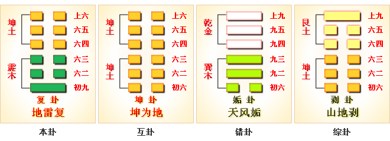

# 复 ䷗ fù

- No.24

> 復，亨，出入无疾，朋來无咎，反復其道，七日來復，利有攸往。
>《彖》曰：復，亨。剛反，動而以順行，是以出入无疾，朋來无咎，反復其道，七日來復，天行也。利有攸往，剛長也。復，其見天地之心乎。
>《象》曰：雷在地中，復，先王以至日閉關，商旅不行，后不省方。

> 初九，不遠復，无祇悔，元吉。
>《象》曰：不遠之復，以脩身也。
>《繫辭》：子曰：顏氏之子，其殆庶幾乎！有不善未嘗不知，知之未嘗復行也。易曰：「不遠復，无祇悔，元吉。」

> 六二，休復，吉。
>《象》曰：休復之吉，以下仁也。

>六三，頻復，厲，无咎。
>《象》曰：頻復之厲，義无咎也。

> 六四，中行獨復。
>《象》曰：中行獨復，以從道也。

> 六五，敦復，无悔。
>《象》曰：敦復无悔，中以自考也。

> 上六，迷復，凶，有災眚，用行師，終有大敗，以其國君，凶，至于十年不克征。
>《象》曰：迷復之凶，反君道也。

阴极则反，阳道行也。《易》云：“君子道长，小人道消。”又曰：“七日来复。”
> 七日，阳之称也。七九称阳之数也。谓坤上六，阴极阳战之地，阴虽不能胜阳，然正当盛，阳不可轻犯。六阳涉六阴反下，七爻在初，故称七日。日亦阳也。

六爻反复之称。
> 注在前。

《易》云：“初九，不远复，无秪悔”。
> 反至初九，阳来阴复，去违也。

六爻盛，卦之体总称也。月一阳为一卦之主，与震为飞伏。
> 庚子水，乙未土。

初九元士之世，六四诸侯见应。建始乙未至庚子，
> 大暑大雪见候，起坤，六月至十一月，戊子为正朔，见复之兆。

积筭起庚子至己亥，
> 积筭起庚子至己亥，十月至十一月，年亦然。

周而复始。土水见候。五星从位起岁星，
> 岁星木星入复卦，合水土，配吉凶。

张宿从位降庚子，
> 二十八宿分张宿，入复卦庚子水上。

分气候二十八。
> 积筭起数二十八，定吉凶六爻。

坤上震下，动而顺，是阳来荡阴，阴柔反去，刚阳复位，君子进，小人退。《易》云：“休复，元吉”。

阳升阴降，变六二入兑象，次并临，二阳将进，内为悦。阴来阳去，气渐隆，
> 阴不敢拒阳，奉命而已。

火之入地泽临卦。[䷒](e4b8b4lin_cn.md)

# [Fù ䷗](e5a48dfu.md)
