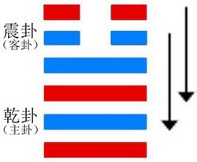

# 大壮 ䷡



大壮（dà zhuàng）是 `7:4` 卦的卦名，`7:4` 是大壮卦的代号。

大壮卦的主卦是`7`卦乾卦，卦象是天；客卦是`4`卦震卦，卦象是雷。

威力强大的主方，面对刚刚出现的新生力量，无疑可以轻易摆布客方，
但是，也可能滥用自己的力量，给自己带来麻烦，“大壮”有过于强壮之意，告诫主方不要过分滥用权力。

大壮卦，雷天大壮，壮勿妄动。
这个卦是异卦，下乾上震，相叠。震为雷；乾为天。乾刚震动。

天鸣雷，云雷滚， 声势宏大，阳气盛壮，万物生长。刚壮有力故曰壮。
大而且壮，故名大壮。四阳壮盛，积极而有所作为，上正下正，标正影直。

图中，红色表示当位的爻，天蓝色表示不当位的爻，箭头表示有应。

- 卦序：34

> 大壯，利貞。
>《彖》曰：大壯，大者壯也，剛以動，故壯。大壯利貞，大者正也。正大而天地之情可見矣。
>《象》曰：雷在天上，大壯，君子以非禮弗履。

> 初九，壯于趾，征凶，有孚。
>《象》曰：壯于趾，其孚窮也。

> 九二，貞吉。
>《象》曰：九二貞吉，以中也。

> 九三，小人用壯，君子用罔，貞厲。羝羊觸藩，羸其角。
>《象》曰：小人用壯，君子罔也。

> 九四，貞吉，悔亡。藩決不羸，壯于大輿之輹。
>《象》曰：藩決不羸，尚往也。

> 六五，喪羊于易，无悔。
>《象》曰：喪羊于易，位不當也。

> 上六，羝羊觸藩，不能退、不能遂，无攸利，艱則吉。
>《象》曰：不能退，不能遂，不詳也。艱則吉，咎不長也。

### 起卦

大壮卦是`7:4`卦的卦名，`7:4`是大壮卦的代号。“壮”（zhuàng），大，有力，强盛，强壮。
大壮卦的主卦是7卦乾卦，卦象是天，特性是强健，像天一样具有无穷威力；
客卦是4卦震卦，卦象是雷，特性是运动，代表新生事物。

威力强大的主方，面对刚刚出现的新生力量，无疑可以轻易摆布客方，
但是，也可能滥用自己的力量，给自己带来麻烦，“大壮”有过于强壮之意，告诫主方不要过分滥用权力。

起卦前必须客观地、全面地、准确地分析主方和客方的情况，必须至少符合下列条件之一，此卦才有参考价值：

1. 主方与天很相似，客方与雷很相似。
2. 主方的阳数是`7`，客方的阳数是`4`。
3. 主方的行动是阳，素质是阳，态度也是阳；客方的行动、素质和态度是阳、阴和阴。

大壮卦下部的三条爻是主卦，代表主方；上部的三条爻是客卦，代表客方。
主卦与客卦的构成决定于对主方的情况分析和对客方的情况分析。
主卦方面可能发生的变化决定于主方；客卦方面可能发生的变化决定于客方，主方可以期待和作应对准备，但是不能改变客卦的状态。

在主卦方面，主卦的下爻和上爻都是当位的爻，以黑色表示；中爻是不当位的爻，以灰色表示。当位表示对主方有利。下爻代表主方的行动，主方积极主动地开拓和发展，有可能取得利益，是潜在的对主方有利的因素。上爻代表主方的态度，主方态度强硬，有可能制约客方，逼使客方按主方的意图办事，也是潜在的对主方有利的因素。中爻不当位，表示主方素质良好，有可能受到客方损害，是潜在的对主方不利的因素，然而由于主方积极主动，态度强硬，主方可以依靠自己的良好素质制约客方，在竞争中获得更大胜利，这良好的素质不仅不是对主方不利，而是对主方非常有利。这样看来，主卦中的三条爻都对主方有利，主方不需要作任何改变，而是应当全部坚持，既坚持积极主动，也坚持态度强硬，并且以积极主动和态度强硬促使素质更优秀，实力更强大。

在客卦方面，下爻和中爻不当位，以灰色表示；上爻当位，以黑色表示。下爻表示客方也是积极主动，与主方剧烈竞争，是潜在的对主方不利的因素。中爻表示客方素质不佳，实力薄弱，正好可以从主方取得补益，对客方有利，对主方不利。图中有一个箭头，从客卦的中爻指向主卦的中爻，表示这种客方受益的关系。上爻表示客方态度随和，而主方态度强硬，正好主方可以制约客方，这是对主方有利的因素，图中有一个箭头从客卦的上爻指向主卦的上爻，表示这种对主方有利的关系。由于主方积极主动，并且制约客方，主方可以利用客方对主方的依赖，促进主方的发展，实际上对主方非常有利。于是，在客卦方面，主方应当认真应对客方的竞争。
以上提到的在主卦方面和客卦方面的各个因素中可能发生的变化，这些都是非常规变化，不能预测那一种变化一定发生，不过，基本上可以认为主方的变化不会很大，而客方有可能在态度方面有所变化，如果客方的态度变得强硬，则对主方不利。

除了非常规变化以外，还有常规变化，这是主方必须考虑的。主方的常规变化是从乾卦变到巽卦，主方由积极主动变成消极被动，从表面看变化并不显著，但是这是从上升到衰落的质的变化，越过了量变到质变的关键点，因此主方必须注意行为有度，切不可傲慢和自大，更不可滥用权力，尽量维持当前这种极盛状态，避免任何衰落迹象的发生，即使是极其微细的衰落，例如滥用职权，微小贪污行贿等，都必须完全杜绝。

客卦方面的常规变化是从震卦到离卦的变化，这是阳数的量变，其结果是客方的态度变得强硬，主方将难以继续制约客方，这也对主方不利。
主方的行为失度可能促使这种常规变化发生。

所以当前对于主方来说最重要的是防止行为失度，这就是这个卦的卦名“大壮”的用意。
爻辞实际上是一首以“壮”为主题的散文诗。下面是其译文：

```
连脚趾都显得强壮有力。
小人才用那强壮的力量，君子不用；
（看哪）那公羊用角去抵触篱藩，它的角被缠住了。
篱藩快破开吧，不要再缠羊角了，
大车下面那个结实的车伏兔才是正确显示强壮有力的地方。
（记住）丧羊于易（的教训）。
那公羊用角去抵触篱藩，既不能退后，也不能如意往前。
```

### 雷天大壮 壮勿妄动 中上卦《象》曰：卦占工师得大木，眼前该着走上路，时来运转多顺当，有事自管放心宽。

### 卦辞
```
〖原文〗利贞。
〖译文〗大壮卦象征十分强盛：坚守正道，将会非常有利。
〖说明〗主客双方都积极主动，主方与客方剧烈地竞争着。
主方的素质良好，态度强硬，而客方的素质不佳，
态度随和，主方占有绝对优势，
然而，主方的强硬态度，可能表现出傲慢、粗暴和自满，
可能滥用权力，导致不良结果。
卦辞指出当前的状态利于坚持下去，不需要大的变化，防止行为失度。
```

### 彖传解释
```
《彖传》说：大壮卦是指阳刚而强盛，
刚健而有行动，所以称之强盛。
“强盛有利于坚守正道”，是说刚强者还必须端正守中，
正直而刚强的真情实感也体现在天地万物之间的存在。
```

### 象传解释
```
《象传》说：《大壮卦》的卦象是乾（天）下，震（雷）上，
为震雷响彻天上之表象，象征着十分强盛。
君子应该严格要求自己，不要越出准则和规律去做非分之事。
```

### 一阳
```
〖原文〗壮于趾，征凶，有孚。
〖译文〗阳刚强盛只在脚趾。
这时如果有所行动，必然会招来灾祸。
《象》曰：“壮于趾”孚穷也。
〖译文〗《象传》说：爻辞中的“阳刚强盛只在脚趾“一句，
说明只停留在这一状态下，是决不会有什么出路的。
〖解说〗第一爻是主卦的下爻 ，代表主方的行动，
阳，表示主方积极主动地谋取和扩大自己的利益，
比如说，创新、创业、投资、进攻、求职、示爱，等等。
第二爻是阳爻，表示主方素质良好。
有良好的素质支持，积极主动的行动是有力的，“壮于趾”。
主方的态度是阳，态度强硬，有可能滥用权力。
主方不宜对客方施压，如果过度主动，可能犯错误，
违法，或者不道德，“征凶”。
如果主方注意到“征”的凶险，对客方不征，
则可以取得客方的信任，从而处理好双方关系，“有孚”。

〖结构分析〗这条爻是阳爻在阳位，当位，与四阳不有应。
当位表明主方积极主动，有可能利于发展，是潜在的对主方有利的因素；
不应表明客方也是积极主动，主方遇到强力反抗与竞争，
这潜在因素没有成为真正的对主方有利的因素。
由于存在客方的反抗和竞争，爻辞说，“征凶”，
为了化解矛盾，在竞争中取得收益，
主方应当与客方诚恳相待，取得客方信任，所以爻辞又说“有孚”。
```

### 二阳
```
〖原文〗贞吉。
〖译文〗坚守正道而获得吉祥。
《象》曰：九二“贞吉”，以中也。
【白话】《象传》说：
《大壮卦》的第二爻位（九二）
之所以能够坚守正道而获得吉祥，
是因为它位置居中，能够以柔相出的原因。
〖解说〗第二爻是主卦的中爻，代表主方的素质，
阳，表示主方的素质良好，
有钱，有地位，有技术，
或者非常强壮，而第五爻是阴爻，表示客方的素质不佳，
没钱，地位低，技术不强，或者虚弱。
然而，客方也在积极主动地改善素质，
在这种情况下，主方应当保持现在的状态，
而不是改变现在的状态，“贞吉”。

〖结构分析〗这条爻是阳爻在阴位，不当位，和五阴有应。
不当位表明主方的良好素质有可能受到客方损害，
是潜在的对主方不利的因素；
有应表明客方素质不佳，正好需要从主方取得补益，
这潜在因素成了真正的对主方不利的因素。
然而，由于主方积极主动，并且态度强硬，
可以利用主方在素质方面的优势制约客方，
这良好的素质对主方非常有利，所以爻辞说“贞吉”。
```

### 三阳
```
〖原文〗小人用壮，君子用罔；
贞厉，羝羊触藩，羸其角。
〖译文1〗小人恃强好胜，君子却恰恰相反。
而且，即使逞强好胜者能够保持住阳刚强盛，
其结果也决不会好。
〖译文2〗没有本领的人用强壮的身体，
有本领的人用网；坚持下去困难，
公羊触篱笆，角钩在篱笆上。
就像强壮的大羊去顶触篱笆，
结果只会把角卡在篱笆中而难以摆脱。
《象》曰：小人用壮，君子罔也。
〖译文〗《象传》说：小人恃强好胜，君子却不这样。
〖解说〗第三爻是主卦的上爻，
代表主方的态度，阳，主方的态度强硬。
爻辞建议主方不要用强力，要用智慧，“小人用壮，君子用罔”。
“罔”（wǎng），古同“网”，用绳线等结成的捕鱼捉鸟器具。
如果主方坚持用强硬的态度，则可能很难处理好与客方的关系，
“贞厉”，主方有可能过分施用强力，滥用权力，
结果会缠在困境之中难于摆脱，“羝羊触藩，羸其角”。
“羝”（dī），公羊。“藩”（fān），篱笆：藩篱。
“羸”（léi），瘦弱：羸瘦。
这里，公羊和篱笆都是形象比喻，
公羊代表主方，积极主动，有力量，而且狂妄；
篱笆代表客方，没有自卫的力量，对主方态度柔和。
这只狂妄的公羊，轻视态度柔和的篱笆，轻举妄动，角被缠着了。

〖结构分析〗这条爻是阳爻在阳位，当位，与六阴有应。
当位表明主方态度强硬，有可能制约客方，是潜在的对主方有利的因素；
有应表明客方态度随和，正好可以接受主方的制约，
这潜在因素成了真正的对主方有利的因素。
上爻是对中爻的补充，主卦的上爻和中爻都是阳爻，
表示主方的素质非常好，实力极强，
在这有利形势下，很可能态度强硬过度，表现出傲慢和粗暴，
使得主方的进展遇到严重困难，所以爻辞说“贞厉”。
```

### 四阳
```
〖原文〗贞吉，悔亡；藩决不羸，壮于大舆之輹。
〖译文1〗坚守正道，必获吉祥，悔恨也会消失；
因为阳刚十分强盛，既像篱笆已经崩溃，
羊角从系累中解脱出来，又像坚固的车轮能负重载远那样。
〖译文2〗坚持下去吉利，悔恨消亡；
篱笆断裂，羊角不再被缠着，大车下面有了结实的车伏兔。
《象》曰：“藩决不羸”，尚往也。
〖译文〗《象传》说：“篱笆崩溃，
羊角从系累中解脱出来”的内在含义是，
鼓励君子要充分行动起来，积极向前进取。
〖解说〗第四爻是客卦的下爻，代表客方的行动，
阳，表示客方积极主动地谋取和扩大自己的利益，
比如说，创新、创业、投资、进攻、求职、示爱，等等。
三阳爻辞中的“羝羊触藩，羸其角”是由于主方过于强大，
客方过于软弱造成的，如果主方坚持行为不失度，
则客方可以充分发挥积极主动性，
改善自己的素质，这对于主方是吉利的，
“贞吉”，主方就没有悔恨，“悔亡”；
客方的积极主动，将使得主方从纠缠中解脱出来，“藩决不羸”。
这样，主方就可能真正地壮大自己，“壮于大舆之輹”。
这一切都是以“贞”为先决条件，主方坚持不过分行动，
让客方积极主动，才能“壮于大舆之輹”。
“舆”（yú）车中装载东西的部分，后泛指车。
“輹”（fù），车伏兔，即垫在车箱和车轴之间的木块，
上面承载车箱，下面呈弧形，架在轴上。
这里仍然用了公羊和篱笆的比喻。

〖结构分析〗这条爻是阳爻在阴位，
不当位，和一阳不有应。
不当位表明客方积极主动，
有可能使主方利益受到损失，是潜在的对主方不利的因素；
不有应表明主方也是积极主动，可以保护主方的利益，
并且，客方的素质不佳，依赖于主方，加之客方态度随和，
主方态度强硬，可以制约客方，所以当前状态坚持下去，
对主方很有利，爻辞说“贞吉，悔亡”。
```

### 五阴
```
〖原文〗丧羊于易，无悔。
〖译文〗在田边地头丢失了羊，
却并没有什么可遗憾的，不会有什么不利的情况发生。
《象》曰：“丧羊于易”，位不当也。
〖译文〗《象传》说：“在田边地头丢失了羊”，是由于其位置不恰当。
〖释义〗易，当边境讲更贴切。边境之地一般多险恶，
丢了这只爱冲动，好斗的羊，没有什么好遗憾的。
〖解说〗第五爻是客卦的中爻，代表客方的素质，
阴，表示客方的素质不佳，主方的素质良好，主方可能帮助客方。
对于主方来说，在帮助客方的时候，
如果不节制自己的举动，可能造成损失，“丧羊于易”。
这里的羊仍然是比喻主方，对照上下文，易指平易的原野，代表平常环境，
在这平常环境里，出现了篱笆，这就是客方。
主方这只公羊，横冲直闯，触到篱笆了，
角被缠着了，“不能退，不能遂”，
这只羊在平易的原野上失去了。
如果主方意识到“丧羊于易”，
不借客方素质不佳之机轻举妄动，则没有悔恨。

〖结构分析〗这条爻是阴爻在阳位，
不当位，与二阳有应。
不当位表明客方素质不佳，有可能向主方寻求补益，
损害主方利益，是潜在的对主方不利的因素；
有应表明主方素质良好，可以满足客方需要，
这潜在因素成了真正的对主方不利的因素。
然而主方积极主动，可以利用客方对主方的依赖，
控制客方，所以爻辞说“无悔”。
```

### 六阴
```
〖原文〗羝羊触藩，不能退，不能遂，无攸利；艰则吉。
〖译文〗强壮的羊因顶触篱笆而被挂住了角，
既不能后退，又不能前进，怎样挣扎都没有好处。
在这种情况下，要能够忍耐坚持，
不被艰难困苦所压垮，就会安然渡过难关，获得吉祥。
《象》曰：“不能退，不能遂”，不详也；“艰则吉”咎不长也。
〖译文〗《象传》说：“既不能后退，又不能前进”，
说明行动处事不够圆满周到，结果陷入了极为被动的局面。
而“忍耐坚持，承受艰难困苦而不被压垮，就会吉祥”，
说明，只要能够坚持忍耐，就一定会渡过难关。
〖解说〗第六爻是客卦的上爻，代表客方的态度，
阴，客方的态度随和。
同时，第六爻是对第五条的补充，
第五条是阴，第六条也是阴，这表示客方的素质很差。
主方态度强硬，有力量，积极主动，像一只公羊，
客方像一条竖立不动，没有自卫能力，任人触闯的篱笆。
由于主方不顾客方的情况，任意触犯客方，
形成“不能退，不能遂”的局面，这对于主方来说没有任何好处。
如果主方严格约束自己，则对于主方来说很吉利，“艰则吉”。
“遂”（suì），顺，如意：遂心。

〖结构分析〗这条爻是阴爻在阴位，
当位，并且和三阳有应。
当位表明客方态度随和，有可能接受主方制约，
是潜在的对主方有利的因素；
有应表明主方态度强硬，恰好可以制约客方，
这潜在因素成了真正的对主方有利的因素。
另一方面，上爻是对中爻的补充，
主方的中爻和上爻都是阳爻，
表示主方的素质非常好，实力极强，
而客卦的中爻和上爻都是阴爻，
表示客方的素质极差，实力极弱，
在这极端反差下，主方很可能傲慢，过于粗暴，
反而对主方的发展不利，所以爻辞说“无攸利”。
如果主方严格控制自己避免失度，
形势还是对主方非常有利的，所以爻辞又说，“艰则吉”。
```

### 帛书易
```
泰壮①：利贞。
【注释】①泰壮：大壮，卦名。泰：大。
【白话】利于占问。
【讲解】泰壮卦象内卦键、外卦辰，
二象动而健，阳胜阴而为壮，
雷在天上健而动，阳升阴降，阳来荡阴，有大壮之象。
虞翻说：“阳息，《泰》也。
壮，伤也。大谓四，失位为阴所乘。
《兑》为毁折伤，与五易位乃得正，故‘利贞’也。”

初九：壮①于止，正凶②，有复。
【注释】①壮：训为伤。②正凶：象征凶恶。正：通征，象征。
【白话】伤了脚趾，象征有灾难降临，
避免遭殃的办法是有诚信之心。
【讲解】虞翻说：“趾谓四。征，行也。《震》足为趾，为征。
初得位，四不征之五，故‘凶’。
《坎》为孚，谓四上之五成《坎》，以得应四，故‘有孚’。”

九二：贞吉。
【白话】贞问吉善。
【讲解】王弼说：“居得中位，以阳居阴，履谦不亢，是以‘贞吉’。”
《象传》曰：“九二贞吉，以中也。”九二阳刚居中不得位。
《易》中爻贵得位，而《泰壮》卦却以阳刚之爻居于阴爻之位为吉。
这是一种特殊情况。
虞翻解释说：“变得位，故‘贞吉’。动体《离》，故‘以中也’。”

九三：小人用壮，君子用亡①。贞厉。羝羊②触藩，羸其角。
【注释】①亡：隐遁。②羝羊：公羊。
【白话】小人用伤害别人的方法成就自己，
君子用隐遁的方法造成自我。
贞问存在危险，象公羊用角抵触篱笆一样，不能进不能退。
【讲解】虞翻说：“变在《震》也。三，阳，君子。
小人谓上。上逆，故‘用壮’。
谓二已变《离》，《离》为罔，三乘二，故‘君子用罔’。
体《乾》夕惕，故‘贞厉’也。”
第三爻与第五爻互卦为《夺》，第二爻与第四爻互卦为《键》。
《夺》为羊，《键》为壮。九四体《辰》，《辰》为竹苇，故称“藩”。
六五为羊角，所以有“羝羊触藩，羸其角”之象。

九四：贞吉，悔亡。藩块①不羸，壮于泰车之緮②。
【注释】
①藩：假借为藩，篱笆。块：读为决，破坏。
②緮：假借为藩，车轮子的辐条。
【白话】贞问吉善，没有悔恨。
公羊抵触冲破了篱笆，又触坏了大车的辐条。
【讲解】《易》卦爻通例，失位则有悔。
九四阳爻居阴位，为什么又“贞吉悔亡”呢？
九四的阳爻到达六五便得中了，所以说“贞吉悔亡”。

六五：亡羊于易①，无悔。
【注释】①易：有易，古代族名，
春秋前长期活动于齐、鲁、晋、卫、宋、邢等国之间，
与诸国有频繁的接触。
【白话】丢失绵羊于有易，没有悔恨。
【讲解】九四爻、六五爻，阴阳失正。阴阳失正就叫做位不当。
九四阳刚动而变阴柔，便得到了川上键下的地天泰卦。
川为丧象，键为易象，九四上至六五爻则上卦为夺卦，夺为羊。
所以说“丧羊于易”。九四、六五变而得正，而处中和，所以说“悔亡”。

上六：羝羊触藩，不能退，不能遂①，无攸利，根②则吉。
【注释】①遂：前进。②根：假借为“艰”。
【白话】公羊触在篱笆上，角被篱笆卡住了，
后退不得，前进不得，没有什么好处，虽然有艰难险阻，但最终吉善。
【讲解】尚六与九三阴阳相应，所以两爻都有“羝羊触藩”。
九四爻上行到六五爻，上卦便变成了赣卦，
赣卦上爻变为阳爻，就又成了筭卦，筭卦卦象为进退。
筭卦的六四爻退到九三爻就失去了阴位，上到九五爻又是剩刚。
所以说“无攸利”。
赣为艰，上爻得位应九三阳爻，有利于上爻，所以说“根则吉”。
```

### 新解
``` 
大壮①：利贞。 
初九：壯②于趾。征，凶。有孚。 
九二：贞吉。 
九三：小人用壮③，君子用罔④。贞厉。羝羊触藩⑤，羸其角⑥。 
九四：贞吉，悔亡。藩决不羸⑦，壮于大舆之輹⑧。 
六五：丧羊于易⑨。无悔。 
上六：羝羊触藩，不能退，不能遂⑩。无攸利，艰则吉。

①大壮是本卦的标题。壮的意思是强健，伤。
全卦的内容主要与畜牧有关。标题的“壮”字是卦中多见词。
②壯：用作“戕”，意思是伤。 
③壮：强壮，力大。
④罔：古“网”字，用来捕兽的工具。
⑤羝（di）羊：公羊。藩；篱笆。
⑥羸（lei）：用作“累”，意思是用绳子捆住。
⑦决：破。
⑧輹：用作“辐”，这里指车轮。
⑨易：用作“场”，指放牧的牧场。
⑩遂：进。

【译文】 
大壮卦：吉利的占问。 
初九：脚趾受了伤。出行，凶险。有所收获。
九二：占得吉兆。
九三：奴隶狩猎凭力大，贵族狩猎用猎网。占得险兆。
公羊用头角撞篱笆，却被篱笆卡住了。
九四：占得吉兆，没有悔恨。
公羊撞破篱笆，摆脱了羁绊，又 撞在大车轮子上受了伤。
六五：羊在牧场上逃掉了。没有悔恨。
上六：公羊用头角撞篱笆，角被卡住，退不了，进不了。
没有什么好处，占问旱情则得吉兆。

【读解】
《周易》一再讲到狩猎驯养的情景，
可见这在当时的社会经济中仍占有相当重要的地位。
倘若这是社会生活的真实反映的话，
那就表明周代尚处在由狩猎社会向农业社会过渡的阶段。
狩猎所获，或用作食物，
或用来驯养（吃不完时养起来供以后食用）。
这两种情况，《周易》都说到了。
另一方面，从所记农业生产的情形看，
显然还比较原始，而且经常发生抢夺粮食的暴力事件。
这说明农业生产还未成为人们生活的主要来源，
还得靠狩猎和畜牧作为重要的补充。 
周人的发祥地在今天的陕西一带。
今昔对比，沧海桑田的巨变给人的感慨不知是忧是喜。
今日的陕西，恐怕找不到一个地方可以狩猎，
找不到一处有茂密的原始森林，
找不到一处可以开垦的处女地……
今日的陕西，给人最突出的印象是黄土地、
浑浊的黄河、信天游、窑洞和古铜色的黄皮肤。
俱往矣，昔日肥沃繁茂的草原，
今朝已变为现代化的钢筋水泥丛林和网络。
```


九四爻动变得[第11卦：地天泰](e6b3b0tai_cn.md)。

这个卦是异卦，下乾上坤，相叠。

乾为天，为阳；坤为地，为阴。

阴阳交感，上下互通，天地相交，万物纷纭。

反之则凶，万事万物，皆对立，转化，盛极必衰，衰而转盛，故应时而变者泰（通）。

### 六五：丧羊于易，无悔。《象》曰：丧羊于易，位不当也。


六五：丧羊于狄。筮遇此爻，没有大的灾祸。

《象传》说：丧羊于狄，因为六五阴爻而居处阳位，是所处不当，像人所处环境不适当，将蒙受损失。

凶：得此爻者，一筹莫展，不能得利，病者有丧身之兆。做官的会荒于政务。

- 时运：亡羊补牢，晚年有望。
- 财运：恐有小失，尚无大碍。
- 家宅：不宜畜牧；婚礼不成。
- 身体：不吉之象。

### 六五变卦：雷天大壮 变卦 泽天夬


六五爻动变得[第43卦：泽天夬](e5a4acguai_cn.md)。

这个卦是异卦，下乾上兑，相叠。

乾为天为健；兑为泽为悦。

泽气上升，决注成雨，雨施大地，滋润万物。

五阳去一阴，去之不难，
决（去之意）即可，故名为夬（guài），夬即决。

### 上六。羝羊触藩，不能退，不能遂，无攸利。艰则吉。《象》曰：不能退，不能遂，不详也；艰则吉，咎不长也。


上六：羊角插进了篱笆，退不了，进不了，处境不利。但是，目前虽处于艰难之中，最终可以化解逢吉。

《象传》说：不能退，不能进，陷入进退维谷之中，这是遭逢不祥。虽陷入艰难之中，最终可以化解逢吉，是说灾难不会长久。

平：得此爻者，进退两难，多是非争诉，宜守常。做官的宜退不宜进，恐有遭贬之危。

- 时运：早些退休，以免后悔。
- 财运：原想发财，难以保本。
- 家宅：艰难自守；先苦后乐。
- 身体：进退两难。

### 上六变卦：雷天大壮 变卦 火天大有


上六爻动变得[第14卦：火天大有](e5a4a7e69c89dayou_cn.md)。

这个卦是异卦，下乾上离，相叠。

上卦为离，为火；下卦为乾，为天。

火在天上，普照万物，万民归顺，顺天依时，大有所成。

# [Dà Zhuàng ䷡](e5a4a7e5a3aedazhuang.md)
