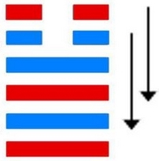
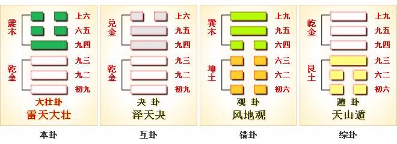

# 大壮 ䷡ dà zhuàng

- No.34

> 大壯，利貞。
>《彖》曰：大壯，大者壯也，剛以動，故壯。大壯利貞，大者正也。正大而天地之情可見矣。
>《象》曰：雷在天上，大壯，君子以非禮弗履。

> 初九，壯于趾，征凶，有孚。
>《象》曰：壯于趾，其孚窮也。

> 九二，貞吉。
>《象》曰：九二貞吉，以中也。

> 九三，小人用壯，君子用罔，貞厲。羝羊觸藩，羸其角。
>《象》曰：小人用壯，君子罔也。

> 九四，貞吉，悔亡。藩決不羸，壯于大輿之輹。
>《象》曰：藩決不羸，尚往也。

> 六五，喪羊于易，无悔。
>《象》曰：喪羊于易，位不當也。

> 上六，羝羊觸藩，不能退、不能遂，无攸利，艱則吉。
>《象》曰：不能退，不能遂，不詳也。艱則吉，咎不長也。

内外二象动而健，阳胜阴而为壮。
> 内阳升降，二象具阳，曰大壮。

《易》曰：“羝羊触藩，羸其角。”进退难也。壮不可极，极则败物。不可极，极则反。故曰：“君子用罔，小人用壮。”与震为飞伏。
> 庚午火，癸丑土。

九四诸侯之世，初九元士在应。建始戊戌至癸卯，
> 寒露至春分。

积筭起癸卯至壬寅，
> 土木入卦起积筭。

五星从位起太白，
> 太白金星入卦。

角宿从位降庚午，
> 二十八宿入卦，配角宿，入大壮庚午九四爻上。

分气候三十六。
> 积筭起数庚午火，定吉凶。

雷在天上，健而动，阳升阴降，阳来荡阴，吉凶随爻着于四时。九四庚午火之位，入坤，为卦之本。起于子，灭于寅。阴阳进退，六位不居，周流六虚。外象震入兑为阴悦，适爻为刚长。次降入夬，阳决阴之象，入泽天夬卦。

# [Dà Zhuàng ䷡](e5a4a7e5a3aedazhuang.md)
