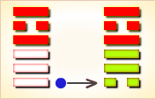
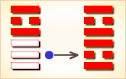
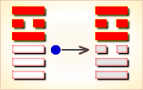
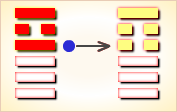
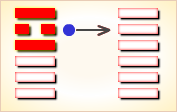
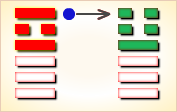

# 大有 ䷍


大有（䷍ dà yǒu）卦的代号是`7:5`。主卦是`7`卦，乾卦，卦象是天，特性是强健，阳数是`7`；客卦是`5`卦，离卦，卦象是火，特性是光明而依赖，阳数是`5`。“有”，表示所属：他有一本书。客方素质不佳，依赖主方，主方利用客方的依赖而获益，大有。主方大有，有很多利益，例如，主方是一个强有力的领导者，获得一个聪明人的辅佐，得益很多。客卦可以代表一个聪明人，此卦的卦爻辞的意思，着重于主方“大有”一个聪明人的辅佐。大有卦，火天大有，离上乾下，顺天依时。

图中，红色表示当位的爻，天蓝色表示不当位的爻，箭头表示有应。

- 卦序：14

> 大有，元亨。
>《彖》曰：大有，柔得尊位大中，而上下應之，曰大有。其德剛健而文明，應乎天而時行，是以元亨。
>《象》曰：火在天上，大有。君子以遏惡揚善，順天休命。

> 初九，无交害，匪咎，艱則无咎。
>《象》曰：大有初九，无交害也。

> 九二，大車以載，有攸往，无咎。
>《象》曰：大車以載，積中不敗也。

> 九三，公用亨于天子，小人弗克。
>《象》曰：公用亨于天子，小人害也。

> 九四，匪其彭，无咎。
>《象》曰：匪其彭，无咎，明辨晢也。

> 六五，厥孚交如，威如，吉。
>《象》曰：厥孚交如，信以發志也。威如之吉，易而无備也。
> 二三子：卦曰：「絞如委如，吉。」孔子曰：「絞，白也；委，老也。老白之行…，故曰吉。」

> 上九，自天祐之，吉无不利。
>《象》曰：大有上吉，自天祐也。
>《繫辭》：易曰「自天祐之，吉，无不利」。子曰：「祐者，助也。天之所助者順也，人之所助者信也。履信思乎順，又以尚賢也。是以自天祐之，吉，无不利也。」


```
大有（䷍ dà yǒu）卦是异卦，下乾上离，相叠。
上卦为离，为火；下卦为乾，为天。火在天上，普照万物，
万民归顺，顺天依时，大有所成。

《象传》：太阳在天，遍照大地万物，但五阳争一阴，须知有盈即缺。
```

运势：得时得运，昌荣大吉，但防物极必反，盛极而衰。

- 事业：事业已经取得一定的成就，最忌得意忘形，胡作非为。务必止恶扬善，坚守中正，交往正直的朋友，戒惧谨慎，兢兢业业，真正做到大而不盈，满而不溢，事业可望迈上新的台阶。
- 经商：兴隆昌盛，已摆脱困难状态，进入兴旺发达的阶段，如能克制贪财的心理，确守诚信原则，公平待人，克勤克俭，尤其应时刻注意市场动向，适时转轨，可望长久。
- 求名：已经小有名气，切勿就此满足，停顿不前，尤其不可陷入世俗圈内，应继续努力，在真正朋友的帮助下，更上一层楼。
- 婚恋：条件优越，可供选择者多，以慎重为好。对于家庭双方应尽力维护。
- 决策：性格坚强，勇于战胜困难，奋斗向上，前进途中困难和厄运很多，唯有认真对待才能不断取得成功，如放松警惕，骄傲自满，将带来惨重失败。朋友很多，交际广泛，对事业很有帮助，但其中也有拆台的小人。

大有卦离上乾下，为乾宫归魂卦。大有卦为柔得尊位，抑恶扬善，丰财利义，象征天命所归，得人心，因此主吉。

日丽中天，遍照万物；盛大富有，持盈保泰。

得此卦者，正当好运，事事吉祥，大有收获，但需防物极必反，盛极转衰。

- 时运：亨通无比，大放异彩。
- 财运：放手去做，财富自来。
- 家宅：积善之家，子孙保之。
- 身体：虚火上升，小心诊治。

```
大有：表示有很多的收获。是个吉卦。
易经解释大有卦为：春耕、夏耘、秋收、冬藏，
是个努力坚持之后的愿望期待实现。
很利于投资、合伙、感情、婚姻。

解释：旺盛大有收获。

特性：具有组织能力，能扩展大事业，吸收各方专才，
克服困难，有努力完成大目标勇气，荣誉心重。
```

运势：得时得运，隆盛昌荣也。然卦象藏有盛极必衰的预兆，不得不慎，以期保持其全盛之枢纽，可众望所归。有走红、赚钱之势，须谨慎不可骄纵。

- 家运：生平富贵吉利。切勿因富而凌贫，过于傲气凌人者不利也。
- 疾病：治疗可愈，防高血压、心脏、头肺病患。
- 胎孕：生贵子女，宜往大医院。
- 子女：儿女有成，父母欢欣之象。
- 周转：大有所得。
- 买卖：交易有获大利之象，但亦宜审慎行事。
- 等人：会带来好消息。
- 寻人：此人为感情或金钱之事出走，宜速找寻，否则恐有走极端之险。以东南再南方再西北三向寻之。
- 失物：找寻费时，惟可失而得。
- 外出：平安，可动身。
- 考试：会取得好成绩
- 诉讼：可圆满解决。
- 求事：顺利可行。
- 改行：可以，依计划进行。
- 开业：开业吉利。

### 初九：无交害，匪咎；艰则无咎。《象》曰：大有初九，无交害也。

不要彼此侵害，即没有灾祸，既使处于艰难之中，也没有灾祸。《象传》：大有初九爻辞说，不要彼此侵害。

平：得此爻者，心绪不定，小人欺凌，很是艰辛，长辈或有灾难。做官的须急流勇退，不可贪婪荣华富贵。

- 时运：刻苦自勉，等待好运。
- 财运：基业初创，慎始无害。
- 家宅：新富可喜，值得珍惜。
- 身体：健康无虞，讼事宜解。



初九爻动变得[第50卦：火风鼎](e9bc8eding_cn.md)。

火风鼎䷱是异卦，下巽上离，相叠。燃木煮食，化生为熟，除旧布新的意思。鼎为重宝大器，三足稳重之象。煮食，喻食物充足，不再有困难和困扰。在此基础上宜变革，发展事业。

### 九二：大车以载，有攸往，无咎。《象》曰：大车以载，积中不败也。

用大车装物载人，有明确的目的地，没有灾祸。《象传》：用大车装物载人，物积于车中不会散失。

吉：得此爻者，营谋得利，财利丰厚，但不利于老人的健康。做官的闲职者会受到重用。

- 时运：正交好运，一路顺风。
- 财运：国内国际，无不获利。
- 家宅：可以乔迁。
- 身体：出外就医，讼事得胜。



九二爻动变得[第30卦：离为火](e7a6bbli_cn.md)。

离为火䷝是同卦，下离上离，相叠。离者丽也，附着之意。一阴附丽，上下二阳，该卦象征火，内空外明。离为火、为明，太阳反复升落，运行不息，柔顺为心。

### 九三：公用亨于天子，小人弗克。《象》曰：公用亨于天子，小人害也。

天子宴请公侯。小人则不能参与。《象传》：天子宴请公侯，（小人不能参与）因为小人参与国政，将是国家的祸害。

平：得此爻者，有灾难，举步维艰，勿近小人。做官的会受到重任，读书人会取得很好的成绩。

- 时运：显荣之时，取贿必败。
- 财运：名利并至，勿近小人。
- 家宅：喜庆宴会，须防仆婢。
- 身体：饮食小心，不可争讼。



九三爻动变得[第38卦：火泽睽](e79dbdkui_cn.md)。

火泽睽䷥是异卦，下兑上离，相叠。离为火；兑为泽。火下泽，相违不相济。克则生，往复无空。万物有所不同，必有所异，相互矛盾。睽即矛盾。

### 九四：匪其彭，无咎。《象》曰：匪其彭，无咎，明辩晰也。

用曝晒男巫来求雨，旱情严重，但没有灾祸。《象传》：反对坏人坏事没有灾祸，因为明于考察辨析。

平：得此爻者，宜守常，则可避免伤害，眼睛方面或会出现病症。做官的须安于现状，不可激进，则可免祸。

- 时运：持盈保泰，知足不辱。
- 财运：利益已足，勿再贪求。
- 家宅：荣美可观，满则招损。
- 身体：膨胀之症。



九四爻动变得[第26卦：山天大畜](e5a4a7e89384daxu_cn.md)。

山天大畜䷙是异卦，下乾上艮，相叠。乾为天，刚健；艮为山，笃实。畜者积聚，大畜意为大积蓄。为此不畏严重的艰难险阻，努力修身养性以丰富德业。

### 六五：厥孚交如，威如，吉。《象》曰：厥孚交如，信以发志也；威如之吉，易而无备也。

来犯之敌被紧紧捆绑，严厉惩罚，吉利。《象传》：其人诚信坦白，因为他以诚信来表现自己的志向。威服众人之所以吉利，因为众人敬畏，则能平安而不困惫。

吉：得此爻者，须相时而动，切不可骄傲自负，以免自取其祸。做官的宜退不宜进。

- 时运：众人信服，晚运亨通。
- 财运：人和为贵，富有不难。
- 家宅：一家和睦，须防盗贼。
- 身体：保持门面。



六五爻动变得[第1卦：乾为天](e4b9beqian_cn.md)。

乾为天䷀是同卦，下乾上乾，相叠。象征天，喻龙（德才的君子），又象征纯粹的阳和健，表明兴盛强健。乾卦是根据万物变通的道理，以“元、亨、利、贞”为卦辞。表示吉祥如意，教导人遵守天道的德行。

### 上九：自天祐之，吉无不利。《象》曰：大有上吉，自天祐也。

上天保祐，吉利，无所不顺利。《象传》：大有是大吉大利之卦，因为得到上天的保祐。

吉：得此爻者，得到祖上之庇佑，一路好运。做官的以及读书人会进职成名。

- 时运：一路好运，事皆吉祥。
- 财运：百货畅达，自然获利。
- 家宅：福庆满门。
- 身体：得神庇佑，或即归天。



上九爻动变得[第34卦：雷天大壮](e5a4a7e5a3aedazhuang_cn.md)。

雷天大壮䷡是异卦，下乾上震，相叠。震为雷；乾为天。乾刚震动。天鸣雷，云雷滚，声势宏大，阳气盛壮，万物生长。刚壮有力故曰壮。大而且壮，故名大壮。四阳壮盛，积极而有所作为，上正下正，标正影直。

# [Dà Yǒu ䷍](e5a4a7e69c89dayou.md)
