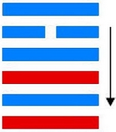
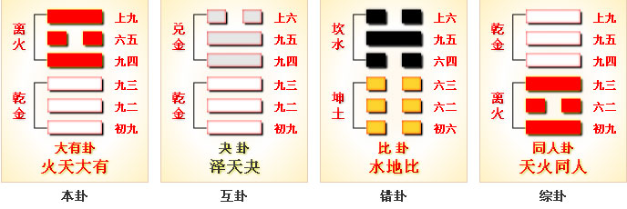

# 大有 ䷍



大有（dà yǒu）是`7:5`卦的卦名，`7:5`是大有卦的代号。

“有”，表示所属：他有一本书。
`7:5`卦的主卦是`7`卦乾卦，卦象是天，特性是强健，阳数是`7`；
客卦是`5`卦离卦，卦象是火，特性是光明而依赖，阳数是`5`。

客方素质不佳，依赖主方，主方利用客方的依赖而获益，大有。

主方大有，有很多利益，例如，主方是一个强有力的领导者，获得一个聪明人的辅佐，得益很多。
客卦可以代表一个聪明人，此卦的卦爻辞的意思，着重于主方“大有”一个聪明人的辅佐。

大有卦，火天大有，离上乾下，顺天依时。

- 互卦：夬卦
- 错卦：比卦
- 综卦：同人卦
- 卦序：14

> 大有，元亨。初九，无交害，匪咎，艱則无咎。九二，大車以載，有攸往，无咎。九三，公用亨于天子，小人弗克。九四，匪其彭，无咎。六五，厥孚交如，威如，吉。上九，自天祐之，吉无不利。
>《彖》曰：大有，柔得尊位大中，而上下應之，曰大有。其德剛健而文明，應乎天而時行，是以元亨。
>《象》曰：火在天上，大有。君子以遏惡揚善，順天休命。

### 结构和卦爻辞

图的左边是大有卦的结构图，大有卦代表从主方看主客双方关系的形势。
卦的下部是主卦，代表主方；上部是客卦，代表客方。
主卦是经卦乾卦，客卦是经卦离卦。经卦的下爻代表行动，中爻代表素质，上爻代表态度，上爻是对中爻的补充。
黑色的爻是当位的爻，对主方有利。灰色的爻是不当位的爻，对主方不利。

客卦三条爻全不当位，表明主方的困难主要来自客方。
客卦的下爻，也就是第四爻，是阳爻，表示客方积极主动，与其对应的主卦下爻也是阳爻，主方也是积极主动，客方与主方激烈竞争，是潜在的对主方不利的因素。因为主方也在积极主动地谋求发展，主方在维护和扩充自己的利益，客方不一定能赢主方，所以这种不利因素只是潜在的。客卦的中爻是阴爻，表示客方素质不佳，图中一个箭头从客卦中爻指向主卦中爻，主卦中爻是阳爻，表示主方素质良好，素质不佳的客方依赖主方，从主方取得补益，是真正的对主方不利的因素。客卦上爻是阳爻，表示客方态度强硬，客方企图制约主方，与其对应的主卦上爻也是阳爻，主方态度也强硬，客方难于制约主方，这是一个潜在的对主方不利的因素。尽管客卦的行动、素质和态度三方面都对主方不利，但是主方不能改变它，只能期望它发生变化，并且及时恰当应对。

主卦下爻是阳爻，表示主方积极主动，主方积极发展开拓，有利于维护和增加自己的利益，应当坚持下去。主卦中爻是阳爻，表示主方素质良好，虽然在与客方交往中可能遭受损失，但是，主方可以利用客方对主方的依赖，获取更多利益，实际上还是对主方有利的，主方应当坚持维护和加强。主卦的上爻是阳爻，表示主方态度强硬，上爻是对中爻的补充，主方的态度强硬是由于主方的素质良好，实力非常强，强硬态度有强大的实力支持，可以压制客方，对主方有利。主方应当做的是更积极主动，争取在竞争中获胜。
对比主卦与客卦，下爻相同，上爻也相同，差别在中爻。主方的中爻是阳爻，客方的是阴爻，双方处于阴阳和谐状态，图中有一个箭头，表示这种和谐状态，这是有应。这种有应表明主方实力大于客方，客方依赖主方，因此，主方与客方的关系不仅是竞争关系，而是客方依附于主方，共同发展的关系，主方拥有客方的辅佐。

根据当前情况，主方或者客方作出任何变化，都是非常规变化，不可预测。
同时，也需要考虑常规变化，常规变化是事物自身的发展变化，按阳数，其规律是4、5、6、7、3、2、1和0。
如主卦的阳数是`7`，已经达到了发展的顶峰，再继续下去，可能产生质变，从上升跃变到衰落，阳数从`7`下降到`3`。
其变化主要是行动上，由积极主动变成消极被动。主方必须极力避免这种变化发生，保持积极主动的活力。
客方可能发生的变化是从离卦变到兑卦，如果这种变化发生，对主方不利。
总之，主方应当保持积极主动的活力，利用客方对自己的依附，与客方共同发展，相互补益。“大有”意味主方拥有客方。

图底是卦名和卦辞。卦辞是从总体上对主方的建议。
图右是爻辞，和爻一一对应，从下往上数。
删去判断词，就是一首完整的围绕主题“大有”的散文诗，下面是其译文：

```
与（他）交往没有害处。
用大车载（他以表尊敬）。
公为天子主持祭祀，平庸之人不能胜任。
（他）不是一般的人。
与他以诚信相交，如同施加威力。
（有他辅佐）是上天保佑。
```


### 起卦

起卦前必须客观地、全面地、准确地分析主方和客方的情况，必须至少符合下列条件之一，此卦才有参考价值：

1. 主方与天很相似，客方与火很相似。
2. 主方的阳数是`7`，客方的阳数是`5`。
3. 主方的行动是阳，素质是阳，态度也是阳；客方的行动、素质和态度也是阳、阴和阳。

### 卦辞解释

大有卦，阐释成功后的因应原则。因本卦唯一的阴爻处于君位，其余五个阳爻都听从指挥，为它效劳。
国家昌盛，百姓富庶，这是普遍的愿望。但事情总有两面性，什么都有容易使人昏昏，忘乎所以。
卦的内容因此强调居有思无，居富思艰。为知艰慎行，所以六条爻辞中没有“凶、吝”等断误；又因为知艰慎行的程度不同，六爻的结果并不一样。

```
“大有”是大的所有，伟大事业的意思。
这一卦，离卦的日，上升到乾卦的天上，就象太阳普照万物；
而且，唯一的“六五”阴爻，在尊位得正，其他五个阳爻，都属于他，
也象君王高高在上，拥有天下，心怀万民。

乾下离上，大有元亨。
初九，无交害，匪咎；艰者无咎。
九二，大车以载，有攸往，无咎。
九三，公用亨于天子，小人弗克。
九四，匪其彭，无咎。
六五，厥孚交加，威加，吉。
上九，自天佑之，吉无不利。

离上乾下。“大有”：元亨。
《彖》曰：“大有”，柔得尊位，大中。而上下应之，曰“大有”。
谓五也。“大”者皆见“有”于五，故曰“大有”。
其德刚健而文明，应乎天而时行，是以“元亨”。
《象》曰：火在天上，“大有”。君子以遏恶扬善，顺天休命。
以健济明，可以进退善恶，“顺天”之“休命”也。

初九，无交害，匪咎；艰则无咎。
二应于五，三通于天子，四与上近焉；独立无交者，惟初而已。
虽然无交之为害也，非所谓“咎”也。独立无恃而知难焉，何咎之有？
《象》曰：大有初九，“无交害”也。
明惟初九为然也。

九二：大车以载，有攸往，无咎。
《象》曰：“大车以载”，积中不败也。
“大车”，虚而有容者，谓五也。
九二足以有为矣，然非六五虚而容之，虽欲往，可得乎？“积中”，明虚也。

九三：公用，亨于天子，小人弗克。
《象》曰：“公用，亨于天子”，小人害也。
九三以阳居阳，其势足以通于天子。以小人处之，则败矣。

九四：匪其彭，无咎。
《象》曰：“匪其彭，无咎”，明辩晢也。
“彭”，三也；九四之义，知有五而已。
夫九三之刚，非强也；六五之柔，非弱也。惟明者为能辨此。

六五：厥孚交如，威如，吉。
《象》曰：“厥孚交如”，信以发志也；“威如”之吉，易而无备也。
处群刚之间，而独用柔，无备之甚者也。
以其无备而物信之，故归之者交如也。
此柔而能威者，何也？
以其无备，知其有余也。夫备生于不足，不足之形见于外，则威削。

上九：自天祐之，吉无不利。
《象》曰：“大有”上吉，“自天祐”也。
王弼曰：余爻皆乘刚，已独乘柔顺也。
五为信德，而已履焉，履信者也。
居丰富之代，物不累心，高尚其志，尚贤者也。
爻有三德，尽夫助道，故《系辞》具焉也。

译文：上天保佑，大吉，无往不利。
曰“祐”，曰“吉”，曰“无不利”，其为福也多矣。
而终不言其所以致福之由，而象又因其成文，无所复说。
此岂真无说也哉！盖其所以致福者远矣。
夫两刚不能相用，而独阴不可以用阳，
故必居至寡之地，以阴附阳，而后众予之，“履”之六三、“大有”之六五是也。
六三附于九五，六五附于上九，而群阳归之。二阴既因群阳而有功，
九五、上九又得以坐受二阴之成绩，故“履”有不疚之光，
而“大有”有“自天”之“祐”，此皆圣贤之高致妙用也。
故孔子曰：“天之所助者，顺也；人之所助者，信也。
履信思乎顺，又以尚贤也。是以‘自天祐之，吉无不利’”。
信也，顺也，尚贤也，此三者，皆六五之德也。
“易而无备”，六五之顺也。“厥孚交如”，六五之信也。
群阳归之，六五之尚贤也。上九特履之尔。
我之所履者，能顺且信，又以尚贤，则天人之助将安归哉？
故曰“圣人无功，神人无名”，而“大有”上九，不见致福之由也。
启示：满而不溢，永远保持谦虚。
```

### 爻辞解释
```
初九：无交害，匪咎，艰则无咎。
《象》曰：大有初九，无交害也。
虞翻曰：害谓四。四离火，为恶人，故“无交害”。
初动，震为交。比坤为害。
匪，非也。艰，难，谓阳动比初成屯。
屯，难也。变得位，艰则无咎。
译文：不要彼此侵害，不要得意忘形，就不会在困难中戒惧。
启示：勿得意忘形。

九二：大车以载，有攸往，无咎。
《象》曰：大车以载，积中不败也。
虞翻曰：比坤为大车，乾来积上，故“大车以载”。
往，谓之五。二失位，变得正应五。故“有攸往无咎”矣。
译文：用大车把它拉走，送到他方，不会有什么麻烦。
启示：坚守中正，稳妥、周到。

九三：公用亨于天子，小人弗克。
《象》曰：公用亨于天子，小人害也。
虞翻曰：天子谓五。三，公位也。
小人谓四。二变得位，体鼎象。
故“公用亨于天子”。四折鼎足，覆公餗，故小人不克也。
译文：天子宴请群臣，小人没有什么可得。
启示：选贤用能，亲君子，远小人。

九四：匪其彭，无咎。
《象》曰：匪其彭，无咎；明辨晰也。
虞翻曰：匪，非也。其位尫。
足尫，体行不正，四失位，折震足，故“尫”。
变而得正，故“无咎”。尫或作彭，作旁声，字之误。
译文：把男匪放在太阳下曝晒，不会有什么过失。
启示：克制私欲，谦虚谨慎。

六五：厥孚交如，威如；吉。
《象》曰：厥孚交如，信以发志也。 
威如之吉，易而无备也。
虞翻曰：孚，信也。发而孚二，故“交加”。
乾称威，发得位，故“威如吉”。
译文：以诚实守信的原则进行交往，威严，吉祥。
启示：对部下诚信为本，恩威并济。

上九：自天佑之，吉无不利。
《象》曰：大有上吉，自天佑也。
虞翻曰：谓乾也。右，助也。
大有通比，坤为自，乾为天，兑为右，故“自天右之”。
比坤为顺，乾为信。天之所助者顺，人之所助者信。
履信思顺，又以尚贤，故“自天右之，吉无不利”。
```

### 卦辞概述
```
〖原文〗元亨。
〖译文〗很顺利。

〖解说〗主方强而有力，客方素质不佳，尽管双方都积极主动，
态度强硬，在双方关系中有矛盾，然而客方依赖于主方。
客方聪明而依赖于主方，可以协助主方，所以，主方的事业发展很顺利。
```

### 初九
```
〖原文〗无交害，匪咎，艰则无咎。
〖译文〗与他方交往没有害处，没有怪罪，艰难维持则无所怪罪。

〖解说〗第一爻是主卦的下爻，代表主方的行动，
阳，表示主方积极主动地谋取和扩大自己的利益，
比如说，创新、创业、投资、进攻、求职、示爱，等等。
同时，第四爻也是阳爻，客方也是积极主动，
主客双方可以相互交往，这种交往对主方没有害处，主方不受怪罪。
不过，由于客方有自己的利益需求，要让客方愿意协助主方，
并不是容易的事，主方艰难地寻求客方的协助，无所怪罪。

〖结构分析〗第一爻的位置是阳位，这条爻是阳爻，
阳爻在阳位，当位，然而与四阳不有应。
当位表明主方积极主动谋求发展，
维护和扩大自己的利益，是潜在的对主方有利的因素；
不有应表明客方也是积极主动，与主方竞争，主方遇到困难，
这潜在因素没有成为真正的对主方有利的因素。
由于这种潜在因素存在，以及主方实力大于客方，
经过艰苦努力，主方仍然可以获益，所以爻辞说“匪咎，艰则无咎”。
```

### 九二
```
〖原文〗大车以载，有攸往，无咎。
〖译文〗用大车乘载，有所前进，无所怪罪。

〖解说〗第二爻是主卦的中爻，代表主方的素质，
阳，表示主方的素质良好，例如，主方有权力和财富。
同时，第五爻是阴爻，表示客方素质不佳，例如，贫穷，或者地位低下。
承载大车的人是聪明的客方，主方聘请客方协助，
让客方乘大车以示尊敬礼遇，这向着取得客方的协助，
迈前了一步，“大车以载，有攸往”。这么做是为了主方的利益，“无咎”。

〖结构分析〗第二爻的位置是阴位，这条爻是阳爻，
阳爻在阴位，不当位，并且和五阴有应。
不当位表明主方素质良好，
有可能在与客方交往中受到损失，是潜在的对主方不利的因素；
有应表明客方素质不佳，谋求从主方的良好素质受益，
这潜在因素成了真正的对主方不利的因素。
换个角度考虑，由于客方需要从主方的良好素质获益，
客方依赖主方，主方利用客方的依赖，
可以取得更多利益，所以爻辞说“有攸往，无咎”。
```

### 九三
```
〖原文〗公用亨于天子，小人弗克。
〖译文〗公为天子主持祭祀，平庸的人不能胜任。

〖解说〗第三爻是主卦的上爻，代表主方的态度，
阳，表示主方态度强硬。同时，第三爻是对第二爻的补充，
第二爻是阳，第三爻也是阳，这表示主方的素质很好，实力极强，
强硬的态度有强大的实力支撑。
“公”（gōng），敬辞，尊称男子：包公。
这里，公比喻客方，天子比喻主方。
主方重用客方，“公用亨于天子”。
客方聪明，平庸的人担负不了这样的重任，“小人弗克”。

〖结构分析〗第三爻的位置是阳位，这条爻是阳爻，
阳爻在阳位，当位，然而与六阳不有应。
当位表明主方态度强硬，有可能制约客方，是潜在的对主方有利的因素；
不有应表明客方态度也强硬，客方不接受主方制约，
这潜在因素没有成为真正的对主方有利的因素。所以爻辞中没有判断词。
```

### 九四
```
〖原文〗匪其彭，无咎。
〖译文〗与大多数人不一样，无所怪罪。

〖解说〗第四爻是客卦的下爻，代表客方的行动，
阳，表示客方积极主动地谋取和扩大自己的利益。
“彭”（bāng），众多的样子，如“行人彭彭”。
客方不是一般的人，“匪其彭”。主方重用客方，无所怪罪。

〖结构分析〗第四爻的位置是阴位，这条爻是阳爻，
阳爻在阴位，不当位，并且与一阳不有应。
不当位表明客方积极主动谋求发展，
有可能损害主方利益，是潜在的对主方不利的因素；
不有应表明主方也是积极主动，主方维护和扩大自己的利益，
这潜在因素没有成为真正的对主方不利的因素。所以爻辞说“无咎”。
```

### 六五
```
〖原文〗厥孚交如，威如，吉。
〖译文〗以诚信交往，好像很有威力，吉利。

〖解说〗第五爻是客卦的中爻，代表客方的素质，
阴，表示客方的素质不佳，
比如说，资金缺乏、地位底下、实力薄弱、教育程度低，等等。
而主方的素质良好，主方诚恳地对待客方，
客方也会以诚恳回复，“厥孚交如”。
客方依赖主方，主方好像很有权威，“威如”。这种情况对主方吉利。
“厥”（jué），其他的，那个的：厥父。

〖结构分析〗第五爻的位置是阳位，这条爻是阴爻，
阴爻在阳位，不当位，不过和二阳有应。
不当位表明客方素质不佳，有可能谋求从主方获益，
是潜在的对主方不利的因素；
有应表明主方素质良好，正好可以满足客方需要，
这潜在因素成了真正的对主方不利的因素。
换一个角度考虑，素质不佳的客方谋求从主方的良好素质获益，
客方依赖主方，主方可以利用客方的依赖取得更多利益，
这种状态对主方很有利，所以爻辞说“吉”。
```

### 上九
```
〖原文〗自天祐之，吉无不利。
〖译文〗从天上来保佑，吉利，没有不利的事。

〖解说〗第六爻是客卦的上爻，
代表客方的态度，阳，客方的态度强硬。
客卦是离卦，卦象是光明而依赖，可以代表一个聪明的人。
客方以坚定而明确的态度支持主方，主方得到一个聪明人的支持，
就如同从天下降的保佑主方的力量，这对于主方来说是吉利的，没有不利的事。

〖结构分析〗第六爻的位置是阴位，这条爻是阳爻，
阳爻在阴位，不当位，并且和三阳不有应。
不当位表明客方态度强硬，有可能制约主方，
是潜在的对主方不利的因素；
不有应表明主方态度也强硬，客方不能制约主方，
这潜在因素没有成为真正的对主方不利的因素。
客方素质不佳，强硬的态度没有实力支持；
主方素质良好，强硬态度有强大的实力支持。
所以，客方受到主方制约，按主方的意图行事，爻辞说“吉无不利”。
```

### 卦象义

《象》曰：砍树摸雀作事牢，是非口舌自然消，婚姻合伙不费力，若问走失未逃脱。
这个卦是异卦，下乾上离，相叠。上卦为离，为火；下卦为乾，为天。
火在天上，普照万物，万民归顺，顺天依时，大有所成。大有卦，离火在乾天之上。
在天候上就是晴天丽日，在人事上是蒸蒸日上之象。是阳气（正气）发扬而阴气（邪气）消散之象。

大有，就是大大的有，是力量、物资、气运充沛的意象。
大有，处于君位（五位）的是本卦唯一一个阴爻，群阳近而比之，远而应之。
象征着君主善于处下而吸纳天下贤才为我所用。海纳百川，有容乃大。大者宜为下。这就是“大有”真正的含义。

## 相关卦
### 乾卦

乾卦是《易经》六十四卦之第一卦，乾为天（乾卦）刚健中正，是上上卦。《象》曰：天行健，君子以自强不息。这个卦是同卦，下乾上乾，相叠。象征天，喻龙（德才的君子），又象征纯粹的阳和健，表明兴盛强健。乾卦是根据万物变通的道理，以“元、亨、利、贞”为卦辞，示吉祥如意，教导人遵守天道的德行。乾卦的总体精神是“天行健，君子以自强不息”，天道之刚健有力与地道之柔顺宽柔双向互补，协调并济，共同促成了万物的化生，是管理艺术的最高境界，也是从事实际的运作所应当奉行的基本原则。

### 坤卦

1. 易经六十四卦之第二卦
2. 坤为地（坤卦）柔顺伸展
3. 上上卦

### 屯卦

屯卦是《易经》六十四卦之第三卦，为下下卦。水雷屯（屯卦）起始维艰。《象》曰：风刮乱丝不见头，颠三倒四犯忧愁，慢从款来左顺遂，急促反惹不自由。这个卦是异卦，下震上坎，相叠。震为雷，喻动；坎为雨，喻险。雷雨交加，险象丛生，环境恶劣。“屯”原指植物萌生大地。万物始生，充满艰难险阻，然而顺时应运，必欣欣向荣。

屯卦是震之坎态，出生的艰难坎坷的状态。此卦的内涵是万物出生都难，但迟早会通过，利于坚持不懈，这时前往无用无为，但是有利于树立建功立业的雄心壮志。正确的态度是，既不轻举妄动，又利用不动的时机积极准备，自强不息。

### 白话解析
```
大有①：元亨。
【白话】筮得大有卦，得“元亨”之占。
【注释】① 大有：卦名，包容丰富之象。
【讲解】大有卦由下体乾卦，上体离卦组成。
古人称丰收之年为“有”，大有年，即大丰年。大有，又解释为大富有。
这一卦一阴柔之爻居于尊位，与五阳刚之爻相应，是大富有的卦象。
《彖传》说：“大有，柔得尊位大中，而上下应之，曰大有，
其德刚健而文明，应乎天而时行，是以元亨。”

初九：无交禍①，非咎根，则无咎。
【白话】筮得大有卦，占得初九爻，
没有交战的灾祸，去掉了灾难的根源，便没有灾难了。
【注释】① 交禍：交战的灾祸。禍：灾祸。
禍，字书无此字，当是“祸”的异体字。
【讲解】这条爻辞通行本作“无交害，匪咎，艰则无咎。”
王弼说：“以夫刚健为大有之始，不能履中，满而不溢。
术斯以往，后害必至，其欲匪咎，艰则无咎也。”

九二：泰车①以载，有攸往，无咎。
【白话】筮得大有卦，占得九二爻，
坐在大车上外出旅行，没有灾难。
【注释】① 泰车：大车。
【讲解】九二阳刚之爻居于下体乾卦之中，
任重而不危险，致远而不拘泥，因此能够往而没有灾难。

九三：公用芳①于天子，小人弗克②。
【白话】筮得大有卦，占得九三爻，
公侯用飨于天子宫中，小人则不能在天子宫中吃饭。
【注释】
① 芳：假借为“享”。享，飨，宴飨，用酒食款待客人。
② 弗克：不能。弗：不。克：能。
【讲解】九三阳刚之爻处于大有卦的时候，居于下体乾卦的终点，
乘九二阳刚强健之上，而履得阳刚之位，
三与五同功而异位，威权达到了极盛的阶段。
王公占用这种爻位，就能通达于天子之道。
小人则不能，灾害总是伴随小人的。

九四：非其彭①，无咎。
【白话】筮得大有卦，占得九四爻，
宴会的仪式不隆重，但是没有灾难。
【注释】① 彭：盛大，隆重。
【讲解】九四失位，阳刚之爻居于阴柔之位，而上近至尊的六五，
下比分权的九三，非常可怕，非常危险。
只有那圣明仁智的人才能避免这样的灾难。
九四不能畏九三的权威，只能专心承受六五，常比九三之旁，就能无咎免灾。

六五：阙①复，交②如，委③如，终吉。
【白话】筮得大有卦，占得六五爻，其往来，
交通啊！委随啊！终于吉善美好。
【注释】
① 阙：假借为“厥”，其也。
② 交：交通。
③ 委：委随。
【讲解】六五阴柔居尊，处大以中，没有私心于物事，上下相应。
不私于物事，物事就处理得公正。不疑于物事，物事就办得诚恳。
这条爻辞告诫人们致富的两条秘诀：一是公正、公道；二是诚实，守信用。
既公且信，何难之有，何事不成，何人不富，何国不强？
不需要说话而教化自成，不需要做事而威信自然树立起来了。

上九：自①天右②之，吉，无不利。
【白话】筮得大有卦，占得尚九爻，
因为有上天的保佑，所以吉善美好，没有什么不利的。
【注释】
① 自：因为。
② 右：假借为“佑”。
【讲解】王弼说：“大有，丰富之世也。
处大有之上，而不累于位，志尚乎贤者也。
馀爻皆乘刚，而己独乘柔顺也。
五为信德，而己履焉，履信之谓也。
虽不能体柔，而以刚乘柔，思顺之义也。
居丰有之世，而不以物累其心，高尚其志，尚贤者也。”
```

### 《彖》曰
```
大有，柔得尊位，
大中而上下应之，曰大有。
其德刚健而文明，
应乎天而时行，是以元亨。
```

### 《象》曰
```
火在天上，大有；
君子以遏恶扬善，顺天休命。
火在天上，大有
火在天上，大有
大有初九，无交害也。
大车以载，积中不败也。
公用亨于天子，小人害也。
匪其彭无咎，明辨皙也。
厥孚交如，信以发志也。
威如之吉，易而无备也。
大有上吉，自天佑也。
```

### 新解
```
【原文】 
大有①：元亨。
初九：无交害②。匪咎。艰③则无咎。
九二：大车以载。有攸往，无咎。
九三：公④用亨于天子。小人弗克。
九四：匪⑤其彭。无咎。
六五：厥⑥孚交如威如。吉。
上九：自天佑之。吉， 无不利。

【注释】 
① 大有是本卦标题。有的意思是丰收，大有就是大丰收。
全卦的内容同农业丰收有关。
② 交害：互相侵害。
③ 艰：天旱，旱灾。
④ 公：指众大臣。亨：同“享”，意思是宴会。
⑤ 匪：用作“昲”，意思是用太阳晒。
彭：用作“尪”（wāng），意思是破足的男巫。
⑥ 厥：其。孚：俘虏。交：同“绞”，这里指捆绑。
交如：捆绑得很紧的样子。威如：气势汹汹 的样子。

【译文】 
大有卦：大亨大通。
初九：不要互相侵害，没有灾祸。即使天旱，也没有灾祸。
九二：大车大车的装载收成。有所往，没有灾祸。
九三：天子设宴款待群臣。小人不能参与。
九四：用太阳晒男巫以求雨。没有灾祸。
六五：把抓到的俘虏紧紧捆住，但还是气势汹汹，不肯屈服。吉利 。
上九：上天保佑。吉利, 没有不吉利。

【读解】
民以食为天。这一古老的思想早已深入到中华民族的骨髓之中，
口福之乐是人生最大的快乐之一。
丰收意味着一年的辛劳有了令人满意的结果，温饱有了着落，
口福之乐可以得到满足，生命又能延续下去。
人生之中恐怕再难以有如此意义重大的事情了。 

丰收的喜悦之中的确包含着众多的心理体验：
祈求苍天风调顺的期盼，担忧不劳而获的盗贼的强夺，
对王公贵族铺张奢侈的不满，面朝黄土背朝天的辛劳，
“三十亩地一头牛，老婆孩子热炕头”的美梦，
全都化作了对至神至圣的上天的虔诚。
严峻的生活现实难以孕育出轻松浪漫的情怀。
从远古面对上天的祈告声中，我们还能依稀听见几声无奈的喟叹。

【大有卦】
大有卦本身是在讲大拥所有，也可以理解成大家都有。
有了财富以后，我们还要保持高度的警惕性，
不要以为什么都有了，就可以放松，开始放纵自己。
不仅一个人拥有财富，我们也要学会和大家分享，
一个人的财富是没有任何意义的，同时一个人的财富，
也意味着你的财富会很快的消亡。

无交害，匪咎，艰则无咎：
交是指近的意思；卦辞的意思是说，
没有近距离的伤害，没有近距离的忧虑。
一个人进入大有卦，首先要做到的是要有忧患意识，
忧患意识不是说怕东怕西，什么都有怕，
而是说你要时刻提高自己的警觉性。
匪咎，艰则无咎：匪通非的意思；
匪咎是讲不是咎，那后面为什么又有艰则无咎呢？
我们讲，一个人开始进入大有卦的时候，
他有了很多财富，但是没有短距离的忧患。
艰，我们可以理解成艰苦、艰辛。
一个人在没有财富，只是一个普通人的时候，他付出了很多，
开店面的时候问别人借钱时的脸红，和朋友一起共患难的艰辛等等，
只要你时刻都铭记过去的艰辛，来修正自己的修养，那么你就可以无咎了。

大车以载，有攸往，无咎：
古时候一个人拉车的叫小车，一头牛拉的叫大车，
意思就是说，你把你所有的财富都装在大车上。
我们看九二爻和九五尊位刚好是相交的，
你把你所有的财富都和九五往来，利益得到分享，当然可以无咎。

公用亨于天子，小人弗克：
这段爻辞我要先说下小人弗克，弗克就是不能克制自己，
意思就是说你要不能克制自己。
公用我们可以理解成社会公益，亨于天子中的天子其实就是在讲九五。
全意就是说，你不能太放纵自己，
别认为有钱了以后就可以目中无人，这样反而适得其反。

匪其彭，无咎：
彭在古代是中乐器，意思是膨胀、澎湃。
意思是说，不要和彭这种乐器一样，
把声音喧哗的到处都听的到，到处人都知道你的财富有多少。

厥孚交如，威如，吉：
厥孚就是诚信的意思，一个人有了钱以后，
你要去拉拢人很困难，困难在是没地方呢？
因为你有了钱以后，你和人打交道，别人看你的眼光就是在想，
你是不是刻意想收买他，是不是从中想动什么歪脑筋。
这时候诚信就很重要，你与人为善，以诚信为本，做什么都要求讲究诚信，
那久而久之你的名声和威望都可以传达到，当然就可以得到吉利。

自天佑之，吉无不利：
只要你顺应天理，顺其大有卦的道理，你当然会得到吉无不利。
```



### 《断易天机》解

大有卦离上乾下，为乾宫归魂卦。大有卦为柔得尊位，抑恶扬善，丰财利义，象征天命所归，得人心，因此主吉。

### 北宋易学家 邵雍 解

日丽中天，遍照万物；盛大富有，持盈保泰。

得此卦者，正当好运，事事吉祥，大有收获，但需防物极必反，盛极转衰。

### 台湾国学家 傅佩荣 解

- 时运：亨通无比，大放异彩。
- 财运：放手去做，财富自来。
- 家宅：积善之家，子孙保之。
- 身体：虚火上升，小心诊治。

### 传统解卦
```
这个卦是异卦，下乾上离，相叠。上卦为离，为火；
下卦为乾，为天。火在天上，普照万物，
万民归顺，顺天依时，大有所成。

大象：太阳在天，遍照大地万物，但五阳争一阴，须知有盈即缺。
```

运势：得时得运，昌荣大吉，但防物极必反，盛极而衰。

- 事业：事业已经取得一定的成就，最忌得意忘形，胡作非为。务必止恶扬善，坚守中正，交往正直的朋友，戒惧谨慎，兢兢业业，真正做到大而不盈，满而不溢，事业可望迈上新的台阶。
- 经商：兴隆昌盛，已摆脱困难状态，进入兴旺发达的阶段，如能克制贪财的心理，确守诚信原则，公平待人，克勤克俭，尤其应时刻注意市场动向，适时转轨，可望长久。
- 求名：已经小有名气，切勿就此满足，停顿不前，尤其不可陷入世俗圈内，应继续努力，在真正朋友的帮助下，更上一层楼。
- 婚恋：条件优越，可供选择者多，以慎重为好。对于家庭双方应尽力维护。
- 决策：性格坚强，勇于战胜困难，奋斗向上，前进途中困难和厄运很多，唯有认真对待才能不断取得成功，如放松警惕，骄傲自满，将带来惨重失败。朋友很多，交际广泛，对事业很有帮助，但其中也有拆台的小人。

### 台湾 张铭仁 解卦
```
大有：表示有很多的收获。是个吉卦。
易经解释大有卦为：春耕、夏耘、秋收、冬藏，
是个努力坚持之后的愿望期待实现。
很利于投资、合伙、感情、婚姻。

解释：旺盛大有收获。

特性：具有组织能力，能扩展大事业，吸收各方专才，
克服困难，有努力完成大目标勇气，荣誉心重。
```

运势：得时得运，隆盛昌荣也。然卦象藏有盛极必衰的预兆，不得不慎，以期保持其全盛之枢纽，可众望所归。有走红、赚钱之势，须谨慎不可骄纵。

- 家运：生平富贵吉利。切勿因富而凌贫，过于傲气凌人者不利也。
- 疾病：治疗可愈，防高血压、心脏、头肺病患。
- 胎孕：生贵子女，宜往大医院。
- 子女：儿女有成，父母欢欣之象。
- 周转：大有所得。
- 买卖：交易有获大利之象，但亦宜审慎行事。
- 等人：会带来好消息。
- 寻人：此人为感情或金钱之事出走，宜速找寻，否则恐有走极端之险。以东南再南方再西北三向寻之。
- 失物：找寻费时，惟可失而得。
- 外出：平安，可动身。
- 考试：会取得好成绩
- 诉讼：可圆满解决。
- 求事：顺利可行。
- 改行：可以，依计划进行。
- 开业：开业吉利。

### 初九爻辞

初九。无交害，匪咎；艰则无咎。

《象》曰：大有初九，无交害也。

### 白话文解释

初九：不要彼此侵害，即没有灾祸，既使处于艰难之中，也没有灾祸。

《象辞》说：大有初九爻辞说，不要彼此侵害。

### 北宋易学家 邵雍 解

平：得此爻者，心绪不定，小人欺凌，很是艰辛，长辈或有灾难。做官的须急流勇退，不可贪婪荣华富贵。

### 台湾国学家 傅佩荣 解

- 时运：刻苦自勉，等待好运。
- 财运：基业初创，慎始无害。
- 家宅：新富可喜，值得珍惜。
- 身体：健康无虞，讼事宜解。

### 初九变卦：火天大有 变卦 火风鼎


初九爻动变得[第50卦：火风鼎](e9bc8eding_cn.md)。

这个卦是异卦，下巽上离，相叠。

燃木煮食，化生为熟，除旧布新的意思。

鼎为重宝大器，三足稳重之象。

煮食，喻食物充足，不再有困难和困扰。
在此基础上宜变革，发展事业。

### 九二爻辞

九二。大车以载，有攸往，无咎。

《象》曰：大车以载，积中不败也。

### 白话文解释

九二：用大车装物载人，有明确的目的地，没有灾祸。

《象辞》说：用大车装物载人，物积于车中不会散失。

### 北宋易学家 邵雍 解

吉：得此爻者，营谋得利，财利丰厚，但不利于老人的健康。做官的闲职者会受到重用。

### 台湾国学家 傅佩荣 解

- 时运：正交好运，一路顺风。
- 财运：国内国际，无不获利。
- 家宅：可以乔迁。
- 身体：出外就医，讼事得胜。

### 九二变卦：火天大有 变卦 离为火


九二爻动变得[第30卦：离为火](e7a6bbli_cn.md)。

这个卦是同卦，下离上离，相叠。

离者丽也，附着之意。

一阴附丽，上下二阳，该卦象征火，内空外明。

离为火、为明，太阳反复升落，运行不息，柔顺为心。

### 九三爻辞

九三。公用亨于天子，小人弗克。

《象》曰：公用亨于天子，小人害也。

### 白话文解释

九三：天子宴请公侯。小人则不能参与。

《象辞》说：天子宴请公侯，（小人不能参与）因为小人参与国政，将是国家的祸害。

### 北宋易学家 邵雍 解

平：得此爻者，有灾难，举步维艰，勿近小人。做官的会受到重任，读书人会取得很好的成绩。

### 台湾国学家 傅佩荣 解

- 时运：显荣之时，取贿必败。
- 财运：名利并至，勿近小人。
- 家宅：喜庆宴会，须防仆婢。
- 身体：饮食小心，不可争讼。

### 九三变卦：火天大有 变卦 火泽睽


九三爻动变得[第38卦：火泽睽](e79dbdkui_cn.md)。

这个卦是异卦，下兑上离，相叠。

离为火；兑为泽。

上火下泽，相违不相济。

克则生，往复无空。

万物有所不同，必有所异，相互矛盾。
睽即矛盾。

### 九四爻辞

九四。匪其彭，无咎。

《象》曰：匪其彭，无咎，明辩晰也。

### 白话文解释

九四：用曝晒男巫来求雨，旱情严重，但没有灾祸。

《象辞》说：反对坏人坏事没有灾祸，因为明于考察辨析。

### 北宋易学家 邵雍 解

平：得此爻者，宜守常，则可避免伤害，眼睛方面或会出现病症。做官的须安于现状，不可激进，则可免祸。

### 台湾国学家 傅佩荣 解

- 时运：持盈保泰，知足不辱。
- 财运：利益已足，勿再贪求。
- 家宅：荣美可观，满则招损。
- 身体：膨胀之症。

### 九四变卦：火天大有 变卦 山天大畜


九四爻动变得[第26卦：山天大畜](e5a4a7e89384daxu_cn.md)。

这个卦是异卦，下乾上艮，相叠。

乾为天，刚健；艮为山，笃实。

畜者积聚，大畜意为大积蓄。

为此不畏严重的艰难险阻，努力修身养性以丰富德业。

### 六五爻辞

六五。厥孚交如，威如，吉。

《象》曰：厥孚交如，信以发志也；威如之吉，易而无备也。

### 白话文解释

六五：来犯之敌被紧紧捆绑，严厉惩罚，吉利。

《象辞》说：其人诚信坦白，因为他以诚信来表现自己的志向。威服众人之所以吉利，因为众人敬畏，则能平安而不困惫。

### 北宋易学家 邵雍 解

吉：得此爻者，须相时而动，切不可骄傲自负，以免自取其祸。做官的宜退不宜进。

### 台湾国学家 傅佩荣 解

- 时运：众人信服，晚运亨通。
- 财运：人和为贵，富有不难。
- 家宅：一家和睦，须防盗贼。
- 身体：保持门面。

### 六五变卦：火天大有 变卦 乾为天


六五爻动变得[第1卦：乾为天](e4b9beqian_cn.md)。

这个卦是同卦，下乾上乾，相叠。

象征天，喻龙（德才的君子），
又象征纯粹的阳和健，表明兴盛强健。

乾卦是根据万物变通的道理，
以“元、亨、利、贞”为卦辞。

表示吉祥如意，教导人遵守天道的德行。

### 上九爻辞

上九。自天祐之，吉无不利。

《象》曰：大有上吉，自天祐也。

### 白话文解释

上九：上天保祐，吉利，无所不顺利。

《象辞》说：大有是大吉大利之卦，因为得到上天的保祐。

### 北宋易学家 邵雍 解

吉：得此爻者，得到祖上之庇佑，一路好运。做官的以及读书人会进职成名。

### 台湾国学家 傅佩荣 解

- 时运：一路好运，事皆吉祥。
- 财运：百货畅达，自然获利。
- 家宅：福庆满门。
- 身体：得神庇佑，或即归天。

### 上九变卦：火天大有 变卦 雷天大壮


上九爻动变得[第34卦：雷天大壮](e5a4a7e5a3aedazhuang_cn.md)。

这个卦是异卦，下乾上震，相叠。

震为雷；乾为天。
乾刚震动。

天鸣雷，云雷滚，声势宏大，阳气盛壮，万物生长。

刚壮有力故曰壮。大而且壮，故名大壮。
四阳壮盛，积极而有所作为，上正下正，标正影直。

# [Dà Yǒu ䷍](e5a4a7e69c89dayou.md)
