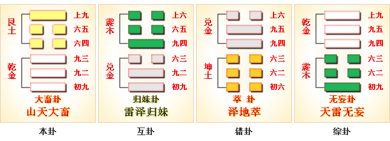

# 大畜 ䷙ dà xù

- No.26

> 大畜，利貞，不家食吉，利涉大川。
>《彖》曰：大畜，剛健篤實，輝光日新其德，剛上而尚賢，能止健，大正也。不家食吉，養賢也；利涉大川，應乎天也。
>《象》曰：天在山中，大畜。君子以多識前言往行，以畜其德。

> 初九，有厲，利已。
>《象》曰：有厲利已，不犯災也。

> 九二，輿說輹。
>《象》曰：輿說輹，中无尤也。

> 九三，良馬逐，利艱貞，曰閑輿衛，利有攸往。
>《象》曰：利有攸往，上合志也。

> 六四，童牛之牿，元吉。
>《象》曰：六四元吉，有喜也。

> 六五，豶豕之牙，吉。
>《象》曰：六五之吉，有慶也。

> 上九，何天之衢，亨。
>《象》曰：何天之衢，道大行也。

阳长阴消，积气凝盛，外止内健，二阴犹盛，成于畜义。《易》云：“既处。”畜消时行，阳未可进。取于下卦，全其健道，君子以时顺其吉凶。与乾为飞伏。
> 甲寅木，丙午火。

建始壬辰至丁酉，
> 清明秋分。

积筭起丁酉至丙申，周而复始。
> 金土入卦分吉凶起筭。

五星从位起太白，
> 太白金星入卦推吉凶。

毕宿从位降甲寅。
> 毕宿入大畜九二甲寅上。

九二大夫应世，应六五为至尊，阴阳相应，以柔居尊
（缺）

为畜之主。分气候二十八。
> 极阴阳之数，定吉凶之兆。

山下有乾，金土相资。阳进阴止，积雨润下，畜道光也。乾象内进，君道行也。吉凶升降，阴阳得位，二气相应，阳上薄阴，阴道凝结。上于阳长，为雨反下，九居高位，极于畜道。反阳为阴，入于兑象。六三应上九，上有阳九，反应六三，成于损道。次降损卦。[䷨](e68d9fsun_cn.md)
> 乾入兑九三之变六二。

# [Dà Xù ䷙](e5a4a7e89384daxu.md)
