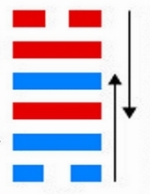
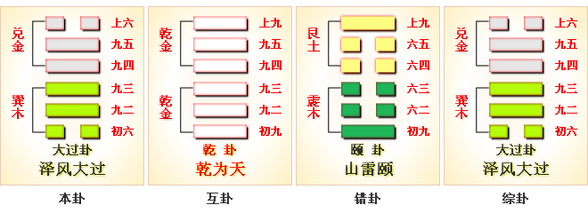
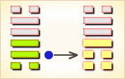
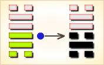
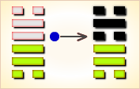
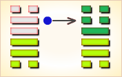
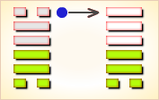

# 大过 ䷛



大过（䷛ dà guò）卦的代号是`3:6`。主卦是巽卦，卦象是风、木，特征是顺，阳数是`3`；客卦是兑卦，卦象是泽，特征是悦，阳数是`6`。上泽下木，水漫过树，洪水之象，水多方酿成洪水。“过”是过分的意思。“大过”，太过分。卦形上本卦中间为四阳，上下为二阴，象征阳气过剩而失调。当前形势对于主方来说是一个太过分的负担，主方不容易对付，但也不是灾难，只是主方需要谨慎处理。泽风大过，非常行动。这个卦是异卦，下巽上兑，相叠。阴阳爻相反，阳大阴小，行动非常，有过度形象，内刚外柔。

图中，红色表示当位的爻，天蓝色表示不当位的爻，箭头表示有应。

- 卦序：28

> 大過，棟橈。利有攸往，亨。
>《彖》曰：大過，大者過也。棟橈，本末弱也。剛過而中，巽而說行，利有攸往，乃亨，大過之時大矣哉。
>《象》曰：澤滅木，大過。君子以獨立不懼，遯世无悶。
>《繫辭》：古之葬者，厚衣之以薪，葬之中野，不封不樹，喪期无數，後世聖人易之以棺槨，蓋取諸大過。

> 初六，藉用白茅，无咎。
>《象》曰：藉用白茅，柔在下也。
>《繫辭》：初六「藉用白茅，无咎」。子曰：「苟錯諸地而可矣。藉之用茅，何咎之有。慎之至也。夫茅之為物薄而用可重也，慎斯術也以往，其无所失矣。」

> 九二，枯楊生稊，老夫得其女妻，无不利。
>《象》曰：老夫女妻，過以相與也。

> 九三，棟橈，凶。
>《象》曰：棟橈之凶，不可以有輔也。

> 九四，棟隆，吉，有它吝。
>《象》曰：棟隆之吉，不橈乎下也。

> 九五，枯楊生華，老婦得其士夫，无咎无譽。
>《象》曰：枯楊生華，何可久也；老婦士夫，亦可醜也。

> 上六，過涉滅頂，凶，无咎。
>《象》曰：過涉之凶，不可咎也。



```
大过（䷛ dà guò）卦是异卦，下巽上兑，相叠。
兑为泽、为悦，巽为木、为顺，泽水淹舟，遂成大错。
阴阳爻相反，阳大阴小，行动非常，有过度形象，内刚外柔。

《象传》：中间四阳爻，为结实之梁，但初末为阴爻，力弱不支，则势将摧折。
```

运势：有力不从心，负担过重之象，多烦恼，防官非及水险。

- 事业：事业出现隐患，甚至危机四伏，务必十分小心谨慎，唯有坚守中道，以谦虚和悦的手段，胆大心细，求助他人相助。必要时可采取非常手段，不拘常规，予以冒险。
- 经商：操之过急，发展过快，宜收缩调整。竞争处于不利地步，切勿过度自信，更不得刚愎自用，宜随时观测风向，待机行动。在有确切把握之下，不妨冒险，争取时机的好转。
- 求名：最忌不务实际，追求不切实际的虚名，以致盛名不符。唯以谦逊态度，谨慎行动，潜心努力，不怕世人眼舌，一往直前，追求最初的目标。
- 婚恋：自知之明最为重要，不可急于求成，应慎重考虑，并以正当手段，促成事情的成功。但也不排除必要的精明手段。
- 决策：处在非常时期，若不能妥善处置，则极为不利，针对实际情况，既不可轻举妄动，也不可优柔寡断，而应刚柔相济，虚心征求他人意见，慎重行动，大胆追求，却又不怕流言，争取时局好转。

大过卦兑上巽下，为震宫游魂卦。大过即太过，事情过头了，但大过卦仍是中庸顺从之象，主其人得协助、能前进。

阳多阴少，势将颠覆；本未俱弱，量力而为。得此卦者，身心不安，事不如意，却又强意而行，大有后悔之时，谨防官非及水险。

- 时运：收敛自省，未可求名。
- 财运：低价高涨，不易把握。
- 家宅：防止倾斜；老少配婚。
- 身体：肝肾皆累，不易治好。

```
大过：表示犯了一个很大的过错，主大凶。
诸事不顺，切忌此时作任何的决策。
需努力找出问题之所在，尽快解决才能扭转劣势。

解释：极大过失。

特性：心直口快，性急，易得罪他人，是非小人多，
但交际层面广，朋友多，但也易受朋友之拖累。
```

运势：诸事衰退，多烦恼，防官非及水险。有力而不从心，负担过重之象。逢挫折而将坠落之时运，故得此卦者，凡事切忌轻举妄动，否则有过。

- 家运：困难重重，摇摇欲坠之衰运。夫妻感情不睦，且均有向外发展之趋势，若想挽回此破象，双方宜改正自己的缺点，否则破裂也。
- 疾病：严重，须耐心治疗，为肺、神经系统，女占得妇科经带之疾。
- 胎孕：女儿或男儿均与六亲缘薄，育养困难。
- 子女：子女与双亲间感情薄弱，又缺乏谅解，有症结也。
- 周转：无啥希望。
- 买卖：不可做超过自己本身财力之生意交易，否则定有折损，亦不成。
- 等人：不会来。
- 寻人：不易找到，可向东南方或西方，难寻。但若动用人手共寻找，可见。
- 失物：无法发现，不能物归原主。
- 外出：行动务必慎重，但不可过于拘泥，必要时不妨采取特殊行动。
- 考试：苦恼也，不佳。
- 诉讼：有文书之烦，即使求和也未能如愿。
- 求事：困难很多。
- 改行：不宜图不相应之事。
- 开业：开业尚属虚，且待时候。

### 初六：藉用白茅，无咎。《象》曰：藉用白茅，柔在下也。

恭敬地用白茅垫着祭品，可以无灾祸。《象传》：“恭敬地用白茅垫着祭品”，柔软之物铺垫在下面，正像初六阴爻居一卦之下位。

平：得此爻者，谨慎行事，财利可固。凶者，防孝服之忧。做官的小心谨慎则禄位巩固。

- 时运：宽柔待人，一起成功。
- 财运：柔白之货，可以获利。
- 家宅：环境荒芜。
- 身体：病体柔弱，温燥之药。


初六爻动变得[第43卦：泽天夬](e5a4acguai_cn.md)。

泽天夬䷪是异卦，下乾上兑，相叠。乾为天为健；兑为泽为悦。泽气上升，决注成雨，雨施大地，滋润万物。五阳去一阴，去之不难，决（去之意）即可，故名为夬（guài），夬即决。

### 九二。枯杨生稊，老夫得其女妻，无不利。《象》曰：老夫女妻，过以相与也。

枯杨发芽，老头子娶少女为妻，并无不吉利。《象传》：夫老妻少，年龄不当，这是错误的婚配。

吉：得此爻者，或娶妻纳妾，或生子，君子得少妻义子。做官的去位者会复职。

- 时运：晚年成名，反败为胜。
- 财运：林木生意，应可获利。
- 家宅：枯树开花；老夫少妻，得以生育。
- 身体：虽危得安。



九二爻动变得[第31卦：泽山咸](e592b8xian_cn.md)。

泽山咸䷞是异卦，下艮上兑，相叠。艮为山；泽为水。兑柔在上，艮刚在下。水向下渗，柔上而刚下，交相感应。感则成。

### 九三：栋桡，凶。《象》曰：栋桡之凶，不可以有辅也。

屋梁弯曲，这是凶险之象。《象传》：屋梁弯曲之所以凶险，因为栋曲即屋倾，无法支撑。

凶：得此爻者，须防大难而遭致家产有失，或有足目之疾。做官的须谨防被贬职。

- 时运：刚愎自用，虽成终败。
- 财运：只靠自己，人财两失。
- 家宅：栋折难居；婚姻不利。
- 身体：恐有不测。



九三爻动变得[第47卦：泽水困](e59bb0kun_cn.md)。

泽水困䷮是异卦，下坎上兑，相叠。兑为阴为泽喻悦；坎为阳为水喻险。泽水困，陷入困境。才智难以施展，仍坚守正道，自得其乐，必可成事，摆脱困境。

### 九四：栋隆，吉。有它吝。《象》曰：栋隆之吉，不桡乎下也。

屋梁挺直，吉利。但有意外之患则不好应付。《象传》：屋梁挺直之所以吉利，因为屋梁不弯曲则房屋不倾倒。

吉：得此爻者，多有修造之事，可做大事，勿谋小事。做官的必能受到重用。读书人进取成名。

- 时运：可担大任，勿图小事。
- 财运：木材生意，可以得利。
- 家宅：门户宏伟。
- 身体：胸胀无碍。



九四爻动变得[第48卦：水风井](e4ba95jing_cn.md)。

水风井䷯是异卦，下巽上坎，相叠。坎为水；巽为木。树木得水而蓬勃生长。
人靠水井生活，水井由人挖掘而成。相互为养，井以水养人，经久不竭，人应取此德而勤劳自勉。

### 九五：枯杨生花，老妇得其士夫，无咎无誉。《象》曰：枯杨生花，何可久也。老妇土夫，亦可丑也。

枯杨开花，老妇人嫁给一个年轻人，这件事不好也不坏。《象传》：枯杨开花，其花怎能长开不谢。老妇人嫁给年轻人，这种事总不大光彩。

平：得此爻者，营谋不利，或喜中生忧，美事成丑；先逆后顺之象。做官的不可久任。

- 时运：晚年得意，求其平顺。
- 财运：小心多情，名利皆失。
- 家宅：闺房不正；女大男小。
- 身体：不好不坏。



九五爻动变得[第32卦：雷风恒](e68192heng_cn.md)。

雷风恒䷟是异卦，下巽上震，相叠。震为男、为雷；巽为女、为风。震刚在上，巽柔在下。刚上柔下，造化有常，相互助长。阴阳相应，常情，故称为恒。

### 上六。过涉灭顶，凶，无咎。《象》曰：过涉之凶，不可咎也。

盲目涉水，水深过顶，虽遇凶险，但终归没有灾难。《象传》：盲目涉水遭致危险，事已至此，谴责亦属无益。

凶：得此爻者，不宜进取，退守为安，面部或有疾。做官的有功高震主身危之祸。

- 时运：下过苦工，赢得声名。
- 财运：出货谨慎，以免失利。
- 家宅：小心水灾。
- 身体：颜面浮肿，可能难治。



上六爻动变得[第44卦：天风姤](e5a7a4gou_cn.md)。

天风姤䷫是异卦，下巽上乾，相叠。乾为天，巽为风。天下有风，吹遍大地，阴阳交合，万物茂盛。姤（gòu）卦与夬（guài）卦相反，互为“综卦”。姤即媾，阴阳相遇。但五阳一阴，不能长久相处。

# [Dà Guò ䷛](e5a4a7e8bf87daguo.md)
