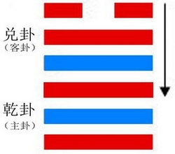
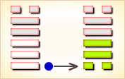
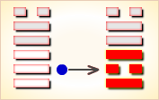
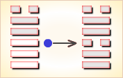
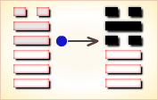
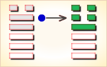

# 夬 ䷪



夬是`7:6`卦的卦名，`7:6`是夬卦的代号。

“夬”（guài），分决，决断。
`7:6`卦的主卦是`7`卦，乾卦，卦象是天，特性是强健，阳数是`7`；客卦是`6`卦，兑卦，卦象是泽，特性是愉快，阳数是`6`。

强健的主方遇到愉快的客方，双方的素质都良好，都积极主动，主方的态度强硬，客方的态度随和。主方是应当视客方为友好的伙伴，依靠客方呢，还是视客方为竞争对手，打击客方呢？尤其客方的态度不明朗，不容易对客方作出判断，主方必须果断，不再犹豫。

图中，红色表示当位的爻，天蓝色表示不当位的爻，箭头表示有应。

- 卦序：43

> 夬，揚于王庭，孚號有厲。告自邑，不利即戎，利有攸往。
>《彖》曰：夬，決也，剛決柔也。健而說，決而和。揚于王庭，柔乘五剛也；孚號有厲，其危乃光也；告自邑，不利即戎，所尚乃窮也；利有攸往，剛長乃終也。
>《象》曰：澤上於天，夬。君子以施祿及下，居德則忌。

> 初九，壯于前趾，往不勝為咎。
>《象》曰：不勝而往，咎也。

> 九二，惕號，莫夜有戎，勿恤。
>《象》曰：有戎勿恤，得中道也。

> 九三，壯于頄，有凶。君子夬夬，獨行，遇雨若濡，有慍，无咎。
>《象》曰：君子夬夬，終无咎也。

> 九四，臀无膚，其行次且；牽羊悔亡，聞言不信。
>《象》曰：其行次且，位不當也，聞言不信，聰不明也。

> 九五，莧陸夬夬，中行无咎。
>《象》曰：中行无咎，中未光也。

> 上六，无號，終有凶。
>《象》曰：无號之凶，終不可長也。

### 全卦内容

此卦由天下泽上组成。

卦辞的“夬：扬于王庭，孚号有厉；告自邑，不利即戎。利有攸往”，是说当将帅拥兵叛乱之时，君侯应在宫廷之上予以宣扬揭露，并应用诚实的言辞大声号呼，国家和君王有危险；除此之外，还应告诉国人及臣下，不宜于用武力去解决。而且事虽如此，但是还是利于前去解决问题的。此处的“ 利有攸往”，实际上就是“九四”爻辞的“牵羊悔亡”这一办法。

“初九”爻辞的“壮于前趾，往不胜为咎”，是说君王不能一开始就用 “壮”的办法去解决，不能用武力去对付武力。因为君王所依赖的卫戎武装是不能与将帅拥有的能征善战兵力作较量的，若果君王依赖自己仅有的卫戎力量去讨伐拥有雄兵强将的将帅的叛乱，去若战胜不了，那就凶险异常。

“九二”爻辞的“惕号，莫夜有戎，勿恤”，是说要号呼大家提高警惕，就是晚上有兵戎相见，大家也不要忧虑惊慌。

“九三”爻辞的“壮于頄，有凶。君子夬夬独行，遇雨若濡，有愠，无咎”，前一句是说君王在平叛中，千万不能用壮，“初九”爻辞的“壮于前趾”已凶，那壮于面颊之上，也即从脚下壮到头上，那亦当凶险。后一句是说尽管如此，但君王一定要坚决平叛，就是独自一人，也要坚决平叛，他要象在大雨里却如同仅仅是毛毛细雨淋湿了一点头发和衣服那样满不在乎，即就是脸上带有怒色，但仍不失去理智，这样就没有凶险。

“九四”爻辞的“臀无肤，其行次且；牵羊悔亡，闻言不信”，前半句是说君王遇叛乱，有如臀部磨破了皮，行走艰难；后半句是说，在这样平叛的过程中，当用“君子用罔”的办法，当用计谋去战胜叛军，要象囚羝羊那样去囚住它，牵着它，这样，后悔便自然消失，可惜的是这种办法一般人并不相信。

“九五”爻辞的“苋陆夬夬，中行无咎”是说君王一定要坚决平叛，要象铲除苋陆草那样去铲除叛乱者；但是，在平叛过程中，切忌杀戮过甚，株连太多，只有这样，才会无咎。

“上六”爻辞的“无号，终有凶”，是说在发生将帅拥兵叛乱的过程中，如果不号召部属和国人，那将有凶险。

### 泽天夬 决而能和 上上卦

《象》曰：蜘蛛脱网赛天军，粘住游蜂翅翎毛，幸有大风吹破网，脱离灾难又逍遥。

这个卦是异卦（下乾上兑）相叠。乾为天为健；兑为泽为悦。泽气上升，决注成雨，雨施大地，滋润万物。五阳去一阴，去之不难，决（去之意）即可，故名为夬（guài），夬即决。

### 起卦

起卦前需要客观地、全面地、准确地分析主方和客方情况，必须至少符合下列条件之一，此卦才有参考价值：

1. 主方与天很相似，客方与泽很相似。
2. 主方的阳数是`7`，客方的阳数是`6`。
3. 主方的行动是阳，素质是阳，态度也是阳；客方的行动、素质和态度是阳、阳和阴。

### 结构和卦爻辞

按阴阳趋于和谐的规律，六十四卦中，判断吉凶的基本原则是当位和有应。

当位指位置适当。别卦中的线叫爻，爻的位置从下往上数。第一、三、五爻的位置叫阳位，第二、四、六爻的位置叫阴位，阳爻在阳位，位置适当，叫当位。阴爻在阴位，也是当位。否则，不当位。当位是对主方有利的潜在因素，在结构图中以红色表示。不当位的爻以天蓝色表示。在夬卦中，一阳、三阳、五阳和六阴当位，其它两条爻不当位。

有应指主卦与客卦相应的爻是一阴一阳，处阴阳和谐状态。如果这一对爻既当位又有应，是对主方有利的因素；如果这一对爻不当位而有应，则不一定有利于主方。别卦的结构图中，用箭头表示有应，箭头的方向是从阴爻到阳爻。这个夬卦中两条上爻相互有应，两条下爻和两条中爻不有应。

综合起来看，夬卦的主卦和客卦的两条下爻当位而不有应，表明主方的积极主动是正确的，但是和客方的行动冲突。两条中爻不当位而又不有应，表明主客双方素质都良好，处于强烈竞争之中。两条上爻既当位又有应，表明客方对主方随和，这是解决主客双方矛盾的好条件。同时，第二爻和第三爻都是阳爻，表明主方的素质不仅良好，而且很好，比客方的素质更好，主方应当果断决定，依靠实力上的优势和客方对主方的随和态度，解决主客关系中的一系列矛盾。另一方面，由于主方的素质很好，实力很强，容易傲慢和粗暴，主方应当注意避免。

夬卦卦爻辞中有三个“号”：“孚号”、“惕号”和“无号”，可见“号”是号令的意思。有二个“夬夬”：“君子夬夬”和“苋陆夬夬”，可见夬夬是果断貌。主卦的爻辞中有“壮”，“壮于前趾”，“壮于頄”；客卦的爻辞中无“壮”，只有“臀无肤”，显出在主客双方的冲突中，如果主方过分施用力量，过“壮”，则可能遭受损失，必须适可而止。卦爻辞以中央朝廷与地方诸侯比喻主方和客方的关系。主方果断地决定战与和，表现出权威，即使有不妥，也“若濡有愠，无咎”。如果不果断，就会像是“臀无肤”，不知坐那里好。爻辞还以商陆作比喻，要独自生长，不依不靠。并且警告主方，如果不果断，发布不出号令，终了有凶险。

根据爻在卦中的状态，爻辞中插入了判断词。

删去少数判断词，就可以看出卦爻辞是一首完整的围绕状态“夬”的散文诗。其译文如下：

```
朝廷（果断）发出诚恳交往号令，
诸侯国来了详细报告，不利于打仗，利于做一些事，
强壮表现在前足趾上，如果往前进不能取胜，就应当怪罪。
朝廷（果断）发出警戒号令，夜间没有战斗，不要忧虑。
强壮表现在面颊上，有凶险；
聪明人作事果断，独行遇雨，淋湿了有些恼怒，无所怪罪，
行为犹豫不定时，就像臀部没有皮肤，
牵了羊悔恨消亡，听到言语也不相信。
（应当像）商陆独自生长，中间行走无所怪罪。
若不再（果断地向诸侯国）发布号令，终了有凶险。
```

### 卦辞
```
〖原文〗扬于王庭，孚号，
有厉告自邑，不利即戎；利有攸往。
〖译文〗从朝廷上发出诚恳的号令，
自城邑有严厉的报告，不利于打仗，利于做一些事。

〖解说〗主卦和客卦的阳数比是2:1，
这表示主方威力强大，客方力量稍弱。
威力强大的主方，比喻为君主，控制着朝廷；
力量稍弱的客方，比喻为占据着城邑的官员，或者诸侯国。
主方果断地发出诚恳的号令，说明自城邑有严厉的报告，
情况不利于发生冲突，而利于双方合在一起作些对双方都有利的事。
“邑”（yì），城市，都城：城邑，古时也指诸侯国。
“即戎”（jí rónɡ），用兵，作战。
就是说，主方应当呼吁客方，双方诚恳相处，不相互攻击，而做到互利共赢。
```

## 爻辞
### 一阳
```
〖原文〗壮于前趾，往不胜为咎。
〖译文〗强壮表现在前足趾上，往前进不胜，应当怪罪。
〖解说〗第一爻是主卦的下爻，代表主方的行动，
阳，表示主方积极主动地谋取和扩大自己的利益，
比如说，创新、创业、投资、进攻、求职、示爱，等等。
积极主动是主方最基本的优点，从此出发会有什么后果？
这取决于主方的决断。
如果往前进得不到胜利，那是决断不佳，应当怪罪主方。

〖结构分析〗第一爻的位置是阳位，
这条爻是阳爻，当位，然而与四阳不有应。
当位表明主方积极主动是正确的，
不有应表明主方与客方的行动有冲突。
在这种情况下，主方采取什么行动，
则须要根据具体情况作决断，能胜则进，
不能胜，则停，或者退，不能盲目前进。
```

### 二阳
```
〖原文〗惕号，莫夜有戎，勿恤。
〖译文〗警惕的号令，夜间没有战斗，不要忧虑。
〖解说〗第二爻是主卦的中爻，
代表主方的素质，阳，表示主方的素质良好，
比如说，主方有资金、有地位、有权力、有实力、有技术，等等。
根据主客双方情况，作为警惕的号令表明，“莫夜有戎，勿恤”，
当前双方关系的状态一般，不是很坏。
“恤”（xù），忧虑：恤恤。

〖结构分析〗第二爻的位置是阴位，
这条爻是阳爻，阳爻在阴位，不当位，并且与五阳不有应。
既不当位又不有应，一般说来，是对主方不利的因素。
然而，这不当位并不是说主方不应当有良好的素质，
而是说主方的良好素质有可能为客方所利用，
这就可能对主方不利。
不有应，因为客方的素质也良好，
不需要利用主方的良好素质，
这种对于主方不利因素的可能性减少了。
也就是说，对于主卦的中爻来说，
如果是阳爻，没有有应比有应好。
正如爻辞所说，“莫夜有戎，勿恤。”
```

### 三阳
```
〖原文〗壮于頄，有凶；
君子夬夬，独行遇雨，若濡有愠，无咎。
〖译文〗强壮于面颊上，有凶险；
聪明的人作事果断，独行遇雨，淋湿了有些恼怒，无所怪罪。
〖解说〗第三爻是主卦的上爻，
代表主方的态度，阳，表示主方态度强硬。
同时，第三爻是对第二条的补充，
第二条是阳，第三条也是阳，表示主方素质非常好。
态度强硬过分，表现在表面上，
这对于主方是很不利的，“壮于頄，有凶”。
“君子”指主方，由于主方的态度强硬，作事果断，
这些果断的决定有时得到不愉快的结果，
如同“君子夬夬，独行遇雨，若濡有愠”。
这是主方的特性，无所怪罪。
“頄”（qiú），泛指面颊。“夬夬”，果决貌。
“愠”（yùn），怒，怨恨：愠色。
主方的态度过热了，须要冷下来，
遇到雨，浇一浇，冷却一些有好处，
这是“独行遇雨，若濡有愠，无咎”的另一层意思。

〖结构分析〗第三爻的位置是阳位，
这条爻是阳爻，阳爻在阳位，当位，又与六阴有应。
当位表明主方的强硬态度是正确的，应当保持下去。
有应表明客方有可能顺从主方的强硬态度。
另一方面。态度过于强硬了，则可能傲慢，
可能粗暴，这是对主方不利的，主方须要警惕和避免傲慢与粗暴。
```

### 四阳
```
〖原文〗臀无肤，其行次且；
牵羊悔亡，闻言不信。
〖译文〗臀部没有皮肤，其行为犹豫不定；
牵了羊悔恨消亡，不相信闻言。
〖解说〗第四爻是客卦的下爻，
代表客方的行动，阳，
表示客方积极主动地谋取和扩大自己的利益，
比如说，创新、创业、投资、进攻、求职、示爱，等等。
客方的积极主动与主方的积极主动有冲突，
使主方受到损失，“臀无肤”。
主方受到损失以后，行动犹豫不决，“其行次且”。
主方应当果断地摆脱这种状态，能够有一定收获即可，“牵羊悔亡”。
主方应当果断地行动，不要听信客方如何说，“闻言不信”。
“臀”（tún），屁股：臀部。“次且”，犹豫不进貌。

〖结构分析〗第四爻的位置是阴位，
这条爻是阳爻，阳爻在阴位，不当位，并且与四阳不有应。
既不当位又不有应，
表明客方的积极主动与主方有矛盾，对主方不利。
在这种情况下，主方不要企图一下获得很多利益，
应当现实一点，有利即取，“牵羊悔亡”。
```

### 五阳
```
〖原文〗苋陆夬夬，中行无咎。
〖译文〗商陆独自生长，中间行走无所怪罪。
〖解说〗第五爻是客卦的中爻，
代表客方素质，阳，表示客方素质良好。
同时，主方素质也良好，
客方良好的素质不能为主方增加利益，
主方应当果断地避免客方干扰，
不左不右地走自己的路，
这样，就无所怪罪。
“苋陆”，即商陆，多年生草本，春初发苗，叶卵形而大；
夏季开红紫或白色小花；入秋结实，实多肉，赤黑色；
嫩叶可食，其根有毒，可供药用。
这里用苋陆作比喻，建议主方要果断，
不要因客方的良好素质而犹豫不决。

〖结构分析〗第五爻的位置是阳位，
这条爻是阳爻，阳爻在阳位，
当位，然而与二阳不有应。
当位表明客方良好素质是对主方有利的潜在因素，
有可能主方会利用客方的良好素质。
不有应表明主方不需要利用客方的良好素质，
因为主方自己的素质也良好。
在这种情况下，主方不须要依赖客方，
应当果断地按自己的意图前进，避免客方干扰。
```

### 六阴
```
〖原文〗无号，终有凶。
〖译文〗没有号令，终了有凶险。
〖解说〗第六爻是客卦的上爻，
代表客方态度，阴，表示客方态度随和。
本来，主方可以利用客方的随和态度，从合作中取得利益，
然而，爻辞所说的情况是主方果断地断绝了与客方的联系，
不再向客方发号令，双方的关系终了了，
这种终了对于主方来说是凶险的。
爻辞从反面警告主方，不要持过分强硬的态度，
不要果断地断绝与客方的关系。
如果主方不果断结束与客方的关系，就不至于有凶险。

〖结构分析〗第六爻的位置是阴位，
这条爻是阴爻，阴爻在阴位，当位，又与三阳有应。
客方的阴的态度有利于主方，主方有可能制约客方，
让事态朝对主方有利的方向发展。
这对于主方是一个有利因素。
不过，如何利用这个有利因素，在于主方。
与第六爻相应的爻是第三爻，第三爻是阳爻，
除了表明主方态度强硬以外，还表明主方素质很好，
实力很强，正是因为实力很强，主方可能过分自信，
撇下客方，独断孤行，如果是这样，对于主方来说，很危险。
```

### 论述

《象》曰：蜘蛛脱网赛天军，粘住游蜂翅翎毛，幸有大风吹破网，脱离灾难又逍遥。
这个卦是异卦（下乾上兑）相叠。乾为天为健；兑为泽为悦。泽气上升，决注成雨，雨施大地，滋润万物。五阳去一阴，去之不难，决（去之意）即可，故名为夬（guài），夬即决。

《夬》卦，与《损》《益》两卦谈的损益之道，可以说并没有多大关系，但与《损》《益》两卦却不能说一点关系也没有。《损》《益》两卦谈的既为侵伐别的国家，那就必然存在着将帅统兵一事，既有将帅统兵，那就难免有将帅拥兵自重之事。当然，这是与《损》《益》两卦的间接关系，并非与《损》《益》两卦的直接关系。

与《夬》卦有联系的是远离它的《履》卦，《履》卦的“夬履”一爻已 毫不忌讳的为《夬》卦埋下了伏笔，《履》卦的“武人为于大君”一爻也为《夬》卦的武人拥兵自重威协君侯立下了前奏。君侯既要立国，必然要立将帅；既要立将帅，也就难免有将帅拥兵自重而叛上，故此武人拥兵叛乱已在难免。《周易》论述的中心问题乃是国家政权问题，所以如何平服将帅拥兵 叛乱也必然成为它的一个重要组成部分。

《夬》卦论述的就是这些问题。

### 正文
```
夬①：扬于王庭②，孚号有厉③；
告自邑④，不利即戎⑤。利有攸往。
初九，壮于前趾⑥，往不胜为咎⑦。
九二，惕号⑧，莫夜有戎⑨，勿恤⑩。
九三，壮于頄⑪，有凶。
君子夬夬独行⑫，遇雨若濡⑬，有愠⑭，无咎。
九四，臀无肤⑮，其行次且⑯；牵羊悔亡⑰，闻言不信⑱。
九五，苋陆夬夬⑲；中行无咎⑳。
上六，无号㉑，终有凶。

注释：
①夬（guài 怪）：六十四卦卦名之一。
乃论述君王如何平服将帅叛乱之卦。
②扬于王庭：“扬”，宣扬。“王庭”，君王所居之处。
此句为君王要在王庭之上当场宣扬叛逆之罪行。
③孚号有厉：“孚号”，用君王的信用去号召。
此句为君王要诚心诚意地大声疾呼国家已面临着叛乱的危险。
④告自邑：“邑”，古指城，也指小国。
此句为告诉君王所居城邑和国家的臣民。
⑤不利即戎：“戎”，兵革战事。
此句为不宜于用武力去平息叛乱。
即，音节，就是简化字“节”字，繁体字则为“节”，
参见齐国刀币“即墨之法化”。
⑥壮于前趾：“趾”，脚。
“前趾”，有起步的含义。
此句有《大壮》 一卦的“小人用壮”一语的含义，
言平叛一开始就使用武力一事，亦与“不利即戎”相照应。
⑦往不胜为咎：指用武力平叛，如果不能平服，则凶险异常。
⑧惕号：“惕”，急。“号”，号呼。此句为急速呼号大家。
⑨莫夜有戎：“莫”，朱熹注为“暮”。
“莫夜”，当“暮夜”。此句为晚上将有兵变发生。
⑩勿恤：勿忧。
⑪頄（qiú 求）：颊骨。
⑫君子夬夬独行：“夬夬”，平叛。
此句为君侯临危不惧，独自坚持平叛。
⑬遇雨若濡：“濡”，古指沾湿。
此句为君侯在叛乱中有若在大雨里侵湿了一点头发和衣服，含满不在乎之义。
⑭愠（yùn 运）：怒。
⑮臀无肤：指臀部磨破了皮。
⑯次且（zī 资 jū 居）：步履艰难。
⑰牵羊悔亡：借《大壮》一卦“君子用罔”一义，
言君侯用智谋笼困住了雄壮的羝羊，牵着它行走，一切后悔自然消亡。
⑱闻言不信：言一般人并不相信这个简单的道理。
⑲苋陆夬夬：“苋（xiàn 现）陆”，草名，即马齿苋。
“夬夬”，铲除。此句为要象铲除马齿苋草那样去坚决平叛。
⑳中行无咎：“中行”，不偏不倚，过犹不及。
此句为言平叛不宜杀戮过甚，这样才无灾祸。
㉑无号：历来皆将“号”解释为“嚎啕”；“号”，当号呼之义。
“无号”，指无有号呼、号召，任其叛逆猖厥。
```

### 释意

夬，阐明以阳决阴、果断清除小人的道理。
```
夬卦下乾上泽，泽为水，乾为天，天上有水。
水可润万物，但水如过多则溃决，危及众生，
故不可使其过盛，必“夬”之。
夬在十二消息卦中属三月，
“是月也，生气方盛，阳气发泄，勿者毕出，萌者尽达”（《礼记·月令》）。
卦中五阳一阴，阳盛阴衰，五阳共“夬”一阴。
然阴凌驾于众阳之上，又切近“九五”之尊，
犹小人当道，决之还有一定的难度。
《说文》：“夬，分决也”，即根据不同情况分别决定，分别处理。
卦辞提出的办法：一是“扬于王庭”，即将小人的罪行公布于朝廷之上，
使之无地自容，让众人认清他的真面貌；
二是“孚号有厉”，诚信地发布号令，告诫人们要远离小人，戒备危险；
三是“告自邑”，自邑中发布一道政令，让天下人都知晓；
四是“不利即戎”，就是说，
解决这类矛盾不用动武，要按客观规律办事，以诚信制之。
有了这四条总的原则，爻辞则分述“夬”的办法。

“初九”阳刚居下，“壮于前趾”，有欲进之势。
但上无所应，在“夬”之始就要前往，
不但没有必胜的把握还会惹来灾祸，
故诫之“往不胜为咎”。
“往不胜”这是必然，因“初九”位居卑下，势单力薄，有轻敌思想。
“九二”居下乾之中为“夬”之主。
以阳刚之质处中居柔，有能进善守之象，
“惕号”即时刻保持警惕，
“莫夜有戎”是说要时刻提防小人暗箭之伤，这样则“勿恤”。

“九三”阳刚处乾卦之上，在五阳之中独与“上六”之阴相应，
“壮于頄，有凶”是说他的阳刚之气只表现在脸上，
表面上怒气冲冲，而不真正去“夬”，则有凶险。
爻辞诫之应该是“君子夬夬”即果断地与“上六”断绝关系。
“独行遇雨，若濡有愠”，“独行”指“九三”脱离众阳而单独与“上六”私交，
得到了“上六”的润泽。“遇雨”、“若濡”，看来俩人感情还不错，
因此招至“有愠”，受到旁人的讥笑、谩骂；
尽管如此，如果他能“夬夬”，还是“无咎”的。
这里用了两个“夬”，是说要坚定不移地与小人决裂，
不要同流合污，这样误会是会消除的。

“九四”以阳居阴失其位，在“夬”之时众阳皆进，
而其“臀无肤”，欲居而不能安；
不安则要行，“其行次且”，
因失其刚性，行而又不能进，故而有悔。
爻辞诫之“牵羊悔亡”，你跟在大家后面一起去“夬”就行了。
“九四”切近“九五”之尊，这里的“羊”指“九五”。
而“悔亡”的关健是“闻言不信”，
即不要听别人怎么说，自己要有主张；
而要做到这一点，对“九四”来说还是很难的！

“九五”阳刚居尊位，为“夬”之主，但比近“上六”之阴；
“上六”在兑卦，有取悦于下之意并有欺凌之势，
像马齿苋那样多浆汁而惑人。
可“九五”刚正，“苋陆夬夬”，能像折马齿苋那样来决断。
“中行无咎”是说处理这类事情不要过急，
更不能采取暴力行动，这也就是卦辞所说的“不利即戎”。

“上六”阴居卦之极，犹君子得时，小人失势，为众阳所“夬”之。
“无号，终有凶”，无须哭号，小人最终是要被“夬”去的。
历朝历代都有小人当道之事。
小人当道，祸国殃民，当然是统治者考虑要解决的问题。
在商灭亡后，箕子说：
“无偏无党，王道荡荡，无党无偏，王道平平”（《尚书·洪范》），
只有清除小人，统治政权才能得到巩固。
《易经》作者总结了历史的教训，在夬卦中阐明了清除小人的做法。
卦中五阳一阴，小人在上，众阳共决之。
夬的办法就是卦辞中所提出来的四条原则，
总的来说是按内部矛盾处理，采取“中行”措施，不使用武力。
但清除小人不是轻而易举之事，初九“往不胜”，没有胜利的把握；
九二“惕号”，时刻保持警惕；九四“臀无肤”，只有“牵羊”。
而“九三”和“九五”与小人有些暧昧关系，
三独与“上六”相应，有“遇雨若濡”之象；
五亲比于“上六”，受其甜言蜜语之惑，故爻辞戒之“夬夬”，
即清除小人要痛下决心，绝不留情。
《易经》作者就是这样步步设辞，
多角度地阐明清除小人应采取的政策、措施和应有的态度。
```

### 白话解析
```
夬①：阳②于王廷，复号③有厉，
告自邑，不利节戎④，利有攸往。
【白话】筮得夬卦，将被举荐用于朝廷，反复号令有危险，
有探马从城里来报告，不利于出兵牵制戎狄，有利于立即进攻。
【注释】
①夬：卦名，决定。
②阳：假借为“扬”，高举。
③复号：反复号令。
④节戎：牵制戎狄。
【讲解】夬卦由五个阳爻、一个阴爻组成，
为诸阳长进共同决定一阴爻的命运。
所以卦名叫“夬”，“夬”有决的意思。
《彖传》说：“夬，决也。刚决柔也。
健而说，决而和。扬于王庭，柔乘五刚也。
孚号有厉，其危乃光也。
告自邑，不利即戎，所尚乃穷也。利有攸往，刚长乃终也。”

初九：床①于前止②，往不胜，为咎。
【白话】筮得夬卦，占得初九爻，伤害了脚趾，
不便于行动，继续前进不会取得胜利，反而会成为灾难。
【注释】
①床：假借为“壮”，引申为伤。
②止：脚趾。
【讲解】初九爻居于下体乾卦的最下方，乾体刚健，
在下则必欲向上，在夬决的时候，有始于用刚决的卦象。
通行本爻辞作“壮于前趾，往不胜，为咎”。
王弼说：“居健之初，为决之始，宜审其策，
以行其事。壮其前趾，往而不胜，宜其咎也。”

九二：㑥①號：“夢②夜有戎，勿血③。”
【白话】筮得夬卦，占得九二爻，轻慢敌人，
发出号令：“寂寞安静的夜间有敌人，不用担忧。”
【注释】
①㑥：轻慢。
②夢：即寂寞的寞字，安静。
③勿血：勿恤。
【讲解】九二阳刚之爻处中居柔，具有能进能退之象
，加上能够警惕防范，所以可以应付不测事件。
《象传》说：“有戎，勿恤，得中道也。”
王弼说：“居健履中，以斯决事，能审己度而不疑者也。
故虽有惕俱号呼，莫夜有戎，不忧不惑，故勿恤也。”

九三：床于頯①，有凶，君子缺缺②独行，
愚③雨如濡，有温④，无咎。
【白话】筮得夬卦，占得九三爻，损伤了面颊，
带来了凶恶，君王独自一人在外行走，
遇大雨淋湿了全身，但有火烤温暖了身子，没有带来疾病灾难。
【注释】
①頯：颊面。
②缺缺：少而又少。缺：少。
③愚：假借为“遇”。
④温：温暖。
【讲解】缺缺，通行本作“夬夬”。
九三爻阳刚，独与尚六爻阴柔相应。
似有情结所累不能决断，所以告诫人们夬夬独行，明断刚决。
《象传》说：“君子夬夬，终无咎也。”
頯，通行本作“頄”。
王弼说：“頄，面权也，谓上六也。最处体上，故曰权也。
剥之六三，以应阳为善。夫刚长，则君子道兴；
阴盛，则小人道长。然则处阴长而助阳则善，处刚长而助柔则凶矣。
夬为刚长，而三独应上六，助于小人，是以凶也。
君子处之，必能弃夫情累，决之不疑，故曰夬夬也。
若不与众阳为群，而独行殊志，应于小人，则受其困焉。
遇雨若濡，有恨而无所咎也。”

九四：脤①无肤，其行郪胥②，
牵羊悔亡，闻言不信。
【白话】筮得夬卦，占得九四爻，臀部没有肌肉，
走起路来艰难困苦，牵着绵羊悔恨消失，传闻的话不能相信。
【注释】
①脤：假借为“臀”。
②郪胥：读为“次且”。次且：行动受到阻碍。
【讲解】九四以阳刚之爻居于阴柔之位，
下面九三阳刚逼进，不是九四阳刚所处的位置，
必然受到九三阳刚的侵略与伤害，失其所安之处。
所以爻辞如此。九五阳刚为夬卦卦主，
不往下侵犯九四，九四如果牵于九五，便可以得到“悔亡”。
阳刚亢进不能纳言，自任所处，闻言不信，
用这种思维方式管理国家，必然失败。

九五：莧勒①缺缺中行，无咎。
【白话】筮得夬卦，占得九五爻，
中军的细角山羊少得很，但是并不因为缺少食物而蒙受灾难。
【注释】
①莧勒：被拴住的细角山羊。
莧：读为“苋”，细角山羊。勒：读为“勒”，拴勒。
【讲解】夬卦的意义就在于以阳刚决断阴柔，以君子除掉小人。
而九五阳刚处于尊位，最亲比于小人，躬身自决。
用最尊的九五之爻与最贱的九二相敌应，虽然也能取胜，最多只能免咎而已。

尚六：无号①，冬有凶②。
【白话】筮得夬卦，占得尚六爻，
部队没有严明的号令，终归要打败仗。
【注释】
①无号：没有号令。
②冬：终。凶：凶险。
【讲解】尚六在夬卦的时候，单独处于穷极之地，
五个阳刚之爻来决断它一个阴柔之爻，必然无声无号地被消灭掉。
所以《象传》说：“无号之凶，终不可长也。”
王弼说：“处夬之极，小人在上，君子道长，
众所共弃，故非号啕所能延也。”
```

### 《象》曰
```
泽上于天，夬；
君子以施禄及下，居德则忌。
不胜而往，咎也。
有戎勿恤，得中道也。
君子夬夬，终无咎也。
其行次且，位不当也。
闻言不信，聪不明也。
中行无咎，中未光也。
无号之凶，终不可长也。
```

### 《彖》曰
```
夬，决也，刚决柔也。
健而说，决而和。
扬于王庭，柔乘五刚也。
孚号有厉，其危乃光也。
告自邑不利即戎，所尚乃穷也。
利有攸往，刚长乃终也。
```


### 《断易天机》解

夬卦兑上乾下，为坤宫五世卦。此卦中的夬为决断、决裂，象征会有危险之事，利有攸往，往前有利。

### 北宋易学家 邵雍 解

排除决去，必须刚断；始吉终凶，谨慎自重。

得此卦者，大运将过，困难将至，宜提高警惕，谨言慎行。

### 台湾国学家 傅佩荣 解

- 时运：气运过盛，散财为吉。
- 财运：利己利人，财散人聚。
- 家宅：须防水患；婚姻不成。
- 身体：调养气息。

### 传统解卦
```
这个卦是异卦，下乾上兑，相叠。
乾为天为健；兑为泽为悦。
泽气上升，决注成雨，雨施大地，滋润万物。
五阳去一阴，去之不难，决（去之意）即可，
故名为夬（guài），夬即决。

大象：泽水积满而泛滥成灾，滔天之势。
又五阳爻之盛势必除去唯一阴爻，故一阴孤立。
```

运势：目前虽吉，但困难及变动正在蕴酿中，宜提高警觉，忌骄傲，防口舌是非。

- 事业：处在兴盛阶段，但已孕育着普遍的危险。务必施恩泽给他人，勿居功自傲，主动团结他人，不干冒险的事。时时提高警惕，防止小人的破坏。但不可莽撞，应持和缓的手段去决断小人，避免过犹不及。
- 经商：市场正在走向衰落的状态，不宜大量活动，随时注意转向。开拓新领域时，加强同他人的合作。但务必充分注意别有用心的奸诈小人趁机捣乱和破坏。
- 求名：虚心求教，充实自身实力。但应量力而行，不可盲目自大，更不可同小人合流，图虚名而败坏事业。
- 婚恋：防止上介绍人的当，也应注意对方的目的。
- 决策：性格矛盾，往往表面刚强而内心虚弱，在关键的时刻，败坏事业。虚心听取他人劝告，切勿鲁莽，多谋深思，用柔和的态度待人处世。

### 台湾 张铭仁 解卦
```
夬：表示决定或缺失，是个状况卦，吉凶未定。
所迟疑的事情，一定要有个决定不能再拖延，
至于如何决定，可视变卦而定。否则在有所拖延，就成凶象了！

解释：卦相奇特，角龙升天行大运。

特性：思想敏锐，有理想抱负，果决，务实主义，
实事求是，不投机冒险，有孤独感，宜从事专技工作。
```

运势：日前虽然鸿运当头，终会遇到困难与危险，凡事不可轻举妄动，宜随时警惕自己，留心意外灾害。住所可能会有变动，亦有文书、契约之失利，易生错误。慎勿傲气或自以为是，不谦和者定有灾。

- 家运：夕阳虽好，却近黄昏，往后有陷于惊动、痛苦之境。因此卦有盛极必反之象。
- 疾病：病情重宜速治，防头部、呼吸系统、肿瘤等疾。
- 胎孕：无灾。母胎宜节食物，且勿发怒气，否则有难产之虑。
- 子女：有先吉后凶之象。
- 周转：不可急躁，须诚意，光明之态度可成，否则有不利之象。
- 买卖：须诚信交易，有失败破财之害。
- 等人：不必等了，不会来。
- 寻人：宜速寻找，延误不利。
- 失物：相信失物已经损坏，不能寻回。
- 外出：不宜过于频繁，以逸待劳最佳。外出旅行吉利。
- 考试：不理想。
- 诉讼：不宜与人争执，因势孤力弱，宜寻求法律途径解决。
- 求事：有困难，或得不到好职位。
- 改行：改行者要慎重考虑。
- 开业：开业者不利，如已备妥，小心难关重重。

## 初九爻详解
### 初九爻辞

初九。壮于前趾，往不胜为咎。

《象》曰：不胜而往，咎也。

### 白话文解释

初九：脚趾受伤，仍然继续前进，将因为脚力不胜而遭致灾难。

《象辞》说：脚力不胜而继续行进，将遭灾难。

### 北宋易学家 邵雍 解

凶：得此爻者，会有无妄之灾，宜静守。做官的躁动者有损。

### 台湾国学家 傅佩荣 解

- 时运：躁进取败，动辄得咎。
- 财运：任意经营，伤财害己。
- 家宅：地势太低；门户不对。
- 身体：小心足疾。

### 初九变卦：泽天夬 变卦 泽风大过



初九爻动变得[第28卦：泽风大过](e5a4a7e8bf87daguo_cn.md)。

这个卦是异卦，下巽上兑，相叠。

兑为泽、为悦，巽为木、为顺。

泽水淹舟，遂成大错。

阴阳爻相反，阳大阴小，行动非常，有过度形象，内刚外柔。

## 九二爻详解
### 九二爻辞

九二。惕号，莫夜有戎，勿恤。

《象》曰：有戎勿恤，得中道也。

### 白话文解释

九二：恐惧地惊叫，夜间有敌来犯，但不足为患。

《象辞》说：有敌来犯，不足为患，因为九二之爻居下卦中位，像人得中正之道。

### 北宋易学家 邵雍 解

凶：得此爻者，多忧愁，多惊险，谨防盗窃之事发生。做官的多掌兵权。

### 台湾国学家 傅佩荣 解

- 时运：凡事谨慎，可以无虑。
- 财运：货物保险，才可无忧。
- 家宅：宜防火灾；婚姻吉祥。
- 身体：阴虚火盛，调养可治。

### 九二变卦：泽天夬 变卦 泽火革



九二爻动变得[第49卦：泽火革](e99da9ge_cn.md)。

这个卦是异卦，下离上兑，相叠。

离为火、兑为泽，泽内有水。

水在上而下浇，火在下而上升。

火旺水干，水大火熄。

二者相生亦相克，必然出现变革。
变革是宇宙的基本规律。

## 九三爻详解
### 九三爻辞

九三。壮于頄，有凶。君子夬夬，独行遇雨，若濡有愠，无咎。

《象》曰：君子夬夬，终无咎也。

### 白话文解释

九三：颧骨受伤，这是凶象。君子匆匆忙忙地独个儿行路，碰上了雨，全身淋湿了，令人很不快，但没有灾难。

《象辞》说：君子匆匆忙忙地独个儿行路，但最后没有灾难。

### 北宋易学家 邵雍 解

凶：得此爻者，会有争诉之忧，品行端正者无忧，初见艰难，终得安乐。做官的除奸不成，反被倒咬一口。

### 台湾国学家 傅佩荣 解

- 时运：任意独行，受人疑忌。
- 财运：独自经营，较费时日。
- 家宅：早些整修；暂时不成。
- 身体：湿气上升，治之可愈。

### 九三变卦：泽天夬 变卦兑为泽



九三爻动变得[第58卦：兑为泽](e58591dui_cn.md)。

这个卦是同卦，下泽上泽，相叠。

泽为水。
两泽相连，两水交流。

上下相和，团结一致，朋友相助，欢欣喜悦。

兑为悦也。
同秉刚健之德，外抱柔和之姿，坚行正道，导民向上。

## 九四爻详解
### 九四爻辞

九四。臀无肤，其行次且。牵羊悔亡，闻言不信。

《象》曰：其行次且，位不当也；闻言不信，聪不明也。

### 白话文解释

九四：臀部受伤，走起路来踉踉跄跄。牵羊上路，悔恨丢失了羊儿，这是由于对别人的告诫不相信。

《象辞》说：行路艰难，因为九四阳爻而居阴位，像人处境不利。对于别人的告诫不相信，说明听觉虽好，但不明事理。

### 北宋易学家 邵雍 解

凶：得此爻者，心绪不定，所谋不成。做官的有心而力不足，难于升迁。

### 台湾国学家 傅佩荣 解

- 时运：心思不定，所谋难成。
- 财运：错过时机，无利可图。
- 家宅：四周狭隘；久之可成。
- 身体：皮肤有病，须防失聪。

### 九四变卦：泽天夬 变卦 水天需



九四爻动变得[第5卦：水天需](e99c80xu_cn.md)。

这个卦是异卦，下乾上坎，相叠，

下卦是乾，刚健之意；上卦是坎，险陷之意。

以刚逢险，宜稳健之妥，不可冒失行动，观时待变，所往一定成功。

## 九五爻详解
### 九五爻辞

九五。苋陆夬夬，中行无咎。

《象》曰：中行无咎，中未光也。

### 白话文解释

九五：细角山羊在道路中间蹦蹦跳跳，筮遇此爻无灾难。

《象辞》说：行中正之道，仅称无灾难，大概是没有将中行之道推广施行。

### 北宋易学家 邵雍 解

平：得此爻者，营谋遂意，诉者伸，有病者愈。做官的须防奸邪之辈侵害。

### 台湾国学家 傅佩荣 解

- 时运：亲近君子，万事皆吉。
- 财运：尽速出手，不然有悔。
- 家宅：整理干净；婚姻合宜。
- 身体：调节气旺。

### 九五变卦：泽天夬 变卦 雷天大壮



九五爻动变得[第34卦：雷天大壮](e5a4a7e5a3aedazhuang_cn.md)。

这个卦是异卦，下乾上震，相叠。

震为雷；乾为天。乾刚震动。

天鸣雷，云雷滚，声势宏大，阳气盛壮，万物生长。

刚壮有力故曰壮。大而且壮，故名大壮。
四阳壮盛，积极而有所作为，上正下正，标正影直。

## 上六爻详解
### 上六爻辞

上六。无号，终有凶。

《象》曰：无号之凶，终不可长也。

### 白话文解释

上六：狗在哭叫，预兆着终将有凶险之事。

《象辞》说：国无号令，其势必遭凶险，说明国运衰微，终不可保。

### 北宋易学家 邵雍 解

凶：得此爻者，营谋不成，宜守常，不良者，骨肉刑克，是非缠绕。做官的难于久任，激流勇退为佳。

### 台湾国学家 傅佩荣 解

- 时运：声名大损，警惕免祸。
- 财运：再立新约，否则无利。
- 家宅：寂静不安；媒妁未成。
- 身体：无声可呼，已至险境。

### 上六变卦：泽天夬 变卦 乾为天


上六爻动变得[第1卦：乾为天](e4b9beqian_cn.md)。

这个卦是同卦，下乾上乾，相叠。

象征天，喻龙，德才的君子。

又象征纯粹的阳和健，表明兴盛强健。

乾卦是根据万物变通的道理，以“元、亨、利、贞”为卦辞，
表示吉祥如意，教导人遵守天道的德行。

# [Guài ䷪](e5a4acguai.md)
