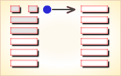

# 夬 ䷪


夬（䷪ guài）卦的代号`7:6`。主卦是`7`卦，乾卦，卦象是天，特性是强健，阳数是`7`；客卦是`6`卦，兑卦，卦象是泽，特性是愉快，阳数是`6`。“夬”，分决，决断。强健的主方遇到愉快的客方，双方的素质都良好，都积极主动，主方的态度强硬，客方的态度随和。主方是应当视客方为友好的伙伴，依靠客方呢；还是视客方为竞争对手，打击客方呢？尤其客方的态度不明朗，不容易对客方作出判断，主方必须果断，不再犹豫。

图中，红色表示当位的爻，天蓝色表示不当位的爻，箭头表示有应。

- 卦序：43

> 夬，揚于王庭，孚號有厲。告自邑，不利即戎，利有攸往。
>《彖》曰：夬，決也，剛決柔也。健而說，決而和。揚于王庭，柔乘五剛也；孚號有厲，其危乃光也；告自邑，不利即戎，所尚乃窮也；利有攸往，剛長乃終也。
>《象》曰：澤上於天，夬。君子以施祿及下，居德則忌。

> 初九，壯于前趾，往不勝為咎。
>《象》曰：不勝而往，咎也。

> 九二，惕號，莫夜有戎，勿恤。
>《象》曰：有戎勿恤，得中道也。

> 九三，壯于頄，有凶。君子夬夬，獨行，遇雨若濡，有慍，无咎。
>《象》曰：君子夬夬，終无咎也。

> 九四，臀无膚，其行次且；牽羊悔亡，聞言不信。
>《象》曰：其行次且，位不當也，聞言不信，聰不明也。

> 九五，莧陸夬夬，中行无咎。
>《象》曰：中行无咎，中未光也。

> 上六，无號，終有凶。
>《象》曰：无號之凶，終不可長也。


```
夬（䷪ guài）卦是异卦，下乾上兑，相叠。
乾为天为健；兑为泽为悦。泽气上升，决注成雨，雨施大地，滋润万物。
五阳去一阴，去之不难，决（去之意）即可，故名为夬（guài），夬即决。

《象传》：泽水积满而泛滥成灾，滔天之势。
又五阳爻之盛势必除去唯一阴爻，故一阴孤立。
```

运势：目前虽吉，但困难及变动正在蕴酿中，宜提高警觉，忌骄傲，防口舌是非。

- 事业：处在兴盛阶段，但已孕育着普遍的危险。务必施恩泽给他人，勿居功自傲，主动团结他人，不干冒险的事。时时提高警惕，防止小人的破坏。但不可莽撞，应持和缓的手段去决断小人，避免过犹不及。
- 经商：市场正在走向衰落的状态，不宜大量活动，随时注意转向。开拓新领域时，加强同他人的合作。但务必充分注意别有用心的奸诈小人趁机捣乱和破坏。
- 求名：虚心求教，充实自身实力。但应量力而行，不可盲目自大，更不可同小人合流，图虚名而败坏事业。
- 婚恋：防止上介绍人的当，也应注意对方的目的。
- 决策：性格矛盾，往往表面刚强而内心虚弱，在关键的时刻，败坏事业。虚心听取他人劝告，切勿鲁莽，多谋深思，用柔和的态度待人处世。

夬卦兑上乾下，为坤宫五世卦。此卦中的夬为决断、决裂，象征会有危险之事，利有攸往，往前有利。

排除决去，必须刚断；始吉终凶，谨慎自重。得此卦者，大运将过，困难将至，宜提高警惕，谨言慎行。

- 时运：气运过盛，散财为吉。
- 财运：利己利人，财散人聚。
- 家宅：须防水患；婚姻不成。
- 身体：调养气息。

```
夬：表示决定或缺失，是个状况卦，吉凶未定。
所迟疑的事情，一定要有个决定不能再拖延，
至于如何决定，可视变卦而定。否则在有所拖延，就成凶象了！

解释：卦相奇特，角龙升天行大运。

特性：思想敏锐，有理想抱负，果决，务实主义，
实事求是，不投机冒险，有孤独感，宜从事专技工作。
```

运势：日前虽然鸿运当头，终会遇到困难与危险，凡事不可轻举妄动，宜随时警惕自己，留心意外灾害。住所可能会有变动，亦有文书、契约之失利，易生错误。慎勿傲气或自以为是，不谦和者定有灾。

- 家运：夕阳虽好，却近黄昏，往后有陷于惊动、痛苦之境。因此卦有盛极必反之象。
- 疾病：病情重宜速治，防头部、呼吸系统、肿瘤等疾。
- 胎孕：无灾。母胎宜节食物，且勿发怒气，否则有难产之虑。
- 子女：有先吉后凶之象。
- 周转：不可急躁，须诚意，光明之态度可成，否则有不利之象。
- 买卖：须诚信交易，有失败破财之害。
- 等人：不必等了，不会来。
- 寻人：宜速寻找，延误不利。
- 失物：相信失物已经损坏，不能寻回。
- 外出：不宜过于频繁，以逸待劳最佳。外出旅行吉利。
- 考试：不理想。
- 诉讼：不宜与人争执，因势孤力弱，宜寻求法律途径解决。
- 求事：有困难，或得不到好职位。
- 改行：改行者要慎重考虑。
- 开业：开业者不利，如已备妥，小心难关重重。

### 初九：壮于前趾，往不胜为咎。《象》曰：不胜而往，咎也。

脚趾受伤，仍然继续前进，将因为脚力不胜而遭致灾难。《象传》：脚力不胜而继续行进，将遭灾难。

凶：得此爻者，会有无妄之灾，宜静守。做官的躁动者有损。

- 时运：躁进取败，动辄得咎。
- 财运：任意经营，伤财害己。
- 家宅：地势太低；门户不对。
- 身体：小心足疾。


初九爻动变得[第28卦：泽风大过](e5a4a7e8bf87daguo_cn.md)。

泽风大过䷛是异卦，下巽上兑，相叠。兑为泽、为悦，巽为木、为顺。泽水淹舟，遂成大错。阴阳爻相反，阳大阴小，行动非常，有过度形象，内刚外柔。

### 九二。惕号，莫夜有戎，勿恤。《象》曰：有戎勿恤，得中道也。

恐惧地惊叫，夜间有敌来犯，但不足为患。《象传》：有敌来犯，不足为患，因为九二之爻居下卦中位，像人得中正之道。

凶：得此爻者，多忧愁，多惊险，谨防盗窃之事发生。做官的多掌兵权。

- 时运：凡事谨慎，可以无虑。
- 财运：货物保险，才可无忧。
- 家宅：宜防火灾；婚姻吉祥。
- 身体：阴虚火盛，调养可治。


九二爻动变得[第49卦：泽火革](e99da9ge_cn.md)。

泽火革䷰是异卦，下离上兑，相叠。离为火、兑为泽，泽内有水。水在上而下浇，火在下而上升。火旺水干，水大火熄。二者相生亦相克，必然出现变革。变革是宇宙的基本规律。

### 九三：壮于頄，有凶。君子夬夬，独行遇雨，若濡有愠，无咎。《象》曰：君子夬夬，终无咎也。

颧骨受伤，这是凶象。君子匆匆忙忙地独个儿行路，碰上了雨，全身淋湿了，令人很不快，但没有灾难。《象传》：君子匆匆忙忙地独个儿行路，但最后没有灾难。

凶：得此爻者，会有争诉之忧，品行端正者无忧，初见艰难，终得安乐。做官的除奸不成，反被倒咬一口。

- 时运：任意独行，受人疑忌。
- 财运：独自经营，较费时日。
- 家宅：早些整修；暂时不成。
- 身体：湿气上升，治之可愈。


九三爻动变得[第58卦：兑为泽](e58591dui_cn.md)。

兑为泽䷹是同卦，下兑上兑，相叠。泽为水。两泽相连，两水交流。上下相和，团结一致，朋友相助，欢欣喜悦。兑为悦也。同秉刚健之德，外抱柔和之姿，坚行正道，导民向上。

### 九四：臀无肤，其行次且。牵羊悔亡，闻言不信。《象》曰：其行次且，位不当也；闻言不信，聪不明也。

臀部受伤，走起路来踉踉跄跄。牵羊上路，悔恨丢失了羊儿，这是由于对别人的告诫不相信。《象传》：行路艰难，因为九四阳爻而居阴位，像人处境不利。对于别人的告诫不相信，说明听觉虽好，但不明事理。

凶：得此爻者，心绪不定，所谋不成。做官的有心而力不足，难于升迁。

- 时运：心思不定，所谋难成。
- 财运：错过时机，无利可图。
- 家宅：四周狭隘；久之可成。
- 身体：皮肤有病，须防失聪。


九四爻动变得[第5卦：水天需](e99c80xu_cn.md)。

水天需䷄是异卦，下乾上坎，相叠。下卦是乾，刚健之意；上卦是坎，险陷之意。以刚逢险，宜稳健之妥，不可冒失行动，观时待变，所往一定成功。

### 九五：苋陆夬夬，中行无咎。《象》曰：中行无咎，中未光也。

细角山羊在道路中间蹦蹦跳跳，筮遇此爻无灾难。《象传》：行中正之道，仅称无灾难，大概是没有将中行之道推广施行。

平：得此爻者，营谋遂意，诉者伸，有病者愈。做官的须防奸邪之辈侵害。

- 时运：亲近君子，万事皆吉。
- 财运：尽速出手，不然有悔。
- 家宅：整理干净；婚姻合宜。
- 身体：调节气旺。


九五爻动变得[第34卦：雷天大壮](e5a4a7e5a3aedazhuang_cn.md)。

雷天大壮䷡是异卦，下乾上震，相叠。震为雷；乾为天。乾刚震动。天鸣雷，云雷滚，声势宏大，阳气盛壮，万物生长。刚壮有力故曰壮。大而且壮，故名大壮。四阳壮盛，积极而有所作为，上正下正，标正影直。

### 上六。无号，终有凶。《象》曰：无号之凶，终不可长也。

狗在哭叫，预兆着终将有凶险之事。《象传》：国无号令，其势必遭凶险，说明国运衰微，终不可保。

凶：得此爻者，营谋不成，宜守常，不良者，骨肉刑克，是非缠绕。做官的难于久任，激流勇退为佳。

- 时运：声名大损，警惕免祸。
- 财运：再立新约，否则无利。
- 家宅：寂静不安；媒妁未成。
- 身体：无声可呼，已至险境。



上六爻动变得[第1卦：乾为天](e4b9beqian_cn.md)。

乾为天䷀是同卦，下乾上乾，相叠。象征天，喻龙，德才的君子。又象征纯粹的阳和健，表明兴盛强健。乾卦是根据万物变通的道理，以“元、亨、利、贞”为卦辞，表示吉祥如意，教导人遵守天道的德行。

# [Guài ䷪](e5a4acguai.md)
