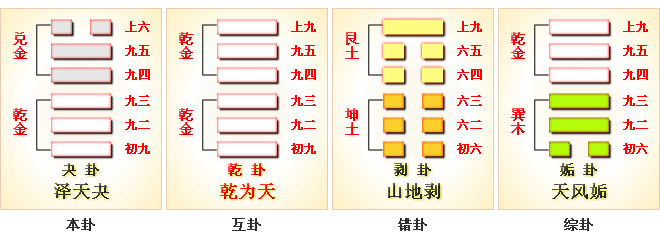

# 夬 ䷪ guài

- No.43

> 夬，揚于王庭，孚號有厲。告自邑，不利即戎，利有攸往。
>《彖》曰：夬，決也，剛決柔也。健而說，決而和。揚于王庭，柔乘五剛也；孚號有厲，其危乃光也；告自邑，不利即戎，所尚乃窮也；利有攸往，剛長乃終也。
>《象》曰：澤上於天，夬。君子以施祿及下，居德則忌。

> 初九，壯于前趾，往不勝為咎。
>《象》曰：不勝而往，咎也。

> 九二，惕號，莫夜有戎，勿恤。
>《象》曰：有戎勿恤，得中道也。

> 九三，壯于頄，有凶。君子夬夬，獨行，遇雨若濡，有慍，无咎。
>《象》曰：君子夬夬，終无咎也。

> 九四，臀无膚，其行次且；牽羊悔亡，聞言不信。
>《象》曰：其行次且，位不當也，聞言不信，聰不明也。

> 九五，莧陸夬夬，中行无咎。
>《象》曰：中行无咎，中未光也。

> 上六，无號，終有凶。
>《象》曰：无號之凶，終不可長也。

刚决柔，阴道灭。五阳务下，一阴危上，将反游魂。九四，悔也。泽上于天，君道行也。
> 夬，五世。六位周而复始，为游魂。至九四成阴，入坎为需。

与兑为飞伏。
> 丁酉金，癸亥水。

九五立世，九二大夫为应。
> 九五在兑象为世，泽小于天也。

建始己亥至甲辰，
> 小雪，清明。

积筭起甲辰至癸卯，周而复始。金木分乾兑入坤象。
> 入坤宫起积筭。

五星从位起太阴，
> 太阴，水位。入卦起筭。

亢宿从位降丁酉，
> 二十八宿配亢宿，入夬卦丁酉金上起。

分气候二十八。
> 积筭起宫二十八，入卦中甲辰，还丁酉金上定吉凶。

《易》云：“泽上于天，夬。”“扬于王庭”。柔道消，消不可极，反于游魂。九四柔来文刚，阴道存也，阴之道不可终否。刚柔相济，日月明矣；天地定位，人事通也。
> 凡卦，阴极阳生，阳极阴生，生生之义，不绝之貌。日月循环，天地交泰，阴阳相荡，六位交分，万物生焉。

故曰：雷动风行，山泽通气。人之运动，体斯合矣。
> 人禀五常，三焦九窍，风火递相兼济，以一位亏，四体羸焉。

阴阳升降，反复道也。次降入游魂水天需卦。

# [Guài ䷪](e5a4acguai.md)
