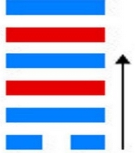

# Gòu ䷫

* Encountering

> Chinese: 姤 ䷫ gòu

**Gòu ䷫** shows a female who is bold and strong. It will not be good to marry (such) a female.

1. The first `SIX`, divided, shows how its subject should be kept (like a carriage) tied and fastened to a metal drag, in which case with firm correctness there will be good fortune. (But) if he move in any direction, evil will appear. He will be (like) a lean pig, which is sure to keep jumping about.

> **䷫** changing to [**䷀**](e4b9beqian.md)

> Matching Line 1 in Adjacent Hexagram: [**䷪**](e5a4acguai.md#43.1)

2. The second `NINE`, undivided, shows its subject with a wallet of fish. There will be no error. But it will not be well to let (the subject of the first line) go forward to the guests.

> **䷫** changing to [**䷠**](e981afdun.md)

> Matching Line 2 in Adjacent Hexagram: [**䷪**](e5a4acguai.md#43.2)

3. The third `NINE`, undivided, shows one from whose buttocks the skin has been stripped so that he walks with difficulty. The position is perilous, but there will be no great error.

> **䷫** changing to [**䷅**](e8aebcsong.md)

> Matching Line 3 in Adjacent Hexagram: [**䷪**](e5a4acguai.md#43.3)

4. The fourth `NINE`, undivided, shows its subject with his wallet, but no fish in it. This will give rise to evil.

> **䷫** changing to [**䷸**](e5b7bdxun.md)

> Matching Line 4 in Adjacent Hexagram: [**䷪**](e5a4acguai.md#43.4)

5. The fifth `NINE`, undivided, (shows its subject as) a medlar tree overspreading the gourd (beneath it). If he keep his brilliant qualities concealed, (a good issue) will descend (as) from Heaven.

> **䷫** changing to [**䷱**](e9bc8eding.md)

> Matching Line 5 in Adjacent Hexagram: [**䷪**](e5a4acguai.md#43.5)

6. The sixth `NINE`, undivided, shows its subject receiving others on his horns. There will be occasion for regret, but there will be no error.

> **䷫** changing to [**䷛**](e5a4a7e8bf87daguo.md)

> Matching Line 6 in Adjacent Hexagram: [**䷪**](e5a4acguai.md#43.6)

## Notes

The single, divided, line at the top of **Gòu ䷫**, the hexagram of the third month, has been displaced, and **Qián ☰** has ruled over the fourth month of the year. But the innings of the divided line commence again; and here we have in **Gòu ䷫** the hexagram of the fifth month, when light and heat are supposed both to begin to be less.

In that divided line [Wén](https://en.wikipedia.org/wiki/King_Wen_of_Zhou) saw the symbol of the small or unworthy man, beginning to insinuate himself into the government of the country. His influence, if unchecked, would go on to grow, and he would displace one good man after another, and fill the vacant seats with others like-minded with himself. The object of [Wén](https://en.wikipedia.org/wiki/King_Wen_of_Zhou) in his [**Tuàn**](https://en.wikipedia.org/wiki/Ten_Wings), therefore, was to enjoin resistance to the encroachment of this bad man.

**Gòu ䷫** is defined as giving the idea of suddenly and casually encountering or meeting with. So does the divided line appear all at once in the figure. And this significance of the name rules in the interpretation of the lines, so as to set on one side the more common interpretation of them according to the correlation; showing how the meaning of the figures was put into them from the minds of [Wén](https://en.wikipedia.org/wiki/King_Wen_of_Zhou) and [Dàn](https://en.wikipedia.org/wiki/Duke_of_Zhou) in the first place. The sentiments of the Text are not learned from them; but they are forced and twisted, often fantastically, and made to appear to give those sentiments forth of themselves.

Here the first line, divided, where it ought to be the contrary, becomes the symbol of a bold, bad woman, who appears unexpectedly on the scene,
and wishes to subdue or win all the five strong lines to herself. No one would contract a marriage with such a female; and every good servant of his country will try to repel the entrance into the government of every officer who can be so symbolised.

Line 1 represents the bête noire of the figure. If its subject can be kept back, the method of firm government and order will proceed. If he cannot be restrained, he will become disgusting and dangerous. It is not enough for the carriage to be stopt by the metal drag; it is also tied or bound to some steadfast object. Internal and external restraints should be opposed to the bad man.

The 'wallet of fish' under line 2 is supposed to symbolise the [subject of line 1](e89083cui.md#p-157). It has come into the possession of the subject of 2, by virtue of the meaning of the name **Gòu ䷫**, which I have pointed out. With his strength therefore he can repress the advance of 1. He becomes in fact 'the lord of the hexagram,' and all the other strong lines are merely guests; and especially is it important that he should prevent 1 from approaching them. This is a common explanation of what is said under this second line. It seems farfetched; but I can neither find nor devise anything better.

With what is said on line 3, compare the fourth paragraph of the duke's Text on the preceding hexagram. Line 3 is strong, but has gone beyond the central place; has no correlate above; and is cut off from 1 by the intervening 2. It cannot do much therefore against 1; but its aim being to repress that, there will be no great error.

Line 1 is the proper correlate of 4; but it has already met and associated with 2. The subject of 4 therefore stands alone; and evil to him may be looked for.

Line 5 is strong, and in the ruler's place. Its relation to 1 is like that of a forest tree to the spreading gourd. But let not its subject use force to destroy or repress the growth of 1; but let him restrain himself and keep his excellence concealed, and Heaven will set its seal to his virtue.

The symbolism of line 6 is difficult to understand, though the meaning of what is said is pretty clear. The [Kāng Xī](https://en.wikipedia.org/wiki/Kangxi_Dictionary) editors observe: -- 'The subject of this line is like an officer who has withdrawn from the world. He can accomplish no service for the time; but his person is removed from the workers of disorder.'

# [姤 ䷫](e5a7a4gou_cn.md)
