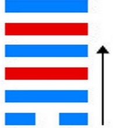
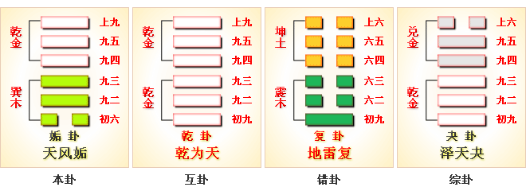

# 姤 ䷫ gòu

- No.44

> 姤，女壯，勿用取女。
>《彖》曰：姤，遇也，柔遇剛也。勿用取女，不可與長也。天地相遇，品物咸章也；剛遇中正，天下大行也，姤之時義大矣哉。
>《象》曰：天下有風，姤，后以施命誥四方。

> 初六，繫于金柅，貞吉。有攸往，見凶，羸豕孚蹢躅。
>《象》曰：繫于金柅，柔道牽也。

> 九二，包有魚，无咎，不利賓。
>《象》曰：包有魚，義不及賓也。

> 九三，臀无膚，其行次且，厲无大咎。
>《象》曰：其行次且，行未牽也。

> 九四，包无魚，起凶。
>《象》曰：无魚之凶，遠民也。

> 九五，以杞包瓜，含章，有隕自天。
>《象》曰：九五含章，中正也。有隕自天，志不舍命也。

> 上九，姤其角，吝，无咎。
>《象》曰：姤其角，上窮吝也。

阴爻用事，金木互体，天下风行，曰姤。姤，遇也。《易》曰：“阴遇阳。”
> 一阴初生，阳气犹盛，阴未为敌。

与巽为飞伏，元士居世。
> 辛丑土，甲子水。

尊就卑，
> 子孙与父母相代位。

定吉凶，只取一爻之象。
> 多以少为贵。

九四诸侯，坚刚在上，阴气处下。《易》云：“系于金柅。” 

巽积阴入阳，辛壬降内外象，建庚午至乙亥。
> 芒种，小雪。

积筭起乙亥水，至丙戌土，周而复始。
> 灾福之兆，生乎五行升降也。

五星从位起太白，
> 太白在西，居金位。

井宿从位入辛丑，
> 辛丑入土，元士临母也。

建午起坤宫初六爻。《易》云：“履霜坚冰至。”建亥，龙战于野。
> 戌亥是乾之位。乾伏本位必战，积阴之地犹盛，故战。 

配于人事为腹，为母，
> 坤顺，容于物。

于类为马。《易》云：“行地无疆。”
> 此释一爻配坤象，本体是乾巽，今赞赞一爻起阴，假坤象言之。

内巽为风，乾为天；天下有风行，君子以号令告四方。
> 巽，入也。风入于坤，皆动也。故知天下有风，动其物也。

天风气象三十六候。
> 三十六候节气，降大风象。 

木入金为始，
> 金纳木也。

阴不能制于阳，附于金柅。《易》之“柔道牵”也。

五行升降，以时消息，阴荡降入遁。
> 天山遁卦。

# [Gòu ䷫](e5a7a4gou.md)
