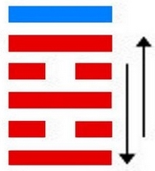
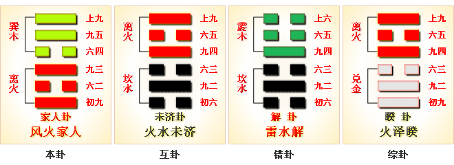

# 家人 ䷤ jiā rén

- No.37

> 家人，利女貞。
>《彖》曰：家人，女正位乎內，男正位乎外，男女正，天地之大義也。家人有嚴君焉，父母之謂也。父父，子子，兄兄，弟弟，夫夫，婦婦，而家道正。正家，而天下定矣。
>《象》曰：風自火出，家人，君子以言有物，而行有恆。

> 初九，閑有家，悔亡。
>《象》曰：閑有家，志未變也。

> 六二，无攸遂，在中饋，貞吉。
>《象》曰：六二之吉，順以巽也。

> 九三，家人嗃嗃，悔厲吉。婦子嘻嘻，終吝。
>《象》曰：家人嗃嗃，未失也。婦子嘻嘻，失家節也。

> 六四，富家，大吉。
>《象》曰：富家大吉，順在位也。

> 九五，王假有家，勿恤，吉。
>《象》曰：王假有家，交相愛也。

> 上九，有孚威如，終吉。
>《象》曰：威如之吉，反身之謂也。

乾刚具变文明，内外相应，
> 九五应六二爻。

阴阳得位，居中履正。火上见风，家人之象。闲邪存诚，嗃嗃得中。互体见文明，家道明也。内平遇坎险象，家人难也。酌中之义，在于六二。与离为飞伏。
> 己丑土，辛亥水。

建始癸卯至戊申，
> 春分，立秋。

积筭起戊申至丁未，金土入离巽。
> 金土入卦同积筭。

大夫居世，应九五立君位。五星从位起太阴，
> 太阴，北方，入卦起宫推筭。

箕宿从位降己丑，
> 二十八宿，分箕宿入家人卦，在己丑土上。

分气候其数三十六。
> 三十六起数家人卦，推入积筭休咎。

火木分形，阴阳得位，内外相资，二气相和。君君臣臣，父父子子，兄兄弟弟。《易》曰：“家人嗃嗃，父子嘻嘻。”治家之道，分于此也。吉凶之义配五行进退，
> 六五进退，吉凶于阴阳。阴阳得起，在于四时运动，吉凶见矣，分内外矣。二象配天地星辰，合命定吉凶。

文明运动，变化之象。九三适阴入震，风为雷，合曰益。次降风雷益卦。

# [Jiā Rén ䷤](e5aeb6e4babajiaren.md)
