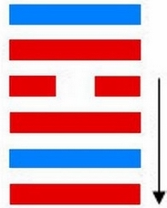
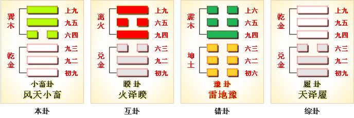

# 小畜 ䷈ xiǎo xù

- No.9

> 小畜，亨，密雲不雨，自我西郊。
>《彖》曰：小畜，柔得位而上下應之，曰小畜。健而巽，剛中而志行，乃亨。密雲不雨，尚往也；自我西郊，施未行也。
>《象》曰：風行天上，小畜，君子以懿文德。

> 初九，復自道，何其咎，吉。
>《象》曰：復自道，其義吉也。

> 九二，牽復，吉。
>《象》曰：牽復在中，亦不自失也。

> 九三，輿說輻，夫妻反目。
>《象》曰：夫妻反目，不能正室也。

> 六四，有孚，血去惕出，无咎。
>《象》曰：有孚惕出，上合志也。

> 九五，有孚攣如，富以其鄰。
>《象》曰：有孚攣如，不獨富也。

> 上九，既雨既處，尚得載，婦貞厲。月幾望，君子征凶。
>《象》曰：既雨既處，德積載也；君子征凶，有所疑也。

《易》云：“密云不雨，自我西郊。”小畜之义，在于六四。三阳连，进于一，危也。外巽体阴，畜道行也。巽之初六，阴荡阳气感，积阴不能固，退复本位。三连同往而不可见，成于畜义，外象明矣。
> 一阴劣，不能固，阳是以往也。外巽积阴能固，阳道成在上九一爻之法也。

《易》云：“既雨既处也。”与乾为飞伏。
> 甲子水，辛丑土。

初九元士居世，六四诸侯在应。建始壬寅至丁未，
> 立春，大暑。

积筭起丁未至丙午，周而复始。木土入乾巽。
> 入宫起筭法。

五星从位起太白，
> 金星入卦，起筭吉凶。

尾宿从位降甲子，
> 二十八宿入卦，分尾宿，以小畜甲子水上起筭。

分气候其数二十八。
> 分二十八数起宫推筭。

一阴居六四，建子入阳宫，推其休咎处吉凶。刚健立阳爻，阴凝在巽体。《易》云：“舆说辐，夫妻反目。”
> 不义之兆。

夏至起纯阴，阳爻位伏藏；冬至阳爻动，阴气凝地。阴阳升降，以柔为刚，见中虚文明，积气居内象。
> 九二适变入离。

次降入风火家人卦。

# [Xiǎo Xù ䷈](e5b08fe7959cxiaoxu.md)
