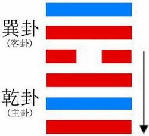
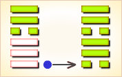
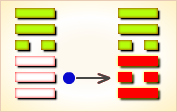
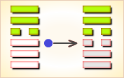
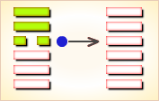
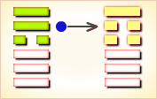
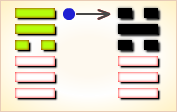

# 小畜 ䷈



小畜（xiǎo xù）是`7:3`卦的卦名，`7:3`是小畜卦的代号。

`7:3`卦的主卦是`7`卦乾卦，卦象是天，天的特性是强健。
客卦是`3`卦巽卦，卦象是风，风的特性是顺从。

这并不意味强健的主方可以让客方顺从主方，因为，风仍然有强大的能量，只是顺从在前进方向上可以通过的路，并不顺从在与前进方向不通，或者没有开通的路。
巽卦的中爻和上爻是阳爻，表示客方仍然有很强的力量，只有下爻是阴爻，消极被动，这并不意味着主方可以让客方无条件地顺从。
所以，在当前双方关系中，主方应当积蓄力量，伺机而动。“小畜”的意思是：少许积蓄。

图中，红色表示当位的爻，天蓝色表示不当位的爻，箭头表示有应。

- 卦序：9

## 哲学解读
### 起卦

起卦前需要客观地、全面地、准确地分析主方和客方情况，至少符合下列条件之一，此卦才有参考价值：

1. 主方与天很相似，客方与风很相似。
2. 主卦阳数是`7`，客卦阳数是`3`。
3. 主方的行动是阳，素质是阳，态度也是阳；客方的行动、素质和态度是阴、阳和阳。

切勿用任何随机数方式起卦，否则此卦不能用作决策工具。

### 结构

在小畜卦的结构与卦爻辞图中有一个箭头，从第四爻指向第一爻，表示客方消极被动，使主方积极主动的行为不受阻扰，是对主方有利的因素。主方应当充分利用这有利因素，控制客方，让形势朝有利于主方的方向发展。除此之外，其它四条爻之间没有有应关系，对于主方来说都是潜在因素，关键在于主方如何处理，由于客方仍然有很强的实力，主方应当避免冲突，减少损失，一点一点地积蓄力量，“小畜”。

“密云不雨”说明了“小畜”的意思是少许积蓄，爻辞中的“复”是“小畜”的行为，要“复自道”，要“牵复”。如果不“小畜”，即使是夫妻，也会“舆说辐”而“夫妻反目”。“小畜”须要以诚信作基础，“有孚”，有了相互信任，就能够“富以其邻”。然而，仍然须要谨慎对待客方，因为情况总是会“既雨既处”。

删去判断词，六条爻辞就是一首围绕主题“小畜”的散文诗。下面是其译文。

```
（遇到困难就）回复到自己的道路，
牵引着（他）来回反复。
（有时就像）车辆的车辐脱开了，（也像）夫妻不和睦，
有了信任，（就）没有流血，（就）没有恐惧，
有了信任，相互牵系，依靠邻居富裕。
一会儿下雨，一会儿停，保持高尚的道德，
（像）妇女般地坚持克服困难。（如果像）男子出征，
总希望圆满成功，月亮几乎满园了，有凶险。
```

下面逐条说明卦爻辞。

### 卦辞
```
〖卦辞原文〗亨，密云不雨，自我西郊。
〖译文〗顺利，来自我方西郊的密云，集结而不下雨。
〖解说〗客方消极被动，为主方的积极主动提供了机会，
在不触犯客方利益情况下，主方可以顺利地发展，“亨”。
然而，客方素质良好，并且态度强硬，主方必须有所节制，
积蓄力量，不要贸然侵犯客方利益，“密云不雨，自我西郊”。
卦爻辞是周文王和周公编写的，当时，周在西部，卦辞说“自我西郊”。
〖彖〗柔得位而上下应之，曰小畜。
健而巽，刚中而志行，乃亨。
密云不雨，尚往也；自我西郊，施未行也。
〖象〗风行天上，小畜；君子以懿文德。
```

### 初九
```
〖原文〗复自道，何其咎？吉。

〖译文〗回归自身的道行，有何可以怪罪？吉利。

〖象〗复其道，其义吉也。

〖解说〗第一爻是阳爻，
表示主方行动是阳，积极主动地谋取和扩大自己的利益，
比如说，创新、创业、投资、进攻、求职、示爱，等等。
主方让自己的行动回复到自己的道路上，不触犯客方利益，
这样就没有怪罪了，就对于主方吉利。
“吉”是以回复到自己的道路为条件的，
如果不是回复到自己的道路上，就不一定吉利。

〖结构分析〗第一爻位置是阳位，
这条爻是阳爻，阳爻在阳位，当位，并且和四阴有应。
当位，表明主方积极主动谋取和扩大自己的利益，
有可能成功，这是潜在的对主方有利因素；
有应，表明主方积极主动正好与客方消极被动呈阴阳和谐状态，
那潜在因素成了真正的对主方有利因素。
然而，从全局看，由于主客双方力量都很强大，
主方在积极行动的时候不能不谨慎，在获取利益以前，
要反复试探，“复自道，何其咎？”
这样可以避免损失，确保获益成功，“吉”。
```

### 九二
```
〖原文〗牵复，吉。

〖译文〗牵引着回复，吉利。

〖象〗牵复在中，亦不自失也。

〖解说〗第二爻是主卦中爻，
代表主方素质，阳，表示主方素质良好，比如说，
主方有资金、有地位、有权力、有实力、有技术，等等。
主方积极主动，而客方消极被动，
主方牵引着客方回复到对双方都有利的道路上，
这样，主方可以得到客方合作，对主方吉利。
“吉”的前提条件是“牵复”，不“牵”，或者不“复”，
不与客方合作，都不是吉利。

〖结构分析〗第二爻位置是阴位，
这条爻是阳爻，阳爻在阴位，不当位，并且和五阳不有应。
不当位，表明主方良好素质可能受到损失，
是潜在的对主方不利的因素；
不有应，表明客方素质也是良好，
客方没有必要使主方受损失，
那潜在因素并没有成为真正的对主方不利因素。
由于双方素质都良好，主方应当争取做到互利共赢。
由于客方消极被动，可能客方对互利共赢没有兴趣，
主方应当以积极主动牵动客方共同反复探索“牵复”，
这样对主方就吉利，“吉”。
```

### 九三
```
〖原文〗舆说辐，夫妻反目。

〖译文〗车辆的车辐脱开了，夫妻不和睦。

〖象〗夫妻反目，不能正室也。

〖解说〗第三爻是主卦上爻，
代表主方态度，阳，表示主方态度强硬。
另一方面。客方态度也强硬。
主方与客方发生冲突，
如同车辆的车辐脱开了，如同夫妻不和睦了。
这就不是“小畜”应当有的结果。
“说”（tuō），解脱，说履《荀子·乐论》。
“辐”（fú），连结车辋和车毂的直条：车辐。
“反目”，不和睦（多指夫妻）：反目成仇。

〖结构分析〗第三爻位置是阳位，
这条爻是阳爻，阳爻在阳位，当位，然而与六阳不有应。
当位，表明主方的强硬态度有可能迫使客方接受主方意图，
是潜在的对主方有利因素；不有应，表明客方态度与主方冲突，
那潜在因素并没有成为真正的对主方有利因素。
而且，第三爻是对第二爻的补充，第二爻是阳，第三爻也是阳，
这表示主方素质很好，实力非常强，有可能自满、傲慢和粗暴，
客方也是如此，这样很可能双方合作关系破裂，“舆说辐，夫妻反目”。
```

### 六四
```
〖爻辞〗有孚，血去惕出，无咎。

〖译文〗有了信任，没有流血，没有恐惧，无所怪罪。

〖象〗有孚惕出，上合志也。

〖解说〗第四爻是客卦下爻，
代表客方行动，阴，表示客方消极被动，
比如说，防守、退却、不想冒险、
不想探索或开辟新的发展领域、只求保持现状，等等。
主方在积极主动的时候，需要“小畜”，
有所节制，不损伤客方利益。
取得了客方信任，没有冲突，没有恐惧，
主方不应当受到怪罪。
“血”，指双方冲突造成损失。

〖结构分析〗第四爻位置是阴位，
这条爻是阴爻，阴爻在阴位，当位，又与一阳有应。
当位，表明客方消极被动，不至于使主方利益受损失，
是潜在的对主方有利因素；有应，
表明客方消极被动正好使主方积极主动不受阻扰，
那潜在因素成了真正的对主方有利因素。
尽管有此有利因素，
由于主客双方在素质方面和态度方面都有矛盾，
冲突可能使双方都受损失，
因此，主方应当诚恳对待客方，取得客方信任，“有孚”。
有了信任，就能够避免损失，避免对冲突恐惧，
主方可以无所怪罪，“有孚，血去惕出，无咎”。
```

### 九五
```
〖原文〗有孚挛如，富以其邻。

〖译文〗有了信任，相互牵系，依靠邻居富裕。

〖象〗有孚挛如，不独富也。

〖解说〗第五爻是客卦中爻，
代表客方素质，阳，表示客方素质良好。
由于主方“小畜”，节制自己的行为，
不损伤客方利益，得到客方信任，客方与主方牵系在一起。
依靠客方协助，主方得到富裕。“挛”（luán），互相牵系。

〖结构分析〗第五爻位置是阳位，
这条爻是阳爻，阳爻在阳位，当位，然而与二阳不有应。
当位，表明客方良好素质有可能使主方获益，
是潜在的对主方有利因素；
不有应，表明主方素质与客方的素质有矛盾，
存在双方之间的利益冲突。
主方应当避免冲突，诚恳地对待客方，取得客方信任，
有了信任，就那个相处如弟兄，“有孚挛如”，
主方可以以客方良好素质帮助自己富裕，“富以其邻”。
```

### 上九
```
〖原文〗既雨既处，尚德载，妇贞厉。月几望，君子征凶。

〖译文〗一会儿下雨，一会儿停，
保持高尚的道德，妇女般地坚持克服困难。
月亮几乎满园了，男子出征有凶险。

〖象〗既雨既处，德积载也。君子征凶，有所疑也。

〖解说〗第六爻是客卦上爻，
代表客方态度，阳，表示客方态度强硬。
同时，主方态度也强硬，主方与客方有些时候有冲突；
由于客方消极被动，方便主方的积极主动，
有些时候合作，“既雨既处”。
双方关系应当建立在高尚的道德基础上，“尚德载”。
像妇女一般地耐心，柔和地坚持下去，有困难。
而像粗暴男子一般地出征，想获取最大利益，
如同“月几望”，由于侵犯客方的利益，有凶险。

〖结构分析〗第六爻位置是阴位，
这条爻是阳爻，阳爻在阴位，
不当位，并且和三阳不有应。
不当位，表明客方强硬态度可能是主方遇到困难，
是潜在的对主方不利因素；
不当位，由于主方态度也强硬，
主方保护自己的利益，
那潜在的不利因素没有成为真正的对主方不利因素。
在行动方面，主方积极主动，客方消极被动，呈和谐状态，
所以，双方关系中有时有冲突，有时又和谐，“既雨既处”。
为了避免冲突，主方应当对客方诚恳，“尚德载”。
像妇女那样耐心地坚持下去，
“妇贞厉”，尽管不容易，也还是应当如此。
如果像男子那样急于求成，尽管有行动和谐的有利因素，
似乎可以圆满成功，“月几望”，
而实际上有很大风险，“君子征凶”。
```

### 卦辞
```
小畜：亨。密云不雨，自我西郊。
译：小畜卦象征微小的蓄聚。亨通。
从西方吹来的浓云密布，却不降雨。
（乾下巽上）
《象》曰：风行天上，小畜。君子以懿文德。
译：风流行于天上，象征微小的蓄聚。
君子因此蓄养文明之德。（懿： 蓄养美德）

初九，复自道，何其咎？吉。
译：返回于本位，会有什么害处呢？吉祥。

九二，牵复，吉。
译：被牵连而返回本位，吉祥。

九三，舆说辐，夫妻反目。
译：车轮的辐条散脱，夫妻反目失和。（说：脱）

六四，有孚，血去惕出，无咎。
译：心怀诚信，就能免去伤害，脱出惕惧，不会有过失。

九五，有孚挛如，富以其邻。
译：心怀诚信，紧密合作，
充满至诚之心，并且推广影响到它的近邻。（挛如：结合紧密。）

上九，既雨既处，尚德载。妇贞厉，月几望。君子征凶。
译：密云已经降雨，阳气已被畜止，高尚的功德已经圆满。
妇人应该坚守正道以防危险，要像月亮将圆而不过盈。
此时，君子如果继续前进，将有灾祸。
处：被畜止。载：积满。几望：将圆。征：前进。
小畜，就蓄聚的主体看，量"小"者，"阴"者。
作为从属的"阴"只能在适宜的限度内发挥主观能动作用，
蓄积作为主导者的"阳"，促使阴阳的和谐统一。

【原文】
小畜：亨；密云不雨，自我西郊。
【解释】
畜：小篆《鲁郊礼》畜从田从兹。
兹：益也。（甲骨文金文）
一块田外面在多一块、在多一块、最后还要出点头。
蓄养，生活一天天富裕。就是亨。
密云不雨：天上有云地上下雨，风调雨顺，田里的庄稼才长的旺。
但是“密云不雨”天地阴阳的力量还在蓄积，
人们的生活还处在继续发展的阶段中。
自我西郊。自我是个倒装句：（我自西郊）西郊，太阳是天上的神鸟，
每天由东升、西落。西郊是太阳落下的地方。
我自西郊：人们的生活，自由自在快乐的一天。

【原文】
初九，复自道，何其咎？吉。
【解释】
初九：至下而上的第一爻，阳爻为九。
复：回归。
复自道，何其咎？吉。回归。自然。之道。会有什么灾祸？
吉。古人的生活，一般都是顺应天地的生活方式。
种田用的是自家传下来的方法。
收获全仰仗天的恩赐。这就是自然之道！

【原文】
九二，牵复，吉。
【解释】
九二：至下而上的第二爻，阳爻为九。
牵复，吉。：牵连，往复。
人们日复一日，过上了幸福的生活。吉。

【原文】
九三，舆说辐，夫妻反目。
【解释】
九三：至下而上的第三爻，阳爻为九。
舆：车辆。说：同脱。
辐：车轮上连接车毂和轮圈的一条条直辊儿或钢条。
夫妻反目：夫妻口角。
在上古时期，女人的社会地位要平等或高于男性。
同时伴有“走婚”的习俗。

车的利用：我国是世界上第一个造车的国家，
据史料记载，在公元前2000多年的夏初大禹时代，
有一个叫奚仲的人，他发明的车由两个车轮架起车轴，
车轴固定在带辕的车架上，车架附有车箱，用来盛放货物。
这就是世界上的第一辆车俗称“独轮车”。
舆说辐，夫妻反目。
家庭生活在当时，就像风雨一样，夫妻反目说来就来、说走就走。
这也是“走婚”习俗的表现。非常自由。自然而然的组合。

【原文】
六四，有孚；血去惕出，无咎。
【解释】
六四：至下而上的第四爻，阴爻为六。
有孚：孚：古俘字。血：借为恤，忧患。
惕（tì）：警惕。血（恤）去惕出：犹言忧患虽去，但戒惧不除。
联系上文，家里的男人“撂挑子”了。
可是是奴隶社会初期了，有了战俘，不用杀掉了，用作奴隶。
只要奴隶 “心怀诚信，就能免去伤害，脱出惕惧，不会有过失。”

【原文】
九五，有孚挛如，富以其邻。
【解释】
九五：至下而上的第五爻，阳爻为九。
挛（luán）：拘系，捆绑。如：形容词词尾。
挛如：拘系相连的样子。
奴隶社会初期，随家里的奴隶多，随的劳动力资源就多，就富裕。
奴隶和田地就是财富。并且推广影响到它的近邻。
（随着奴隶制度的推广，生产力大大提高社会就向前进了，
夏朝我国第一个奴隶制国家就诞生了。）

【原文】
上九，既雨既处，尚德载；妇贞厉，月几望；君子征凶。
【解释】
上九：至下而上的第六爻，阳爻为九。
既雨既处：处，停止。尚德载：德，借为得。载，借为栽。
月望：夏历每月十五日。几，接近。
月几望：犹言夏历每月的十四日。
密云已经降雨，阳气已被畜止。
高尚的功德已经在人们的心里栽下
（帝王制度、奴隶制国家“夏”已经建立）。
妇人应该坚守正道以防危险（母系社会、开始向父系社会过度），
要像月亮将圆而不过盈。
此时，君王如果一味的为了掠夺奴隶和领土继续前进，
（比卦的“上六，比之无首，凶。”）将有灾祸。征：前进。
```

## 卦意
### 第9卦 风天小畜（小畜卦）蓄养待进
### 下下卦

《象》曰：苗逢旱天尽焦梢，水想云浓雨不浇，农人仰面长吁气，是从款来莫心高。

这个卦是异卦（下乾上巽）相叠，乾为天；巽为风。
喻风调雨顺，谷物滋长，故卦名小畜（蓄）。
力量有限，须待发展到一定程度，才可大有作为。

### 白话解析
```
少畜①：亨，密云不雨，自我西茭②。
【白话】筮得少畜卦，办事亨通顺畅，
天空布满了密密的阴云，但是并没有下雨，
密云从西郊的上空聚集过来。
【注释】
① 少畜：读为“小畜”，一点一点的积聚。
② 茭：假借为“郊”。
【讲解】少畜卦通行本作“小畜”，有积累、蓄养、聚集等义项。
小畜卦旨在揭示事物发展过程中的弱小变强大，阴柔变阳刚。
有量的积累到质的飞跃的含义。
《彖传》说：“小畜，柔得位而上下应之，曰小畜。
健而巽，刚中而志行，乃亨。密云不雨，尚往也。
自我西郊，施未行也。”
《象传》说：“风行天上，小畜。君子以懿文德。”

初九：復自①道，何其咎，吉。
【白话】筮得少畜卦，占得初九爻，
往来返复都遵循道德规范，哪里还有灾难呢？自然吉善美好。
【注释】① 復：往来。自：由，遵守。
【讲解】初九阳刚之爻居于阳刚之位，处于下体乾卦的开始，
以升上体巽卦之初，与六四阴阳相应，不距离本爻而去，
而是以阳爻升阴爻往复于自己的道中，巽顺不违，吉莫大焉。

九二：堅①復，吉。
【白话】筮得少畜卦，占得九二爻，
坚守“复自道”的原则，自然吉善美好。
【注释】① 堅：坚持，坚守。
【讲解】爻辞“坚复”，通行本作“牵复”。
王弼说：“处乾之中，以升巽五，五非畜极，非固己者也。
虽不能若阴之不违，可牵以获复，是以吉也。”
崔憬说：“四柔得位，群刚所应，
二以中和牵复自守，不失于行也。”

九三：車說緮①，夫妻反目。
【白话】筮得少畜卦，占得九三爻，
车轮子和车轴相脱离，夫妻之间因此产生了矛盾。
【注释】① 說：假借为“脱”。
緮：车下固定轮子和轴头的绳索。
【讲解】九三阳刚之爻居于阳刚之位，
处下体乾卦之极，居不得中而密比于六四阴柔之爻，
受六四畜止而不能前进，阳刚受制于阴柔，有如夫妻失和反目，
夫不能制妻，用车轮子和车轴相脱离来比喻夫妻反目的后果，
反目成仇，相互脱离，不相往来。

六四：有復①，血②去汤③出，无咎。
【白话】筮得少畜卦，占得六四爻，
有诚信，忧愁消失，恐惧心也没有了，自然没有灾难了。
【注释】
① 复：诚信。
② 血：假借为“恤”，忧。
③ 汤：假借为“惕”，惧。
【讲解】小畜卦五阳一阴之卦，
六四一阴柔之爻畜止五阳刚之爻，力不能及，
则以诚信维系，得九五、上九两阳爻相助而成功。

九五：有復龻如①，富以其鄰②。
【白话】筮得少畜卦，占得九五爻，
有诚信于追求仁爱，不仅国内富有了而且影响邻国也富有了。
【注释】
① 龻如：仁爱的样子。龻：仁爱。
② 鄰（lín）：邻。
【讲解】九五阳刚之爻居阳刚之位，
而且居于上体巽卦的中央，
上有尚九阳刚相助，下有六四阴柔相承。
诸阳相从，仁爱聚众。
处阴畜阳之时，诸赖九五相助，
九五因为畜养救济诸阳，
因而得到诸阳的回报，富有以其邻国。

上九：既①雨既處②，尚得載③，
女貞厲④，月幾望⑤，君子正⑥，凶。
【白话】筮得少畜卦，占得尚九爻，
老天爷下了一场大雨，但很快又停止了，
正好栽种庄稼，妇女贞问危险，
月近望的时候，丈夫被应征入伍打仗，凶险。
【注释】
①既：已经。
② 處（chǔ）：处，停止。
③ 載（zǎi）：载，假借为“栽”。
④ 女：妇女。
貞厲（zhēn lì）：贞厉，贞问危险。厉：危险。
⑤ 幾望（jǐ wàng）：几望，近望。几：近。
⑥ 君子：此处指“女贞厉”中的“女人”的丈夫。正，假借为“征”。
【讲解】尚九阳刚之爻居于少畜卦的终点，处于巽顺之体的最高位，
为六四阴柔所畜止，所以有凶险。
王弼说：“处小畜之极，能畜者也。
阳不获亨，故既雨也。刚不能侵，故既处也。
体巽处上，刚不敢犯，尚德者也。
为阴之长，能畜刚健，德积载者也。
妇制其夫，臣制其君，虽贞近危，故曰妇贞厉也。
阴之盈盛，莫盛于此，故曰月几望也。
满而又进，必失其道。阴疑于阳，必见战伐。
虽复君子，以征必凶，故曰‘君子征凶’。”
```

### 《彖》曰
```
小畜，柔得位而上下应之，曰小畜。
健而巽，刚中而志行，乃亨。
密云不雨，尚往也。
自我西郊，施未行也。〔彖传〕

【白话】《彖传》说：《小畜卦》象征小有积蓄，
阴柔得其位而上下的阳刚与之相应，因此亨通顺利。
心怀刚健之志，为实现自我志向而努力，这样就能亨通。
“天空布满浓密的积云而不下雨”，
说明还在积蓄力量之中，
“云气自城西郊外升起”象征发力的时候到了。
```

### 《象》曰
```
风行天上，小畜；
君子以懿文德。
复自道，其义吉也。
牵复在中，亦不自失也。
夫妻反目，不能正室也。
有孚惕出，上合志也。
有孚挛如，不独富也。
既雨既处，德积载也。
君子征凶，有所疑也。
```

### 新解
```
【原文】
（乾下巽上）小畜①：亨。
密云不雨，自我西郊②。 
初九：复自道③，何其咎。吉。
九二：牵复④。吉。
九三：舆说辐⑤，夫妻反目。
六四：有孚，血去惕出⑥，无咎。
九五：有孚挛如⑦，富以其邻⑧。
上九：既雨既处⑨，尚德载⑩。
妇贞厉。月几望⑪，君子征，凶。

【注释】
① 小畜是本卦标题。
畜的意思是田地里谷物滋生，草木茂盛。
卦象是表示天的“乾”和表示风的“巽”相叠加，
卦辞、爻辞主要讲农业生活。本卦的标题是根据内容加的。
② 我：王公贵族的自称。
③ 复：返回。道：田间的 道路。
④ 牵复：拉回来。
⑤ 舆：车。说：用作“脱”。辐：车轮上的辐条，这里指车轮。
⑥ 血：用作“恤”，意思是担忧。惕：提防。
⑦ 挛如：捆绑得很紧的样子。
⑧ 富：用作“辐”。
⑨ 既：已经。处：停止。
⑩ 德：“得”的意思。载：用作“栽”。尚德载：还可以栽种作物。
⑪ 几：接近。望：农历每个月十五日月圆的时候，也叫做月望。

【译文】
小畜卦：吉利。在我西边郊野上空阴云密布，但雨却没有落下来。
初九：沿田问道路返回，没有什么灾祸。吉利。
九二：拉回来。吉利。
九三：车子坏了一个轮子，夫妻俩互相埋怨。
六四：抓到俘虏，免除了担忧，还是要注意提防，不会有灾祸。
九五：抓到俘虏后把他们紧紧捆住，与邻村邻族共同分享快乐。
上九：雨已降下，又已停止，还可以栽种作物。女子占问得到凶兆。
月亮已是接近十五时的满月，君子离家出行，贞兆凶险。

【读解】
从事农业劳动的生活平淡而琐碎，
今天身处现代化大都市钢筋水泥丛林中的我们，
难以想象其中苦、乐、喜、忧、烦、闷、愁、淡等体验的具体滋味。
生动切肤的感性体验，早已被抽象的文字符号扼杀和深埋起来了。
唯有想象力，才能透过冰冷僵死的文字符号，
深入到真切具体的古人生存的事实中去，
虽然这也是以我们今天的感性体验作为基础的。
没有现代化的农业机械和交通运输工具，没有电灯、电话、电视机和歌舞戏曲。
日出而作，日落而息，冬去春来，年复一年艰辛体力劳动的印痕，
渐渐在简陋土屋昏暗油灯的阴影中隐去。
生存的现实是严峻的，活下去是人生的首要问题，除了自身能力之外，
神灵似乎能带给人们精神上的慰藉。
于是，春播秋收，天旱雨雪，虫灾鼠害，人祸徭役，
都得叩问上苍的意向，都被严肃认真地对待。
我们透过这些似乎神秘的占卜祷告，
真切地听见了那来自远古的沉重的喘息和感叹，
看见了祖先们布满厚茧的双手和满是皱纹的古铜色脸庞……
```

### 《小畜》全新译文
```
小畜：亨。密云不雨，自我西郊。
译：小畜之道在于小的蓄聚成势。
大的财富散于天下，小的财富集于自身。
大的权力散于天下，小的权力集于自身。其法顺畅亨通。
其势犹如浓云密布却不下雨，外围结阵以势动人而不出手。
就像核武器之道，只以势唬人，而不是真出手。

《象》曰：风行天上，小畜。君子以懿文德。
译：就像风流行于天上，把小块的云层都吹在一起，却不成雨落下。
对于整个天来说，云虽然依然是小的，但是也是一种可用的蓄聚成势啊。
其只以势动人并不实际出手，此法并不强悍但是依然可以影响于天下。
君子以此道来蓄养并彰显“文”之美德。毕竟天下太平才是多数人的愿望。

初九，复自道，何其咎？吉。
译：回归（开启）自己心目中的大道正道，
不再为各种邪说歪论偏见所动摇，怎么会有害处呢？吉祥！

九二，牵复，吉。
译：自己回归了正道，也要引导身边人回归正道，
把亲人朋友们都从邪说歪论偏见中拉回来。吉祥。

九三，舆说辐，夫妻反目。
译：不是谁都能轻轻松松地被自己从邪说歪论偏见中拉回来。
你会遇上各种各样的问题，比如配偶，你就很难拉的回。

六四，有孚，血去惕出，无咎。
译：不要急躁，只要自信、有诚意、有耐心、有手段，问题终究能够解决。
至此大势已定。从此 忧虑散去恐惧消失，
再也不用担心与紧张了。再也没有严重的问题了。

九五，有孚挛如，富以其邻。
译：传播正道不只是身边人，所有有关系的人，你都要你去影响，
比如：邻里、国人、天下人。自己富裕了，也要让他们依次富裕。
自己好过了，也要让他们依次好过。泽及天下。

上九，既雨既处，尚德载。妇贞厉，月几望，君子征凶。
译：人心永远不可能统一，再好的大道正道，也会遇上激烈反对的人。
就算同一个人，也可能一会支持一会又反对。像大地般厚德载物包容吧。
拥有一定要改变别人的心，不好。
无限地接近圆满，才是圆满的，一旦达到了圆满，就会开始损了。
为了迫使异族认同大道而兴兵，不值当，这是下策。
```


### 《断易天机》解

小畜卦巽上乾下，为巽宫初世卦。小畜为小的蓄积、小的阻碍，阳盛而阴不足，以致不得不暂时停顿，但终究还能亨通。

### 北宋易学家 邵雍 解

力量寡弱，阻止前进；藏器待时，耐心推进。

得此卦者，力量薄弱，运势反覆，宜蓄养实力，静待时机，急进则有险，凡事须耐心推进。

### 台湾国学大儒 傅佩荣 解

- 时运：平平无奇，受人牵制。
- 财运：外表不错，内多耗损。
- 家宅：小康，须防口舌；娶得淑女。
- 身体：风火之症；小孩吉，大人凶。

### 传统解卦
```
这个卦是异卦（下乾上巽）相叠，乾为天，巽为风。
喻风调雨顺，谷物滋长，故卦名小畜（蓄）。
力量有限，须待发展到一定程度，才可大有作为。

大象：蓄养之量有限，力不从心，
故宜忍耐蓄养实力，静待时机。
```

运势：运势反覆，有口舌之争，但难于短期内解决，须忍耐，静待时机。

- 事业：时机尚不成熟，应当耐心而积极地积存力量，切不可冒险行动。遇到挫折不可灰心，鼓起勇气战胜困难，坚持原则，加强团结合作，提前做好各项准备，会有所成。
- 经商：已有一定的基础，但有失去危险，一定要特别慎重，争取与他人真诚合作，共同获利，决不贪心，适可而止，但更不能满足现状，不图进取。
- 求名：树立远大目标，尽最大努力去争取，虚心求教他人，取得真诚帮助，实现自己的理想，警惕小人的破坏。
- 婚恋：双方必须十分忠诚，第三者插足的现象极有可能发生。
- 决策：不很顺利，前进途中会遇到一些意想不到的困难。但由于本人性格坚强，具有战胜不利条件的意志。因此，可以实理自己的理想。但极有可能遭到小人的伤害，必须得到志同道合者的真诚相助，才能可能排除障碍。对所得应满足，适可而止，切不可过度追求，以免满招损。

### 台湾 张铭仁 解卦
```
小畜：表示小有积蓄。
是个小吉卦，事事不可贪大，
投资理财均需保守为佳。
健康无碍，平顺。

解释：稍有积蓄。

特性：上进心，求知欲强，思想灵敏，
察言观色，善解人意，追求精神层次​​，美好事物。
有艺术美学方面天分。
```

运势：有蓄聚、阻止之意。 一阴畜五阳，虽有云雨而不下，雨之不下，大地不能得到滋润，故此运势有反覆、有口舌、又难以急调，诸事宜忍耐，等待时机。尤其女人得此卦更应在行为上，对事或对人有所节制。

- 家运：不和且多是非，衰而不振，多劳，要耐心应对，以待时机。雨过天必晴。
- 疾病：危，重病，注意肝胆，头部病变。
- 胎孕：宜防流产。
- 子女：因子女而劳碌之象，但晚年有福也。
- 周转：有女人从中阻碍，不成也。
- 买卖：景气不好，买卖难成或利薄。
- 等人：不会来，临时变卦。
- 寻人：因感情或家庭不和出走，只在原处。东南或西北之向。
- 失物：似乎遗失的是金器或现金支票等物，有被硬物夹住，或者第三格的地方。
- 外出：准备尚未充分，不得仓促出行，尤其忌长途旅行，会有意外的灾害。应另择他日外出。
- 考试：不理想。
- 诉讼：会因证据不足而败诉。
- 求事：希望渺小。
- 改行：不宜。
- 开业：不宜，已开业者则困难、口舌多。

## 初九爻详解
### 初九爻辞

初九。复自道，何其咎？吉。

《象》曰：复自道，其义吉也。

### 白话文解释

初九：由原路返回，有什么灾祸？吉利。

《象辞》说：由原路返回，其含义是吉利。

### 北宋易学家 邵雍 解

平：得此爻者，宜守旧业，不宜创新。谋事者，须防猜忌疑惑之祸。做官的会闲位复职。

### 台湾国学大儒 傅佩荣 解

- 时运：退守自保，无灾无难。
- 财运：守稳旧业，不宜创新。
- 家宅：不求于外，家道自亨。
- 身体：安静休养，可以复原。

### 初九变卦：风天小畜 变卦 巽为风



初九爻动变得[第57卦：巽为风](e5b7bdxun_cn.md)。

这个卦是同卦（下巽上巽）相叠，

巽为风，两风相重。

长风不绝，无孔不入。

巽亦为顺、谦逊的态度和行为，可无往不利。

## 九二爻详解
### 九二爻辞

九二。牵复，吉。

《象》曰：牵复在中，亦不自失也。

### 白话文解释

九二：牵引着返回，吉利。

《象辞》说：牵引着返回，吉利，因为九二之爻处于下卦中位，像人操行中正，自然不会有错失。

### 北宋易学家 邵雍 解

吉：得此爻者，有人相助，营谋遂意。做官的有升迁之机会。

### 台湾国学大儒 傅佩荣 解

- 时运：因人成事，获利大吉。
- 财运：创业守成，两皆为宜。
- 家宅：兄弟和睦，家道兴隆。
- 身体：旧疾复发，小心调养。

### 九二变卦：风天小畜 变卦 风火家人



九二爻动变得[第37卦：风火家人](e5aeb6e4babajiaren_cn.md)。

这个卦是异卦（下离上巽）相叠。

离为火；巽为风。

火使热气上升，成为风。

一切事物皆应以内在为本，然后伸延到外。

发生于内，形成于外。喻先治家而后治天下，家道正，天下安乐。

## 九三爻详解
### 九三爻辞

九三。舆说辐，夫妻反目。

《象》曰：夫妻反目，不能正室也。

### 白话文解释

九三：车子坏了一个轮子。夫妻互相口角。

《象辞》说：夫妻口角，说明不能治理家庭。

### 北宋易学家 邵雍 解

凶：得此爻者，荣而见辱，进而见退，或有足目之疾，或夫妻反目，或君臣疏远，或朋友是非，血气损伤。

### 台湾国学大儒 傅佩荣 解

- 时运：阴盛阳衰，内外不安。
- 财运：逆向操作，可以获利。
- 家宅：家庭不和，婚姻不利。
- 身体：阴阳不察，慎择良医。

### 九三变卦：风天小畜 变卦 风泽中孚



九三爻动变得[第61卦：风泽中孚](e4b8ade5ad9azhongfu_cn.md)。

这个卦是异卦（下兑上巽）相叠。

孚本义孵，孵卵出壳的日期非常准确，有信的意义。

卦形外实内虚，喻心中诚信，所以称中孚卦。这是立身处世的根本。

## 六四爻详解
### 六四爻辞

六四。有孚，血去惕出，无咎。

《象》曰：有孚惕出，上合志也。

### 白话文解释

六四：捕获了俘虏，战争危险暂时消除了，但仍须保持警惕，才能没有灾难。

《象辞》说：捕获了俘虏，保持着警惕，说明尚能统一意志。

### 北宋易学家 邵雍 解

平：得此爻者，心诚者，人情和合，营谋颇遂。做官的会得到上司的提拔，久任者，能转运。

### 台湾国学大儒 傅佩荣 解

- 时运：切忌争斗，出门远避；升迁靠长官提拔。
- 财运：利西北，不利东南；邻里相助。
- 家宅：管理得宜，否则受累。
- 身体：宽解治之，燥烈之药不宜。

### 六四变卦：风天小畜 变卦 乾为天



六四爻动变得[第1卦：乾为天](e4b9beqian_cn.md)。

这个卦是同卦（下乾上乾）相叠。

象征天，喻龙（德才的君子），
又象征纯粹的阳和健，表明兴盛强健。

乾卦是根据万物变通的道理，以“元、亨、利、贞”为卦辞，
表示吉祥如意，教导人遵守天道的德行。

## 九五爻详解
### 九五爻辞

九五。有孚挛如，富以其邻。

《象》曰：有孚挛如，不独富也。

### 白话文解释

九五：捕获俘虏，串连搁缚，这些财物与邻邑同享。

《象辞》说：捕获俘虏，串连捆缚，财物与邻邑同享，并非一人独享。

### 北宋易学家 邵雍 解

吉：得此爻者，能得到他人的帮助，百谋称心。做官的会得到上级的赏识，下属的拥戴，德高望重。

### 台湾国学大儒 傅佩荣 解

- 时运：一时亨通，无往不利。
- 财运：百货聚积，自有大利。
- 家宅：既富且贵，惠及邻里。
- 身体：手足麻痹之症。

### 九五变卦：风天小畜 变卦 山天大畜



九五爻动变得[第26卦：山天大畜](e5a4a7e89384daxu_cn.md)。

这个卦是异卦（下乾上艮）相叠。

乾为天，刚健；艮为山，笃实。

畜者积聚，大畜意为大积蓄。

为此不畏严重的艰难险阻，努力修身养性以丰富德业。

## 上九爻详解
### 上九爻辞

上九。既雨既处，尚德载。妇贞厉。月几望，君子征凶。

《象》曰：既雨既处，德积载也。君子征凶，有所疑也。

### 白话文解释

上九：久雨新停，还赶得上栽种作物。妇女占得此爻则凶险。夏历某月十四日君子离家出行也有危险。

《象辞》说：久雨新停，未误农时，当能丰登满载。君子离家出行有凶险，因为对充满危险的旅途缺乏了解。

### 北宋易学家 邵雍 解

平：得此爻者，会受到小人的骚扰，宜修德养身，不妄进者，则可免灾。妇女占得此爻则凶，君子离家出行有凶险。

### 台湾国学大儒 傅佩荣 解

- 时运：长期梦想，终可如愿。
- 财运：得利则止，切忌过贪。
- 家宅：前困后亨。
- 身体：须防营养过多。

### 上九变卦：风天小畜 变卦 水天需



上九爻动变得[第5卦：水天需](e99c80xu_cn.md)。

这个卦是异卦（下乾上坎）相叠，

下卦是乾，刚健之意；
上卦是坎，险陷之意。

以刚逢险，宜稳健之妥，不可冒失行动，观时待变，所往一定成功。
　　
# [Xiǎo Xù ䷈](e5b08fe7959cxiaoxu.md)
