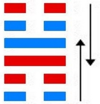

# 小过 ䷽ xiǎo guò

- No.62

> 小過，亨，利貞，可小事，不可大事。飛鳥遺之音，不宜上，宜下，大吉。
>《彖》曰：小過，小者過而亨也，過以利貞，與時行也。柔得中，是以小事吉也；剛失位而不中，是以不可大事也。有飛鳥之象焉，飛鳥遺之音，不宜上，宜下，大吉，上逆而下順也。
>《象》曰：山上有雷，小過。君子以行過乎恭，喪過乎哀，用過乎儉。
>《繫辭》：「斷木為杵，掘地為臼，臼杵之利，萬民以濟，蓋取諸小過。」

> 初六，飛鳥以凶。
>《象》曰：飛鳥以凶，不可如何也。

> 六二，過其祖，遇其妣。不及其君，遇其臣，无咎。
>《象》曰：不及其君，臣不可過也。

> 九三，弗過防之，從或戕之，凶。
>《象》曰：從或戕之，凶如何也。

> 九四，无咎，弗過遇之，往厲必戒，勿用永貞。
>《象》曰：弗過遇之，位不當也；往厲必戒，終不可長也。

> 六五，密雲不雨，自我西郊，公弋取彼在穴。
>《象》曰：密雲不雨，已上也。

> 上六，弗遇過之，飛鳥離之，凶，是謂災眚。
>《象》曰：弗遇過之，已亢也。

六四适变，血脉通也。阳入阴，阴入阳，二气降内外象。上下返应，二刚相适。
> 九三，九四。

土木入卦，分于二象。
> 内艮外震。

雷处高山，亢之极也。内柔无正性，危及于外。《易》曰：“飞鸟遗之音，不宜上宜下。”与坤为飞伏。
> 庚午火，癸丑土。

反归九四，诸侯立世，元士见应。建始乙丑至庚午，
> 大寒，芒种。

积筭起庚午至己巳，周而复始。土火入震艮。
> 外土火二象入兑宫。

五星从位起太阴，
> 水星入卦游魂。

翼宿从位降庚午，
> 二十八宿，分翼宿入兑宫游魂，小过卦九四庚午火上。

分气候三十六。
> 积筭三十六数，六位吉凶。

木下见土，二阳畜阴，六位相刑，吉凶生也。上升下阴阳反应，各私其党。六爻适变，阴道悖也。升降进退，其道同也。之艮入兑，阴纳与阳也。反复其位，次降入归魂，雷泽归妹卦。
　　
# [Xiǎo Guò ䷽](e5b08fe8bf87xiaoguo.md)
