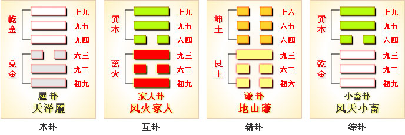
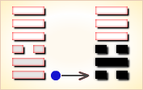
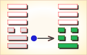
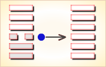
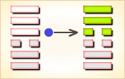
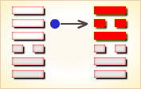
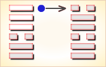

# 履 ䷉


履（lǚ）卦的代号是`6:7` ，主卦是兑卦，卦象是泽，阳数是`6`；客卦是乾卦，卦象是天，阳数是`7`。

图中，红色表示当位的爻，天蓝色表示不当位的爻，箭头表示有应。

天泽履（履卦），君子坦荡荡。
在《说文》中有这样的解释：“履，足所依也。”也就是说履是实践、行动的意思。

履卦的上卦是乾，是刚健之君，而下卦是泽，是恩泽的意思。也就是指这种行为一定要有礼，更要有理，只有做到这一点，才是真正的刚健。意思是说，君子在人际交往中只要能做到刚健守中，就可以将坏事变为好事，让恶的事物也呈现出好的一面，那么再大的艰难也能平安度过。

- 卦象：中上卦
- 卦序：10

## 总述

履是`6:7`卦的卦名，`6:7`是履卦的代号。“履”(lǚ)，践踩，走过。

`6:7`卦的主卦是`6`卦兑卦，卦象是泽，特性是愉快；客卦是`7`卦乾卦，卦象是天，特性是强健。

主方愉快地享受成功的喜悦，然而，面对威力强大的客方，不得不小心翼翼地行动，就像是一步一步地踩踏着往前走。

### 应用条件

起卦前需要客观地、全面地、准确地分析主方和客方情况，必须至少符合下列条件之一，此卦才有参考价值：

1. 主方与泽很相似，客方与天很相似。
2. 主方阳数是`6`，客方阳数是`7`。
3. 主方的行动是阳，素质是阳，态度是阴；客方的行动、素质和态度是阳、阳和阳。

切勿用任何随机数方式起卦，否则此卦不能用作决策工具。

### 结构和卦爻辞

履卦的结构图中，六条爻有两种颜色，红色和天蓝色。
图中，红色爻是当位的爻，是对主方有利的潜在因素。

第一爻是当位的爻，这条爻表示主方的行动是积极主动，这是正确的，只有积极主动才能获得和扩充自己的利益，这是对主方有利的潜在因素。

第五爻也是红色，那是客卦中爻，代表客方素质，是阳爻，表示客方素质良好，比如说，客方很富有，这也是对主方有利的潜在因素，主方有可能从客方的良好素质得益。
天蓝色爻是不当位的爻。

第二爻是天蓝色，这是主卦中爻，代表主方素质，这条爻不当位，表明，主方素质良好，主方不需要直接从客方的素质获益，于是，利用客方的良好素质充实自己的可能性小，不大可能利用客方素质良好的有利的潜在因素。

第三爻也是天蓝色，而且，第六爻也是天蓝色，从第三爻到第六爻还有一个箭头，这表示，主方态度随和，客方态度强硬，在态度方面，主方与客方处于阴阳和谐，但是，这种和谐对主方并不有利，表示主方受到客方制约。第六爻又是对第五爻的补充，第五爻和第六爻都是阳爻，表示客方素质非常好，客方实力比主方强大，在对待客方的态度上，主方不得不随和，不得不接受客方制约。

第四爻也是天蓝色，表示客方也积极主动，与主方有矛盾，第一爻所表现出的对主方有利的潜在因素并没有能够成为真正的对主方有利的因素，因此，主方不能盲动，必须小心谨慎，伺机而动。

履卦的卦辞与爻辞中，条条有“履”，而且，三次提到“履虎尾”，这说明在当前双方关系中，主方必须谨慎行事。人都习惯于走在平坦的道路上，“素履”，“履道坦坦”，然而，是走在老虎尾巴上，这种情况下，要走自己的路，不要指望从客方得到什么，不要在老虎尾巴上踩踏，“夬履”，还要仔细观察客方的行为，“视履考祥”。删除爻辞中的判断词，六条爻辞就是一首完整的围绕主题“履”的散文诗，下面是其译文：

```
自然地走，
走的道路很平坦，像隐士一样坚持下去，
瞎了一只眼仍然能够看东西，瘸子仍然可以走路；
踩老虎尾巴，老虎会咬人，这是将帅对君主的作法，
踩老虎尾巴，很恐惧啊。
走自己的路，
详细考察其行为，（与其）周旋很吉利。
```

卦辞强调当前主方的处境是“履虎尾”，主方要设法做到老虎“不咥人”，如果能够这样，主方的进展就会顺利。下面逐条解说卦爻辞。

### 卦辞
```
〖原文〗履虎尾，不咥人，亨。
〖译文〗踩老虎尾巴，老虎不咬人，顺利。

〖解说〗“咥”（dié）咬。
这条卦辞从双方关系的总体上说明形势。
主方和客方都在积极主动地行动，可能有冲突。
客方具有强大的力量，主方对付不了客方，可能很危险。
客方像是老虎，主方像是踩在老虎的尾巴上，
必须非常小心，以免被老虎咬伤。
而实际上，客方素质良好，不需要从主方获取利益，
只要主方谨慎处事就可以做到这只老虎不咬人，
这样，主方就可以顺利地发展自己的事务。
```

### 彖传
```
履，柔履刚也。
说而应乎乾，是以履虎尾，不咥人，亨。
刚中正，履帝位而不疚，光明也。〔彖传〕

【白话】《彖传》说：“履”卦象是说以柔顺对付阳刚，
以适应天下万变。有典故说，“跟在老虎尾巴后面走路，
老虎会很得意而不会咬人，当然诸事顺利。”
象征万事初起处位得当，中正不偏，
即使登上皇位履行君王职责也无所愧疚，
因心怀坦荡言行恰当，故前途光明远大。
```

### 象传
```
上天下泽，履；
君子以辩上下，定民志。
```

## 爻辞
### 初九
```
〖原文〗素履，往无咎。
〖译文〗自然地走，往前走无所怪罪。

〖解说〗“素”（sù），本来的，质朴、不加修饰的。
第一爻是主卦下爻，代表主方行动，
阳，表示主方行动是阳，
积极主动地谋取和扩大自己的利益。
主方按自己的步伐，自然地往前走，无所怪罪。

〖结构分析〗第一爻的位置是阳位，
这条爻是阳爻，阳爻在阳位，当位，然而与四阳不有应。
当位表明主方积极主动是正确的，
主方应对坚持积极主动地谋求和扩展自己的利益；
不有应表明客方与主方有矛盾。
主方须要妥善处理与客方的矛盾，
避免客方干扰，走自己的路，“素履”。
能进则进，不能进则耐心等待时机，
前进而不受怪罪，“往无咎”。
素履之往，独行愿也。
```

### 九二
```
〖原文〗履道坦坦，幽人贞吉。
〖译文〗走的道路很平坦，像隐士一样坚持下去，吉利。

〖解说〗“幽人”（yōu rén），幽隐之人；隐士。
第二爻是主卦中爻，代表主方素质，
阳，表示主方素质是阳，主方素质良好，比如说，
主方有资金、有地位、有权力、有实力、有技术，等等。
不要炫耀自己，平平常常地作自己的事，
像隐士一样地坚持下去，对于主方有利。
不然，如果企图走一条不平常的路，
想轰轰烈烈地大干一场，则不一定吉利。

〖结构分析〗第二爻的位置是阴位，
这条爻是阳爻，阳爻在阴位，
不当位，并且和五阳不有应。
不当位并不是说主方素质不应当良好，
而是说，主方不需要直接从客方获益；
不有应表明客方的素质也良好，但是，
其良好素质对于主方来说没有直接益处，
客方有可能依靠其良好素质压抑或打击主方。
主方应当依靠自己的良好素质，平平稳稳地发展自己，
不要张扬，避免客方攻击。坚持这么做，对主方吉利。
幽人贞吉，中不自乱也。
```

### 六三
```
〖原文〗眇能视，跛能履，
履虎尾咥人，凶；武人为于大君。
〖译文〗瞎了一只眼仍然能够看东西，
瘸子仍然可以走路；踩老虎尾巴，老虎咬人，有凶险；
这是将帅对君主的作法。

〖解说〗“眇”（miǎo），瞎了一只眼。
“跛”（bǒ），腿或脚有病，走路时身体不平衡，瘸：跛脚。
“武人”，指将帅军人。“大君”，天子。
第三爻是主卦上爻，代表主方态度，阴表示主方态度随和。
主方像走路人，像将帅；客方力量强大，像老虎，像君主。
主方采取了随和态度，一般情况都可以处理，“眇能视，跛能履”；
然而，对待客方则必须非常谨慎，
踩老虎尾巴，老虎是要咬人的，对于主方来说，情况是危险的。
这就像是将帅对待君主，必须非常谨慎，稍有不慎，可能被君主杀了。

〖结构分析〗第三爻位置是阳位，
这条爻是阴爻，阴爻在阳位，不当位，然而与六阳有应。
不当位表明主方对客方态度随和，
有可能受客方抑制而损伤自己的利益，
是对主方不利的潜在因素。
而且，第三爻是对第二爻的补充，
第二爻是阳爻，第三爻是阴爻，
表示主方素质良好但不是很好，
与客方相比，实力弱于客方，因此，难以与客方对抗，
不得不采取随和态度，“眇能视，跛能履”；
有应表明客方态度强硬，可以抑制主方，
对主方不利的潜在因素，成了真正的对主方的不利因素。
而且，第六爻是对第五爻的补充，表明客方素质非常好，
与主方相比，实力在主方之上，如同老虎，
在客方感觉受主方威胁的时候，
会严重伤害主方，“履虎尾咥人，凶；”。
主方积极主动，想谋取和扩大自己的利益，像个“武夫”，
客方威力强大，如同“君主”，主方与客方相处，
如同“武人为于大君”，主方必须十分小心谨慎。
眇能视，不足以有明也。
跛能履，不足以与行也。
咥人之凶，位不当也。
武人为于大君，志刚也。
```

### 九四
```
〖原文〗履虎尾，愬愬，终吉。
〖译文〗踩老虎尾巴，很恐惧，最终吉利。

〖解说〗“愬愬”，恐惧貌。
第四爻是客卦下爻，代表客方行动，
阳，客方积极主动地谋取和扩大自己的利益，
比如说，创新、创业、投资、进攻、求职、示爱，等等。
主方也是积极主动，主方可能与客方有冲突，
主方像是踩在老虎尾巴上，很恐惧。
主方态度随和，能够妥善处理与客方的冲突，“终吉”。

〖结构分析〗第四爻位置是阴位，
这条爻是阳爻，阳爻在阴位，不当位，并且和一阳不有应。
不当位表明客方积极主动是对主方不利的潜在因素，
有可能客方损害主方素质，使主方受损失，
主方像踩在老虎尾巴上，感到很恐惧，“履虎尾，愬愬”；
不有应表明主方也积极主动，主方采取积极主动的行动，
维护和扩充自己的利益，不让客方损害自己的利益，
主方积极主动是正确的，最终主方有可能使自己免受损失，
甚至使自己的利益得到扩张，“终吉”。
主方应当不惧怕客方，坚持积极主动。
愬愬终吉，志行也。
```

### 九五
```
〖原文〗夬履，贞厉。
〖译文〗走自己的路，坚持下去很困难。

〖解说〗“夬”（guài），分决。
第五爻是客卦中爻，
代表客方素质，阳表示客方素质良好。
主方素质也良好，主方不需要客方帮助，
也不需要帮助客方，主方应当果断地走自己的路。
如果坚持下去，与客方纠缠在一起，
由于客方力量强大，态度强硬，主方将很困难。

〖结构分析〗第五爻的位置是阳位，
这条爻是阳爻，阳爻在阳位，当位，然而与二阳不有应。
当位表明客方的良好素质是对主方有利的潜在因素，
主方有可能从客方的良好素质获益；
不有应表明主方不需要从客方的良好素质获益。
因为主方素质也良好，主方应当依靠自己的力量，
走自己的路，避免受客方控制，“夬履”，
不过，主方应当有思想准备，
客方实力强于主方，走下去会有困难，“贞厉”。
夬履贞厉，位正当也。
```

### 上九
```
〖原文〗视履考祥，其旋元吉。
〖译文〗详细考察其行为，周旋很吉利。

〖解说〗“视履”，观察其行为。
“旋”（xuán），表示与各方来往或来往于各方之间：周旋。
第六爻是客卦上爻，
代表客方态度，阳表示客方的态度强硬。
主方详细观察客方行为，
由于主方态度随和，与客方周旋很吉利。
“旋”指主方与客方周旋，“元吉”是指“其旋”而言，
不是直接指整个形势对主方很吉利。
不过，间接地也是对主方有利。

〖结构分析〗第六爻位置是阴位，
这条爻是阳爻，阳爻在阴位，不当位，然而与三阴有应。
不当位表明客方以强硬态度压抑主方，
是对主方不利的潜在因素；
有应表明主客双方的态度处于和谐状态，
主方对客方的强硬态度随和，以致客方压抑主方，
是对主方的真正的不利因素。
从总体看，第六爻是对第五爻的补充，
第五爻是阳爻，表示客方素质良好，
第六爻也是阳爻，表示客方素质不仅良好，
而且非常好，客方实力非常强大，
其强硬态度是实力强大的表现。
另一方面，第二爻是阳爻，表明主方素质良好。
第三爻是阴爻，表示，主方的素质虽然良好，
但不是非常好，主方实力比客方弱，
主方的随和态度是出于不是很强的实力，不得不如此。
然而，如果主方清醒地看到这个现实，
不是简单地接受客方压抑，而是认真仔细地观察客方行动，
“视履考祥”，以柔克刚，灵活地与客方周旋，
于是主方就可以避免客方的控制和压抑，
维护和扩张自己的利益，这样对主方很有利，“其旋元吉”。
元吉在上，大有庆也。
```

### 原文
```
（兑下乾上）[履]①：履虎尾，不咥②人。亨。
初九：素履③往，无咎。
九二：履道坦坦④，幽人⑤贞吉。
六三：眇⑥能视，跛能履。
履虎尾，咥人，凶。武人为于大君⑦。
九四：履虎尾，愬愬⑧。终吉。
九五：夬履⑨，贞厉。
上九：视履⑩考祥，其旋⑪元吉。

注释：
① 本卦标题是履。原经文卦象后无“履”字。
履的意思是踩踏，引申为行为和行为准则。
由于“履”字在本卦中出现次数多，所以用它作为标题。
全卦内容主要讲人的行为修养。
② 咥（dié）：咬。
③ 素：洁白，引申为纯洁。素履；行为清正纯洁。
④ 履道：这里指人的行为修养。坦坦：宽 广坦荡。
⑤ 幽人：被监禁的人。
⑥ 眇（miǎo）：一只眼睛小。
⑦ 大君：国君。
⑧ 愬愬（shuò shuò）：恐惧的样子。
⑨ 夬（guài）：”快“的本 字，意思是快速。
夬履：意思是行为养撞急躁。
⑩ 视：察看，审视。视履：意思是行为审慎。
⑪ 考祥：全面仔细地考虑。旋：反复。
```

### 译文
```
初九：素履，往，无咎。
白话：阳爻在刚位，按平常的方式去前往，是因为只想实现自己的愿望，
"独行愿"是因为跟九四不应，因此不是为了任何利益，作为履卦的初爻，
故老老实实地按照自己的方式来做，行为清正纯洁，如此下去，便没有灾祸。

九二：履道坦坦，幽人贞吉。
白话：“幽人”为隐居之人，是因为九二在下爻“泽”的中间，
古代隐居在沼泽中间的人常常是隐居之人，这里用幽人来讲。
小心行走在平坦宽广的大道上，幽居的人安于闲逸恬静的生活，
意志不被世俗扰乱，结果自然是吉祥的。

六三：眇能视，跛能履。履虎尾，咥人，凶。武人为于大君。
白话：六三在下卦互兑\互离\互巽里面，
兑代表口，也代表有开口有缺陷，离代表眼睛，
故曰眼睛不好却能看，巽代表大腿，故曰跛了脚却能走路。
上面是乾卦，代表老虎，故曰六三踩到九四老虎的尾巴，
六三在互兑中，兑代表口，即落入了老虎口中。
故曰老虎咬人，征兆凶险。
再用军人掌握政权成为国君做比喻，也是凶兆。

九四：履虎尾，愬愬。终吉。
白话：九四也踩到老虎尾巴，
但是九四本身自己就是老虎的尾巴，故踩到自己的尾巴，
虽然让人害怕，但结果还是吉利的，
因为九四是阳爻在柔位，调和一下，没有大问题。

九五：夬履，贞厉。
白话：在履卦里面以柔为主，九五态度过于岗刚强，
故曰行为莽撞急躁，占问得到不利之兆。
上九：视履，考祥其旋。元吉。
白话：上九为什么元吉？在64卦中最上爻元吉的只有2卦，
一为井卦，井卦最上爻上六为元吉，
寓意井终于造好了不要盖盖子好让大家享用；
二为履卦的上九为元吉，
因为从初爻到五爻一路走来都秉持有礼的态度，
到了上九自然吉祥。
故爻辞白话为“行为小心谨慎，反复仔细考虑，大吉大利。”
```

### 读解

这一卦以梦中所见踩到老虎尾巴的景象，来占问平时所作所为的吉凶兆头，探问神的意旨，这就是所谓“梦占”。古人迷信，认为梦中所见所思，与日常的言谈举止有着某种必然的、神秘的内在联系，是神的意志的显现。因此，梦占便成了占筮的重要内容之一。

如今我们对梦的了解远比古人深入得多，虽然还没有达到了若指掌的地步，但已拨开了蒙在梦境之上的不少迷雾、不过，透过神秘之雾，我们发现古人关注的焦点集中在如何做人、如何使自己的行为合符仪轨之上。常言道，日有所思，夜有所梦。由梦 联系到行为规范，可见古人对为人处世的重视。

我们不难发现，作者认为一个有教养的人应当行为清正纯洁，胸怀坦荡，光明磊落，同时又沉着冷静，机敏细致，才可能有所作为。这个标准大概就是君子与小人、王者与野心家的分界线所在吧。由此可以想到，重视人伦道德纲常的儒家，何以要把《易》当作经典，也可以明白孔子所说的“君子坦荡荡”、“君子不忧不惧”所包含的内容了。

### 卦辞解释
```
履：履虎尾，不咥人。亨。
【白话】《履卦》象征小心行动：
跟在老虎尾巴后面走路，老虎却没有回头咬人，当然亨通顺利。
《象》曰：上天下泽，"履"；君子以辩上下，定民志。
【白话】《象辞》说：
《履卦》的卦象是兑（泽）下乾（天）上，为天下有泽之表象。
上有天，下有泽，说明要处处小心行动，如行在沼泽之上，
一不注意就会陷下去；君子要深明大义，分清上下尊卑名分，
坚定百姓的意志，遵循礼仪而行，必然秩序井然。
```

### 爻辞解释
```
初九：素履①，往，无咎。
九二：履道坦坦②，幽人③贞吉。
六三：眇④能视，跛能履。
履虎尾，咥人，凶。武人为于大君⑤。
九四：履虎尾，愬愬⑥。终吉。
九五：夬履⑦，贞厉。
上九：视履⑧，考祥其旋⑨。元吉。

【注释】
① 本卦标题是履。
原经文卦象后无“履”字。履的意思是踩踏。
素：洁白，引申为纯洁。素履；行为清正纯洁。
② 咥（dié）：咬。
履道：这里指人的行为修养。坦坦：宽广坦荡。
③ 幽人：被监禁的人。
④ 眇（miǎo）：一只眼睛小。
⑤ 大君：国君。
⑥ 愬愬（shuò shuò）：恐惧的样子。
⑦ 夬（guaì）：“快”的本字，意思是快速。
夬履：意思是行为养撞急躁。
⑧ 视：察看，审视。视履：意思是行为审慎。
⑨ 考祥：全面仔细地考虑。旋：反复。

（乾上兑下）履卦。

白话解释：
初九，素履，往无咎。
【白话】初九，心地纯朴，品行端正，
处处小心行事，那么无论到什么地方都没有灾祸。
《象》曰："素履之往"，独行愿也。
【白话】《象辞》说："心地纯朴，品行端正，处处小心行事"，
表明要专心致志，遵循礼仪实现自己的意愿。

九二，履道坦坦，幽人贞吉。
【白话】九二，小心行走在平坦宽广的大道上，
幽居的人安于闲逸恬静的生活，结果是吉祥的。
《象》曰："幽人贞吉"，中不自乱也。
【白话】《象辞》说："幽居的人可获吉祥"，
说明自己内心平静自然毫不紊乱，循礼仪而行的信念坚固。

六三，眇能视，跛能履。履虎尾咥人，凶；武人为于大君。
【白话】六三，眼睛快要瞎了，但勉强能看到一点点；
腿跛了，但勉强能走几步。
不小心踩在老虎尾巴上，老虎回头就咬人，凶险；
勇敢的武士要竭力为君主效劳。
《象》曰："眇能视"，不足以有明也；"跛能履"，不足以与行也；
"咥人之凶"，位不当也；"武人为于大君"，志刚也。
【白话】《象辞》说："眼睛快瞎了，但勉强能看到一点点"，
不足以分辨事物；"腿跛了，但勉强能走几步"，不能出外远行；
"老虎咬人是凶险的"，表明这时处的位置很不妥当，
竟然踩在老虎尾巴上。"武士要竭力为君主效劳"，表明武士的志向刚强。

九四，履虎尾，愬愬，终吉。
【白话】九四，跟在老虎尾巴后面走路，
感到恐惧害怕，但谨慎小心，终于得到吉祥。
《象》曰："愬愬终吉"，志行也。
【白话】《象辞》说："感到恐惧害怕，但谨慎小心，终久获得吉祥"，
说明小心遵循礼仪而行就能实现自己的志愿。

九五，夬履，贞厉。
【白话】九五，刚毅善于作出决断，小心行动，要提防危险。
《象》曰："夬履贞厉"，位正当也。
【白话】《象辞》说："刚毅果断，小心行动，要提防危险"，
说明此时虽处于正当的位置，但也不能疏忽大意。

上九，视履考祥，其旋元吉。
【白话】上九，回头看看走过的路，详细察看一下吉凶祸福，
转身来顺应阴柔自然之道，这样是吉祥的。
《象》曰："元吉在上，大有庆也。
【白话】《象辞》说：极为吉祥，
高居尊上之位，表明有大的福分值得庆祝。

详解：
初九：素履，往无咎。
《象》曰：素履之往，独行愿也。
“初九”是阳爻，在最下位，象征有才能，却甘心情愿安于低的地位。
这是踏步前行的第一步，还不曾被富贵诱惑，
仍然本着自己平素的志向前进，所以不会有过失。
《象传》的“独”，是指特立独行，不随世俗的意思。
这一爻，说明实践理想，履行责任，应当一本初衷，特立独行不同流合污。

九二：履道坦坦，幽人贞吉。
《象》曰：幽人贞吉，中不自乱也。
“坦坦”是平坦，“幽人”指隐士。
“九二”阳爻，在下卦中位，性格刚健、中庸；
但与“上九”同性相斥，不能相应。
因而，以心胸坦荡的隐士比拟，执着纯正，
不求闻达，意志不被世俗扰乱，当然吉祥。
这一爻，说明道不合，不相谋，心胸坦荡，择善固执的态度。

六三：眇能视，跛能履，履虎尾，咥人，凶。武人为于大君。
《象》曰：眇能视﹔不足以有明也。
跛能履﹔不足以与行也。
咥人之凶﹔位不当也。武人为于大君﹔志刚也。
“六三”阴爻阳位不正，离开下卦的“中”位；
所以，《象传》说位不当。
阴爻本性柔弱，阳位性情刚暴；
以这种性格，竟然尾随在刚强的“干”的后面，必然非常危险。
就像祇有一只眼，能看但看不清楚；跛了一只脚，能走却走不安稳；
终于踩到老虎尾巴，以致被咬伤。
又像“武人为于大君”，刚愎自用，拥兵自重，
心怀不轨，企图叛乱，终于失败，当然凶险。
由此可见，中国传统重文轻武的观念。
这一爻，说明践履应当量力守分，不可逞强，以致适得其反。

九四：履虎尾，愬愬终吉。
《象》曰：愬愬终吉，志行也。
“愬愬”是恐惧的意思。
“九四”也不在中位，阳爻阴位不正，
尾随在老虎“九五”的后面，当然危险。
不过，前一爻的“六三”，是柔弱却要逞强；
相对的，“九四”却是刚强而在柔位，亦即，强而有力，
但态度柔顺，戒慎恐惧，因而能够避免伤害，施展抱负，当然吉祥。
这一爻，强调戒慎恐惧，以柔制刚的法则。

九五：夬履，贞厉。
《象》曰：夬履贞厉，位正当也。
“夬”同决，果决，用强的意思。
“九五”阳爻阳位，又在至尊的地位，以致刚强果决；
下卦“兑”是和，象征“九五”的部下，又和悦服从，唯命是听；
造成“九五”的独断独行，肆无忌惮。
这种作风，即或动机纯正，仍然危险。
这告诫，意义极为深远。
《象传》中的“位正当也”，是指“夬履”的危险，
正在于有才能，又有地位，以致恃才傲物，过于自负。
这一爻，告诫刚愎一意孤行的危险性。

上九：视履考祥，其旋元吉。
《象》曰：元吉在上，大有庆也。
“祥”包含祸福两面，“考”是成的意思。
“旋”是周旋，在此当圆满没有瑕疵解。
“上九”已是履卦的最后阶段，是祸是福，要看实践的结果而定。
如果践履圆满，没有瑕疵，当然大吉大利。
《象传》中的“上”与终同。“庆”指祸福中的福。
是说大吉大利要看结果如何？
如果圆满，则是大有福庆。
这一爻，告诫成败的评价在结果。

履卦，阐释实践理想，履行责任的原则，
以“履虎尾”象征，充满危机感，不可不戒惧。
应以柔顺和悦中庸的态度，小心翼翼去践履。
应当坚定平素的志向，不被世俗诱惑，独立特行；
又要能心胸坦荡，择善固执，甘于寂寞。
应知量力守分，不可逞强冒进。
应戒慎恐惧，要能把握以柔制刚的法则，
不可一意孤行，刚愎自用。
并应一本初衷，贯彻到底，不可妥协，
结果要求尽善尽美，稍有瑕疵，前功尽弃。
```

### 白话解析
```
礼①：虎尾不真②，人亨。
【白话】筮占得礼卦，其卦象为“虎尾不真”，其占语为“人亨”。
【注释】
① 礼：卦名，所以事神祭祀的仪式。
② 虎尾不真：仿制的假老虎尾巴。
【讲解】礼，通行本作“履”。礼、履，古通用。
礼神用假老虎尾巴，是古代虎图腾崇拜的文化现象。

初九：错①礼，往，无咎。
【白话】筮得礼卦，占得初九，
设神案祭祀神灵祖先，然后才去行动，便没有灾咎。
【注释】① 错：假借为措，设置、安置。
【讲解】错礼，通行本作“素履”。错、素，旁纽、叠韵。

九二：礼道亶亶①，幽人②贞吉。
【白话】筮得礼卦，占得九二，礼神之道平坦宽广，
只有幽静淡泊的人才能得到吉占。
【注释】
① 亶亶：假借为“坦坦”，平坦宽广的样子。
② 幽人：幽静淡泊的人。
【讲解】九二以阳刚之爻居于阴柔之位，
宽裕得中，标明礼神之道坦坦然宽广平易。

六三：履①能视，跛能利，礼虎尾真，人凶；武人迵于大君。
【白话】筮得礼卦，占得六三，眼睛不方便却能看东西，
脚腿不方便却能走路，用真正的老虎尾巴去礼神祭祀，
占断为凶恶，卫兵通报大君。
【注释】① 履：瞟子，一只眼睛大，一只眼睛小。
【讲解】六三以阴柔居于阳刚之位，志欲阳刚而体本阴柔，
所以有眼睛小、腿脚跛之象。因此得凶占。

九四：礼虎尾，朔朔①，终吉。
【白话】筮得礼卦，占得九四，礼神用虎尾巴，
有恐惧之象，然而终归得吉善之占。
【注释】① 朔朔：假借为“愬愬”，恐惧的样子。
【讲解】九四以阳刚之爻居于阴柔之位，是不正之象，
四不居上卦之中，但以刚居柔，刚柔相济，
能够戒惧警惕，所以终归吉善。

九五：履礼①，贞厉。
【白话】筮得礼卦，占得九五，其象为“履礼”，其占为“贞厉”。
【注释】① 履礼：决定礼神。
【讲解】礼神之道贵柔，此爻九五以阳刚之爻居阳刚之位，所以贞厉。

上九：视礼①，巧翔其睘②，元吉。
【白话】筮得礼卦，占得尚九，
其象为“视礼，巧翔其睘”，其占为“元吉”。
【注释】
① 视礼：观察礼神之道。
② 巧翔其睘：善于独善其身。
巧：善。翔：高扬。睘，同茕，独也。
【讲解】巧翔其睘：通行本作“考祥其旋”，谓尚九处礼之终，
于其终视其所礼之行，以考其善恶祸福，如其返朴归真则善而且吉利。
```

### 新解
```
【原文】 
（兑下乾上）[履]①：履虎尾，不咥②人。亨。
初九：素履③，往，无咎。
九二：履道坦坦④，幽人⑤贞吉。
六三：眇⑥能视，跛能履。
履虎尾，咥人，凶。武人为于大君⑦。
九四：履虎尾，愬愬⑧。终吉。
九五：夬履⑨，贞厉。
上九：视履⑩，考祥其旋⑪。元吉。

【注释】 
① 本卦标题是履。原经文卦象后无“履”字。
② 咥（dié）：咬。
③ 素：洁白，引申 为纯洁。素履；行为清正纯洁。
④ 履道：这里指人的行为修养。坦坦：宽 广坦荡。
⑤ 幽人：被监禁的人。
⑥ 眇（miǎo）：一只眼睛小。
⑦ 大君：国君。
⑧ 愬愬（shuò shuò）：恐惧的样子。
⑨ 夬（guài）：“快”的本字，意思是快速。
夬履：意思是行为养撞急躁。
⑩ 视：察看，审视。视履：意思是行为审慎。
⑪ 考祥：全面仔细地考虑。旋：反复。

【译文】 
（履卦）：踩到老虎尾巴，老虎不咬人。吉利亨通。
初九：行为清正纯洁，如此下去，没有灾祸。
九二：为人处世胸怀坦荡，即使无故蒙冤也会有吉祥的征兆。
六三：眼睛不好却能看，跛了脚却能走路。
踩到老虎尾巴，老虎咬人，征兆凶险。
军人掌握政权成为国君，也是凶兆。
九四：踩到老虎尾巴，让人害怕，但结果还是吉利。
九五：行为莽撞急躁，占问得到不利之兆。
上九：行为小心谨慎，反复仔细考虑，大吉大利。

【读解】
我们不难发现，作者认为一个有教养的人应当行为清正纯洁，
胸怀坦荡，光明磊落，同时又沉着冷静，机敏细致，才可能有所作为。
这个标准大概就是君子与小人、王者与野心家的分界线所在吧。
由此可以想到，重视人伦道德纲常的儒家，何以要把 《易》当作经典，
也可以明白孔子所说的“君子坦荡荡”、“君子不忧不惧”所包含的内容了。
```

### 《哲学易经》之《履卦》 --- 李建明

履：履虎尾，不咥人，亨。《彖》日：履，柔履刚也。说而应乎乾，是以履虎尾，不咥人，亨。刚中正，履帝位而不疚，光明也。《象》曰：上天下泽，履。君子以辩上下，定民志。

不断蓄积力量，从而才能夙行其愿，履行于天下，故受之《履》。履：《说文》，足所依也。足有所依，行之矣。人民创造一定的生活条件必然要向更高层次发展，但发展是有局限性的，只有预备一定的条件才能行之远而亨。因此要促使事物的发展和蓬勃的生活就当遵循发展观和符合发展的客观条件。遵循发展观和符合发展的客观条件用真理改变事实，是以“柔可履刚，行帝位而不疚”矣。故面对一切当如行虎尾、如行薄冰、谨慎而动，如此即或行虎尾老虎也不会咬人，是以有亨之见了。

《彖》辞说：履行之道，柔履刚也。用柔顺悦和之道而应之于刚键，依其情而动，顺其势而为，是以履虎尾而不咥人，无不亨也。原因是虎虽凶矣，顺其性而动未尝不可进也；道虽艰矣，合于其理而行未尝不可通也。是故君子当相观其才能气势而为之度。若能顺应形势，和合于天，悦乐于民，则虽危而安、虽弱而强。如此行进哪怕行虎尾老虎也不会咬人，是以有亨之见了。故一切当顺其势、依其情、合其理、战战兢兢，其行虽柔而能致其刚健中正也。其行刚健中正，哪怕是履行帝王之位又何疚，前途光明灿烂矣。

《象》辞说：上有巍巍蓝天，下有碧波海洋，履道坦坦无有际也，这是《履》之象。是以君子观之，思天之为高矣，何以骥其际；海之为深矣，何以履其地。从而当相观其能而动，谨慎自我行为，辩上下、度能量、明法度、以定天下之志。

初九：素履，往无咎。《象》曰：素履之往，独行愿也。
素，朴素无华，不标榜者也。如牛皮堆山论成十足，世必疑矣。故君子当“言顾行，行顾言”切实于行动，才能业有所进德有所树而日见其增。业绩不是吹出来的，而是埋头苦干做出来的，粉饰自己则包装最好总有自破的一天。因此君子当“素富行富，素贫行贫，上不怨天下不怨人”而独行其愿。

九二：履道坦坦，幽人贞吉。《象》曰：幽人贞吉，中不自乱也。
坦坦，坦荡宽广也。履道坦坦，无边无际，唯有沉着冷静的人才能不被物欲所迷倒而自逢吉祥。故一切当以平静的心态从事才不会被鸟语花香的情境所蒙蔽，也只有以沉着冷静从事才不会丧失理智和迷失方向。若以俗眼的态度谛视天下则到处都是鸟语花香酒红灯绿矣。故马克思主义反对一切抽象的公式和一切教条的方法，而是要求细心的深思熟虑的看待和思考正在进行的问题，若不加以细心观察和深思熟虑，则任何一个片断、碎片、小段都会将人们引入泥潭。

六三：眇能视，跛能履，履虎尾，咥人，凶，武人为于大君也。《象》曰：眇能视，不足以有明也。跛能履，不足以与行也。咥人之凶，位不当也。武人为于大君，志刚也。

眼睛瞎了还盯着不放，脚跛了还要行走，如此强行则必招其灾，如此履虎尾虎必咥人。原因是人民的利益高于一切，更何况还有法律法规，这就叫“武人为于大君也”。因此不切实际的行动必然会招致意想不到的危害，脱离实际的环境就会招受意想不到的打击，之所以咥人之凶是因为位不当也。故君子当明动，安行，不犯难行。

九四：履虎尾，愬愬，终吉。《象》曰：愬愬终吉，志行也。
如行虎尾，如履薄冰，愬愬终吉，敬慎不败也。因此我们当注重每一个细节，谨慎自我的行为，如此而进则志必可行。常言道：“小心驶得万年船”，唯小心谨慎则不易出错而能保长足发展。

九五：夬履，贞厉。《象》曰：夬履贞厉，位正当也。
夬，决也，果决也。一切要果决而行，明快而动，卜问有艰难也。原因是因为时机容不得你迟疑。故夬履贞厉，位正当也。若一迟缓、拖泥就相去千里矣。故“一步实际的行动比一打纲领更重要，发展才是硬道理。”如成天呆在泥潭里，用调和的手法和犹豫不决，只能是自取其辱。

上九：视履，考祥其旋，元吉。《象》曰：元吉在上，大有庆也。
视履，视而履之也。视而履之则进可得位退可免灾，是以大吉，如此行进必有庆也。故面对一切要周祥考虑，全部总和。只有周祥考虑、全部总和、相互联系，才能制定依据而获得吉祥。因此面对一切不应当从可能出发，而应当从现实出发。如能考祥其旋，是以元吉和大有庆也。

### 《履卦》最新译文
```
履：履虎尾，不咥人，亨。
译文：
履卦，踩了老虎尾巴，老虎却不咬人，气运亨通。
初九：素履，往无咎。
译文：
打算轻装出行踏青。此去原则上是不可能有错的。

九二：履道坦坦，幽人贞吉。
译文：
出行踏青的道路 坦荡而宽广。出来散心的人啊，心情不错。

六三：眇能视，跛能履，履虎尾，咥人，凶。武人为于大君。
译文：
对于某些不开眼又没本事的人来说这是凶的。
因为他不小心踩了老虎尾巴，老虎咬了他，大凶。
但是这对于老虎来说，这却是大吉的。
因为老虎终于有了发威的机会。
像老虎一样有实力的武人，此时可以发力，
而进步成为君主，大吉。

九四：履虎尾，愬愬，终吉。
译文：
如果你不是不开眼又没本事的人请不要担心。
虽然你不小心踩了老虎尾巴，战战兢兢的，
但是老虎是不会咬你的。因为这是一只有大志的老虎。

九五：夬履，贞厉。
译文：
虽然老虎不咬你，但是你不能不知好歹。
这是你该站队的时候。站在老虎这边，吉利。
否则，仍然不能保证你的安全。

上九：视履，考祥其旋，元吉。
译文：
观其大势，老虎主导了整个大局。
不论左思右想，站在老虎这边都是吉祥的。
所以你坚定了自己的选择：站在老虎这边。
老虎视你为自己人，当然就不会咬你。于是你得以凯旋而归。
这是常人所不可能有的吉祥。

履卦的本意是：弱者意外地遭遇到了强者。
但是强者只要你归顺并不想杀你。
你顺应了大势终于得到了吉祥与安全。
履卦除第三爻外的5个爻都吉祥。唯独三爻，利强者，不利弱者。
如老虎般强大的武人，得此履卦三爻，可以君临天下。
这是所有想成为君主的武人唯一的机会。

```



### 《断易天机》解

履卦乾上兑下，为艮宫五世卦。履为履行之意，又寓意礼，提示占筮者要兢兢戒惧，遵守礼节，这样才有惊无险。

### 北宋易学家 邵雍 解

步履不安，困难危险；谦虚自重，敬慎事主。

得此卦者，困难时期，多坎坷不顺，万事不宜急进，须循序渐进，谨慎行事。

### 台湾国学家 傅佩荣 解

- 时运：依序升进，不可攀缘。
- 财运：明察货品，待时而售。
- 家宅：门庭严整。
- 身体：疏通气血。

### 传统解卦
```
这个卦是异卦（下兑上乾）相叠，
乾为天，兑为泽，以天喻君，以泽喻民，
原文：“履（踩）虎尾，不咥（咬）人”。
因此，结果吉利。君上民下，各得其位。
兑柔遇乾刚，所履危。
履意为实践，卦义是脚踏实地的向前进取的意思。

大象：柔弱遇刚强，欲行却难行之象，难且危也。
```

运势：先劳而后逸，始惊而后安，百事不宜急进，须以和待人，有惊无险。

- 事业：起初很不顺利，受到种种威胁，若能提高警惕，谨小慎微，脚踏实地，逐个地去克服困难，不改变自己的决心，一定可以达到目的。办事有自知之明，务必量力而行，不可不顾实际，尤其不得逞强，急于求成。
- 经商：宜待观动静，勿为小利而动摇自己计划，尤其不得贪得无厌，遵循商业道德，了解全面信息。
- 求名：务必有恒心，孜孜以求，不为财富利诱，不为世俗干扰，坚持自己的志向和理想，可以取得成功。
- 婚恋：双方安贫乐道，可和睦相处，若一方为富贵所动，会发生婚变。
- 决策：诸事必须小心慎重，不利的情况经常会出现，但若能处理得好，总会是有惊无险，化险为夷。为此，办事必须认认真真，遵循正道，虚心听取别人的建议，量力而行，切莫自负逞强，一定会有好的结果。

### 台湾张铭仁解卦
```
履：表示战战兢兢、如履薄冰而行，却是有惊无险。
为小凶带吉之象。 履又为「礼」也。
得此卦者，需尽快反省自己的态度，
对人、对事、对长辈是否有轻忽、不敬之意。
虽有危急之事幸好能平安度过。

解释：只要履行契约承诺则吉。

特性：竞争，积极，冒险，热枕，独立，自立自强，有骨气。
```

运势：先劳而后逸，始惊而后安，百事不宜急进，须以和待人，有惊无险。

- 家运：新婚而刚建立家庭者，多碍、劳苦。但此卦有先苦后甜之象，和气可生财，过些时日即可雨过天晴也。
- 疾病：病虽重，但注意调理亦可愈，防头、口、肺等疾。
- 胎孕：临盆产妇占得则吉，否则有受惊吓之象，需安胎。
- 子女：初运有劳苦，障碍、困难之象，但以后能获得幸福也。
- 周转：虽有些困难，但不必急躁，谦恭而施则可成也。
- 买卖：虽有是非但终可成，牛马猴之月或日方成。
- 等人：迟来。
- 寻人：走失之人有生命危险，在西方或西北方向，难寻，须争取时效。申未日可见。
- 失物：赶快去找有可能寻回，留意行过的路上，或者有鞋的地方。
- 外出：有惊无险，可以外出，但非紧急情况可以缓行。
- 考试：不理想。
- 诉讼：敌强而我弱之象，宜步步为营。
- 求事：有贵人提拔，可发展，称心。
- 改行：不宜。
- 开业：不宜。

## 初九爻详解
### 初九爻辞

初九。素履，往无咎。

《象》曰：素履之往，独行愿也 。

### 白话文解释

初九：以朴素坦白的态度处世，没有灾害。

《象辞》说：以朴素坦白的态度处世，是说能独行其志愿。

### 北宋易学家 邵雍 解
平：得此爻者，营谋有计，则财利日增。做官的若修德养身，则有升迁之机。

### 台湾国学家 傅佩荣 解

- 时运：等待时机，自有成就。
- 财运：守好旧业，久必获利。
- 家宅：门庭吉祥。
- 身体：慢跑有益。

### 初九变卦：天泽履 变卦 天水讼



初九爻动变得[第6卦：天水讼](e8aebcsong_cn.md)。

这个卦是异卦（下坎上乾）相叠。

同需卦相反，互为“综卦”。

乾为刚健，坎为险陷。

刚与险，健与险，彼此反对，定生争讼。
争讼非善事，务必慎重戒惧。

## 九二爻详解
### 九二爻辞

九二。履道坦坦，幽人贞吉。

《象》曰：幽人贞吉，中不自乱也。

### 白话文解释

九二：行道之人，胸怀坦荡；隐居之人，长逢吉兆。

《象辞》说：隐居之人洁身守正，因为他们秉性中正，不被世俗所惑。

### 北宋易学家 邵雍 解

平：得此爻者，安然自乐，修身养性。做官的会有全身而退之兆。

### 台湾国学家 傅佩荣 解

- 时运：高尚其志，修身以道。
- 财运：物价稳定，稍有小利。
- 家宅：分析财产，小心损耗。
- 身体：保养眼睛。

### 九二变卦：天泽履 变卦 天雷无妄



九二爻动变得[第25卦：天雷无妄](e697a0e5a684wuwang_cn.md)。

这个卦是异卦（下震上乾）相叠。

乾为天为刚为健；震为雷为刚为动。

动而健，刚阳盛。

人心振奋，必有所得，但唯循纯正，不可妄行。
无妄必有获，必可致福。

## 六三爻详解
### 六三爻辞

六三。眇能视，跛能履。履虎尾，咥人，凶。武人为于大君。

《象》曰：眇能视，不足以有明也。跛能履，不足以与行也。咥人之凶，位不当也。武人为于大君，志刚也。

### 白话文解释

六三：瞎了眼睛却要看物，跛了脚却要行走，这是勉为其难，犹如踩着虎尾巴，终将为虎所伤。这是凶险之事。武人纂夺国政，同样是凶险之事。

《象辞》说：瞎了眼睛却要看物，其视力不足以辨物。跛了脚却要行走，其脚力不足以行路。老虎之所以伤人，因为六三阴爻而居于阳位，所处不当。武人纂夺国政，这是僭越犯上，以六三之位而行九五之志，必遭祸殃。

### 北宋易学家 邵雍 解

凶：得此爻者，会有争诉，囚狱之扰，甚者家破人亡。做官的则会有被贬职之祸。

### 台湾国学家 傅佩荣 解

- 时运：退守为宜，妄动则凶。
- 财运：被人欺弄，货物滞销。
- 家宅：暗昧不明，以小凌大。
- 身体：保养眼睛与脚部。

### 六三变卦：天泽履 变卦 乾为天



六三爻动变得[第1卦：乾为天](e4b9beqian_cn.md)。

这个卦是同卦（下乾上乾）相叠。

象征天，喻龙（德才的君子），又象征纯粹的阳和健，表明兴盛强健。

乾卦是根据万物变通的道理，以“元、亨、利、贞”为卦辞，表示吉祥如意，教导人遵守天道的德行。

## 九四爻详解
### 九四爻辞

九四。履虎尾，愬愬，终吉。

《象》曰：愬愬终吉，志行也。

### 白话文解释

九四：踩着虎尾巴，但能遇险知惧，最后仍吉利。

《象辞》说：恐惧警惕，终归于吉，说明虽历磨难，但志愿得行。

### 北宋易学家 邵雍 解

平：得此爻者，会有危险，宜温和自持，可免灾祸。做官的会有虎符将帅之兆。读书人将会取得不错的佳绩。

### 台湾国学家 傅佩荣 解

- 时运：温和笃实，终可免祸。
- 财运：不急求售，终获利益。
- 家宅：平稳持家。
- 身体：谨慎走路。

### 九四变卦：天泽履 变卦 风泽中孚



九四爻动变得[第61卦：风泽中孚](e4b8ade5ad9azhongfu_cn.md)。

这个卦是异卦（下兑上巽）相叠。

孚本义孵，孵卵出壳的日期非常准确，有信的意义。

卦形外实内虚，喻心中诚信，所以称中孚卦。这是立身处世的根本。

## 九五爻详解
### 九五爻辞

九五。夬履，贞厉。

《象》曰：夬履贞厉。位正当也。

### 白话文解释

九五：行为急躁莽撞；卜其行事有危险之象。

《象辞》说：行为急躁莽撞，卜其行事有危险之象，但九五阳爻居上卦中位，正当其位。因而虽险不凶。

### 北宋易学家 邵雍 解

凶：得此爻者，躁动妄行者，则祸患将至，甚者有性命之忧。做官的会功高盖主，而不赏。

### 台湾国学家 傅佩荣 解

- 时运：拨云见日，勿忘艰苦。
- 财运：和衷共济，惜售有利。
- 家宅：居安思危，可保平安。
- 身体：由危转安。

### 九五变卦：天泽履 变卦 火泽睽



九五爻动变得[第38卦：火泽睽](e79dbdkui_cn.md)。

这个卦是异卦（下兑上离）相叠。

离为火；兑为泽。

上火下泽，相违不相济。

克则生，往复无空。

万物有所不同，必有所异，相互矛盾。
睽即矛盾。

## 上九爻详解
### 上九爻辞

上九。视履考祥，其旋元吉。

《象》曰：元吉在上，大有庆也。

### 白话文解释

上九：行为审慎，遇事周密反复地考虑，大吉。

《象辞》说：大吉大利，因为上九之爻居全卦之首。预兆其人将有重大喜庆之事。

### 北宋易学家 邵雍 解

吉：得此爻者，财利可获。做官的宜退而以享安静和平之福。读书人努力者可获佳绩。

### 台湾国学家 傅佩荣 解

- 时运：晚运亨通，福寿双全。
- 财运：往来经营，无不有利。
- 家宅：积善之家才有余庆。
- 身体：天年有限。

### 上九变卦：天泽履 变卦 兑为泽



上九爻动变得[第58卦：兑为泽](e58591dui_cn.md)。

这个卦是同卦（下泽上泽）相叠。

泽为水。
两泽相连，两水交流。

上下相和，团结一致，朋友相助，欢欣喜悦。

兑为悦也。
同秉刚健之德，外抱柔和之姿，坚行正道，导民向上。
　　　　　　　　　　　　　　　　　　　　　　
# [Lǚ ䷉](e5b1a5lv.md)
