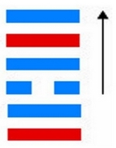

# 履 ䷉ lǚ

- No.10

> 履虎尾，不咥人，亨。
>《彖》曰：履，柔履剛也。說而應乎乾，是以履虎尾，不咥人，亨。剛中正，履帝位而不疚，光明也。
>《象》曰：上天下澤，履，君子以辯上下，定民志。

> 初九，素履，往，无咎。
>《象》曰：素履之往，獨行願也。

> 九二，履道坦坦，幽人貞吉。
>《象》曰：幽人貞吉，中不自亂也。

> 六三，眇能視，跛能履。履虎尾，咥人凶。武人為于大君。
>《象》曰：眇能視，不足以有明也；跛能履，不足以與行也；咥人之凶，位不當也；武人為于大君，志剛也。

> 九四，履虎尾，愬愬，終吉。
>《象》曰：愬愬終吉，志行也。

> 九五，夬履，貞厲。
>《象》曰：夬履貞厲，位正當也。

> 上九，視履，考祥其旋，元吉。
>《象》曰：元吉在上，大有慶也。

阴中见阳，荡入阳中。阴阳二气交互，见本象。火居山上，为旅之义。
> 离为阴，初九为阳；艮为阳，初六为阴。二气交互，上下见本也。火在上，无止象，旅之义。

《易》曰：“旅人先笑后号啕。”又曰：“得其资斧。”仲尼为旅人，固可知矣。
> 旅卦为取象，火在山上，显露无止，五行入卦消息，去此还也。

与艮为飞伏。
> 丙辰土，己卯木。

其居初六元士，九四诸侯见应。建始己酉至甲寅，
> 秋分，立春。

积筭起甲寅至癸丑，周而复始。金入木土离艮。
> 金木土入卦起积筭。

五星从位起荧惑，
> 火星入卦见本象。

壁宿从位降丙辰，
> 二十八宿，壁宿入旅卦初六丙辰土位上起筭。

分气候三十六。
> 分三十六数起卦推筭。

火土同宫，二气合应，阴阳相对，吉凶分乎阴位。上九阳居宗庙，得丧于易。六五为卦之主，不系于一凶，其宜也。内象适变，荡阴入阳，巽顺于物，进退意器。外象明，应内为鼎。次降火从风入鼎。
> 初九之初六，六二之九二，巽为风，离象火，曰鼎。
　　　　　　　　　　　　　　　　　　　　　　
# [Lǚ ䷉](e5b1a5lv.md)
