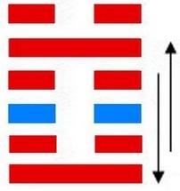

# Zhūn ䷂

* Difficulty at the Beginning

> Chinese: 屯 ䷂ zhūn

<a id="p-62"/>

**Zhūn ䷂** (indicates that in the case which it presupposes) there will be great progress and success, and the advantage will come from being correct and firm. (But) any movement in advance should not be (lightly) undertaken. There will be advantage in appointing feudal princes.

1.<a id="3.1"/> The first `NINE`, undivided, shows the difficulty (its subject has) in advancing. It will be advantageous for him to abide correct and firm; advantageous (also) to be made a feudal ruler.

> **䷂** changing to [**䷇**](e6af94bi.md)

> Matching Line 1 in Adjacent Hexagram: [**䷃**](e89299meng.md#4.1)

2.<a id="3.2"/> The second `SIX`, divided, shows (its subject) distressed and obliged to return; (even) the horses of her chariot (also) seem to be retreating. (But) not by a spoiler (is she assailed), but by one who seeks her to be his wife. The young lady maintains her firm correctness, and declines a union. After ten years she will be united, and have children.

> **䷂** changing to [**䷻**](e88a82jie.md)

> Matching Line 2 in Adjacent Hexagram: [**䷃**](e89299meng.md#4.2)

3.<a id="3.3"/> The third `SIX`, divided, shows one following the deer without (the guidance of) the forester, and only finding himself in the midst of the forest. The superior man, acquainted with the secret risks, thinks it better to give up the chase. If he went forward, he would regret it.

> **䷂** changing to [**䷾**](e697a2e6b58ejiji.md)

> Matching Line 3 in Adjacent Hexagram: [**䷃**](e89299meng.md#4.3)

<a id="p-63"/>

4.<a id="3.4"/> The fourth `SIX`, divided, shows (its subject as a lady), the horses of whose chariot appear in retreat.
She seeks, however, (the help of) him who seeks her to be his wife. Advance will be fortunate; all will turn out advantageously.

> **䷂** changing to [**䷐**](e99a8fsui.md)

> Matching Line 4 in Adjacent Hexagram: [**䷃**](e89299meng.md#4.4)

5.<a id="3.5"/> The fifth `NINE`, undivided, shows the difficulties in the way of (its subject's) dispensing the rich favours that might be expected from him. With firmness and correctness there will be good fortune in small things; (even) with them in great things there will be evil.

> **䷂** changing to [**䷗**](e5a48dfu.md)

> Matching Line 5 in Adjacent Hexagram: [**䷃**](e89299meng.md#4.5)

6.<a id="3.6"/> The topmost `SIX`, divided, shows (its subject) with the horses of his chariot obliged to retreat, and weeping tears of blood in streams.

> **䷂** changing to [**䷩**](e79b8ayi.md)

> Matching Line 6 in Adjacent Hexagram: [**䷃**](e89299meng.md#4.6)

## Notes

The character called **Zhūn ䷂** is pictorial, and was intended to show us how a plant struggles with difficulty out of the earth, rising gradually above the surface.
This difficulty, marking the first stages in the growth of a plant, is used to symbolise the struggles that mark the rise of a state out of a condition of disorder, consequent on a great revolution. The same thing is denoted by the combination of the trigrams that form the figure; -- as will be seen in the notes on it under [Appendix II](appendix02s1.md).

I have introduced within parentheses, in the translation, the words 'in the case which the hexagram presupposes.' It is necessary to introduce them. [king Wén](https://en.wikipedia.org/wiki/King_Wen_of_Zhou) and his son wrote, as they did in every hexagram, with reference to a particular state of affairs which they had in mind. This was the unspoken text which controlled and directed all their writing; and the student must try to get hold of this, if he would make his way with comfort and success through the [Yì Jīng](https://en.wikipedia.org/wiki/I_Ching). [Wén](https://en.wikipedia.org/wiki/King_Wen_of_Zhou) saw the social and political world around him in great disorder, hard to be remedied. But he had faith in himself and the destinies of his House. Let there be prudence and caution, with unswerving adherence to the right; let the government of the different states be entrusted to good and able men: -- then all would be well.

The first line is undivided, showing the strength of its subject. He will be capable of action, and his place in the trigram of mobility ☳ will the more dispose him to it. But above him is the [trigram of peril](e89299meng.md#p-64); and the lowest line of that, to which especially he must look for response and co-operation, is divided and weak. Hence arise the ideas of difficulty in advancing, the necessity of caution, and the advantage of his being clothed with authority.

To the subject of the second line, divided, advance is still more difficult. He is weak in himself; he is pressed by the subject of the strong line below him. But happily that subject, though strong, is correct; and above in the fifth line, in the place of authority, is the strong one, union with whom and the service of whom should be the objects pursued. All these circumstances suggested to the [duke of Zhōu](https://en.wikipedia.org/wiki/Duke_of_Zhou) the idea of a young lady, sought in marriage by a strong wooer, when marriage was unsuitable, rejecting him, and finally, after ten years, marrying a more suitable, the only suitable, match for her.

The third line is divided, not central, and the number of its place is appropriate to the occupancy of a strong line. All these things should affect the symbolism of the line. But the outcome of the whole hexagram being good, the superior man sees the immediate danger and avoids it.

The subject of the fourth line, the first of the upper trigram **☵**, has recourse to the strong suitor of line 1, the first of the lower trigram **☳**; and with his help is able to cope with the difficulties of the position, and go forward.

The subject of the fifth line is in the place of authority, and should show himself a ruler, dispensing benefits on a great scale. But he is in the very centre of the trigram denoting perilousness, and line 2, which responds to 5, is weak. Hence arises the symbolism, and great things should not be attempted.

The sixth line is weak; the third responding to it is also weak it is at the extremity of peril; the game is up. What can remain for its subject in such a case but terror and abject weeping?

# [屯 ䷂](e5b1afzhun_cn.md)
