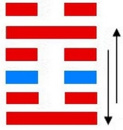
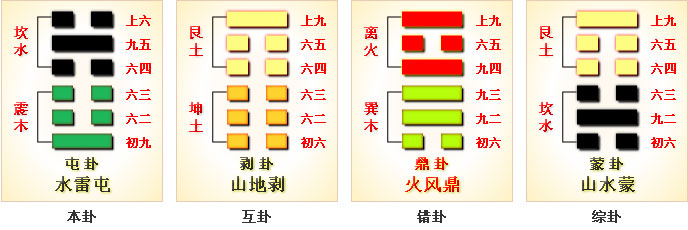

# 屯 ䷂ zhūn

- No.3

> 屯，元亨利貞，勿用有攸往，利建侯。
>《彖》曰：屯，剛柔始交而難生，動乎險中，大亨貞。雷雨之動滿盈，天造草昧，宜建侯而不寧。
>《象》曰：雲雷屯，君子以經綸。

> 初九，磐桓，利居貞，利建侯。
>《象》曰：雖磐桓，志行正也。以貴下賤，大得民也。

> 六二，屯如邅如，乘馬班如，匪寇婚媾。女子貞不字，十年乃字。
>《象》曰：六二之難，乘剛也。十年乃字，反常也。

> 六三，即鹿无虞，惟入于林中。君子幾不如舍，往吝。
>《象》曰：即鹿无虞，以從禽也。君子舍之，往吝窮也。

> 六四，乘馬班如，求婚媾，往吉，无不利。
>《象》曰：求而往，明也。

> 九五，屯其膏，小貞吉，大貞凶。
>《象》曰：屯其膏，施未光也。

> 上六，乘馬班如，泣血漣如。
>《象》曰：泣血漣如，何可長也。

内外刚长，阴阳升降，动而险。凡为物之始，皆出先难后易。今屯则阴阳交争，天地始分，万物萌兆，在于动难。故曰屯。
> 水在雷上，如云雷交作；天地草昧，经纶之始，无出于此也。

故易曰：“屯如邅如，乘马班如。泣血涟如。”
> 屯难之际，盘桓不进之貌。

难定乃通。《易》云：“女子贞不字，十年乃字。”
> 字，爱也。时通则道亨，合正匹也。

土木应象见吉凶，与震为飞伏。
> 庚寅木，戊辰土。

世上见大夫，应至尊。阴阳得位，君臣相应，可以定难于草昧之世。建乙酉至庚寅，
> 秋分立春。

积筭起庚寅至己丑，周而复始。
> 土木配本宫起积筭。

五星从位起岁星，
> 木星入卦。

虚宿从位降庚寅。
> 虚宿入六二庚寅位。

分气候三十六。
> 定吉凶之数。

阳适阴，入中女，子午相敌见吉凶。
> 动入离象见既济。[䷾](e697a2e6b58ejiji_cn.md)

# [Zhūn ䷂](e5b1afzhun.md)
