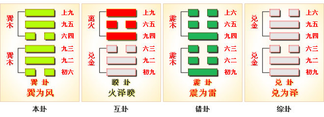

# 巽 ䷸ xùn

- No.57

> 巽，小亨，利有攸往，利見大人。
>《彖》曰：重巽以申命，剛巽乎中正而志行，柔皆順乎剛，是以小亨，利有攸往，利見大人。
>《象》曰：隨風，巽，君子以申命行事。

> 初六，進退，利武人之貞。
>《象》曰：進退，志疑也；利武人之貞，志治也。

> 九二，巽在床下，用史巫紛若，吉，无咎。
>《象》曰：紛若之吉，得中也。

> 九三，頻巽，吝。
>《象》曰：頻巽之吝，志窮也。

> 六四，悔亡，田獲三品。
>《象》曰：田獲三品，有功也。

> 九五，貞吉悔亡，无不利，无初有終，先庚三日，後庚三日，吉。
>《象》曰：九五之吉，位正中也。

> 上九，巽在床下，喪其資斧，貞凶。
>《象》曰：巽在床下，上窮也；喪其資斧，正乎凶也。

阳中积阴而巽顺，
> 本乾象，阴来荡成巽，巽者顺也。

风从穴，入于物，号令齐顺，天地明也。内外禀于一阴，顺于天地道也。声闻于外，远彰柔顺，阴阳升降，柔于刚也。本于坚刚，阴来又柔，东南向明，齐肃阴阳。与震为飞伏。
> 辛卯木，庚戌土。

宗庙居世，三公在应。
> 上九，九三。

建始辛丑至丙午，
> 大寒，芒种。

积筭起丙午至乙巳，周而复始。
> 火木与二十八宿分虚宿，入巽上九辛卯木上。

分气候其数三十六。
> 分三十六数入卦起筭。

阴气起阳，阳顺于阴，阴阳和柔，升降得位，刚柔分也。阴不可盈，晷刻顷也。初六适变，阳来阴退，健道行也。三阳务进，外阴阳也，适变于内外未从也。次降阴交于阳九，为小畜卦。[䷈](e5b08fe7959cxiaoxu_cn.md)
> 初六变初九也。

# [Xùn ䷸](e5b7bdxun.md)
