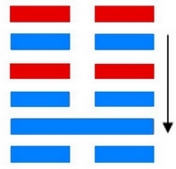
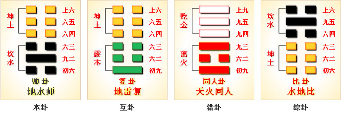

# 师 ䷆ shī

- No.7

> 師，貞，丈人吉，无咎。
>《彖》曰：師眾也，貞正也，能以眾正，可以王矣。剛中而應，行險而順，以此毒天下，而民從之，吉又何咎矣。
>《象》曰：地中有水，師，君子以容民畜眾。

> 初六，師出以律，否臧凶。
>《象》曰：師出以律，失律凶也。

> 九二，在師中，吉，无咎，王三錫命。
>《象》曰：在師中吉，承天寵也；王三錫命，懷萬邦也。

> 六三，師或輿尸，凶。
>《象》曰：師或輿尸，大无功也。

> 六四，師左次，无咎。
>《象》曰：左次无咎，未失常也。

> 六五，田有禽，利執言，无咎。長子帥師，弟子輿尸，貞凶。
>《象》曰：長子帥師，以中行也；弟子輿尸，使不當也。

> 上六，大君有命，開國承家，小人勿用。
>《象》曰：大君有命，以正功也；小人勿用，必亂邦也。

变离入阴阳于正道，复本归坎，阳在其中矣。
> 内卦坎为本宫。

处下卦之中，为阴之主，利于行师。《易》云：“师者，众也。”众阴而宗于一，一阳得其贞正也。与离为飞伏。
> 离入坎也。

阴阳相薄，刚柔迁位。
> 戊午火，己亥水。

世主三公，应为宗庙。建始壬辰至丁酉，
> 清明秋分。

积筭起丁酉至丙申，周而复始。
> 金火入卦起筭。

五星从位起岁星，
> 岁星木入卦。

娄宿从位降戊午，
> 娄宿入坎卦归魂六三爻。

分气候二十八。
> 起筭入卦吉凶。

地下有水复本位，六五居阴处阳位；九二贞正，能为众之主，不溃于众。《易》云：“师贞丈人吉。”入卦始于坎，阴阳相荡，反至于极，则归本，坎中男。
> 阳居九二，称中男。

升降得失，吉凶悔吝，策于六爻。六爻之设，出于蓍。蓍之得象而卦生。积筭起于五行，五行正则吉，极则凶。吉凶之象，显于天地人事、日月岁时。坎之变于艮，艮为少男。少男处卦之末，为极也。
> 震一阳居初爻，坎二阳处中，艮三阳处卦之末。故曰阳极为少男，又云止也。

次入艮卦。

# [Shī ䷆](e5b888shi.md)
