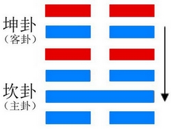
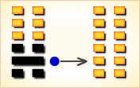

# 师 ䷆



《师》：贞，丈人吉，无咎。

师（shī）卦展示像“师”的形势下各种变化的可能性。

“师”指用兵。师卦的代号是`2:0`，主卦是坎卦，卦象是水，阳数是`2`；客卦是坤卦，卦象是地，阳数是`0`。

建议运用恰当时机，采取主动行动和强硬态度，摆脱自己造成的困境。

图中，红色表示当位的爻，天蓝色表示不当位的爻，箭头表示有应。

师卦，地水师，行险而顺。
这个卦是异卦，下坎上坤相叠。“师”指军队。坎为水、为险；坤为地、为顺，喻寓兵于农。

师卦，阐释由争讼终于演变成战争的用兵原则。军队必须是正义之师，统帅必须中庸、公正，老成持重，不可好战喜功。

战争必须得到人民的支持，才能战无不胜。 这是师卦的主要精神。

- 注解：民众、兵众之意。
- 卦序：7

### 传统解卦
```
《师》：贞，丈人吉，无咎。
上六：大君有命，开国承家，小人勿用。
六五：田有禽，利执言，无咎。
长子帅师，弟子舆尸，贞凶。
六四：师左次，无咎。
六三：师或舆尸，凶。
九二：在师中，吉，无咎；王三锡命。
初六：师出以律，否臧凶。
```

这个卦是异卦（下坎上坤）相叠。“师”指军队。坎为水、为险；坤为地、为顺，喻寓兵于农。兵凶战危，用兵乃圣人不得已而为之，但它可以顺利无阻碍地解决矛盾，因为顺乎形势，师出有名，故能化凶为吉。

### 起卦

师是`2:0`卦的卦名。不要以为师卦是专讲军事的，《易》是哲学，反映事物的普遍性，《易》的卦具有普遍性。由于卦是绝对抽象的，有了卦名，卦名给出一个比较形象的表述，便于理解卦所代表的情况。师卦不是专用于敌我关系，也可以用于朋友关系、夫妻关系、商务关系等等各种各样的双方关系。

`2:0`是师卦的代号，表示师卦由二个经卦组成，一个经卦是`2`卦坎卦，另一个经卦是`0`卦坤卦。八卦的卦叫经卦，像是六十四卦的经纬。师卦中，坎卦在下，坤卦在上，坎卦和坤卦的阳数之比是`2:0`。

师卦的主卦的卦象是水，客卦的卦象是地，按说，水可以在地上自由流动，然而，事实并非如此，水往低处流，水本身的问题阻碍了它自己在地上扩张。地是温和而顺从的，然而，水本身的困难阻碍了水在地上完全畅行无阻。孙子说：“凡兵有走者、有驰者、有陷者、有崩者、有乱者、有北者。凡此六者，非天地之灾，将之过也”，“将弱不严，教道不明，吏卒无常，陈兵纵横，曰乱。”师卦卦爻辞所描述的师，实际上是一种“乱”兵，师卦以此形象比喻建议主方如何摆脱自己造成的困境。

起卦前必须客观地、全面地、准确地分析主方和客方的情况，必须至少符合下列条件之一，此卦才有参考价值：
1. 主方与水很相似，客方与地很相似。
2. 主方的阳数是`2`，客方的阳数是`0`。
3. 主方的行动是阴，素质是阳，态度是阴；客方的行动、素质和态度是阴、阴和阴。

### 结构和卦爻辞

阴阳趋于和谐是变化的基本规律，根据这个规律，分析卦的结构有两个基本原则：当位和有应。师卦下部的三条爻是主卦，代表主方；上部的三条爻是客卦，代表客方。黑色的爻表示当位的爻，就是说，爻的阴阳属性的位置恰当，对主方有利；灰色的爻是不当位的爻，就是说，爻的阴阳属性的位置不恰当，对主方不利。图中显示，主卦的三条爻全部不当位，这说明主方当前的困难完全是主方自己造成的。客卦中只有中爻不当位，并且从这条爻有一个箭头指向主卦的中爻。这两条爻代表客方和主方的素质，箭头表示有应，表示这两条爻和谐，客方的素质不佳从主方的良好素质得到补益。仅仅从客方在素质方面得益，主方损失利益来看，例如，客方得到主方的资助，这对主方不利，但是换一个角度考虑，主方可以依靠自己的良好素质得到客方的信任和支持，实际上对主方是有利的。因此，需要考虑改变的是主方的下爻和上爻，就是说需要改变主方的行动和态度，而不需要改变主卦的中爻。

不过这两个方面可以改变的程度是有限的。主方的行动消极被动，这是主方长期衰落的结果，在成长和衰落的过程中，主方已经经历了从成长到衰落的质变，越高了量变到质变的关键点，要完全扭转被动状态很难，所以卦辞说“贞”，保持状态。不过往往阴中有阳，主方应当在恰当时机采取主动措施，利用客方的消极被动维护和增加自己的利益。

主卦上爻是阴爻，表示主方态度随和。第三爻是对第二爻的补充，这随和态度表示主方的素质虽然良好但不是很好，主方的实力不是非常强，不得不表现得随和。在这方面，也是阴中有阳，主方应当恰当地采取强硬态度，维护自己的利益。

主方需要有在恰当时机采取主动行动和强硬态度的智慧，所以卦辞说“丈人吉”。

图的右边是师卦的爻辞，与爻一一对应，按由下到上的顺序排列。如果删去判断词，就是一首以“乱”师为主题，向主方提出建议的散文诗，下面是其译文。

```
出师前严明纪律，否则包藏凶险。
（将弱不严，教道不明）
部队在驻扎中吉利，国王再三授予使命（吏卒无常）。
出师后时或用大车运送尸体。
部队又败退。田野有野禽，应当明确说清各自的任务；
长子帅领部队，兄弟用大车运尸（陈兵纵横）。
大君指示说，“开国承家，不能用不称职的人.”（将弱）
```

下面逐条说明卦爻辞。

### 卦辞
```
〖原文〗贞，丈人吉，无咎。
〖译文〗坚持下去，老人是吉利的，无所怪罪。

〖解说〗这是师卦的卦辞。
卦辞概略地对当前的情况作总体说明，
给绝对抽象的别卦描画一个轮廓。
“贞”（zhēn），坚定，有节操；忠贞，坚贞不屈。
“丈人”，平常指岳父，这里指岁数大的人，有经验的成熟的人。
“咎”（jiù），罪怪，处分：既往不咎。
“凶”（xiōng），不吉利的，不幸的，有危险的：凶兆。
卦辞的意思是：当前主方素质明显优于客方，
这种良好的形势应当坚持下去，
如果有具备成熟经验的老人作指导，是吉利的，无所怪罪。
卦辞中的吉利是有条件的，隐含一个警告：
如果指导者不成熟，缺乏经验，就不一定吉利。
```

### 初六
```
〖原文〗师出以律，否臧凶。
〖译文〗出师一开始就强调纪律，否则就隐藏凶险。

〖解说〗这是师卦第一爻的爻辞。
这是一条阴爻，表示主方的行动是阴。
主方消极被动可能出现纪律松弛，主方必须振作起来，
对自己有严格要求，否则隐伏导致失败的危险。

〖结构分析〗第一爻的位置是阳位，
这条爻是阴爻，阴爻在阳位，不当位。
并且，这条爻与四阴不有应。
不当位表明主方消极被动，有可能不利于保护主方的利益，
是潜在的对主方不利的因素；
不有应表明客方也是消极被动，
客方不想损害主方的利益，
这潜在因素没有成为真正的对主方不利的因素。
但是，这潜在因素是存在的，
主方应当采取恰当主动措施以防止不利情况发生，所以爻辞说“否臧凶”。
```

### 九二
```
〖原文〗在师中，吉，无咎；王三锡命。
〖译文〗部队在驻扎中吉利，无所怪罪；国王三次下达命令。

〖解说〗这是师卦第二爻的爻辞，
这条爻是阳爻，表示主方的素质良好，
比如说，主方有资金、有地位、有权力、有实力、有技术，等等。
这种良好素质是主方的现状，是主方固有的，
所以爻辞说，“在师中，吉，无咎”。
由于主方消极被动，不能让这种良好素质发挥作用，
于是国王再三赋予主方（部队）战胜客方的使命。

〖结构分析〗第二爻的位置是阴位，
这条爻是阳爻，阳爻在阴位，不当位，又与五阴有应。
不当位表明主方的良好素质有可能在相互交往中遭受损失，
是潜在的对主方不利的因素；
有应表明客方素质不佳，正好需要从主方获得补益，
这潜在因素成了真正的对主方不利的因素。
换个角度看，主方给于客方一定的利益，可以取得客方信任，
得到客方支持，这对主方很有利，真正有利的情况是现实，
不用打仗就是如此，所以爻辞说“在师中，吉，无咎”。
```

### 六三
```
〖原文〗师或舆尸，凶。
〖译文〗战争中有时用大车载运尸体，凶险。

〖解说〗这是师卦第三爻的爻辞，
阴爻，表示主方的态度随和。
由于态度随和，当遇到客方态度强硬的时候，
主方可能受到客方压抑，从而使主方的利益受到损失，
在战斗中可能造成本来可以避免的人员伤亡，
有时侯，要用大车载运尸体，“师或舆尸”。
这种不利情况对主方是凶险的，爻辞中有个判断词“凶”。

〖结构分析〗第三爻的位置是阳位，
这条爻是阴爻，阴爻在阳位，
不当位，与六阴不有应。
不当位表明主方态度随和，
有可能受到客方压抑，是潜在的对主方不利的因素；
不有应表明客方的态度也随和，并没有压抑主方，
这潜在因素没有成为真正的对主方不利的因素，
所以爻辞说“或”和“凶”。
```

### 六四
```
〖原文〗师左次，无咎。
〖译文〗战争中部队后撤，无所怪罪。

〖解说〗这是师卦第四爻的爻辞。
第四爻是客卦的下爻，代表客方的行动，阴爻表示客方行动被动。
“师左次”是部队后撤的意思，虽然客方的被动提供了主方挺进的机会，
但是，鉴于主方的实际情况，
不仅不向前推进，反而后撤，这无所怪罪，“无咎”。

〖结构分析〗第四爻的位置是阴位，
这条爻是阴爻，阴爻在阴位，当位，然而与一阴不有应。
当位表明客方的消极被动是主方发展的好机会，
是潜在的对主方有利的因素；
不有应表明主方也是消极被动，不能利用这样的好机会，
这潜在因素没有成为真正的对主方有利的因素，
所以爻辞没有说“吉”，而是仅仅说“无咎”。
```

### 六五
```
〖原文〗田有禽，利执言，无咎。长子帅师，弟子舆尸，贞凶。
〖译文〗田野有野禽，利于坦率地发表意见，无所怪罪。
长子指挥部队，弟子运输尸体，坚持下去有凶险。

〖解说〗这是师卦第五爻的爻辞。
第五爻表示客方的素质，阴爻，表示客方素质不佳，
比如说，资金缺乏、地位底下、实力薄弱、教育程度低，等等。
客方的力量微弱，提供了主方取胜的机会，
如同在田野里有野禽，是捕猎的好机会。
这时应当严肃纪律，协调行动，以避免不必要的损失。
“执”（zhí）指坚持意见，如，固执己见，执迷不悟，固执，争执等等。
“田有禽，利执言，无咎”，
面对当前的大好形势，应当坦率地发表意见，如此，则无所怪罪。
“贞”（zhēn）是“坚持”的意思。
“长子帅师，弟子舆尸”形象地说明互不通气、各行其是的不协调状态，
如果坚持这种不协调的状态，前景是危险的，“贞凶”。

〖结构分析〗第五爻的位置是阳位，
这条爻是阴爻，阴爻在阳位，不当位，不过与二阳有应。
不当位表明客方的素质不佳，
有可能谋求从主方得到补益，是潜在的对主方不利的因素；
有应表明主方素质良好，正好可以满足客方的需要，
这潜在因素成了真正的对主方不利的因素。
由于主客双方的素质对比情况是现实存在的，
不能怪罪主方，所以爻辞说“无咎”。
主方消极被动，态度随和，不能保护自己的利益，
如果继续下去，主方可能遭受较大损失，所以爻辞说“贞凶”。
```

### 上六
```
〖原文〗大君有命，开国承家，小人勿用。
〖译文〗国家领袖颁布诏命，建立邦国，
继承封邑，不要重用无德无才之人。

〖解说〗这是师卦第六爻的爻辞。
第六爻是客卦的上爻，代表客方的态度，
态度阴，表示客方态度随和。
“大君有命”指国家领袖发布命令。“开国承家”指重要的事务。
“小人”指能力低下的人。爻辞的意思是领袖发布命令，
在开国承家这样的重要事务中，不要任用不称职的人。
“大君有命”强调指示的重要性，
在实际生活中，不一定非得由领袖发布命令。
“开国承家”指重要事务，不一定限于“开国”，
也不一定限于“承家”，更不限于“军事”。
在重要事务中，不要任用不称职的人，这是一条普遍性原则。
如果不称职的人已经承担了重要事务，怎么办？
应当在实践中努力学习、锻炼、提高自己的水平，
尽快成为称职的人，否则会造成损失。

〖结构分析〗第六爻的位置是阴位，
这条爻是阴爻，阴爻在阴位，当位，然而与三阴不有应。
当位表明客方的态度随和，有可能接受主方的制约，
按主方的意图办事，是潜在的对主方有利的因素；
不有应表明主方的态度也随和，
主方不能利用这样的好机会制约客方，
这潜在因素没有成为真正的对主方有利的因素。
因此，爻辞中没有判断词，
既没有说对主方有利，也没有说对主方不利。
```

## 释义
### 卦名
```
地水师。坤为地，坎为水，地中有水。
地中众者，莫过于水。师为众，部属兵士众多的意思。
持正的“仁义之师”，才可攻伐天下使百姓服从；用兵胜负在于择将选师，
持重老成的人统兵可获吉祥，这样才没有灾祸。

【注解】
师：卦名，民众、兵众之意。

【释义】
此卦的卦名为师。前面的讼卦是讲人们的争讼，
不服从裁决，便会引起械斗与战争。所以讼卦之后便是师卦。
师是兵众的意思，它是古代军队的一级编制，名称沿用到今。
按《周官·大司马》中记载，藏兵于农，
每户出一人，五人为一伍，五伍为一两，四两为一卒，
五卒为一旅，五旅为一师，五师为一军。
按这种推算一师就是两千五百人。而师的引申义也就代表战争了。
战争必然会使人产生忧患，所以师卦也有忧患的含义。
这就是《杂卦传》中所说的“比乐师忧”。
```

### 卦画

师卦的卦画一个阳爻五个阴爻。阳爻代表统帅，阴爻代表兵众。下面我们便通过卦象来对卦画进行分析。

### 卦象

师卦上卦为坤为地为众，下卦为坎为水为险，地中有水、引众凶险，就是师卦的卦像。地中有水，则是比喻兵来源于民众中，平时务农，战时成兵。引众凶险则表示战争会带来大量的人口伤亡，表明了战争的残酷。

下卦为水，为坎，为险；上卦为坤，为阴，阴气浊而下沉。喻寓兵凶战危，用兵乃不得已而为之，因为顺乎形势，故名为师。

```
【原文】
（坎下坤上）师①：贞，丈人②吉，无咎。
初六：师出以律③，否臧④，凶。
九二：在师中，吉，无咎。王三锡命⑤。
六三：师或舆尸⑥，凶。
六四；师左次⑦，无咎。
六五：田有禽⑧，利执言⑨，无咎。长子⑩帅师，弟子⑪舆尸，贞凶。
上六：大君⑫有命，开国承家⑬。小人勿用。

【注释】
① 师是本卦标题。
② 丈人：这里的意思是军队的总指挥。
③ 律：军纪，纪律。
④ 否（pǐ）臧 （zāng）：不好。这里指不守军纪。
⑤ 王：君王。锡命：赐命，意思是下 令嘉奖。
⑥ 舆（yú）尸：用车运送尸体。
⑦ 左次：驻扎在左边。
⑧ 田：田猎，打猎。禽：鸟兽。
⑨ 执言：意思是抓获俘虏。
⑩长子：指挥作战的长官。
⑪ 弟子：指挥运送尸体的副官。
⑫ 大君：国君。
⑬ 开国。分封诸侯。承家：分封大夫。

【译文】
师卦：占问总指挥的处境，吉利，没有危险。
初六：行军征战要守军纪，不守军纪，必打败仗。
九二：主帅身在军中，吉利，没有灾祸，君王三次下令嘉奖。
六三：军中有人用车运送尸体，战败。
六四：军队驻扎在左边，没有危险。
六五：打猎获取猎物，打仗抓获俘虏，没有灾祸。
长官率领军队作战，副官指挥运送伤亡者，贞兆凶险。
上六：国君下令赏功，分封诸侯大夫。不能重用无才德的小人。

【读解】
战争被古人看作最重要的事情之一。
攻城掠地，发财致富，讨伐异己，争权夺利，都要诉诸武力。
成者为王，败者为寇，似乎成了天经地义的真理。
古人几乎把战争当做一种仪式来对待，当做一门艺术来研究，
从神灵的意向、天时地利，
一直研究到习武组织、制胜谋略、论功行赏等等规则。
中国古代兵书的发达，世所罕见，在技术和艺术层面上都堪称一流。
由此反思，古人称战争为“王者之事”，
早已把它升华成了治 国平天下的头等大事。
相形之下，西方人后来称战争是政治的继续，就逊色多了。
欲王天下者，精通战争艺术应是第一课。
```

### 新解
```
【原文】
（坎下坤上）师①：贞丈人②，吉，无咎。
初六：师出以律③，否臧④，凶。
九二：在师中，吉，无咎。王三锡命⑤。
六三：师或舆尸⑥，凶。
六四；师左次⑦，无咎。
六五：田有禽⑧，利执言⑨，无咎。
长子⑩婚帅师，弟子⑪四舆尸，贞凶。
上六：大君⑫有命，开国承家⑬。小人勿用。

【注释】
① 师是本卦标题。师在这里的意思是指军队。
本卦既因“师”字多次出现，
又因内容主要与军队出征作战有关，所以用师作标题。
② 丈人：这里的意思是军队的总指挥。
③ 律：军纪，纪律。
④ 否（pǐ）臧 （zāng）：不好。这里指不守军纪。
⑤ 王：君王。锡命：赐命，意思是下 令嘉奖。
⑥ 舆尸：用车运送尸体。
⑦ 左次：驻扎在左边。
⑧ 田： 田猎，打猎。禽：鸟兽。
⑨ 执言：意思是抓获俘虏。
⑩ 长子：指挥 作战的长官。
⑪ 弟子：指挥运送尸体的副官。
⑫ 大君：国君。
⑬ 开国。分封诸侯。承家：分封大夫。

【译文】
师卦：占问总指挥的处境，吉利，没有危险。
初六：行军征战要守军纪，不守军纪，必打败仗。
九二：主帅身在军中，吉利，没有灾祸，君王三次下令嘉奖。
六三：军中有人用车运送尸体，战败。
六四：军队驻扎在左边，没有危险。
六五：打猎获取猎物，打仗抓获俘虏，没有灾祸。
长官率领军队作战，副官指挥运送伤亡者，贞兆凶险。
上六：国君下令赏功，分封诸侯大夫。不能重用无才德的小人。

【读解】
战争的结果总有胜负，因此事前严肃认真地对待，
请教神灵，祈求神灵保佑，寻找正当的理由，然后大张旗鼓地兴师讨伐。
古人几乎把战争当作一种仪式来对待，当作一门艺术来研究。
```

### 卦辞解释
```
这一卦，祇有“九二”是阳爻，在下卦的中央，被上下五个阴爻围护；
所以，“九二”是统帅，五个阴爻是士兵。
“九二”刚强，在下层，握有实权；“六五”柔和，高高在上；
象征君王任命统帅，以扩张军势。所以，这一卦命名为“师”。

师：贞，丈人吉，无咎。
贞：贞洁。丈人：德高望重的人。咎：过错。
解释：今天就算你出兵打仗，你原来既有贞洁都不能忘记。
本来他带兵打仗，不应该产生争端的。
但是因为“丈人”德高望重的人是受委托的人，
所以，（无咎）基本上他是没有任何过错的。
《彖》曰：师，众也。贞，正也。能以众正，可以王矣。
刚中而应，行险而顺，以此毒天下，而民从之，吉又何咎矣？
众：大众。师就是大众。正：正义。王：王定天下。
解释：师就是大众。能以正义让所有的大众来信服，这样才可以平定天下。
师卦的卦画组合是下面一个三爻的坎卦，
上面一个三爻的坤卦，坤为地，坎为水，所以传统称作坎下坤上，地水师。
《序卦》云：“讼必有众起，故受之以师。师者，囚也。”
意为“争讼必定会有众人起来相斗”，故在讼卦之后接着是师卦。
师是众的意思。《杂卦》说：“比乐师忧。”

师是古代军队的一级编制，名称一直沿用。
按《周官·大司马》记载，古代军队的编制是藏兵于农，
每户出一人，五人为一伍，由下士任伍长；
五伍为一两（二十五人），由中士任两司马；
四两为一卒（一百人），由上士任卒长；
五卒为一旅（五百人），由下大夫任旅帅；
五旅为一师（二千五百人），由中大夫任师帅；
五师为一军（一万二千五百人），由卿任军帅。
师有二千五百人，故有囚多的意思。
师是军队的编制，故有军队的意思。
军队用以作战，故师有战争的意思。
战争给人们带来的是灾难，故有忧苦的意思。

但是历来却忽视了几个问题，一是在六十四卦中，
除了忽视与曲解了言谈王师大举侵伐的《丰》卦这一卦外，
也忽视与曲解了言谈师旅的《旅》卦。
由于人们忽视了这一问题，
自然也就忽视了《师》卦乃是站在君王立场上专二是忽视了，
或者说是除了《序卦传》的作者之外，
还没有弄明白《师》卦乃是由于上一卦《讼》卦的国与国之间的争讼而带来的，
此一卦的兵革和为此而进行的立师之举，
自然也无法弄明白《周易》自《乾》《坤》两卦之后的由始生的《屯》卦，
一直发展演变到《师》卦的立师与师旅角逐。
这是《周易》卦与卦之间的关系所在，也是《周易》的核心内容所在。
“丈人”指老成持重的人物。军队的运用原则，必须“贞”，以坚持正义为条件。
亦即，必须听从天命，符合众望，讨伐邪恶，伸张正义。
所以，必须以正义、中庸、老成持重的人物统帅，才会吉祥，没有过失与灾祸。
“孙子兵法”说：“武力是凶恶的工具，战争为不得已的手段，
关系着人民的生命，国家的存亡；”。
如果以小人为统帅，一味贪功好战，纵然战胜，也将带来灾祸。
```

### 爻辞解释
```
初六：师出以律，否臧凶。
《象》曰：师出以律，失律凶也。
九二：在师中，吉无咎，王三锡命。
《象》曰：在师中吉，承天宠也。王三锡命，怀万邦也。
六三：师或舆尸，凶。
《象》曰：师或舆尸，大无功也。
六四：师左次，无咎。
《象》曰：左次无咎，未失常也。
六五：田有禽，利执言，无咎。长子帅师，弟子舆尸，贞凶。
《象》曰：长子帅师，以中行也。弟子舆师，使不当也。
上六：大君有命，开国承家，小人勿用。
《象》曰：大君有命，以正功也。小人勿用，必乱邦也。

坎下师？①：贞，丈人②吉，无咎。
初六，师出以律③，否臧④凶。
九二，在师⑤，中吉，无咎。王三锡命⑥。
六三，师或舆尸⑦，凶。
六四，师左次⑧，无咎。
六五，田有禽⑨，利执言⑩，无咎。长子⑪帅师，弟子⑫舆尸，贞凶。
上六，大君有命⑬，开国承家⑭。小人⑮勿用。

【注释】
① 师：六十四卦卦名之一。乃论述立师和用将之卦。
② 丈人：与“君子”、“大人”、“王”、“侯”为同义语，指一国之长。
③ 律：军纪。
④ 否（pǐ 痞）臧（zāng 脏）：朱熹注为“不善”。此处看来指军纪混乱。
⑤ 在师：“在”，指存在。“在师”，指保存师旅。
⑥ 王三锡命：“锡”，古通赐。“王三锡命”，指君王再三命令筹建军队、选择将帅。
⑦ 师或舆尸：指师旅或从战场上不断往下运送尸体。
⑧ 左次：古有“右犹高、左犹下”之说，此“左次”当指师旅出师不利或败退之事。
⑨ 田有禽：是一种政治术语，指敌对一方。亦即朱熹注的“兵端也”。
⑩ 利执言：利于兴师问罪之义。
⑪ 长子：指明智的将帅。
⑫ 弟子：指无能的庸才。
⑬ 大君有命：“大君”，指国君。“命”有使命的成份，也有天命的含义。
⑭ 开国承家：指开辟国家。
⑮ 小人：指昏庸无能和阿谀逢迎之辈。

【详细解释】
初六：师出以律，否臧凶。
“律”指军律。“否”是恶，“臧”是善，“否臧”即善恶得失。
“初六”是师卦的第一爻，象征军队出发作战的阶段。战争以开始的阶段最重要，
必须以严格的军律统制；否则，不论胜败都是凶，告诫开始应特别慎重。
这一爻，强调严格军律的重要性。

九二：在师中，吉无咎，王三锡命。
“九二”是这一卦中唯一的阳爻，位于下方，得到许多阴爻的信赖。
又在下卦的中位，象征刚毅、中庸，
军队有巩固的领导中心，这样当然吉祥，不会有过失灾祸。
“九二”又与至尊的“六五”，阴阳相应，得到君王的宠信，三度赐给褒扬的荣誉。
“象传”说：这是依赖统帅的力量，以安抚使万国信服。
“三命”，依『周礼』是指“一命受职，再命受服，三命受位。”
这一爻，强调统帅刚毅中庸的重要性。

六三：师或舆尸，凶。
“六三”阴爻阳位不正，象征缺乏统御才能，却又刚愎自用。
位置不中，象征统帅行动乖张，轻举妄动，必然失败。
这样，也许将军的尸体，要用车载回来了，当然凶。
“象传”说：这是由于好大喜功，结果适得其反。
这一爻，说明统帅不中不正的严重后果。

六四：师左次，无咎。
《象》曰：左次无咎，未失常也。
“左次”是到左方的意思。
兵法的原则，布阵要使低地在左前方，才能攻击便利，而且有速度；
高地要在右后方，可以当作防御的据点。
“左次”就是到达高地的左方，使高地右后方布阵。
“六四”阴柔，又不在中位，本来无战胜的可能。
可是，阴爻阴位得正，又在下卦“坎”的险阻的前方，
象征知道量力，于安全地带布阵，
据守高地，而不轻举妄动；所以说无咎。
“象传”说：这是由于不违背常规。
这一爻，强调统军应以安全为首要，不可违背常规。

六五：田有禽，利执言，无咎。长子帅师，弟子舆尸，贞凶。
《象》曰：长子帅师，以中行也。弟子舆师，使不当也。
“田”是狩猎，“禽”是猎获物。
“执言”是发表意见，责难对方的过错，加以声讨的意思。
“六五”是这一卦的主体，阴爻，
在上卦中央至尊的位置，柔顺、中庸，不会主动发动战争，
祇有在不得已时应战；因而必胜，
所以，用打猎猎获的野兽，象征胜利卤获的战利品。
这种军队，有利于仗义执言，不会有灾祸。
“长子”比拟大人物，指“九二”。
“弟子”是次子以下，比拟小人物，指“六三”“六四”。
战争，祇可交由一位统帅，全权指挥作战，既然任命有才能的统帅，
却又让一些小人参与，必然失败。
因而，用长子统帅军队，弟子们的尸体，却用车装载回来了，当作比喻。
在这种指挥不能统一的状况下，即或动机纯正，结果也是凶。
“象传”说：以长子统帅军队，可以战胜，因为行动能够把握中庸的原则。
但如果再让弟子们参与，就成为任用不当，必然失败，要装载尸体回来了。
这一爻，调强统帅权统一的重要性。

上六：大君有命，开国承家，小人勿用。
《象》曰：大君有命，以正功也。小人勿用，必乱邦也。
“上六”是“师”亦即军队的终极点。
战争结束，君王论功行赏，颁布命令，
有人封为侯，赐以土地，开创战时出千辆战车的“千乘”大国；
有人被任命为卿、士、大夫，赐以土地，世袭战时百辆战车的“百乘”的家。
但小人则不可以使其成为拥有国家或获得政治权力。
上卦“坤”是土，所以象征分封土地“开国承”。
“象传”说：君王颁布命令，是为了公正的论劲行赏。
小人不可以重用，是因为必定会使国家陷于混乱。
这一爻，强调小人不可使其形成政治势力。
```

### 全文内容
```
此卦由水下地上组成。
卦辞的“师：贞，丈人吉，无咎”，是说对于师旅来说，
虽然有如《彖传》所说的“以此毒天下”并且“行险”之举，
但师旅却“能以此众正”则“可以王矣”，
故对于国君的“丈人”来说，它是贞正的，也是吉祥的，自然也没有灾祸。

“初六”爻辞的“师出以律，否臧凶”，
是说立师必须要有一个严明的纪律约束，不然则是一群乌合之众；
若果一个师旅的纪律松弛，有令不行，有禁不止，则有败军之祸。

“九二”爻的“在师，中吉，无咎。王三锡命”，
前一句是说，一个师旅的存在，对于一个国家政权来说，
是至关重要的，是吉祥的，它只能是一件好事，它绝不会带来灾祸。
后一句是说，正因为如此，
一个国家的君王则应当再三下令组建军队和选拔将帅。

“六三”爻的“师或舆尸，凶”，
是说若果发现师旅经常往回搬运尸体，那将意味着凶险。

“六四”爻辞的“师左次，无咎”，是说胜败乃兵家常事，
若果不是兴师无名，不是不义之师，
或者有如孙子说的若果不是因“主不可以怒而兴师，
将不可以愠而致战”而造成的溃败的话，
就一般战役而论，师旅暂时败退与失利，
暂时处于“左次”，它还不会有什么灾祸。

“六五”爻辞的“田有禽，利执言，无咎。长子帅师，弟子舆尸，贞凶”，
是说遇敌国扰掠，有如田有禽之象，这时应该发兵讨伐，
这时不仅出师有名，而且也不会遭到什么灾祸。
紧接着说在行师讨伐之时，千万要选择好将帅：
因为一个昏庸之辈却可以丧军亡国，凶险异常。

“上六”爻辞的“大君有命，开国承家。小人勿用”，
前一句是说，一个国君承受着一定使命或天命，当极力去开辟国家。
后一句是说，在此之时，
对于一批昏馈无能或阿谀逢迎之辈的小人，却千万不能启用。
```

### 白话解析
```
师①：贞，大人吉，无咎。
【白话】筮得师卦，贞问，大人吉善，没有灾难。
【注释】① 师：卦名，军队。
【讲解】师卦一阳刚之爻，五阴柔之爻。
一阳刚之爻在下居中，为五阴柔之爻所拥戴，
为众阴爻的主爻，有将帅统兵之象。
《序卦传》说：“讼必有众起，故受之以师。师者，众也。”
《彖传》说：“师，众也。贞，正也。能以众正，可以王矣。”
《象传》说：“地中有水，师。君子以容民畜众。”

初六：师出以律①，不臧②，凶。
【白话】筮得师卦，占得初六爻，
出兵作战必须纪律严明，如果军纪松弛，就凶险。
【注释】
① 律：纪律。
② 臧：善，好。不臧，不好。
【讲解】初六阴柔之爻居阳刚之位，为师卦的开始，
动众兴师的法则是以统一号令为首要，所以于首爻阐发此义。

九二：在师中，吉，无咎，王三汤①命。
【白话】筮得师卦，占得九二爻，
在军队中，吉善美好，没有灾难，君王三次下达命令。
【注释】① 汤：假借为“赐”，引申为下达。
【讲解】九二爻以阳刚居于下体的中位，象征部队的主帅，
六五阴柔与之相应，为了树立统帅的威信，
所以君王下达了三道命令到军中。

六三：师或舆属①，凶。
【白话】筮得师卦，占得六三爻，
军队中有载着尸体的战车，危险，打不了胜仗。
【注释】① 舆：读为“舆”，车子。属：假借为“尸”，尸体。
【讲解】六三爻阴柔无才无能，又没有中正的道德，
兴师必然失败，所以爻辞断以陈师而出，载尸而归。

六四：师左次①，无咎。
【白话】筮得师卦，占得六四爻，部队在左边扎营，没有灾难。
【注释】① 次：舍，驻扎。
【讲解】六四阴柔之爻居于阴柔之位，在师卦有不用的意思。
故军队在左方长期驻扎不参与作战则没有灾难。

六五：田有禽①，利执言②，无咎，长子率师，弟子舆属③，贞凶。
【白话】筮得师卦，占得六五爻，
打猎射落了飞禽，利于拿起来，没有灾难，
大儿子率领部队出兵打仗，小儿子运载尸体，贞问凶险。
【注释】
① 田：通畋，打猎。禽：飞鸟。
② 言：“之”字的讹写。
③ 舆属：参阅六三爻注释。
【讲解】六五爻阴柔之体处于尊位，所以指挥儿子出征。
九二爻阳刚为长子，有刚中的才能与品德，而且名正言顺，所以可用。
六三阴柔为弟子，无才能无品德，而且没有名分，所以不可以委以重任。

尚六：大人君有命，启国承家①，小人勿用。
【白话】筮得师卦，占得尚六爻，
大人和君王都有命令，建国立家都不能使用小人。
【注释】① 启国：开国。承家：继承家业，立家。
【讲解】尚六爻阴柔之爻居于阴柔之位，处于师卦的终点，为功成行赏的时候。
《象传》说：“大君有命，以正功也。小人勿用，必乱邦也。”
王弼说：“处师之极，师之终也。大君之命，不失功也。
开国承家，以宁邦也。小人勿用，非其道也。”
```

### 《彖》曰
```
师，众也；贞，正也。
能以众正，可以王矣。
刚中而应，行险而顺，
以此毒天下，而民从之，吉又何咎矣！

【白话】《彖传》说：师、众多，指军队。贞、表示坚守正道。
能够以正道率领众多的军队并富有德高望重的长者可以成为君王！
统帅军队应战能攻克艰险一帆风顺，
凭这些就能统治天下让百姓服从，肯定吉祥，谈不上有什么灾祸！
```

### 《象》曰
```
地中有水，师；
君子以容民畜众。
师出以律，失律凶也。
在师中吉，承天宠也。
王三锡命，怀万邦也。
师或舆尸，大无功也。
左次无咎，未失常也。
长子帅师，以中行也。
弟子舆尸，使不当也。
大君有命，以正功也。
小人勿用，必乱邦也。

【孙子兵法，形第四篇中说：
不可胜者，守也；可胜者，攻也。
守则不足，攻则有余。善守者，藏于九地之下；
善攻者，动于九天之上，故能自保而全胜也。】
善守者，藏于九地之下。和地中有水，师，相呼应。

【孙子兵法，势第五篇中说：
孙子曰：凡治众如治寡，分数是也；斗众如斗寡，形名是也；
三军之众，可使毕受敌而无败者，奇正是也；凡战者，以正合，以奇胜。】
```

### 文学引用

在《三国演义》第七十六回，徐公明大战沔（miǎn）水，关云长败走麦城中吕范卜了一卦为“地水师卦”，地水师卦，更有玄武临应，主敌人远奔。后来吕蒙安排伏兵与逃跑的路上，关公果然在逃跑的时候被擒。

### 《哲学易经》之《师卦》
```
师：贞，丈人吉，无咎。
《彖》曰：师，众也。贞，正也。能以众正，可以王矣。
刚中而应，行险而顺，以此毒天下而民从之，吉又何咎矣。
《象》曰：地中有水，师。君子以容民畜众。

争讼不成必然会聚合以众合力而战，故受之《师》。
师，众也。也就是众人集合的团体。
众人集合一团就能化弱为强，就能维护正义，
就能战胜一切邪恶的势力，就能捍卫自己不受侵害。
因此，要想维护利益和将来的利益，
人们就不得不站立到共同的立场上来，
就得建立一个以共同利益为中心的，
不以他人意志为转移的捍卫之师、正义之师。
因为只有这样的军队的形成才能为社会发展保驾护航，
才能捍卫自己的领土不受侵犯，
才能以人民的利益高于一切的姿态凝聚人心全面发展。
故《师》卦说：“众人合力一团才能守贞其利，仰仗于人，吉又何咎。”
试想，如果没有强大的军队作后盾，
怎能抵御外部敌对势力的强力掠夺，又何以存身利已，更无尊严可言了。

《彖》辞说：师就是众合之体，贞就是守正之道。
能够把众人凝聚起来而又能行守正之道则可王天下矣。
因为只有把人们团结起来武装起来，
才能形成一个刚强有力的整体而能应变一切，
只有把人们组织起来行动起来才能形成一个强大的势力而冲破险难，
使社会趋向和平、安定、繁荣。
因此能以此治天下民必从之，是以吉又何咎。

《象》辞说：地中有水，润下就湿，
汇合于流，其势浩荡，这是《师》之象。
是以君子观之，思天下柔弱莫过于水，
汇合于流则江水滔滔而奔腾于四海其势无可阻矣，
从而当效法于水畜养民众、容和民心、凝聚民力。

初六：师出以律。否藏，凶。
《象》曰：师出以律，失律凶也。

《孟子》说：“不以规矩不能成方圆，不以六律不能正五音。”
众人聚合在一起如果没有一个制度律其纪就难以齐人心，
人心不齐心志各异是以否藏而有凶之见矣。
因此“师出以律”首先就得制法度明号令建立一个以共同利益为基础的，
不以个人意志为转移的凌驾于一切之上的法律法规。
只有这样的制度建成才能壹行其纪万目皆起，壹行其纲万目皆张而天下和服。
如果没有这样的制度何以行其政肃其法，
如果没有一个健有力的制度何以整肃人们的行为，是以有勃之见而凶出矣。

九二：在师，中吉，无咎，王三锡命。
《象》曰：在师，中吉，承天宠也。王三锡命，怀万邦也。

在师，存在于师、生存于师、依赖于师。
是以在师，中正吉祥，没有灾咎，承天宠也。
个人的力量太渺小了，只有依靠群体力量的维护才能战胜一切和捍卫一切，
故王多次赐命，赏牿天下，怀万邦也。

六三：师或舆尸，凶。
《象》曰：师或舆尸，大无功也。

合众以力的目的是为了维护和捍卫自身的利益，
是为了更好地发展自己，是为了大家过上好日子。
如果相互结合反而带来了内哄内斗和凶事的产生，
这样的组织有什么作为呢？乌合之众，必大而无功。

六四：师左次，无咎。
《象》曰：左次无咎，未失常也。
有师阵列和驻地，没有灾咎。有师阵列和驻地才能应突变防不虞，
使一切正常和有序发展，是以未失常也。
故作为一个国家当建立边防体系，设立官府机构，加强治安队伍，
做好一切防范措施才能应突变防不虞，使社会永远处于稳健的发展。

六五：田有禽，利执言，无咎。长子帅师，弟子舆尸，贞凶。
《象》曰：长子帅师，以中正也。弟子舆尸，使不当也。

禽，擒也。田有所擒，利当执言。
分封行赏无有其过，充罚无有其私，则民心和民志从无有咎矣。
故作为君长为兄者等当表率于师，身体力行，以求中正。
没有学问的见识短浅的人只会造成社会危害，卜问有凶灾。
故用人不可不慎，如赏罚不明，荣利辱害失度，
谁效死而折服，更无从谈起牧民履政了。

上六：大君有命，开国承家，小人勿用。
《象》曰：大君有命，以正功也。小人勿用，必乱邦也。

大君，是最高统领的意思。
最高统领当号令天下成立国体修建家园，
这样才能阻止一切唯利是图只求自大的小人行径而归正天下，
使人们主权得以体现，民主得以解放，
社会得以安定，人能得以展现，社会得和谐。
故“大君有命，开国承家，当以正功也；
小人唯利是图只求已为，必乱其邦。”
```


### 《断易天机》解

师卦坤上坎下，为坎宫归魂卦。师即兵众，只有选择德高望重的长者来统率军队，才能吉祥无咎。

### 北宋易学家 邵雍 解

忧劳动众，变化无穷；公正无私，排除万难。

得此卦者，困难重重，忧心劳众，宜包容别人，艰苦努力，摒除一切困难。

### 台湾国学家 傅佩荣 解

- 时运：包容别人，修行待时。
- 财运：有财有库，善自珍惜。
- 家宅：旧亲联姻，可喜可贺。
- 身体：腹胀之症，调气无忧。

### 传统解卦
```
这个卦是异卦（下坎上坤）相叠。
“师”指军队。坎为水、为险；坤为地、为顺，喻寓兵于农。
兵凶战危，用兵乃圣人不得已而为之，
但它可以顺利无阻碍地解决矛盾，因为顺乎形势，师出有名，故能化凶为吉。

大象：养兵聚众，出师攻伐之象，彼此有伤，难得安宁。
```

运势：困难重重，凡事以正规行事，忌独断独行、投机取巧，提防潜在敌人。

- 事业：阻力很大，困难很多，处于激烈的竞争状态，要与他人密切合作，谨小慎微，行为果断，切忌盲目妄动，适度即可，注意保全自己。机动灵活，严于律已。从容沉着对付一切，必能成功。
- 经商：已有一定的积蓄，可以从事大的营销活动，但必卷入激烈商战，以刚毅顽强的精神和高尚的商业道德，辅以灵活的方法，勿贪图小利，勿掉以轻心，加强与他人的沟通，必可摆脱困境，化险为夷。
- 求名：具备很好的条件，但须有正确的引导，务必严格要求自己，克服不利因素的干扰，经过扎实努力，必可名利双全。
- 婚恋：慎重、专注，否则会陷入“三角”纠纷。痴情追求可以达到目的。
- 决策：天资聪颖，性格灵活，具有坚强的意志，对事业执着追求，迎难而进。可成就大事业。喜竞争，善争辩，富有冒险精神，不免带来麻烦，务老成持重，不贪功，以中正为要。

### 台湾 张铭仁 解卦
```
师：表示军队打仗强烈抗争之意。
师亦为「师长、老师」，是为强烈教训的现象，
若在事、在人，均表示会受到很大教训、挫折。
或是与人结怨甚深而遭到其强力的打击、迫害。

解释：要师出有名。

特性：讲求实力，具有毅力，不怕困难，
挑战艰巨任务，虽然时常会遇到逆境，
都能一一化解克服，赢得他人的赞许。
```

运势：事虽有不顺、但要引以为镜，记取教训。不要图私利而投机取巧。凡事应以正规而行，事物多变动，切忌独立而行。困难多端，靠自己努力，摒除一切困难为上策。

- 家运：外柔顺而内险恶，故家内常生不和，需慎重处理。行正道可化险为安。
- 疾病：病况严重，提防心脏或腹腔肿瘤等。
- 胎孕：喜中有忧。或有不安或不孕。
- 子女：大出息之象。
- 周转：无望，另觅别处。
- 买卖：有阻，不太顺意，寅午戌日交易可成。
- 等人：来者不善。
- 寻人：此人因家内失和而出走，速往北方或西南找，否则有危险。
- 失物：不会出现，即或寻回，也已损坏。
- 外出：“行险而顺”。虽有可能遇到麻烦，但结果一定十分顺利，可放心出行。
- 考试：很认真，但不理想，继续努力终有成就。
- 诉讼：宜进不宜退，内心虽忧，但得贵人之助。
- 求事：独立无望，有人扶持则可。
- 改行：不宜。
- 开业：须待时机行事，勿过急。

## 初六爻详解
### 初六爻辞

初六。师出以律，否臧凶。

《象》曰：师出以律，失律凶也。

### 白话文解释

初六：整军出战全凭纪律，不遵守纪律就会有凶险。

《象辞》说：整军出战全凭纪律，失去纪律的约束就会带来凶险。

### 北宋易学家 邵雍 解

凶：得此爻者，经营得当，则财货日增。但妄动者，成少败多。不良者，多险难刑伤。做官的宜谨守正道，则会得到上级的欣赏。

### 台湾国学家 傅佩荣 解

- 时运：失道以求，终受其辱。
- 财运：海运业务，合义则吉。
- 家宅：治家以法，否则必凶。
- 身体：寒多热少，宜早医治。

### 初六变卦：地水师 变卦 地泽临


初六爻动变得[第19卦：地泽临](e4b8b4lin_cn.md)。

这个卦是异卦（下兑上坤）相叠。

坤为地，兑为泽，地高于泽，泽容于地。

喻君主亲临天下，治国安邦，上下融洽。

## 九二爻详解
### 九二爻辞

九二。在师中，吉无咎，王三锡命。

《象》曰：在师中吉，承天宠也，王三锡命，怀万邦也。

### 白话文解释

九二：主帅身在军中指挥，吉利，没有灾难。君王三次颁命嘉奖。

《象辞》说：主帅身在军中指挥，吉利，因为得到上天的宠爱。君王三次颁命嘉奖，因为主帅能怀徕万国。

### 北宋易学家 邵雍 解

吉：得此爻者，会遇到贵人，谋事可成。做官的会受到上级的赏识，有升迁之机会。读书人会取得佳绩。

### 台湾国学家 傅佩荣 解

- 时运：杰出人才，大受赏识。
- 财运：谋略出众，领导获利。
- 家宅：邻里所重；婚姻吉祥。
- 身体：流动血气，病即舒解。

### 九二变卦：地水师 变卦 坤为地



九二爻动变得[第2卦：坤为地](e59da4kun_cn.md)。

这个卦是同卦（下坤上坤）相叠，阴性。

象征地（与乾卦相反），顺从天，承载万物，伸展无穷无尽。

坤卦以雌马为象征，表明地道生育抚养万物，而又依天顺时，性情温顺。

它以“先迷后得”证明“坤”顺从“乾”，依随“乾”，才能把握正确方向，遵循正道，获取吉利。

## 六三爻详解
### 六三爻辞

六三。师或舆尸，凶。

《象》曰：师或舆尸，大无功也。

### 白话文解释

六三：军队出征，有人载尸而归，这是凶险之兆。

《象辞》说：军队出征，有人载尸而归，这是前方吃了败仗。

### 北宋易学家 邵雍 解

凶：得此爻者，多有悲优，或家中亲人病故。做官的会受职待缺。

### 台湾国学家 傅佩荣 解

- 时运：无德有位，难免于凶。
- 财运：物耗财损，凶险无比。
- 家宅：不得安宁，小心为上。
- 身体：可能归天。

### 六三变卦：地水师 变卦 地风升


六三爻动变得[第46卦：地风升](e58d87sheng_cn.md)。

这个卦是异卦（下巽上坤）相叠。

坤为地、为顺；巽为木、为逊。

大地生长树木，逐渐成长，日渐高大成材。

喻事业步步高升，前程远大，故名“升”。

## 六四爻详解
### 六四爻辞

六四。师左次，无咎。

《象》曰：左次无咎，未失常也。

### 白话文解释

六四：军队在左边扎营，没有危险。

《象辞》说：军队在左边扎营，没有危险，因为军队驻扎或左或右，唯视地理环境、敌我形势而定，并没有违背行军常道。

### 北宋易学家 邵雍 解

平：得此爻者，安居乐业，无妄动之灾。做官的官运不济，不宜妄想。

### 台湾国学家 傅佩荣 解

- 时运：官运不济，不宜妄想。
- 财运：次级货物，尚可获利。
- 家宅：近东，朝西南吉；入赘无咎。
- 身体：春生气来，疾病可愈。

### 六四变卦：地水师 变卦 雷水解


六四爻动变得[第40卦：雷水解](e8a7a3xie_cn.md)。

这个卦是异卦（下坎上震）相叠。

震为雷、为动；坎为水、为险。

险在内，动在外。严冬天地闭塞，静极而动。

万象更新，冬去春来，一切消除，是为解。

## 六五爻详解
### 六五爻辞

六五。田有禽，利执言，无咎。长子帅师，弟子舆尸，贞凶。

《象》曰：长子帅师，以中行也；弟子舆尸，使不当也。

### 白话文解释

六五：打猎时获得猎物，作战中捕获俘虏，没有灾祸。长子指挥军队，次子战败阵亡，这是凶险的贞兆。

《象辞》说：以长子指挥军队，这是依正道行事。次子战败阵亡，这是因为差遣不当。

### 北宋易学家 邵雍 解

平：得此爻者，财富日增，若用人得当，则谋望可成，但须谨防小人之危。做官的或有实权，或因为谏言而地位高显。读书人会取得佳绩。

### 台湾国学家 傅佩荣 解

- 时运：德胜于才，否则凶险。
- 财运：老成练达，有利可图。
- 家宅：利于长子；媒妁而成。
- 身体：跑步健身。

### 六五变卦：地水师 变卦 坎为水


六五爻动变得[第29卦：坎为水](e59d8ekan_cn.md)。

这个卦是同卦（下坎上坎）相叠。

坎为水、为险，两坎相重，险上加险，险阻重重。

一阳陷二阴。所幸阴虚阳实，诚信可豁然贯通。

虽险难重重，却方能显人性光彩。

## 上六爻详解
### 上六爻辞

上六。大君有命，开国承家，小人勿用。

《象》曰：大君有命，以正功也；小人勿用，必乱邦也。

### 白话文解释

上六：国君颁发命令，有人被封为诸侯，享有封国，有人被封为大夫，享有采邑。但是不要重用无才无德的小人。

《象辞》说：国君颁发封赏功臣的命令，这是论功行赏。不要重用无才无德的小人，因为小人必定覆国乱邦。

### 北宋易学家 邵雍 解

平：得此爻者，可立家计，或继承家业，但谨防小人从中作梗。做官的会当权立功。专业人才则会技艺成名。

### 台湾国学家 傅佩荣 解

- 时运：论功行赏，勿做小人。
- 财运：因富致贵，须防小人。
- 家宅：家道兴旺；贵人做媒。
- 身体：正常运动。

### 上六变卦：地水师 变卦 山水蒙


上六爻动变得[第4卦：山水蒙](e89299meng_cn.md)。

这个卦是异卦（下坎上艮）相叠，

艮是山的形象，喻止；坎是水的形象，喻险。

卦形为山下有险，仍不停止前进，是为蒙昧，故称蒙卦。

但因把握时机，行动切合时宜，因此，具有启蒙和通达的卦象。

# [Shī ䷆](e5b888shi.md)
