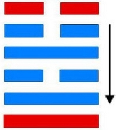

# 归妹 ䷵

归妹（䷵ guī mèi）卦的代号是`6:4`。主卦是`6`卦，兑卦，卦象是河泽，特性是愉快。客卦是`4`卦，震卦，卦象是雷，特性是运动。震上兑下。“归妹”，古代称女子出嫁。客方谋求发展，为了主方利益，主方需要给予客方一些好处，以获得良好的发展环境，就如同以自己亲爱的妹妹嫁给客方，如卦名“归妹”所表达的意思。卦辞“归妹：征凶，无攸利”，此卦辞与《渐》卦的卦辞意思正好相反，《渐》卦谈循序渐进的“女归”，用它去办事很吉祥；而《归妹》卦谈的急于求成的“归妹”，用它去办事，迹象则很凶险，一点好处也没有。这是就整个卦义而言。

图中，红色表示当位的爻，天蓝色表示不当位的爻，箭头表示有应。

- 卦序：54

> 歸妹，征凶，无攸利。
>《彖》曰：歸妹，天地之大義也。天地不交，而萬物不興。歸妹，人之終始也，說以動，所歸妹也。征凶，位不當也；无攸利，柔乘剛也。
>《象》曰：澤上有雷，歸妹。君子以永終知敝。

> 初九，歸妹以娣，跛能履，征吉。
>《象》曰：歸妹以娣，以恒也；跛能履，吉，相承也。

> 九二，眇能視，利幽人之貞。
>《象》曰：利幽人之貞，未變常也。

> 六三，歸妹以須，反歸以娣。
>《象》曰：歸妹以須，未當也。

> 九四，歸妹愆期，遲歸有時。
>《象》曰：愆期之志，有待而行也。

> 六五，帝乙歸妹，其君之袂不如其娣之袂良，月幾望，吉。
>《象》曰：帝乙歸妹，不如其娣之袂良也。其位在中，以貴行也。

> 上六，女承筐无實，士刲羊无血，无攸利。
>《象》曰：上六无實，承虛筐也。

> 归妹（䷵ guī mèi）卦是异卦，下兑上震，相叠。震为动、为长男；兑为悦、为少女。以少女从长男，产生爱慕之情，有婚姻之动，有嫁女之象，故称归妹。

>《象传》：震长男在上，兑少女在下，女必归从，归即是出嫁，但少女配长男，非正常组合。

> 处事有违常理正道，先得其益，但随后祸事百端。

- 事业：正在进入新的阶段，很快将会出现另一番景象。这时首先必须具备远大眼光，识破利弊和吉凶，有备始能无患。其次是坚守纯正的品德和正确的原则。
- 经商：开拓新的市场即将成功，在未来的商业活动中必须注意经营的方向和种类，加强与他人合作。
- 求名：务必以坚定的决心，努力提高自己，为成名立业奠定基础，最可怕是儿女情长影响了自己的前途和事业。
- 婚恋：顺其自然，不可违背原则，尤其不可强求，宁可晚婚也要选择理想的对象。夫妻经过生活考验，可和谐到老。
- 决策：对于人生必须坚持公正纯洁的品德，正确对待婚姻和家庭，以幸福美满的家庭为基础，开拓和发展自己的事业。

归妹卦，震上兑下，为[兑宫归魂卦](jing/dui.md#54)。占得此卦，天地不交，闭塞不通，有殃有咎，无始无终，所作不顺，百事不利。违反常理，其道将穷；明察事理，止绝妄念。得此卦者，困难之时，做事有违常理，灾祸不断。宜明察事理，修身养性，断绝妄念。

- 时运：进不以道，难以持久。
- 财运：货价尚可，结局未必。
- 家宅：已婚不宜居母家；勿眈情欲。
- 身体：大限将至。

> 归妹：表示小妹急着先出嫁，为感情冲动、不理智之象。得此卦投资、升迁、合伙，大概与男女之间的感情用事，会有很大的关连。感情，第三者积极介入之象，或是自己一厢情愿冲动的妄想。

> 解释：精神恍惚。

> 特性：具有同情心，喜欢结交朋友，爱热闹，贵人运多，恋爱运早，喜追求变化性工作，容易转换工作，多学不专。

> 运势：祸出百端，事物有违常理。初时有悦，不久反凶，祸害随至。

- 家运：外观风光幸福，其实家内正起风波，有失和、祸害等不幸情况。
- 疾病：病危重，极易恶化，为中风、肝病、气管及性病等。
- 胎孕：无碍。秋占不利。
- 子女：儿女有沉于情欲之中者。
- 周转：希望渺小。
- 买卖：表面上不错，其实亏了老本。
- 等人：不会来。
- 寻人：在东方或西方。
- 失物：失物虽有被归还的可能，但自身仍有损失。
- 外出：十分顺利，即便发生意外也会有人相助。
- 考试：有重新再读一年之况。
- 诉讼：事牵连于女性，宜力求和解，但我方必有损失。
- 求事：放弃算了，再另做打算。
- 改行：不宜。
- 开业：开业者宜暂停，静候时机。

### 初九：归妹以娣，跛能履，征吉。《象》曰：归妹以娣，以恒也。跛能履吉，相承也。

嫁女而将其妹妹一同陪嫁。跛脚而能行走。筮遇此爻，出行吉利。《象传》：嫁女而将其妹妹一同陪嫁，是说姊妹共嫁一夫，这是古代贵族婚嫁的常规。跛脚而能行走，出行吉利，因为跛者获得别人的帮助。

吉：得此爻者，有小德，谋望顺遂。做官的或有政绩。

- 时运：因人成事，乏善可陈。
- 财运：奉命而行，幸可获利。
- 家宅：偏屋亦吉。
- 身体：不良于行。

初九爻动变得[第40卦：雷水解](e8a7a3xie_cn.md)。

雷水解䷧是异卦，下坎上震，相叠。震为雷、为动；坎为水、为险。险在内，动在外。严冬天地闭塞，静极而动。万象更新，冬去春来，一切消除，是为解。

### 九二。眇能视，利幽人之贞。《象》曰：利幽人之贞，未变常也。

眼睛瞎了而能看得见。这是利于囚徒的贞卜。《象传》：这是利于囚徒的贞卜，因为身处囚笼尚不失正道，故能重见光明。

平：得此爻者，不宜进取，守旧者则祸害不生。

- 时运：不必幻想，安心修养。
- 财运：独到之见，暗中得利。
- 家宅：适合隐居；偏房为宜。
- 身体：保养眼睛。

九二爻动变得[第51卦：震为雷](e99c87zhen_cn.md)。

震为雷䷲是同卦，下震上震，相叠。震为雷，两震相叠，反响巨大，可消除沉闷之气，亨通畅达。平日应居安思危，怀恐惧心理，不敢有所怠慢，遇到突发事变，也能安然自若，谈笑如常。

### 六三：归妹以须，反归以娣。《象》曰：归妹以须，未当也。

嫁女而用其姊陪嫁，随后又与其妹妹返归父母家。《象传》：嫁女而用其姊陪嫁，这件事不妥当。

凶：得此爻者，进退无常，劳役悲苦。做官的有被降职之忧。

- 时运：受人抑制，忍耐一时。
- 财运：眼前无利，可图未来。
- 家宅：不是正宅；不是正娶。
- 身体：待时可愈。

六三爻动变得[第34卦：雷天大壮](e5a4a7e5a3aedazhuang_cn.md)。

雷天大壮䷡是异卦，下乾上震，相叠。震为雷；乾为天。乾刚震动。天鸣雷，云雷滚，声势宏大，阳气盛壮，万物生长。刚壮有力故曰壮。大而且壮，故名大壮。四阳壮盛，积极而有所作为，上正下正，标正影直。

### 九四：归妹愆期，迟归有时。《象》曰：愆期之志，有待而行也。

出嫁时超过了婚龄，迟迟不嫁是因为有所等待。《象传》：超龄而不嫁，因为她决意找到合意的郎君。

平：得此爻者，不是佳期，须待时运。

- 时运：行运有时，不宜躁进。
- 财运：待时而动，自可获利。
- 家宅：暂勿迁居；须待时日。
- 身体：安心静养。

九四爻动变得[第19卦：地泽临](e4b8b4lin_cn.md)。

地泽临䷒是异卦，下兑上坤，相叠。坤为地，兑为泽，地高于泽，泽容于地。喻君主亲临天下，治国安邦，上下融洽。

### 六五：帝乙归妹，其君之袂，不如其娣之袂良。月几望，吉。《象》曰：帝乙归妹，不如其娣之袂良也。其位在中，以贵行也。

帝乙嫁女于周文王，以其次女陪嫁。论嫁妆姊的不如妹的好。良辰择在某月十四日，吉利。《象传》：帝乙嫁女于周文王，姊的嫁妆不如妹的好。六五之爻居上卦中位，像女嫁夫家处于尊贵之位。

吉：得此爻者，正值好运，或成婚，或得财。做官的会受到重用，身居要职。

- 时运：谦虚得福，联袂上进。
- 财运：后货较优，早售有利。
- 家宅：喜事临门；二女同归。
- 身体：半月可愈。

六五爻动变得[第58卦：兑为泽](e58591dui_cn.md)。

兑为泽䷹是同卦，下兑上兑，相叠。泽为水。两泽相连，两水交流，上下相和，团结一致，朋友相助，欢欣喜悦。兑为悦也。同秉刚健之德，外抱柔和之姿，坚行正道，导民向上。

### 上六。女承筐无实，士刲羊无血，无攸利。《象》曰：上六无实，承虚筐也。

献祭之时，新娘捧着盛祭品的筐具，但筐中无物；新郎以刀刺羊，但羊不流血。此不祥之兆，无所利。《象传》：上六之爻居一卦之尽头，孤悬无所依赖，正宜其捧着空空的筐具。

凶：得此爻者，事多不顺，营谋皆空。做官的居虚位而无实禄。

- 时运：诸事不顺，小心为宜。
- 财运：本虚货缺，如何得利。
- 家宅：须防纷争；婚娶不正。
- 身体：虚劳失血，不治之象。

上六爻动变得[第38卦：火泽睽](e79dbdkui_cn.md)。

火泽睽䷥是异卦，下兑上离，相叠。离为火；兑为泽。上火下泽，相违不相济。克则生，往复无空。万物有所不同，必有所异，相互矛盾。睽即矛盾。

# [Guī Mèi ䷵](e5bd92e5a6b9guimei.md)
