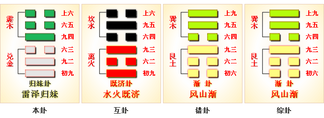
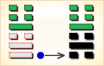
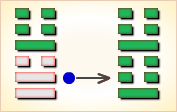
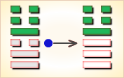
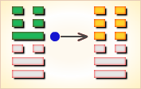
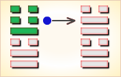
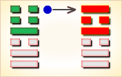

# 归妹 ䷵


归妹（guī mèi）是震上兑下卦的卦名，代号`6:4`。
“归妹”，古代称女子出嫁。

`6:4`卦的主卦是`6`卦兑卦，卦象是河泽，特性是愉快。客卦是`4`卦震卦，卦象是雷，特性是运动。

客方谋求发展，为了主方利益，主方需要给予客方一些好处，以获得良好的发展环境，就如同以自己亲爱的妹妹嫁给客方，如卦名“归妹”所表达的意思。
卦辞“归妹：征凶，无攸利”，此卦辞与《渐》卦的卦辞意思正好相反，《渐》卦谈循序渐进的“女归”，用它去办事很吉祥；
而《归妹》卦谈的急于求成的“归妹”，用它去办事，迹象则很凶险，一点好处也没有。这是就整个卦义而言。
求鱼须当向水中，树上求之不顺情，受尽爬揭难随意，劳而无功运平平。

图中，红色表示当位的爻，天蓝色表示不当位的爻，箭头表示有应。

- 卦序：54

> 歸妹，征凶，无攸利。
>《彖》曰：歸妹，天地之大義也。天地不交，而萬物不興。歸妹，人之終始也，說以動，所歸妹也。征凶，位不當也；无攸利，柔乘剛也。
>《象》曰：澤上有雷，歸妹。君子以永終知敝。

> 初九，歸妹以娣，跛能履，征吉。
>《象》曰：歸妹以娣，以恒也；跛能履，吉，相承也。

> 九二，眇能視，利幽人之貞。
>《象》曰：利幽人之貞，未變常也。

> 六三，歸妹以須，反歸以娣。
>《象》曰：歸妹以須，未當也。

> 九四，歸妹愆期，遲歸有時。
>《象》曰：愆期之志，有待而行也。

> 六五，帝乙歸妹，其君之袂不如其娣之袂良，月幾望，吉。
>《象》曰：帝乙歸妹，不如其娣之袂良也。其位在中，以貴行也。

> 上六，女承筐无實，士刲羊无血，无攸利。
>《象》曰：上六无實，承虛筐也。

### 总述

起卦前必须客观地、全面地、准确地分析主方和客方的情况，必须至少符合下列条件之一，此卦才有参考价值：

1. 主方与泽很相似，客方与雷很相似。
2. 主方的阳数是`6`，客方的阳数是`4`。
3. 主方的行动是阳，素质是阳，态度是阴；客方的行动、素质和态度是阳、阴和阴。

切勿用任何随机数方式起卦，否则此卦没有参考价值。

这个卦是异卦，下兑上震，相叠。震为动、为长男；兑为悦、为少女。
以少女从长男，产生爱慕之情，有婚姻之动，有嫁女之象，故称归妹。
男婚女嫁，天地大义，人的开始和终结。上卦与渐卦为综卦，交互为用。

归妹卦下部的三条爻是主卦，代表主方，上部的三条爻是客卦，代表客方。
主卦与客卦的形成基于对主方和客方状态的分析，归妹卦代表从主方的角度看当前的形势。
阴阳趋于和谐是变化的基本规律，根据这个规律，分析卦的结构有两个基本原则。

一个原则是当位。比较主卦和客卦的下爻和上爻，下爻完全相同，上爻也完全相同。尽管下爻都是阳爻，然而表示的颜色不同，主卦的下爻是黑色，客卦的下爻是灰色，这是因为从主方的角度来看对主方的利害不同。主卦的下爻是阳爻，表示主方积极主动，有利于主方的发展，对主方有利，这种状态叫做当位；客卦的下爻也是阳爻，表示客方积极主动，是对主方的挑战，增加主方发展的困难，对主方不利，这叫做不当位。主卦和客卦的上爻都是阴爻，然而表示的颜色不一样：主卦的上爻是阴爻，表示主方的态度随和，有可能受客方制约，对主方不利，这是不当位，以灰色表示；客卦的上爻也是阴爻，表示客方态度随和，客方有可能接受主方制约，对主方有利，这是当位，以黑色表示。

另一个原则是有应。主卦与客卦的中爻是一阴一阳，处于阴阳和谐状态，这叫有应。图中的箭头表示有应，从阴爻指向阳爻。有应不一定对主方有利，这需要看有应的爻的性质和阴阳状态。归妹卦中主卦的中爻是阳爻，表示主方素质良好；客卦的中爻是阴爻，表示客方素质不佳。在这种和谐状态下，主方施惠于客方，客方直接受益，主方直接受损，对主方不利。因此，尽管这两条爻是一阴一阳，但是仍然都是不当位，以灰色表示。换一个角度考虑，结合主方积极主动来看，主方可以利用客方对主方的依赖取得更大的发展，这种情况对主方非常有利。

由以上对归妹卦的结构分析可以知道，在当前形势下，主方应当利用客方对主方的依赖，积极主动地大力发展开拓；同时要意识到客方的剧烈竞争，各为自己的利益，缺少诚意，即使主方为客方作出贡献，不能指望得到恰当回报。
图的右边是爻辞。爻辞对完全抽象的爻作比较具体的比较形象的说明，爻辞与爻一一对应，从下往上数。根据爻在卦中的状态，爻辞中加了判断词。删去判断词，可以看出六条爻辞是一首围绕“归妹”为主题的散文诗，描述主方试图嫁女给客方表示亲善，然而双方都没有诚意。下面是其译文：

```
嫁出的女子当了妾，
（忍耐点吧）一条腿也能走路。
一只眼也能看，应当坚持隐藏心中的不满。
嫁出女子去当补缺的妻子，反而出嫁后当了妾。
出嫁的日期推迟了。
（忍耐点吧）推迟出嫁的日期更合适。
帝乙出嫁女子，其服饰还不如妾的服饰好，
（也好）月亮差不多满园了。
（都没有诚意啊，就像那）女士托着筐子，没有果实；
男士刺羊，没有血。
```

### 全卦内容

此卦由泽下雷上组成。卦辞“归妹：征凶，无攸利”，此卦辞与《渐》卦的卦辞意思正好相反，《渐》卦谈循序渐进的“女归”，用它去办事很吉祥；而《归妹》卦谈的急于求成的“归妹”，用它去办事，迹象则很凶险，一点好处也没有。这是就整个卦义而言。
1. “初九”爻辞的“归妹以娣，跛能履，征吉，”是说办事急于求成，结果落到了象出嫁女子嫁给了别人做小妾；这种结局虽很不理想，就如同是一个残废的跛子那样不称心如意，但跛子总比两条腿全残要好，虽跛，但尚能走路。若果能这样，迹象也是吉祥的。
2. “九二”爻辞的“眇能视，利幽人之贞”此爻前半句有类同上一爻的意思，是说办事急于求成，结果仍不理想，这时就如同是只有一只眼睛；但这结局总比两只眼睛全瞎要好。如果能这样，还是利于深居九五之位的君王的贞正的。
3. “六三”爻辞“归妹以须，反归于娣”，是说办事有如出嫁女子，本不想去做小妾，但由于急忙出嫁，在匆匆忙忙的须臾片刻办完了出嫁之事，谁知本想弄个长妇，却没有料想到仍然落得做了个偏房小妾。
4. “九四”爻辞“归妹愆期，迟归有时”，是说办事有如出嫁女子，不要采取须臾片刻便办完的办法，而是等待时机。这样固然还有过期嫁不出去的危险，但是这种“愆期”，还是有时机可待的。
5. “六五”爻辞“帝乙归妹，其君之袂不如其娣之袂良；月几望，吉”，此一爻有接上一爻“归妹愆期，迟归有时”的含义，前半句是说办事有如出嫁女子，如果不急于求成，渐缓等待，有如帝乙出嫁女子那样，这时既就是出嫁的女子去为别人做了偏房，但所出嫁时所佩之服饰还反会比其长妇出嫁时所着的服饰荣耀。后半句是说，当此十五月圆之时，方是女子选择出嫁的好日子。
6. “上六”爻辞的“妇承筐，无实；士刲羊，无血，无攸利”，是说办事如果象“归妹以须”，过于匆忙，那其结果必然好像一个女人虽然手中提着筐子，但却空无一物；也有如壮士在杀羊，但却不见血，这一点吉祥也没有，一点好处也没有。

### 卦辞
```
〖原文〗征凶，无攸利。
〖译文〗往前发展有凶险，没有什么有利之处。
〖解说〗这是6:4卦的卦辞，说明当前双方关系的一般情况。
“攸“（yōu）助词，相当于“所”：性命攸关。
主方的素质良好，客方的素质不佳，
主方愿意奉献给客方一些客方所需要的东西，
然而，主客双方都是积极主动地谋求发展，双方的利益难免冲突，
因此，即使主方对客方友好，也不一定会得到善报。
这种情况下，主方不应当在发展主客双方关系方面走到过快，“征凶”。
往前发展对自己没有好处，“无攸利”。
```

### 解释
```
归妹，虞翻曰：归，嫁也。兑为妹。
泰三之四，坎月离日，俱归妹象。
阴阳之义配日月，则天地交而万物通。故以嫁娶也。
征凶，虞翻曰：谓四也。震为征。
三之四，不当位，故“征凶”也。
无攸利。虞翻曰：谓三也。
四之三，失正无应，以柔乘刚，故“无攸利”也。
《彖》曰：归妹，天地之大义也。
虞翻曰：乾天坤地。三之四，天地交。
以离日坎月战阴阳，阴阳之义配日月，
则万物兴，故“天地之大义”。
乾主壬，坤主癸。日月会北。震为玄黄，天地之杂。
震东兑西，离南坎北。
六十四卦，此象最备四进正卦，故“天地之大义也”。
天地不交而万物不兴。
虞翻曰：乾三之坤四。震为兴。
天地以离坎交阴阳，故“天地不交则万物不兴”矣。
王肃曰：男女交而后人民蕃，天地交然后万物兴，
故归妹以及天地交之义也。
归妹，人之终始也。
虞翻曰：人始生乾，而终于坤，故“人之终始”，
《杂卦》曰：归妹，女之终，
谓阴终坤癸，则乾始震庚也。
干宝曰：归妹者，衰落之女也。父既没矣，
兄主其礼，子续父业，人道所以相终始也。
说以动，所归妹也。
虞翻曰：说，兑。动，震也。谓震嫁兑所归必妹也。
征凶，位不当也。
崔觐曰：中国皆爻失位，以象归妹非正嫡，故“征凶”也。
无攸利，柔乘刚也。
王肃曰：以征则有不正之凶，
以处则有乘刚之逆也，故“无所利”矣。
《象》曰：泽上有雷，归妹。
干宝曰：雷薄于泽，八月九月将藏之时也。
君子象之，故不敢恃当今之虞，而虑将来祸也。
君子以永终知敝。
虞翻曰：君子，谓乾也。坤为永终，为敝。乾为知。
三之四，为永终；四之三，兑为毁折，故“以永终知敝”。
崔觐曰：归妹，从之始终也。
始则征凶，终则无攸利，故“君子以永终知敝”为戒者也。
```

### 一阳
```
〖原文〗归妹以娣，跛能履，征吉。
〖译文〗嫁女为妾，跛脚也能够行走，征伐吉利。
〖解说〗这是第一爻的爻辞，
阳，表示主方积极主动地谋取和扩大自己的利益。
“娣”（dì），古代诸妾中的年幼者。
“跛”（bǒ），腿或脚有病，走路时身体不平衡，瘸：跛脚，跛子。
主客双方都在积极主动地谋取发展，主方为客方作了奉献，
但是客方并没有完全满意，只是把嫁来的女子作了妾，“归妹以娣”。
尽管如此，主客双方关系可能有所改善，“跛能履”。
主方继续如此作是吉利的，“征吉”。
这里的“征吉”仅仅是指主方的积极主动行动而言，
肯定主方应当继续积极主动，
并没有指当前整个双方关系的状态对主方是吉利的。

〖结构分析〗这条爻是阳爻在阳位，
当位，与四阳不有应。当位表明主方积极主动，
有可能维护和增长自己的利益，是潜在的对主方有利的因素；
不有应表明客方也是积极主动，主方面临竞争，
这潜在因素没有成为真正的对主方有利的因素。
由于这种潜在因素的存在，加之主方的素质优于客方，
主方应当继续积极主动，依靠素质上的优势，
取得竞争中的顺利，所以爻辞说“征吉”。
```

### 二阳
```
〖原文〗眇能视，利幽人之贞。
〖译文〗一只眼也能够看东西，利于隐士的坚持。
〖解说〗这是第二爻的爻辞，
阳，表示主方的素质是阳，素质良好。
“眇”（miǎo），瞎了一只眼。
“幽人”（yōu rén），幽隐之人，隐士。
主方的素质良好，有可能对客方作贡献，
不过，由于客方也在积极主动求发展，
主方没有必要全部奉献给客方，只要奉献一部分就可以了。
利于把自己的实力隐藏起来，像隐士一样，并且坚持隐藏下去。

〖结构分析〗这条爻是阳爻在阴位，不当位，与五阴有应。
不当位表明主方的良好素质有可能受到客方损害，
是潜在的对主方不利的因素；
有应表明客方素质不佳，需要从主方得到补益，
这潜在因素成了真正的对主方不利的因素。
因此，主方应当把良好的素质隐藏起来，
保护自己的利益，“利幽人之贞”。
```

### 三阴
```
〖原文〗归妹以须，反归以娣。
〖译文〗嫁女为补妻，反嫁作为妾。
〖解说〗这是第三爻的爻辞，
阴，表示主方的态度是阴，主方的态度随和。
“须”（xū），必得，应当，须次（官吏依次候补官缺）。
结合爻辞的上下文，这里的须指男人缺少的女人，妻。
主方的态度随和，不计较尊畀，“归妹以须”，又“反归以娣”。
爻辞本身并没有说主方阴的态度对于主方来说是有利，或者不利。

〖结构分析〗这条爻阴爻在阳位，
不当位，与六阴不有应。
不当位表明主方态度随和，有可能受到客方制约，
是潜在的对主方不利的因素；
不有应表明客方的态度也随和，不求制约主方，
这潜在因素没有成为真正的对主方不利的因素，
所以爻辞中没有判断词。
```

### 四阳
```
〖原文〗归妹愆期，迟归有时。
〖译文〗嫁女的时间误了期，推迟出嫁有了合适时间。
〖解说〗这是第四爻的爻辞，阳，表示客方的行动是阳，
客方积极主动地谋取和扩大自己的利益，比如说，
创新、创业、投资、进攻、求职、示爱，等等。
“愆期”，误期，失期。
由于客方的积极主动行动可能与主方的积极主动行动冲突，
主方嫁女给客方的时间误期了，
不过，嫁出的时间推迟了以后，时间对主方更合适。

〖结构分析〗这条爻是阳爻在阴位，
不当位，并且和一阳不有应。
不当位，表明客方积极主动，
有可能损害主方的利益，是潜在的对主方不利的因素；
不有应，表明主方也是积极主动地维护和增加自己的利益，
主方的利益不会受到客方损害，
这潜在因素没有成为真正的对主方不利的因素。
所以爻辞中没有判断词。
```

### 五阴
```
〖原文〗帝乙归妹，其君之袂，
不如其娣之袂良；月几望，吉。
〖译文〗帝乙嫁女，她的服饰不如其妾的服饰好；
月亮几乎是满月了，吉利。
〖解说〗这是第五爻的爻辞，
阴，表示客方的素质是阴，客方的素质不佳。
“帝乙”，商朝第30代国王，在位时期为前1101年～前1076年。
“袂”（mèi），衣袖，袖口：张袂（张开衣袖）。
帝乙指主方。由于客方的素质不佳，主方帮助客方，“帝乙归妹”。
而客方依靠自己的努力，对主方的帮助并不重视，
“其君之袂，不如其娣之袂良”。
主方能够帮助客方，已经算不错了，“月几望”。
继续帮助客方，对主方有好处，“吉”。

〖结构分析〗这条爻是阴爻在阳位，
不当位，不过与二阳有应。
不当位，表明客方素质不佳，
有可能从主方寻求利益，是潜在的对主方不利的因素；
有应表明主方素质良好，可以给于客方所需，
这潜在因素成了真正的对主方不利的因素。
换一个角度考虑，由于客方素质不佳以及主方素质良好，
客方依赖主方，主方可以利用客方对主方的依赖，
积极主动地取得更大发展，这对主方很有利，所以爻辞说“吉”。
```

### 六阴
```
〖原文〗女承筐，无实；士刲羊，无血；无攸利。
〖译文〗女士托着筐子，没有果实；
男士刺羊，没有血。没有什么好处。
〖解说〗这是第六爻的爻辞，
阴，表示客方的态度是阴，客方的态度随和。
“承”（chéng），在下面接受，托着：承重。
“刲”（kuī），刺杀。客方的态度随和，
同时，主方的态度也是如此，双方相互周旋，没有诚意，
“女承筐，无实；士刲羊，无血”，对于主方没有什么好处。
主方的态度不宜太随和，应当比较明确而肯定。

〖结构分析〗这条爻是阴爻在阴位，
当位，并且与三阴不有应。
当位表明客方态度随和，
有可能接受主方制约，是潜在的对主方有利的因素；
不有应表明主方的态度也随和，主方不能制约客方，
这潜在因素没有成为真正的对主方有利的因素。
因此爻辞说“无攸利”。
```

### 注释
```
归妹卦，兑下震上。
归妹①：征凶②，无攸利。
初九，归妹以娣③，跛能履④，征吉。
九二，眇能视⑤，利幽人⑥之贞。
六三，归妹以须⑦，反归于娣⑧。
九四，归妹愆期⑨，迟归有时⑩。
六五，帝乙归妹⑪，其君之袂不如其娣之袂良⑫；月几望⑬，吉。
上六，女承筐，无实⑭；士刲羊，无血⑮，无攸利。

①归妹：六十四卦卦名之一。
乃言办事急于求成，亦即欲速则不达之卦。
②征凶：此处“征”当按迹象讲。
③归妹以娣：“娣”（dì 地），古代称夫之妾曰“娣”。
此句指将女子嫁与别人做小妾。
④跛能履：跛着一条腿尚能走路。
⑤眇能视：瞎掉一只眼睛尚能看见。
⑥幽人：参《履》卦“九二”爻“履道坦坦，幽人贞吉”，
二处“幽人”同出一义，皆指深居九五之位的君王。
⑦归妹以须：“须”，片刻，少时。
此句言出嫁女子勿勿忙忙，片刻便办妥。
⑧反归于娣：反而仍然落到了做小妾。
⑨愆（qiān 牵）期：过期。
⑩迟归有时：迟一点“归妹”（出嫁），还有好的时机可待。
⑪帝乙归妹：殷商末代倒数第二个君王帝乙出嫁女子。
⑫其君之袂不如其娣之袂良：“君”，此处指长妇。
“袂”（mèi 妹），本指衣袖，此处指服饰。
此句有接“迟归有时”之义，是说只要等待时机出嫁，
有如帝乙出嫁女子，其长妇的服饰还不如其小妾的服饰好。
⑬月几望：参《小畜》一卦“月几望”一注，指到了十五月圆之时。
⑭女承筐，无实：女子手里虽提着筐子，但却空无一物。
⑮士刲羊，无血：“刲”（kuī 亏），宰。壮士杀羊却不见血。
```

### 白话解析
```
歸妹①：正凶②，无攸利③。 
【注释】
①归妹：卦名，嫁女。
②正凶：象征凶恶。
③无攸利：无所利。攸：所。
【白话】筮得归妹卦，象征凶恶，没有什么利益。
【讲解】归妹卦卦象：
下卦为夺（兑）卦，兑为少女；
上卦为辰（震）卦，震为长男。
按照《彖传》的说法：“归妹，天地之大义也。
天地不交，而万物不兴。归妹，人之终始也。
说以动，所归妹也。征凶，位不当也。
无攸利，柔乘刚也。”
孔颖达说：“归妹者，卦名也。妇人谓嫁曰归。
归妹犹言嫁妹也。然《易》论归妹得名不同。
泰卦六五云：帝乙归妹。彼据兄嫁妹谓之归妹。
此卦名归妹以妹从姊而嫁谓之归妹，
故初九爻辞云：‘归妹以娣’是也。
上咸卦明二少相感，恒卦明二长相承，
今此卦以少承长非是匹敌，明是妹从姊嫁，故谓之归妹焉。”

初九：歸妹以弟①，跛能利②，正吉③。
【注释】
①弟：次序，后作“第”。
②跛能利：腿脚不方便而能走路，
比喻变不利因素为有利因素。
③正吉：象征吉善。
【白话】筮得归妹卦，占得初九爻，
按照年龄大小依次嫁女，虽然有困难但也能克服，象征吉善。
【讲解】弟，通行本作“娣”。娣，就是妹妹。
姐姐嫁给诸侯，妹妹要陪嫁。
王弼说：“少女而与长男为耦，非敌之谓，是娣从之义也。
妹，少女之称也。少女之行，善莫若娣。
夫承嗣以君之子，虽幼而不妄行。少女以娣，
虽‘跛能履’，斯乃恒久之义，吉而相承之道也。以斯而进，吉其宜也。”

九二：眇能视①，利幽人②贞。
【注释】
①眇能视：眼睛瞎了但却能看东西。
一种情况是治好了眼睛，
另一种情况是特异功能，第三种情况是梦占。
②幽人：囚禁的人。
【白话】筮得归妹卦，占得九二爻，
眼睛不方便却能看东西，利于幽禁的人占问。
【讲解】九二阳刚之爻居于阴柔之位，虽然失位，但居内卦之中，
眼睛虽然有毛病，但仍然能够看东西，足以保持正常的生活。
居于内卦的中爻，能够遵守常规，所以爻辞断以“利幽人之贞”。

六三：歸妹以嬬①，反歸以苐②。
【注释】
①嬬：仆妾。
②苐：通“弟”。
【白话】筮得归妹卦，占得六三爻，
少女出嫁用女仆陪嫁，嗣后女仆又陪同少女返回其父母家中。
【讲解】嬬，通行本作“须”。朱熹认为“须”是卑贱的女性。
程颐认为“须”是等待。程颐的说法本于王弼。
王弼说：“室主犹存，而求进焉，进未值时，故有须也。
不可以进，故‘反归’待时，以娣乃行也。”

九四：歸妹衍期①，迟归有时。
【注释】①衍期：过期。
【白话】筮得归妹卦，占得九四爻，
嫁女超过了日期，推迟嫁女有定期。
【讲解】九四阳刚之爻居于阴柔之位，
下与初九阳刚无应。用这不正无应之道适人，
必须等待彼道穷尽无所与交，然后才可以往。

六五：帝乙①歸妹，其君之袂②，
不若其苐之快③良，日月既望④，吉。
【注释】
①帝乙：商代国王，纣王的父亲。
②袂：衣袖。
③快：袂字的讹写。
④既望：过望，近于月中，指每月的十六日至二十二、二十三日。
望：月之望，月大则十六日为望，月小则十五日为望。
【白话】筮得归妹卦，占得六五爻，帝乙嫁少女给文王，
少女的打扮非常朴素，穿戴还不如陪嫁的姑娘好，
出嫁的时间选择在日月既望的大吉日子里。
【讲解】兑（夺）为少阴，震（辰）为长阳，
少阴而承长阳，悦以动，嫁妹之象。
六五归妹之中，独处贵位，所以叫做“帝乙归妹”。
六五配在九二，兑少阴，震长男，
以长从少，不如以少从长那样美好。
王弼说：“位在乎中，以贵而行，极阴之盛，以斯适配，
虽不若少，往亦必合，故曰‘月几望吉’也。”

尚六：女承筐无實，士刲①羊无血，无攸利。
【注释】①刲：割杀。
【白话】筮得归妹卦，占得尚六爻，女人捧着空盘子，
男士宰羊而不流血，没有什么好处。
【讲解】尚六处于卦的穷极之处，上无所承，下无所应，
与六三相敌，进退为难，所以爻辞断以“无攸利”。
```



### 《断易天机》解

归妹卦震上兑下，为兑宫归魂卦。占得此卦，天地不交，闭塞不通，有殃有咎，无始无终，所作不顺，百事不利。

### 北宋易学家 邵雍 解

违反常理，其道将穷；明察事理，止绝妄念。

得此卦者，困难之时，做事有违常理，灾祸不断。宜明察事理，修身养性，断绝妄念。

### 台湾国学家 傅佩荣 解

- 时运：进不以道，难以持久。
- 财运：货价尚可，结局未必。
- 家宅：已婚不宜居母家；勿眈情欲。
- 身体：大限将至。

### 传统解卦
```
这个卦是异卦，下兑上震，相叠。
震为动、为长男；兑为悦、为少女。
以少女从长男，产生爱慕之情，
有婚姻之动，有嫁女之象，故称归妹。

《象传》：震长男在上，兑少女在下，
女必归从，归即是出嫁，但少女配长男，非正常组合。
```

运势：处事有违常理正道，先得其益，但随后祸事百端。

- 事业：正在进入新的阶段，很快将会出现另一番景象。这时首先必须具备远大眼光，识破利弊和吉凶，有备始能无患。其次是坚守纯正的品德和正确的原则。
- 经商：开拓新的市场即将成功，在未来的商业活动中必须注意经营的方向和种类，加强与他人合作。
- 求名：务必以坚定的决心，努力提高自己，为成名立业奠定基础，最可怕是儿女情长影响了自己的前途和事业。
- 婚恋：顺其自然，不可违背原则，尤其不可强求，宁可晚婚也要选择理想的对象。夫妻经过生活考验，可和谐到老。
- 决策：对于人生必须坚持公正纯洁的品德，正确对待婚姻和家庭，以幸福美满的家庭为基础，开拓和发展自己的事业。

### 台湾 张铭仁 解卦
```
归妹：表示小妹急着先出嫁，为感情冲动、不理智之象。
得此卦投资、升迁、合伙，大概与男女之间的感情用事，会有很大的关连。
感情，第三者积极介入之象，或是自己一厢情愿冲动的妄想。

解释：精神恍惚。

特性：具有同情心，喜欢结交朋友，爱热闹，
贵人运多，恋爱运早，喜追求变化性工作，容易转换工作，多学不专。
```

运势：祸出百端，事物有违常理。初时有悦，不久反凶，祸害随至。

- 家运：外观风光幸福，其实家内正起风波，有失和、祸害等不幸情况。
- 疾病：病危重，极易恶化，为中风、肝病、气管及性病等。
- 胎孕：无碍。秋占不利。
- 子女：儿女有沉于情欲之中者。
- 周转：希望渺小。
- 买卖：表面上不错，其实亏了老本。
- 等人：不会来。
- 寻人：在东方或西方。
- 失物：失物虽有被归还的可能，但自身仍有损失。
- 外出：十分顺利，即便发生意外也会有人相助。
- 考试：有重新再读一年之况。
- 诉讼：事牵连于女性，宜力求和解，但我方必有损失。
- 求事：放弃算了，再另做打算。
- 改行：不宜。
- 开业：开业者宜暂停，静候时机。

### 初九爻辞

初九。归妹以娣，跛能履，征吉。

《象》曰：归妹以娣，以恒也。跛能履吉，相承也。

### 白话文解释

初九：嫁女而将其妹妹一同陪嫁。跛脚而能行走。筮遇此爻，出行吉利。

《象传》说：嫁女而将其妹妹一同陪嫁，是说姊妹共嫁一夫，这是古代贵族婚嫁的常规。跛脚而能行走，出行吉利，因为跛者获得别人的帮助。

### 北宋易学家 邵雍 解

吉：得此爻者，有小德，谋望顺遂。做官的或有政绩。

### 台湾国学家 傅佩荣 解

- 时运：因人成事，乏善可陈。
- 财运：奉命而行，幸可获利。
- 家宅：偏屋亦吉。
- 身体：不良于行。

### 初九变卦：雷泽归妹 变卦 雷水解卦



初九爻动变得[第40卦：雷水解](e8a7a3xie_cn.md)。

这个卦是异卦，下坎上震，相叠。

震为雷、为动；坎为水、为险。

险在内，动在外。严冬天地闭塞，静极而动。

万象更新，冬去春来，一切消除，是为解。

### 九二爻辞

九二。眇能视，利幽人之贞。

《象》曰：利幽人之贞，未变常也。

### 白话文解释

九二：眼睛瞎了而能看得见。这是利于囚徒的贞卜。

《象传》说：这是利于囚徒的贞卜，因为身处囚笼尚不失正道，故能重见光明。

### 北宋易学家 邵雍 解

平：得此爻者，不宜进取，守旧者则祸害不生。

### 台湾国学家 傅佩荣 解

- 时运：不必幻想，安心修养。
- 财运：独到之见，暗中得利。
- 家宅：适合隐居；偏房为宜。
- 身体：保养眼睛。

### 九二变卦：雷泽归妹 变卦 震为雷



九二爻动变得[第51卦：震为雷](e99c87zhen_cn.md)。

这个卦是同卦，下震上震，相叠。

震为雷，两震相叠，反响巨大，可消除沉闷之气，亨通畅达。

平日应居安思危，怀恐惧心理，不敢有所怠慢，遇到突发事变，也能安然自若，谈笑如常。

### 六三爻辞

六三。归妹以须，反归以娣。

《象》曰：归妹以须，未当也。

### 白话文解释

六三：嫁女而用其姊陪嫁，随后又与其妹妹返归父母家。

《象传》说：嫁女而用其姊陪嫁，这件事不妥当。

### 北宋易学家 邵雍 解

凶：得此爻者，进退无常，劳役悲苦。做官的有被降职之忧。

### 台湾国学家 傅佩荣 解

- 时运：受人抑制，忍耐一时。
- 财运：眼前无利，可图未来。
- 家宅：不是正宅；不是正娶。
- 身体：待时可愈。

### 六三变卦：雷泽归妹 变卦 雷天大壮



六三爻动变得[第34卦：雷天大壮](e5a4a7e5a3aedazhuang_cn.md)。

这个卦是异卦，下乾上震，相叠。

震为雷；乾为天。乾刚震动。

天鸣雷，云雷滚，声势宏大，阳气盛壮，万物生长。刚壮有力故曰壮。

大而且壮，故名大壮。四阳壮盛，积极而有所作为，上正下正，标正影直。

### 九四爻辞

九四。归妹愆期，迟归有时。

《象》曰：愆期之志，有待而行也。

### 白话文解释

九四：出嫁时超过了婚龄，迟迟不嫁是因为有所等待。

《象传》说：超龄而不嫁，因为她决意找到合意的郎君。

### 北宋易学家 邵雍 解

平：得此爻者，不是佳期，须待时运。

### 台湾国学家 傅佩荣 解

- 时运：行运有时，不宜躁进。
- 财运：待时而动，自可获利。
- 家宅：暂勿迁居；须待时日。
- 身体：安心静养。

### 九四变卦：雷泽归妹 变卦 地泽临



九四爻动变得[第19卦：地泽临](e4b8b4lin_cn.md)。

这个卦是异卦，下兑上坤，相叠。

坤为地，兑为泽，地高于泽，泽容于地。

喻君主亲临天下，治国安邦，上下融洽。

### 六五爻辞

六五。帝乙归妹，其君之袂，不如其娣之袂良。月几望，吉。

《象》曰：帝乙归妹，不如其娣之袂良也。其位在中，以贵行也。

### 白话文解释

六五：帝乙嫁女于周文王，以其次女陪嫁。论嫁妆姊的不如妹的好。良辰择在某月十四日，吉利。

《象传》说：帝乙嫁女于周文王，姊的嫁妆不如妹的好。六五之爻居上卦中位，像女嫁夫家处于尊贵之位。

### 北宋易学家 邵雍 解

吉：得此爻者，正值好运，或成婚，或得财。做官的会受到重用，身居要职。

### 台湾国学家 傅佩荣 解

- 时运：谦虚得福，联袂上进。
- 财运：后货较优，早售有利。
- 家宅：喜事临门；二女同归。
- 身体：半月可愈。

### 六五变卦：雷泽归妹 变卦 兑为泽



六五爻动变得[第58卦：兑为泽](e58591dui_cn.md)。

这个卦是同卦，下泽上泽，相叠。

泽为水。

两泽相连，两水交流，上下相和，团结一致，朋友相助，欢欣喜悦。

兑为悦也。同秉刚健之德，外抱柔和之姿，坚行正道，导民向上。

### 上六爻辞

上六。女承筐无实，士刲羊无血，无攸利。

《象》曰：上六无实，承虚筐也。

### 白话文解释

上六：献祭之时，新娘捧着盛祭品的筐具，但筐中无物；新郎以刀刺羊，但羊不流血。此不祥之兆，无所利。

《象传》说：上六之爻居一卦之尽头，孤悬无所依赖，正宜其捧着空空的筐具。

### 北宋易学家 邵雍 解

凶：得此爻者，事多不顺，营谋皆空。做官的居虚位而无实禄。

### 台湾国学家 傅佩荣 解

- 时运：诸事不顺，小心为宜。
- 财运：本虚货缺，如何得利。
- 家宅：须防纷争；婚娶不正。
- 身体：虚劳失血，不治之象。

### 上六变卦；雷泽归妹 变卦 火泽睽



上六爻动变得[第38卦：火泽睽](e79dbdkui_cn.md)。

这个卦是异卦，下兑上离，相叠。

离为火；兑为泽。

上火下泽，相违不相济。

克则生，往复无空。万物有所不同，必有所异，相互矛盾。睽即矛盾。

# [Guī Mèi ䷵](e5bd92e5a6b9guimei.md)
