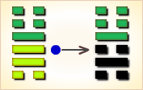
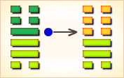

# 恒 ䷟


恒（héng），雷风恒，恒心有成。代号是`3:4`。
`3:4`卦的主卦是`3`卦巽卦，卦象是风，阳数是`3`；客卦是`4`卦震卦，卦象是雷，阳数是`4`。
恒：亨，无咎，利贞。利有攸往。

恒卦：通达，没有过失。有所往则有利。恒，卦名。本卦为异卦相叠，巽下震上。上卦为震，震为雷，下卦为巽，巽为风。

从自然界看，风雷激荡，使宇宙常新。从社会上看，震为阳，巽为阴，阳上阴下，正像君贵民贱，男萼女卑，所谓永恒不变的封建纲常。
“君子”应该坚守此道，持之以恒。所以卦名曰恒。恒，《说文》：“恒，常也。”

图中，红色表示当位的爻，天蓝色表示不当位的爻，箭头表示有应。

- 卦序：32

> 恒，亨，无咎，利貞，利有攸往。
>《彖》曰：恒，久也。剛上而柔下，雷風相與，巽而動，剛柔皆應，恒。恒，亨，无咎，利貞，久於其道也。天地之道，恒久而不已也，利有攸往，終則有始也，日月得天而能久照，四時變化而能久成，聖人久於其道而天下化成，觀其所恒而天地萬物之情可見矣。
>《象》曰：雷風，恒，君子以立不易方。

> 初六，浚恒，貞凶，无攸利。
>《象》曰：浚恒之凶，始求深也。

> 九二，悔亡。
>《象》曰：九二悔亡，能久中也。

> 九三，不恒其德，或承之羞，貞吝。
>《象》曰：不恒其德，无所容也。

> 九四，田无禽。
>《象》曰：久非其位，安得禽也。

> 六五，恒其德貞，婦人吉，夫子凶。
>《象》曰：婦人貞吉，從一而終也。夫子制義，從婦凶也。

> 上六，振恒，凶。
>《象》曰：振恒在上，大无功也。

### 起卦

恒是`3:4`卦的卦名，`3:4`是恒卦的代号。
“恒”，持久，固定不变的：永恒，恒温。

`3:4`卦的主卦是`3`卦巽卦，卦象是风，特性是有力而顺从；客卦是`4`卦震卦，卦象是雷，特性是运动而力弱。
狂风暴雨，雷借风势，风助雷威。然而，震雷短暂，风则恒久存在，即使天晴，也有微风，白天有风，夜晚也有风。
恒卦以风和雷的对比，建议主方努力保持当前状态恒久不变。

起卦前必须客观地、全面地、准确地分析主方和客方的情况，必须至少符合下列条件之一，此卦才有参考价值：

1. 主方与风很相似，客方与雷很相似。
2. 主方的阳数是`3`，客方的阳数是`4`。
3. 主方的行动是阴，素质是阳，态度也是阳；客方的行动、素质和态度是阳、阴和阴。

切勿用任何随机数方式起卦，否则此卦不能用作决策工具。

### 结构和卦爻辞

在恒卦的结构和卦爻辞图中有三个箭头，表示卦中的爻全部有应，都是一阴一阳成对，处于完全和谐状态。
阴阳趋于和谐是变化的基本规律，完全和谐状态是一个稳定状态，不容易发生变化。

不过，从主方角度来看，这三种和谐的利害是不一样的。第一个箭头，从主卦的下爻指向客卦的下爻，表示主方消极被动，客方积极主动，主方屈从客方，对主方不利，图中，这一对爻以灰色表示，是不当位的爻；第二个箭头从客卦的中爻指向主卦的中爻，表示客方素质不佳，主方素质良好，客方从主方受益，对主方不利，这一对爻也是以灰色表示，是不当位的爻；第三个箭头从客卦上爻指向主卦上爻，表示客方态度随和，主方态度强硬，主方制约客方，对主方有利，这一对爻是当位的爻。总起来说，如果这种和谐状态长期存在下去，主方的素质，例如资金、权力、精力等等被客方消耗，对主方不利。

这种和谐状态是过去的变化造成的。变化有常规变化与非常规变化两种：事物自身的变化是常规变化，事物之间相互影响而发生的变化是非常规变化。

首先看主方，目前主方处于巽卦所代表的状态，巽卦之前是乾卦，乾卦的阳数是7，巽卦的阳数是3，从乾卦到巽卦越过了一个量变到质变的关键点，阳数减少了3，主方发生了从上升到衰落的质变。这种变化的发生并不是实力削弱，而是失去了积极主动的动力，变成消极被动，例如滥用权力，贪污行贿，谋求私利等等，都会失去前进的动力。
再看客方，目前客方处于震卦所代表的状态，震卦之前是坤卦，坤卦的阳数是0，震卦的阳数是4，从坤卦到震卦也越过了一个量变到质变的关键点，阳数增加了4，客方发生了从衰落到上升的质变。这种变化的发生并不是由于素质的改善。客方素质仍然不佳，例如缺少经验、资金贫乏、体格软弱，等等，但是生命力极强，如初生婴儿。
常规变化继续下去，主方将从巽卦变到坎卦，情况对主方更不利，而返回到乾卦的状态已经不可能，所以现在主方应当做的就是尽力保持目前形势恒久，这就是恒卦的中心思想。

从恒卦的结构看，主方首先应当做的是变化第一爻，从阴爻变到阳爻，由消极被动变成积极主动。完全变成像乾卦那样的积极主动是不可能的，但是，可以做到阴中有阳，在一定程度上积极主动。这积极主动包含两个方面：一是增强发展动力，是主方内部的，例如整顿纪律，改革管理，学习培训，等等；一是积极竞争，进攻，占领市场，等等，是对客方的。就对客方而言，客方也是阳中有阴，主方不宜盲目行动，要伺机而行，也就是要注意第四爻，这是不当位的阳爻，如果客方有消极被动的迹象，立即主动应对。其次，主方应当做的是针对第二爻，这也是不当位的爻，要尽量保护自己的素质，避免过多消耗，例如勤俭节约、压缩开支，对外低姿态，等等。同时注意第五爻，这也是不当位的爻，如果客方暴露出良好素质，就设法获取。

图的下部，在卦名之后是卦辞，简要阐述对当前形势的分析。图的右边是爻辞，与爻一一对应，比较形象具体地说明完全抽象的爻的含义。如果删去判断词，就可以看出，爻辞是一首完整的围绕主题“恒”的散文诗：

```
疏通河道，保证恒久畅通。
没有保持恒久的品德，就要承受羞耻。
（没有保持恒久的品德）田里就没有了野禽。
保持恒久的品德，像夫人那样爱守忠贞，
不要像男人见异思迁。
（小心啊，不要让）恒久的品德振荡不定。
```

### 卦辞释义
```
〖原文〗亨，无咎，利贞，利有攸往。
〖译文〗顺利，无所怪罪，利于坚持，利于有所前进。
〖解说〗这是恒卦的卦辞。
“亨”（hēng），通达，顺利；万事亨通。
恒卦的三对爻全部有应，二条爻当位，卦辞说“亨”。
然而有四条爻不当位，因此卦辞没有说“元亨”。
主方消极被动，而客方积极主动；客方没有足够的力量，主方有力量；
主方强而有力，客方尊重主方。主方和客方在各方面都相互补充，“亨”。
主方出力量帮助客方，同时也受惠于客方，主方“无咎”。
主方应当保持目前状态，“利贞”。
如果主方主动而不是被动地对客方作出反映，可能对主方更有利，“利有攸往”。
```

### 彖传解释
```
《彖传》说：恒，象征恒久的意思。
阳刚居上而阴柔处下，雷震风行交相配合，谦逊以动，
阳刚阴柔完全得以应合，这都是恒常持久的表现。
恒久，“亨通顺利，没有灾难，利于坚守正道”，是因能长久地守持正道。
天地运行的法则，也是表现了恒久和永不停息的规律。
“利于出行，有所作为”。说明发展循环不止，终而复始。
日月遵循上天的法则而能永久照耀天下，
四季的往复变化，遵循上天的法则而能永久地化生万物，
圣人之恒久地保持其品德，天下就能遵从其教化形成风格。
观察这些恒常持久的现象，便可知道天地万物的性情事态。
```

### 象传解释
```
《象传》说：
《恒卦》的卦象是巽（风）下，震（雷）上，
为风雷交加之表象，二者常是相辅相成而不停地活动的形象，
因而象征常久；君子效法这一现象，
应当树立自身的形象，坚守常久不变的正道。
```

### 一阴
```
〖原文〗浚恒，贞凶，无攸利。
〖译文〗疏通恒久状态，坚持有凶险，没有什么利益。
〖解说〗“浚”（jùn），疏通，挖深；浚河。
第一爻是主卦的下爻，代表主方的行动，
阴爻，表示主方消极被动。
爻辞告诉主方被动是不利的，
应当经常检查和纠正消极被动的状态和不适当的行为，疏通自己。
如果不疏通，任消极被动状态保持下去，有凶险，没有什么利益。

〖结构分析〗这条爻是阴爻在阳位，不当位，与四阳有应。
不当位表明主方消极被动，不利于主方发展，是潜在的对主方不利的因素；
有应表明客方积极主动，正好利用主方的消极被动取得发展，
对客方有利，对主方不利，这潜在因素成了真正的对主方不利的因素。
所以爻辞说“贞凶，无攸利“。
```

### 二阳
```
〖原文〗悔亡。
〖译文〗悔恨消亡。
〖解说〗这是恒卦第二爻的爻辞，
表示主方的素质是阳，比如说资金充足，
有权力，身体健壮，等等。
这是主方的利益所在，有此良好素质，“悔亡”。

〖结构分析〗这条爻是阳爻在阴位，
不当位，与五阴有应。
不当位表明主方素质良好，
有可能受到客方伤害，是潜在的对主方不利的因素；
有应表明客方素质不佳，正好可以从素质良好的主方取得补益，
这潜在因素成了真正的对主方不利的因素。
同时，由于客方对主方的依赖，
主方可以保持比较安定的环境，所以爻辞说“悔亡”。
```

### 三阳
```
〖原文〗不恒其德，或承之羞；贞吝。
〖译文〗不保持恒久的品德，也许会承受耻辱；坚持下去很难。
〖解说〗这是恒卦第三爻的爻辞。
第三爻是主卦的上爻，代表主方的态度，
阳爻，表示主方对客方的态度强硬。
“其”指主方，“恒”是动词，使保持恒久，
“不恒其德”，如果不在思想意识上保持恒久，
“或承之羞”，也许会蒙受耻辱。

〖结构分析〗这条爻是阳爻在阳位，
当位，并且与六阴有应。
当位表明主方态度强硬，
有可能制约客方，是潜在的对主方有利的因素；
有应表明客方态度随和，接受主方制约，
这潜在因素成了真正的对主方有利的因素。
另一方面，主卦的上爻是对中爻的补充，
这两条爻都是阳爻，表示主方素质非常好，
实力极强，主方很可能因此而自满，
傲慢，粗暴，从而造成衰落，
对主方不利，所以爻辞说“贞吝”。
```

### 四阳
```
〖原文〗田无禽。
〖译文〗田野没有野禽。
〖解说〗从字面理解，
由于没有恒久地施肥和清理，
连野禽都不到田里来了。
这是恒卦第四爻的爻辞，代表客方的行动，
阳，表示客方积极主动地谋取和扩大自己的利益，
比如说，创新、创业、投资、进攻、求职、示爱，等等。
“田”指主客双方关系，“禽”指双方关系中对主方有益的事项。
“田无禽”，由于客方积极主动，而主方消极被动，
双方关系中的有益的事项都被客方获取了，没有什么可以为主方所有。

〖结构分析〗这条爻是阳爻在阴位，
不当位，与一阴有应。不当位表明客方积极主动，
有可能损害主方利益，是潜在的对主方不利的因素；
有应表明主方消极被动，正好是客方发展的好机会，
对主方不利，这潜在因素成了真正的对主方不利的因素。
爻辞中没有判断辞，不过“田无禽”描述了这种对主方不利的状态。
```

### 五阴
```
〖原文〗恒其德，贞，妇人吉，夫子凶。
〖译文〗使他有恒久的品德，
坚持，妇人吉利，男子有凶险。
〖解说〗这是恒卦第五爻的爻辞，
代表客方的素质，
阴，表示客方需要主方的关怀和支持。
“其”指主方。“恒其德”，使主方具有恒久的品德。
“贞”，坚持，主方应当坚持恒久的品德。
“妇人吉，夫子凶”：
像妇女爱坚守忠贞就吉利；像男子爱见异思迁就有凶险。

〖结构分析〗这条爻是阴爻在阳位，不当位，与二阳有应。
不当位表明客方素质不佳，有可能向主方寻求帮助，
是潜在的对主方不利的因素；有应表明主方素质良好，
正好可以满足客方需要，这潜在因素成了真正的对主方不利的因素。
另一方面，由于客方对主方的依赖，主方可以有比较安定的环境。
所以爻辞中没有判断辞。
```

### 六阴
```
〖原文〗振恒，凶。
〖译文〗恒久的状态振荡不定，有凶险。
〖解说〗这是恒卦第六爻的爻辞，
表示客方的态度阴，态度随和。
“振恒”指在客方态度随和的情况下，
主方的恒久状态振荡不定。这对于主方有凶险。

〖结构分析〗这条爻是阴爻在阴位，
当位，与三阳有应。
当位表明客方态度随和，有可能接受主方制约，
是潜在的对主方有利的因素；
有应表明主方态度强硬，正好可以制约客方，
这潜在因素成了真正的对主方有利的因素。
另一方面，客卦的上爻是对其中爻的补充，
这两条爻都是阴爻，表示客方的素质极差，实力极弱，
而主方素质极好，实力极强，在此极端反差下，
主方很容易自满，傲慢，粗暴，
以致更趋衰落，所以爻辞说“凶”。
```

### 雷风恒 恒心有成 中上卦《象》曰：鱼翁寻鱼运气好，鱼来撞网跑不了，别人使本挣不来，谁想一到就凑合。

### 白话解读
```
《恒卦》象征常久：
亨通顺利，没有灾祸，利于坚守正道，利于前去行事。

初六，浚恒，贞凶，无攸利。
刨根挖底地深入追求常久之道，
结果必然凶险，没有一点好处。
《象》曰：“浚恒之凶”，始求深也。
《象传》说：
“刨根挖底地深入追求常久之道所产生的凶险”，
是因为事情刚开始，追求的目标就过于深远的缘故。

九二，悔亡。
悔恨自行消除。
《象》曰：九二“悔亡”，能久中也。
《象传》说：
《恒卦》的第二爻位（九二）能够使“悔恨自行消除”，
是由于它能够常久地守中不偏的缘故。

九三，不恒其德，或承之羞，贞吝。
不能常久地保持美好的品德，
总会不时蒙受他人的羞辱，结果难免产生惋惜。
《象》曰：“不恒其德”，无所容也。
《象传》说：
“不能常久地保持美好的品德”，是说由于急躁妄动，
不安分守己，没有恒心，因此落了个无处容身的下场。

九四，田无禽。
田间狩猎，结果却没有捕获到任何禽兽。
《象》曰：“久非其位，安得禽也？
《象传》说：
“长久地处在不属于自己应该处的位置上，
又怎么能够捕获到禽兽呢？

六五，恒其德，贞；妇人吉，夫子凶。
常久地保持柔顺服从的美好品德，永远坚守正道；
这样的话，女人可以获得吉祥，男人则遭遇凶险。
《象》曰：“妇人贞吉，从一而终也；夫子制义，从妇凶也。
《象传》说：“女人坚守正道可以获得吉祥，
是说女人一生应该只嫁一个丈夫，终身都不能改嫁他人；
男人遇事应当果断处理，如果像女人那样只知顺从、优柔寡断的话，就会遭遇凶险。

上六，振恒，凶。
摇摆不定，不能坚守常久之道，结果必然凶险。
《象》曰：“振恒在上，大无功也。
《象传》说：
摇摆不定，不能坚守常久之道，但是又高高在上，
终将一无所成，不会有所建树。
《象》曰：鱼翁寻鱼运气好，鱼来撞网跑不了，
别人使本挣不来，谁想一到就凑合。
这个卦是异卦，下巽上震，相叠。
震为男、为雷；巽为女、为风。震刚在上，巽柔在下。
刚上柔下，造化有常，相互助长。阴阳相应，常情，故称为恒。
```

### 注释
```
恒：亨，无咎。利贞，利有攸往。
志向与信念恒久不变，策略与行动则与时俱进，灵活变通。
恒中有变，变中有恒，此诸事有成之要妙。
恒：卦名，长久的意思。
朱熹《周易本义》曰：“恒”，常久也。为卦震刚在上，巽柔在下。
震雷巽风，二物相与，巽顺震动，为巽而动，二体六爻阴阳相应。
四者皆礼之常，故为恒。

初六：浚恒，贞凶，无攸利。
浚（jùn）恒，贞凶：求之太久，占问则有凶。
汉帛《易》之“浚恒”与上六爻“振恒”皆作“夐恒”。
夐，古人解作“求”。
此正与《象传》：“‘浚恒’之凶。始求深也”相符，
由此而考之，“浚”、“振”、“夐”皆以音近通假，
故皆可作“求”解。即求之太久，占之则凶。
朱熹《周易本义》曰：初与四为正应，礼之常也。
然初居下，而在初未可以深有所求。
四震体而阳性，上而不下，又为二三所隔，应初之意，异乎常矣。
初之柔暗不能度事，又以阴居巽下，为巽之主，其性务入，
故深以常理求之，“浚恒”之象也。
占者如此，则虽“贞”亦凶，而无所“利”矣。
久者，为而得之，求则失之。

九二：悔亡。
悔亡：无悔事。亡，无。
朱熹《周易本义》曰：以阳居阴，本当有“悔”。
以其久中，故得“亡”也。
生不逢时，然而坚定不移，
持而久之地保持中正，就不会有悔之事了。

九三：不恒其德，或承之羞，贞吝。
不恒其德，或承之羞，贞吝：不能恒守其德，
因而蒙受羞辱，占问有吝。承，蒙受。
朱熹《周易本义》曰：位虽得正，则过刚不中，
志从于上，不能久于其所，故为“不恒其德，或承之羞”之象。
以理欺人，虽然正义，但不会有好结果！

九四：田无禽。
田无禽：（此占）田中无禽兽。
朱熹《周易本义》曰：以阳居阴，久非其位，故为此象。
占者田无所获，而凡事亦不得其所求也。
选择错误，在不可能有鱼的地方去打渔，
坚持再久，也不会有任何收获的。

六五：恒其德，贞妇人吉，夫子凶。
恒其德，贞妇人吉，夫子凶：
恒守其德，占问妇人吉，（而）男人则凶。夫子，指男人。
朱熹《周易本义》曰：以柔中而应刚中，常久不易，正而固矣。
然乃妇人之道，非夫子之宜也，故其象占如此。
妇守柔则吉，夫守柔而失刚，则意味着凶险。

上六：振恒，凶。
振恒：恒久而求。
朱熹《周易本义》曰：“振”者，动之速也。
上六居恒之极，处震之终，恒极则不常，震终则过动。
又阴柔不能固守，吉上非其所安，故有“振恒”之象。
而其占则“凶”也。恒久之事，可为而不可求。

【今译】
恒：亨通，无咎，
宜于守正，利有所往。
初六：恒久而求，占问则凶，没有什么利。
九二：无悔事。
九三：不能恒守其德，因而蒙受羞辱，占问有吝。
九四：田中无禽兽。
六五：恒守其德，占妇夫人吉，（而）男人则凶。
上六：恒久而求。凶。
```

### 新解
```
恒①：亨，无咎，利贞。利有攸往。
初六：浚恒②。贞凶，无攸利。
九二：悔亡。
九三：不恒其德③，或承之羞④。贞吝。
九四：田无禽。
六五：恒其德。贞，妇人吉，夫子凶。
上六：振恒⑤。凶。

①恒是本卦的标题。恒的意思是久常。
全卦内容是日常生活和生产上的事。
作标题的“恒”字是卦中多见词。
②浚：挖土。
③德：用作 “得”，指收获。
④承：奉送。羞：即“馐”，意思是美味。
⑤振：振动，动荡。

【译文】
恒卦：亨通，没有灾祸，吉利的占问。有利于出行。
初六：挖土不止。占问凶兆，没有什么好处。
九二：没有什么可悔恨。
九三：不能经常有所获，有人送来美味的食物。占得艰难的征兆。
九四：田猎打不到禽兽。
六五：经常有所获。占问结果，女人吉利，男人凶险。
上六：动荡不止。凶险。

【读解】
希望过上好日子，并且希望好日子长久保持下去，
这是人们最普遍、最朴素的愿望，
理所当然要占问神灵这一基本愿望能否实现。
愿望是美好的。而现实却是严峻的，日子并不好过。
有天灾，天旱水涝，火患虫害，雷电霜雪，
对农业生产、居家度日、出门经商都会构成威胁。
也有人祸，朝政动荡，兵匪战乱，盗贼抢劫，
平民百姓终日提心吊胆，生活难以为继。
所以，古人的生活固然有田园牧歌的一面，
而更多的却是生产繁忙，生活艰辛。
其实，任何时代的生活都有各自的难题和烦恼，
哪里有恒常不变的舒适美满日子。
现代人虽然在物质方面远胜于古人，
却面对着物对人的异化和吞噬，日子同样不好过。
但是，疲惫的现代人已没有了向上苍祈祷的虔诚了。
```


初六爻动变得[第34卦：雷天大壮](e5a4a7e5a3aedazhuang_cn.md)。

这个卦是异卦，下乾上震相叠。

震为雷；乾为天。乾刚震动。

天鸣雷，云雷滚，声势宏大，阳气盛壮，万物生长。

刚壮有力故曰壮。大而且壮，故名大壮。四阳壮盛，积极而有所作为，上正下正，标正影直。

### 九二。悔亡。《象》曰：九二悔亡，能久中也。


九二：没有悔恨。

《象传》说：九二爻辞说没有悔恨，因为能坚守中正之道。

平：得此爻者，安分守己则无忧。做官的宜洁身自爱，谨慎行事。

- 时运：稳住阵脚，可以免祸。
- 财运：苦撑待变，将可回本。
- 家宅：位置不利，须待十年。
- 身体：尚称平顺。

### 九二变卦：雷风恒 变卦 雷山小过


九二爻动变得[第62卦：雷山小过](e5b08fe8bf87xiaoguo_cn.md)。

这个卦是异卦，下艮上震相叠。

艮为山，震为雷。

过山雷鸣，不可不畏惧。

阳为大，阴为小，卦外四阴超过中二阳，故称“小过”，小有越过。

### 九三：不恒其德，或承之羞，贞吝。《象》曰：不恒其德，无所容也。


九三：不能保持其德行，必然蒙受耻辱。卜问得艰难之兆。

《象传》说：不能保持其德行，反复无常，无人信任，必然落到无所容身的地步。

凶：得此爻者，须防小人诽谤，争诉之扰。做官的须防被贬。

- 时运：三心二意，如何成功。
- 财运：没有恒业，难以获利。
- 家宅：不利久居；难以偕老。
- 身体：运动无恒，如何健康。

### 九三变卦：雷风恒 变卦 雷水解



九三爻动变得[第40卦：雷水解](e8a7a3xie_cn.md)。

这个卦是异卦，下坎上震相叠。

震为雷、为动；坎为水、为险。

险在内，动在外。

严冬天地闭塞，静极而动。

万象更新，冬去春来，一切消除，是为解。

### 九四：田无禽。《象》曰：久非其位，安得禽也。


九四：畋猎无所获。

《象传》说：长久处于不适宜的环境，怎会有收获？

凶：得此爻者，营谋费力，难以成事。做官的时运不济，有所退步。

- 时运：不得正位，徒劳无功。
- 财运：地方不对，如何有利。
- 家宅：方位不利；配偶不和。
- 身体：服药谨慎。

### 九四变卦：雷风恒 变卦 地风升



九四爻动变得[第46卦：地风升](e58d87sheng_cn.md)。

这个卦是异卦，下巽上坤相叠。

坤为地、为顺；巽为木、为逊。

大地生长树木，逐渐成长，日渐高大成材。

喻事业步步高升，前程远大，故名“升”。

### 六五：恒其德，贞。妇人吉，夫子凶。《象》曰：妇人贞吉，从一而终也。夫子制义，从妇凶也。


六五：操行一贯。卜得妇人吉利，丈夫凶险。

《象传》说：爻辞讲妇人操守贞洁则吉利，这是符合从夫以终其身的道理。丈夫则因事制义，其道多方，如果以妇德来约束男子，则必遭凶险。

凶：得此爻者，多招毁谤，有所损失。做官的多阿谀权势而有失。

- 时运：迷恋感情，因小失大。
- 财运：只见小利，如何致富。
- 家宅：女强男弱；女占喜，男占凶。
- 身体：男女异命。

### 六五变卦：雷风恒 变卦 泽风大过


六五爻动变得[第28卦：泽风大过](e5a4a7e8bf87daguo_cn.md)。

这个卦是异卦，下巽上兑相叠。

兑为泽、为悦，巽为木、为顺，泽水淹舟，遂成大错。

阴阳爻相反，阳大阴小，行动非常，有过度形象，内刚外柔。

### 上六。振恒，凶。《象》曰：振恒在上，大无功也。


上六：久动不息，凶险。

《象传》说：统治者朝令夕改，政令无常，其结果必所向无功。

凶：得此爻者，求名望利，小能成，大则无功，女人不利夫子。做官的会很劳累，多动少静。

- 时运：功名已尽，不可妄动。
- 财运：不愿结算，无利可言。
- 家宅：旧宅不改；再娶必凶。
- 身体：小心保养。

### 上六变卦：雷风恒 变卦 火风鼎


上六爻动变得[第50卦：火风鼎](e9bc8eding_cn.md)。

这个卦是异卦，下巽上离相叠。

燃木煮食，化生为熟，除旧布新的意思。

鼎为重宝大器，三足稳重之象。

煮食，喻食物充足，不再有困难和困扰。在此基础上宜变革，发展事业。

# [Héng ䷟](e68192heng.md)
