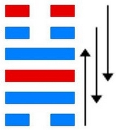
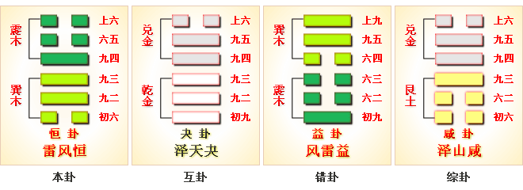

# 恒 ䷟ héng

- No.32

> 恒，亨，无咎，利貞，利有攸往。
>《彖》曰：恒，久也。剛上而柔下，雷風相與，巽而動，剛柔皆應，恒。恒，亨，无咎，利貞，久於其道也。天地之道，恒久而不已也，利有攸往，終則有始也，日月得天而能久照，四時變化而能久成，聖人久於其道而天下化成，觀其所恒而天地萬物之情可見矣。
>《象》曰：雷風，恒，君子以立不易方。

> 初六，浚恒，貞凶，无攸利。
>《象》曰：浚恒之凶，始求深也。

> 九二，悔亡。
>《象》曰：九二悔亡，能久中也。

> 九三，不恒其德，或承之羞，貞吝。
>《象》曰：不恒其德，无所容也。

> 九四，田无禽。
>《象》曰：久非其位，安得禽也。

> 六五，恒其德貞，婦人吉，夫子凶。
>《象》曰：婦人貞吉，從一而終也。夫子制義，從婦凶也。

> 上六，振恒，凶。
>《象》曰：振恒在上，大无功也。

久于其道，立于天地；雷与风行，阴阳相得；尊卑定矣。号令发，而万物生焉。
> 万物得其道也，生者。道，一作进也。

雷风行，而四方齐也。
> 齐者整齐。

与巽为飞伏。
> 辛酉金，庚辰土。

三公治世，应于上六宗庙。
> 宗庙爻。

建己卯至甲申，
> 春分立秋。

金木起度数，积筭起甲申至癸未，周而复始。
> 金木入宫。

五星从位起太白，
> 太白金星入卦用事。

房宿从位降辛酉。
> 房宿入卦，立秋用。

上下二象见木，分阴阳于内外。
> 内巽阴，外震阳。

气候分数三十八。
> 金木入卦分节候。

九三至于阳屯之位，不顺所履，无定其位。
> 恒者，常也。而九三以阳居位，立于阴阳交互之上，是知不久为所然。

《易》云：“不恒其德，或承之羞。”阴阳升降，反于阴。君道渐进，臣下争权，运及于升。
> 次降入升卦。[䷭](e58d87sheng_cn.md)

# [Héng ䷟](e68192heng.md)
