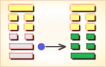
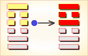

# 损 ䷨


损（sǔn）卦展示“损”的形势下各种变化的可能性。

损卦的代号是`6:1`，表示主卦是兑卦，卦象是泽，阳数是`6`；客卦是艮卦，卦象是山，阳数是`1`。

主卦和客卦的阳数比是`6`比`1`，主方占绝对优势，主方利用自己的优势给客方造成损失，然而客方态度强硬，主方应当恰当给于客方一些利益以获取更多利益。

损卦，山泽损，损益制衡。

图中，红色表示当位的爻，天蓝色表示不当位的爻，箭头表示有应。

- 卦序：41

> 損，有孚，元吉，无咎可貞，利有攸往。曷之用，二簋可用享。
>《彖》曰：損，損下益上，其道上行，損而有孚，元吉。无咎，可貞，利有攸往，曷之用，二簋可用享，二簋應有時，損剛益柔有時，損益盈虛，與時偕行。
>《象》曰：山下有澤，損，君子以懲忿窒欲。

> 初九，已事遄往，无咎，酌損之。
>《象》曰：已事遄往，尚合志也。

> 九二，利貞，征凶。弗損，益之。
>《象》曰：九二利貞，中以為志也。

> 六三，三人行，則損一人。一人行，則得其友。
>《象》曰：一人行，三則疑也。
>《繫辭》：易曰：「三人行，則損一人，一人行，則得其友。」言致一也。

> 六四，損其疾，使遄有喜，无咎。
>《象》曰：損其疾，亦可喜也。

> 六五，或益之十朋之龜，弗克違，元吉。
>《象》曰：六五元吉，自上祐也。

> 上九，弗損，益之，无咎，貞吉。利有攸往，得臣无家。
>《象》曰：弗損益之，大得志也。

### 结构和卦爻辞

损卦的结构和卦爻辞的图中有三个箭头，表示主客之间存在三种和谐关系。第一个箭头，从第四爻指向第一爻，表示行动方面的和谐关系，这两条爻都当位，既当位又有应，是对主方有利因素，主方可以利用客方消极被动的机会，积极主动地大力扩张自己的利益。第二个箭头从第五爻指向第二爻，这两条爻都不当位，不当位而又有应，是对主方不利因素，表明，主方可能遭受损失。如果换一种思维，主方是否能够以自己的暂时损失换取更多利益呢？因为存在前一个有利因素，主方可以做到如此，也就是说，以自己的损失为诱饵，从双方关系获取更多利益。这恰恰是此卦的主题思想。第三个箭头从第三爻指向第六爻，表示在态度方面存在主客之间的和谐，这两条爻都不当位，既不当位而又有应，是对主方不利因素，是主方受到客方制约。而换一个角度考虑，主方可以以柔克刚，加之以利为诱，主方有可能获得更多利益。

卦爻辞进一步说明损卦的主题。“损”在爻辞中都是用作动词，而且，其后都有“之”或“其”，可见，“损的意思是损伤客方，而不是损伤自己。然而，损伤客方必须适当，“酌损之”，并且要适时，“损其疾”，甚至，不损伤客方，反而给客方利益，“弗损益之”，甚至，给予很多利益，“或益之十朋之龟”。也要注意不要让第三方干扰主客双方关系，“三人行则损一人”。

如果从爻辞中删去判断辞，再省略爻的名称，爻辞就是一首完整的围绕主题“损”的散文诗：

```
快去对付他们，适当地让他们受些损失。
不要再让他们受损失，给他们一些好处。
三人同行则有一人受损，一人行则得到朋友。
趁他们有麻烦的时候，让他们受些损失，越快越好。
有时可以馈赠他们极昂贵的灵龟，让他们难以推脱。
不要再让他们受损失，给他们一些好处，
让他们放弃自己的家乡前来臣服。
```

卦辞避开谈对客方造成损失，而是强调给予客方的利益要适当，关键是真诚，“有孚，元吉”。卦辞说“二簋可用享”，向祖先献上最简单的享祀，就能够得到祖先的佑护，用祭祀祖先比喻以适当奉献获取客方帮助。

### 卦辞
```
〖原文〗有孚，元吉，
无咎，可贞，利有攸往。曷之用？二簋可用享。
〖译文〗有了信任，非常吉利，无所怪罪，
可以坚持下去，有利于有所往前发展。
怎么作享祀？用二簋食物即可作享祀。

〖解说〗这是损卦的卦辞，综合说明当前形势。
“孚”是信用，是为人所信赖的意思，“深孚众望”。
在双方关系中，可以理解为谨慎处理客方关系。
损卦有二个爻当位，有四个爻不当位，
卦辞说“有孚”，强调谨慎对待客方。
六个爻全部有应，总的形势有利，卦辞说“元吉”。
如果谨慎对待，则无可怪罪，“无咎”。
主方实力强大，可以坚持下去，“可贞”，主强客弱，“利有攸往”。
言外之义，如果不谨慎对待，则不一定“利有攸往”。
“曷”（hé），古代疑问词，怎么，何时。
“簋”（guǐ），古代盛食物的器具，圆口，两耳。
“享”（xiǎng），享受，享用。这里指享祀，享祀之礼。
享祀之礼，最多的用八簋，一般的用四簋，最少的用二簋。
“曷之用？二簋可用享”意思是，怎么作享祀？用二簋食物即可作享祀。
结合双方关系解释，作享祀的是主方，享受祀祭的是客方。
“曷之用？二簋可用享”是卦名“损”的真正含义。
也就是说，在谨慎对待客方的时候，“利有攸往”，
如何往呢？可以恰当地“诱之以利”。
```

### 卦辞解释
```
损：有孚，元吉，
无咎可贞，利有攸往。曷之用，二簋可用享。
损：减损之道。孚：诚信。咎：过错。
贞：正固。攸往：前进。
曷：通“何”，什么。簋：祭祀的用品。
在有减损的时候，君子要以诚信为准，才会吉祥，
才不会有错误，才可以保证安定，这样有利于继续前进。
在有损的时候，祭祀可以简单，但目的是要诚心诚意。

《彖》曰：损，损下益上，其道上行。
损：乾损一爻变成兑。行：升。
损一爻变成兑，上面增一爻变成艮，
这样损一爻，增一爻的道是上升的。

损而有孚，元吉，无咎。可贞。
损：减损之道。孚：诚信。咎：过错。贞：安稳。
在有减损的时候，君子要以诚信为准，
才会吉祥，才不会有错误，才可以保证安定。

利有攸往。曷之用？二簋可用享。
攸往：前进。曷：通“何”，什么。簋：祭祀的用品。
这样有利于继续做大事。
在有损的时候，祭祀可以简单，但目的是要诚心诚意。

二簋应有时。损刚益柔有时。
簋：祭祀的用品。有时：有的时候。损：减损。
作为祭祀只是有的时候，但是要诚信诚意。
这样减少乾的一阳爻，增加坤的一阳爻，变为艮。

损益盈虚，与时偕行。
损：减损，减少。益：增加。盈：满。
君子不要有分别心，懂得有减损有增益，有满有虚，
就可以放好心态，减少苦恼，等待时机做大事。
虞翻曰：君子，泰乾。乾阳刚武，为忿。
坤阴吝啬，为欲。损乾之初成兑说，故“惩忿”。
初上据坤，艮为止，故“窒欲也”。
《象》曰：山下有泽，损。君子以惩忿窒欲。
惩（chéng）：惩戒、抑制心情。
忿（fèn）： 忿恨不平，这里指“总看别人占便宜，
自己占不到便宜却有损失而忿恨不平”。
窒：窒息，这里指抑止。
欲：欲望，（多得利益，不受损失的欲望）。
解释：山下有泽，是减损的征象（征兆），
这时君子应该惩戒自己减损的忿恨，抑止自己增益的欲望。

〖综述〗
损卦，有诚信，大吉大利，没有咎害，可正固。
有利于前往。用什么？两簋就可以用来祭享。
彖曰：损，损下益上，其道上行。损而有孚，元吉，无咎，可贞。
利有攸往，曷之用？二簋可用享。
二簋应有时，损刚益柔有时。损益盈虚，与时偕行。
损卦，减损下边的泽泥，增益上边的山林，运行之道是向上走。
损减自己而得到大家信服，动因（出发点）吉利，没错误，可坚持。
有利于前往。拿什么用来共享？二簋就可以用来共享。
使用二簋祭享应当有时，因为减损阳刚、增益阴柔有时。
减损增益、盈满亏虚，都是伴随着时序运行的。
```

### 一阳
```
〖原文〗已事遄往，无咎；酌损之。
〖译文〗阻止事态发展，迅速去办帮助别人，
无所怪罪；酌情量力而为。
〖解说〗这是损卦第一爻爻辞。
第一爻是主卦下爻，代表主方的行动，阳，
表示主方积极主动地谋取和扩大自己的利益，
比如说，创新、创业、投资、进攻、求职、示爱，等等。
第一爻位置是阳位，阳爻在阳位，当位；
同时，它与第四爻有应，既当位又有应，是有利因素。
但是，从总体上看，爻辞更强调策略。
“已”（yǐ），停止，艮止也。
“遄”（chuán），快，迅速。
“已事遄往”，阻止事态，迅速去办。
“酌”（zhuó），斟酌，估量，酌情办理。
“之”（zhī），指示代词，“这”，“那”。
“损之”是给客方造成损失。
“酌损之”是说酌情造成损失，量力而为。

〖结构分析〗第一爻位置是阳位，
这条爻是阳爻，阳爻在阳位，当位，又与四阴有应。
当位，表明主方积极主动，
有可能从双方关系获益，是潜在的对主方有利因素；
有应，表明客方消极被动，给了主方积极主动谋利的机会，
那潜在因素成了真正的对主方有利因素，
所以爻辞说“酌损之”。这里强调“酌”，是从全局考虑。
```

### 二阳
```
〖原文〗利贞，征凶；弗损，益之。
〖译文〗利于坚持下去，征伐有凶险；不要损伤他，给他以利益。
〖解说〗这是损卦第二爻爻辞。
第二爻是主卦中爻，代表主方素质，阳，表示主方素质良好，
比如说，主方有资金、有地位、有权力、有实力、有技术，等等。
主方应当慎重使用力量，以免被客方利用，
应当保持当前有利状态，“利贞”。
盲目行动有风险，“征凶”。为了能够给客方造成损失，
主方应当设法给客方以利诱，“弗损，益之”。

〖结构分析〗第二爻位置是阴位，
这条爻是阳爻，阳爻在阴位，不当位，不过与五阴有应。
不当位，表明主方的良好素质有可能遭受损失，
是潜在的对主方不利因素；
有应，表明客方素质不佳，希望从主方获益，
那潜在因素成了真正的对主方不利因素，爻辞说“利贞，征凶”。
换一个角度思维，为了最终从客方获益，
主方可以用自己的良好素质作诱饵，制服客方，
所以，爻辞又说“弗损，益之”。
```

### 三阴
```
〖原文〗三人行则损一人，一人行则得其友。
〖译文〗三人同行难以同心协力，必有一人离去，
一人出行专一求合则得到朋友。
〖解说〗这是损卦第三爻爻辞。
第三爻是主卦上爻，代表主方态度，阴，表示主方态度随和。
“三人行”指除了主客双方以外，再有第三方卷入当前关系，
这样的话，有一方将受到损害，对于主方是不利的。
如果主方态度强硬，就有可能与态度强硬的客方冲突，
导致第三者插入，这对双方都不利。
如果主方保持随和态度，则可能与客方和谐相处，
得到客方作朋友。主方应当保持随和的态度。

〖结构分析〗第三爻位置是阳位，
这条爻是阴爻，阴爻在阳位，
不当位，不过与六阳有应。
不当位，表明主方态度随和，
有可能受客方制约，是潜在的对主方不利因素；
有应，表明客方态度强硬，可能制约主方，
那潜在因素成了真正的对主方不利因素。
从全局看，尽管存在这样的不利因素，
主方应当保持与客方的和谐关系，
这样有助于主方获得更多利益，所以爻辞说，“一人行则得其友”。
```

### 四阴
```
〖原文〗损其疾，使遄，有喜，无咎。
〖译文〗减轻那个患病的人疾病，
快速行动，将有喜讯，无所怪罪。
〖解说〗这是损卦第四爻爻辞。
第四爻是客卦下爻，代表客方的行动，阴，表示客方被动。
“疾”（jí），像中箭那样危急的病，身体很不舒适。
“使”（shǐ），派遣，差遣，支使。
“遄”（chuán），快，迅速。
客方消极被动，减少客方受到损失，“损其疾”。
抓住机遇，迅速行动，会有收获，“使遄，有喜”。
如果这么做，就对了，“无咎”。

〖结构分析〗第四爻位置是阴位，
这条爻是阴爻，阴爻在阴位，当位，又与一阳有应。
当位，表明，客方消极被动有可能是主方发展的机遇，
是潜在的对主方有利因素；有应，表明主方积极主动，
正好可以利用客方的消极被动获取利益，
那潜在因素成了真正的对主方有利因素，
主方利用客方消极被动的机会是应当的，所以爻辞说“无咎”。
```

### 五阴
```
〖原文〗或益之十朋之龟，弗克违，元吉。
〖译文〗或者给予他价值连城的宝龟，
很多利益，以致他不能推脱，非常吉利。
〖解说〗这是损卦第五爻爻辞。
第五爻是客卦中爻，代表客方素质，阴，表示客方素质不佳，
比如说，资金缺乏、地位底下、实力薄弱、教育程度低，等等。
“或”（huò），连词，表示选择关系，或多或少。
“朋”（péng），古时货币。
“龟”（guī），古时用龟于占卜。
“十朋之龟”表示非常珍贵的礼物。
“违”（wéi），背离，不依从；违背，违约，阳奉阴违。
主方素质良好，可以给予客方一些利益，
引诱客方，这样对主方非常吉利。

〖结构分析〗第五爻位置是阳位，
这条爻是阴爻，阴爻在阳位，
不当位，不过与二阳有应。
不当位，表明客方素质不佳，
有可能向主方索取利益，是潜在的对主方不利因素；
有应，表明主方素质良好，正好可以满足客方需要，
那潜在因素成了真正的对主方不利因素。
然而，从总体看，主方正可以依靠自己实力上的优势，
给予客方足够实惠，以从客方谋取更多利益，所以爻辞说，“元吉”。
```

### 六阳
```
〖原文〗弗损，益之，无咎；
贞吉，利有攸往，得臣，无家。
〖译文〗不要减损他们的利益，
增益他们利益，就无人怪罪；
坚持下去吉利，宜于有所前进，
客方放弃原来立场，又能得到一位贤臣的辅佐。
〖解说〗这是损卦第六爻爻辞。
第六爻是客卦上爻，代表客方态度，阳，表示客方态度强硬。
客方虽然素质不佳，但是态度强硬，而主方态度随和，阴阳有应，
在这种情况下，应当不损伤客方而以利诱之，“弗损，益之”，“无咎”。
坚持下去吉利，“贞吉”。这有利于主方向前推进，
“利有攸往”。“得臣”，客方降服为臣。
“无家”，放弃原来立场。
结果，客方降服而放弃原来立场，“得臣，无家”。

〖结构分析〗第六爻位置是阴位，
这条爻是阳爻，阳爻在阴位，
不当位，不过与三阴有应。
不当位，表明客方态度强硬，
有可能制约主方，是潜在的对主方不利因素；
有应，表明主方态度随和，正好受到客方制约，
那潜在因素成了真正的对主方不利因素。
尽管存在这种不利因素，从全局看，
如果主方保持随和态度，与客方维持和谐关系，
最后，客方有可能摒弃原来立场，臣服于主方，
这样，主方最终获得更多利益。
客方立场的改变取决于客方自己，主方不能强求，
但是，主方对客方所作的各项优惠措施，将促使客方转化，
事物自身总是遵循螺旋型变化规律，客方自己也会变化的，
从艮卦变成坤卦，顺从主方，当然，主方必须有耐心，谋求“元吉”发生。
```

### 爻辞解释
```
损①：有孚，元吉，无咎，可贞；利有攸往。
曷②之用？二簋可用享③。
初九，已事遄往④，无咎；酌损之⑤。
九二，利贞，征凶；弗损益之?⑥。
六三，三人行，则损一人；一人行，则得其友。
六四，损其疾⑦，使遄有喜，无咎。
六五，或益之十朋之龟⑧，弗克违⑨，元吉。
上九，弗损益之，无咎，贞吉。有攸往，得臣无家⑩。

①损：六十四卦卦名之一。
乃论述与敌国交往中不需要受损，就获得利益。
或在万不得已的情况下，
适当减损自己一部分利益而去获得更大利益之卦。
②曷（hé 何）：何；什么。
③二簋可用享：“簋（guǐ 鬼），古盛饭器具。“享”，祭祀。
此句为用二簋粗淡食物作祭祀就可以了。
④已事遄往：“已”，停止。“遄”（chuán 船），急。
此句为停止所事急忙前往。
⑤酌损之：适当减损一些利益。
⑥弗损益之：在不使自己一方有任何损失的情况下去获得收益。
⑦损其疾：“疾”，灾祸，危难。此句为乘对方之灾危去借机损伤对方。
⑧或益之十朋之龟：“朋”，古为货币单位，两枚为一朋。“龟”，指神龟。
此句为敌对一方能奉送一个价值十朋的大神龟。
⑨弗克违：不要推辞。
⑩得臣无家：言惠及天下，万民归心。
```

《损》卦谈的是减损自己的卦。但是这种减损，并不意味着损伤自己一部分利益去援助别人，也不是一般的损人利己；而是如何在不使自己一方受到丝毫损伤的情况下去获得相当的利益，和如何在不得已的情况下适当减损或放弃一部分利益而去追求更大更多的利益。这是《损》卦最本质的东西。当然，这种《损》卦的卦义是为了国家政权角逐和用兵之道服务的，它绝不涉及一般的人与人之间的道德问题。

### 白话解析
```
损：有復，元吉，无咎，可贞，
利有攸往，曷①之用二巧，可用芳②。
【注释】
①曷，假为割。
②芳：借为享，祭祀。
【白话】筮占得损卦，有复归诚信之象，有大吉、无咎、可贞之占，
利于有所往行，可以使用上等技术的厨师切割的祭牲进行祭祀。
【讲解】损卦下卦为兑卦，上卦为艮卦，
居于艮宫第四卦，帛书第十二卦。损与益义相反。

初九：巳事①端②往，无咎，酌损之。
【注释】
①巳事：祀事。
②端：开始。
【白话】筮得损卦，占得初九，
祭祀开始前就去，没有灾咎，酌情损减一些活动。
【讲解】初九阳刚与六四阴柔相应，
损阳刚益阴柔，损下卦益上卦，上下相应，所以无咎。

九二：利贞，正①凶，弗损益之。
【注释】①正：通征，征伐。
【白话】筮得损卦，占得九二，适合于贞问，
征伐他国则凶险，不能损害自己的阳刚正气而用柔弱之性。
【讲解】九二，阳刚居阴柔之位，上应于六五阴柔之君，
用柔悦的态度取悦于上，所以丢失了阳刚正气，所以得凶占。

六三：三人行则损一人，一人行则得其友①。
【注释】①友：朋友。
【白话】筮得损卦，占得六三，
三人同路一人掉队，一人出门行走却得到了朋友。
【讲解】损卦的下卦本来为乾卦，上卦本来是坤卦，
下卦乾损去上爻给上卦坤的上爻，这就叫“三人行则损一人”，
上卦坤的上爻下到下卦乾卦的上爻，这就叫“一人行则得其友”。

六四：损其疾①，事端有喜，无咎。
【注释】①疾：毛病。
【白话】筮得损卦，占得六四，克服身上的坏毛病，
事情一开始就有喜，得到没有灾咎的占断。
【讲解】六四以柔阴之爻居于阴柔之位，
得到初九的阳刚以为应，所以初九言“事端”，六四也言“事端”。

六五：益之，十傰①之龟，弗克回②，元吉。
【注释】
①傰：借为朋贝。
②弗克回：不能少于那个价。克，能。弗，不。回，违背。
【白话】筮得损卦，占得六五，大龟的价钱增加十朋贝，
绝不能少于这个价钱，所以得大吉之占。
【讲解】前人都是用龟从、筮从、人从、
鬼神从等意义去说解“弗克（回）违”这一爻辞的。
此则从市场价格方面做了诠释。

尚九：弗损益之，无咎。贞吉，有攸往，得仆①无家。
【注释】①仆：家内奴隶。
【白话】筮得损卦，占得尚九，
不损害自我却帮助别人，就没有灾咎，
贞问得吉善之占，有所往，得到了无家可归的奴隶。
【讲解】损卦的意义有三种。
第一种，损己从人，六四、六五两爻便是这样。
第二种，自损以益于人，下卦三爻。
第三种，行损道以益于人，尚九是也。
```

### 全卦内容

此卦由泽下山上组成卦辞的“损：有孚，元吉，无咎，可贞；利有攸往。曷之用？二簋可用享”，是说作为言谈减损之道的《损》卦，它含有诚实信用，含有大吉大利，它亦无有灾祸，也可以贞正；它更宜于前往办事。作为减损之道的《损》卦怎么用呢？它只需要用二簋粗淡的食物祭祀一下神灵，以示自己的诚心就足够了。
1. “初九”爻辞的“已事遄往，无咎；酌损益之”，是说若有要紧事，需要停止自己所做的事急忙前往，这也没有灾祸；但是不过适当斟酌减损自己一部分利益就可以了。这一爻的“已事遄往”有上乘《解》卦的“负且乘，致寇至”这一含义。
2. “九二”爻辞的“利贞，征凶；弗损益之”，是说如果一切都顺利贞正， 即在不需使用武力的情况下就能解决问题，那使用武力进行侵伐则是一种灾祸；这时最好的办法还是不用征伐或侵伐，即在不作任何损失（自然包括兵员和财力）的情况下去获得收益。这一爻的意思颇有些“上兵伐谋”的含义。
3. “六三”爻辞的“三人行，则损一人；一人行，则得其友”，此一爻颇有些结盟性质的含义，也可能有《比》卦“比之无首，凶”的含义，说的主要就要使自己处于主导地位，有若如群雄角逐，必然要损失另一方之义。
4. “六四”爻辞的“损其疾，使遄有喜，无咎”，是说当敌对两国对峙之时，若敌对国家有疾灾之祸，那就正好乘对方灾危予以攻灭，使自己一方急速获得喜庆，千万莫做妇人之仁，这样做的结果将不会给本国带来任何灾祸，也不算什么过错。
5. “六五”爻辞的“或益之十朋之龟，弗克违，元吉”，是说若被侵伐的国家能主动奉送十朋的大神龟，那就不要推辞，要收下，这乃天赐良机，这乃意味着很大的吉祥。
6. “上九”爻辞的“弗损益之，无咎，贞吉。有攸往，得臣无家”，前一 句是说在不作任何损失的情况下就能获得收益，这样将无灾祸，也很吉祥。后一句是说在这时要勇于前去办事，它将会惠及天下，万民归心。


### 《断易天机》解

损卦艮上兑下，为艮宫三世卦。损象征损益、减少，为损己之兆，多主不吉，但只要坚守诚信，就会有利。

### 北宋易学家 邵雍 解

损下益上，损盈益虚；先难后易，量入为出。

得此卦者，损己利人，虽然开始会有所不顺，但付出总会有所回报，因祸得福之象。

### 台湾国学家 傅佩荣 解

- 时运：心平气和，才有发展。
- 财运：和气生财，损己利人。
- 家宅：地势宜平；夫妇得正。
- 身体：修身养性。

### 传统解卦
```
这个卦是异卦，下兑上艮，相叠。艮为山；兑为泽。
上山下泽，大泽浸蚀山根。损益相间，损中有益，益中有损。
二者之间，不可不慎重对待。损下益上，治理国家，过度会损伤国基。
应损则损，但必量力、适度。少损而益最佳。

《象传》：山高水深，各得其所，因损得益之象。
```

运势：现况诸事不顺，有破财之象，虽先损失，但后反而得益，因祸得福。

- 事业：开拓事业要有所投入，投入多少应事先精心算计，力求损益得当。诸事皆应有节度，切忌欺诈、贪婪。天下事克己最难，务必严格要求自己，刻苦奋斗，手段灵活，争取事业成功。
- 经商：全面调查市场行情，计算投入和收益的比例。不必过于计较利润的多少，获利即可。真诚与他人合作，彼此信任，手段灵活，切勿自我封闭。
- 求名：为了成长进步，务必有所投入，且应付诸实践。以损增益，成就理想。
- 婚恋：全面权衡对方的长处与短处，应从大处着眼。
- 决策：为人聪颖，善于权衡利弊。顺应自然发展规律，积极主动与他人合作，助人为乐，适度投入，资助他人，而自己要宁俭勿奢。如此，诸事都可以十分顺利。

### 台湾 张铭仁 解卦
```
损：表示小有损失也，主凶中带吉之象。
「赛翁失马、焉之非福」是此卦最好的解释。
投资、事业、借贷、感情皆是失意不顺之时，然对事要有信心，
学得经验将可得到更好的结果。若将要投资则不可。

解释：有所损害、损失。

特性：心地善良，富同情心，悲天悯人，
体贴他人，善于照顾，安慰别人。
牺牲小我，完成大我精神，生活节俭，大方助人。
```

运势：诸事不如意，若倾于利欲不当之心则有灾，散财之损。必须能够悟其所损，方能挽回局势。与人共事商量则可收损失之象。

- 家运：正处于受损之时，审慎挽救颓势也。
- 疾病：现况病情虽重，积极治疗可愈。身体较衰弱，注意肠胃、咽喉、贫血等疾。
- 胎孕：产母有凶象。
- 子女：儿女多诚实孝顺，幸福之格。
- 周转：可达目的。
- 买卖：虽有损，但终得利。
- 等人：可能会迟到。
- 寻人：在东北或西方友人家中，可寻。否则会自回。
- 失物：不能寻回。
- 外出：有益可行。注意节省费用，防止损多于益。
- 考试：多努力，榜上可题名。
- 诉讼：有斗争之象，损失破财，和解反而获益。
- 求事：可慢慢受重用。
- 改行：可行，勿急躁，宜周密行事。
- 开业：吉利，宜有耐力。

### 初九爻辞

初九。已事遄往，无咎，酌损之。

《象》曰：已事遄往，尚合志也。

### 白话文解释

初九：祭祀大事，得赶快去参加，这才不会有灾难。祭品过丰，可以酌情减损。

《象传》说：“祭祀大事，得赶快去参加”，这是体现了敬畏鬼神的心意。

### 北宋易学家 邵雍 解

平：得此爻者，谋事得当，可获利，不良者，或因酒食误事。做官的会因为工作忙碌而顾不得家庭，声望日盛。

### 台湾国学家 傅佩荣 解

- 时运：加进努力，或仍有望。
- 财运：判断准确，自有利益。
- 家宅：早些迁移；即日迎娶。
- 身体：立即行动。

### 初九变卦：山泽损 变卦 山水蒙


初九爻动变得[第4卦：山水蒙](e89299meng_cn.md)。

这个卦是异卦，下坎上艮，相叠。

艮是山的形象，喻止；坎是水的形象，喻险。

卦形为山下有险，仍不停止前进，是为蒙昧，故称蒙卦。

但因把握时机，行动切合时宜，因此，具有启蒙和通达的卦象。

### 九二爻辞

九二。利贞，征凶。弗损，益之。

《象》曰：九二利贞，中以为志也。

### 白话文解释

九二：吉利的卜问。征伐他国则凶。因为这样作对于他国非但不能损伤，反而有利。

《象传》说：九二爻辞讲的吉利的卜问，因为九二之爻居下卦中位，像人行事以处正守贞为心。

### 北宋易学家 邵雍 解

凶：得此爻者，宜谨守勿动。做官的时机未成熟，难于升迁。

### 台湾国学家 傅佩荣 解

- 时运：中庸处世，自有好运。
- 财运：货物合宜，应可获利。
- 家宅：守之则吉；门当户对。
- 身体：平常状态。

### 九二变卦：山泽损 变卦 山雷颐



九二爻动变得[第27卦：山雷颐](e9a290yi_cn.md)。

这个卦是异卦，下震上艮，相叠。

震为雷，艮为山。

山在上而雷在下，外实内虚。

春暖万物养育，依时养贤育民。

阳实阴虚，实者养人，虚者为人养。自食其力。

### 六三爻辞

六三。三人行，则损一人；一人行，则得其友。

《象》曰：一人行，三则疑也。

### 白话文解释

六三：三人同行，难免意见分岐，必有一人被孤立。一人独行，孤单无助，则主动邀人作伴。

《象传》说：一人独行，凡事自作主张，事无掣肘。三人同行，遇事各持己见，滋生疑惑。

### 北宋易学家 邵雍 解

平：得此爻者，合力经营，获利者多，未婚者配。做官的与同僚关系融洽，进取有望。

### 台湾国学家 傅佩荣 解

- 时运：双月有利，不可贪多。
- 财运：一人独资，不会损失。
- 家宅：一家二丁；得偶为吉。
- 身体：寡欲修身。

### 六三变卦：山泽损 变卦 山天大畜


六三爻动变得[第26卦：山天大畜](e5a4a7e89384daxu_cn.md)。

这个卦是异卦，下乾上艮，相叠。

乾为天，刚健；艮为山，笃实。

畜者积聚，大畜意为大积蓄。

为此不畏严重的艰难险阻，努力修身养性以丰富德业。

### 六四爻辞

六四。损其疾，使遄有喜，无咎。

《象》曰：损其疾，亦可喜也。

### 白话文解释

六四：要消除疾病，赶快求巫祭神，病就会有好转，必无灾难。

《象传》说：“求巫祭神消除疾病”，也是可喜之事。

### 北宋易学家 邵雍 解

平：得此爻者，多喜庆之事，有灾者转好运，有病者愈，有忧者转喜。做官的闲职者将被起复。

### 台湾国学家 傅佩荣 解

- 时运：小灾之后，转忧为喜。
- 财运：减少货物，信之有利。
- 家宅：阴气过剩，祈祷可安；婚姻可喜。
- 身体：立即就医，否则堪虑。

### 六四变卦：山泽损 变卦 火泽睽



六四爻动变得[第38卦：火泽睽](e79dbdkui_cn.md)。

这个卦是异卦，下兑上离，相叠。

离为火；兑为泽。

上火下泽，相违不相济。

克则生，往复无空。

万物有所不同，必有所异，相互矛盾。睽即矛盾。

### 六五爻辞

六五。或益之，十朋之龟，弗克违。元吉。

《象》曰：六五元吉，自上佑也。

### 白话文解释

六五：有人送给他价值十朋的大龟，这不能拒而不收，得龟用于占卜这是大吉之事。

《象传》说：六五爻辞讲的大吉大利，因为上天保佑他，赐以灵龟，所以大吉。

### 北宋易学家 邵雍 解

吉：得此爻者，运势大好，财利丰富。做官的会得到领导的赞赏和提拔。读书人会取得佳绩。

### 台湾国学家 傅佩荣 解

- 时运：运势大好，意外之助。
- 财运：利润自来，不必推辞。
- 家宅：家业兴隆；天作之合。
- 身体：病愈得财。

### 六五变卦：山泽损 变卦 风泽中孚


六五爻动变得[第61卦：风泽中孚](e4b8ade5ad9azhongfu_cn.md)。

这个卦是异卦，下兑上巽，相叠。

孚本义孵，孵卵出壳的日期非常准确，有信的意义。

卦形外实内虚，喻心中诚信，所以称中孚卦。这是立身处世的根本。

### 上九爻辞

上九。弗损，益之，无咎。贞吉。利有攸往，得臣无家。

《象》曰：弗损益之，大得志也。

### 白话文解释

上九：不要减损，不要增益，一任其旧，没有灾难，卜问得吉兆。筮遇此爻，有所往则必获利，将得到一单身奴隶。

《象传》说：不要减损，不要增益，公允执中，如此行事，平生志愿当能实现。

### 北宋易学家 邵雍 解

吉：得此爻者，贵人扶持，财利可期。做官的会得到下属的爱戴，领导的器重。

### 台湾国学家 傅佩荣 解

- 时运：一帆风顺，所图可成。
- 财运：物价平平，获利不少。
- 家宅：不必改造。
- 身体：出外求医。

### 上九变卦：山泽损 变卦 地泽临


上九爻动变得[第19卦：地泽临](e4b8b4lin_cn.md)。

这个卦是异卦，下兑上坤，相叠。

坤为地，兑为泽，地高于泽，泽容于地。

喻君主亲临天下，治国安邦，上下融洽。

# [Sǔn ䷨](e68d9fsun.md)
