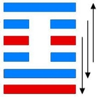

# 损 ䷨ sǔn

- No.41

> 損，有孚，元吉，无咎可貞，利有攸往。曷之用，二簋可用享。
>《彖》曰：損，損下益上，其道上行，損而有孚，元吉。无咎，可貞，利有攸往，曷之用，二簋可用享，二簋應有時，損剛益柔有時，損益盈虛，與時偕行。
>《象》曰：山下有澤，損，君子以懲忿窒欲。

> 初九，已事遄往，无咎，酌損之。
>《象》曰：已事遄往，尚合志也。

> 九二，利貞，征凶。弗損，益之。
>《象》曰：九二利貞，中以為志也。

> 六三，三人行，則損一人。一人行，則得其友。
>《象》曰：一人行，三則疑也。
>《繫辭》：易曰：「三人行，則損一人，一人行，則得其友。」言致一也。

> 六四，損其疾，使遄有喜，无咎。
>《象》曰：損其疾，亦可喜也。

> 六五，或益之十朋之龜，弗克違，元吉。
>《象》曰：六五元吉，自上祐也。

> 上九，弗損，益之，无咎，貞吉。利有攸往，得臣无家。
>《象》曰：弗損益之，大得志也。

泽在山下，卑险于山；山高处上，损泽益山。成高之义，在于六三。在臣之道，奉君立诚。《易》云：“损下益上。”
> 乾九三变六三阴柔，益上九，臣奉君之义。

与兑为飞伏。
> 丁丑土，丙申金。

三公居世，宗庙为应。
> 六三，上九。

建始癸巳至戊戌，
> 小满至寒露。

积筭起戊戌至丁酉，周而复始。
> 土火入宫起积筭。

五星从位起太阴，
> 太阴水星入卦用事。

觜宿从位降丁丑，
> 二十八宿配觜宿入损卦，六爻三起筭岁月日时。

土星入卦配吉凶，阴阳相荡位不居。
> 土金入损卦起筭，阴阳相生，六位变动不居也。

六爻有吉凶，四时变更，不可执一以为规。
> 六爻吉凶，随时更变。或春或夏，或秋或冬，岁时运动。

分气候二十八。
> 二十八起数，筭吉凶入卦。

阴阳升降，次艮入离，见睽之象。损益六爻，刚长阴。次入火泽睽卦。

# [Sǔn ䷨](e68d9fsun.md)
