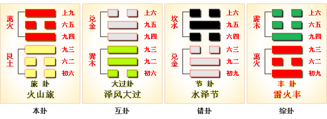

# 旅 ䷷


旅（lǚ）是`1:5`卦的卦名，`1:5`是旅卦的代号。
“旅”，出行的，在外作客的，旅行。

`1:5`卦的主卦是`1`卦艮卦，卦象是山，特性是被动和阻止，阳数是`1`；客卦是`5`卦离卦，卦象是火，特性是明亮和依赖，阳数是`5`。

主方像山一样静止不动，比喻为旅店，聪敏爱动的客方比喻为旅客。
此卦以旅店和旅客的关系比拟当前的主客双方关系。

旅卦，火山旅，依义顺时。这个卦是异卦，下艮上离，相叠。此卦与丰卦相反，互为“综卦”。
山中燃火，烧而不止，火势不停地向前蔓延，如同途中行人，急于赶路。因而称旅卦。
图中，红色表示当位的爻，天蓝色表示不当位的爻，箭头表示有应。

- 卦序：56

> 旅，小亨，旅貞吉。
>《彖》曰：旅，小亨，柔得中乎外而順乎剛，止而麗乎明，是以小亨，旅貞吉也，旅之時義大矣哉。
>《象》曰：山上有火，旅，君子以明慎用刑而不留獄。

> 初六，旅瑣瑣，斯其所取災。
>《象》曰：旅瑣瑣，志窮災也。

> 六二，旅即次，懷其資，得童僕貞。
>《象》曰：得童僕貞，終无尤也。

> 九三，旅焚其次，喪其童僕，貞厲。
>《象》曰：旅焚其次，亦以傷矣。以旅與下，其義喪也。

> 九四，旅于處，得其資斧，我心不快。
>《象》曰：旅于處，未得位也；得其資斧，心未快也。

> 六五，射雉，一矢亡，終以譽命。
>《象》曰：終以譽命，上逮也。

> 上九，鳥焚其巢，旅人先笑後號咷，喪牛于易，凶。
>《象》曰：以旅在上，其義焚也；喪牛于易，終莫之聞也。

### 起卦

《旅》卦所说的“旅”，指离家外出，滞留他乡。经商、逃难、周游列国等等，可说是五花八门，只是今天所说的旅游怕不能包括在内。古人安士重迁，把长期离家看成是万难的事。正是针对这种“难”的情绪和事实，《旅》卦讲述了在漂泊中寻求安居的原则。卦辞表明，出门在外，当以柔顺持中为本。卦中六爻，凡柔顺中和者得吉，刚强高傲者则凶。这方面道理好说而不好做，做起来必须因时制宜，所以我们应常持光明磊落的态度，柔和顺其自然，把握中庸原则，才能转危为安。

起卦前必须客观地、全面地、准确地分析主方和客方的情况，必须至少符合下列条件之一，此卦才有参考价值：

1. 主方与山很相似，客方与火很相似。
2. 主方的阳数是`1`，客方的阳数是`5`。
3. 主方的行动是阴，素质是阴，态度是阳；客方的行动、素质和态度也是阳、阴和阳。

切勿用任何随机数方式起卦，否则此卦不能用作决策工具。

### 结构和卦爻辞

旅卦是六十四卦的一个别卦。别卦指代表类别的卦，代表从主方的角度看主客双方关系的形势。别卦中的线叫爻，爻的位置从下往上数。按阴阳趋于和谐的规律，第一、三、五爻的位置叫阳位，第二、四、六爻的位置叫阴位，阳爻在阳位，位置适当，叫当位。阴爻在阴位也是当位，否则不当位。

当位对主方有利，在结构图中以黑色表示。不当位的爻以灰色表示，对主方不利。在这个别卦中，只有二阴和三阳当位，其它的爻不当位。主卦指别卦下部三条爻组成的经卦，代表主方。别卦上部三条爻组成的经卦叫客卦，代表客方。主卦与客卦相应的爻，如果是一阴一阳，叫有应。当位而有应是对主方有利的因素，不当位而有应是对主方不利的因素，不有应是潜在因素。别卦的结构图中，用箭头表示有应，箭头的方向是从阴爻到阳爻。这个别卦中，只有两条下爻有应，而且不当位，主方被动，客方主动，主方受客方控制，是对主方不利的因素。客卦的三条爻全部不当位，主客双方关系中的问题主要来自客方，然而客方决定于客方，主方不能改变，只能期待和应对。主卦只有下爻不当位而有应，主方应当着力改变它，尽力扭转消极被动为主动。

在分析卦的结构的时候，还要考虑常规变化，用阳数表示，其规律是4、5、6、7、3、2、1和0。现在主卦的阳数是1，主方经历了从乾卦到艮卦的衰落过程，阳数从7下降到了1，很难逆转。因此，主方很难完全扭转消极被动，只能是阴中有阳，顺从客方，在适当的时候采取主动，维护自己的利益，避免进一步衰落。

旅卦的卦辞和四条爻辞中都有“旅”，“旅”是主题，形象地比拟当前的双方关系，主方是旅店，客方是旅客。第一爻说明旅行是麻烦琐碎的事，是旅行者自己寻来的灾难；第二爻说，旅行者付了钱，在旅馆住下了；第三爻说，旅客烧了旅馆，失去了旅馆服务的童仆；第三爻说，旅行者住在野外；第五爻说，射野鸡，丢了箭；第六爻说，旅行者先喜后悲。卦辞则讲述在类似旅行的状态下主方应当做的事。从爻辞中删去判断词，这六条爻辞就是一首完整的围绕主题“旅”的散文诗。下面是其译文。

```
旅行是琐碎麻烦的事，是旅行者自己所寻取的灾难。
旅行者在旅馆住下了，用怀中的钱，得到了童仆，
旅行者烧了他的住处，丧失了他的童仆，
旅行者住到荒野去了，省了旅费，我心中不愉快。
（我）射野鸡，反丢了一只箭，（不过）终于以此取得欢乐。
（像是）焚烧了鸟巢，旅行者先笑后大哭；
（又像是王亥）在易国丢失了牛。
```

### 卦辞
```
〖原文〗小亨，旅贞吉。
〖译文〗少许顺利，在旅行中坚持下去吉利。
〖解说〗主客双方的素质都不佳，
而态度又都强硬，互相有冲突。
不过，主方的消极被动可以适应客方的积极主动，
客方可以推动主方，使得主方有所发展。
所以，主方的事情进展少许顺利。
这种状态类似于旅店接待旅客，旅店满足旅客的要求，
可以挣到钱。这种状态，坚持下去对于主方吉利。
```

### 解释
```
旅：小亨，旅贞吉。

译文：
旅卦山上有火。
旅行，旅居在外，外出。
亲朋寡少。不安定像。
火灾，火山，火把，烟火台。
居不安，而道不废，火丽高而明而慎。
旅卦。小顺利。在旅途中守持中正是吉祥的。

《象传》：
这一卦，下卦“艮”是山，上卦“离”是火，
山上烧火，火势蔓延，不停的往前燃烧，
就像旅行的人，急着赶路居无定所，所以称作旅卦。

旅：小亨，旅贞吉。
【白话】《旅卦》象征旅行：小心谦顺可以亨通，
旅行虽是小事，但能坚守正道必然吉祥。

《象》曰：山上有火，旅；君子以明慎用刑，而不留狱。
【白话】《象传》说：
《旅卦》的卦象是艮（山）下离（火）上，
为火势匆匆蔓延之表象，象征行旅之人匆匆赶路；
君子观此应谨慎使用刑罚，明断决狱。
```

### 一阴爻
```
〖原文〗旅琐琐，斯其所取灾。
〖译文〗旅行是琐碎麻烦的事，是旅行者自己所寻取的灾难。
〖解说〗第一爻是主卦的下爻，
代表主方的行动，阴，表示主方消极被动，
比如说，防守、退却、不想冒险、
不想探索或开辟新的发展领域、只求保持现状，等等。
消极被动的主方静静地呆在家中，麻烦是客方招来的。
“琐”（suǒ），细小，零碎：琐事。
“斯”（sī），这，这个，这里：斯人。

〖结构分析〗第一爻的位置是阳位，
这条爻是阴爻，不当位，不过与四阳有应。
主方的消极被动与客方的积极主动是和谐协调的，
但是，主方受客方控制，对主方不利，主方应当着力扭转被动状态。
```

### 二阴爻
```
〖原文〗旅即次，怀其资，得童仆，贞。
〖译文〗旅行者在旅馆住下了，
用怀中的钱，得到了童仆，坚持下去。
〖解说〗第二爻是主卦的中爻，
代表主方的素质，阴，表示主方的素质不佳，
比如说，资金缺乏、地位底下、实力薄弱、教育程度低，等等。
主方需要客方的帮助。客方的素质也不佳，双方只能平等交换。
客方住下了旅馆，主方得到了钱，客方得到了服务。
这是正常的，坚持下去。
“即”（jí），到，开始从事：即位。
“次”（cì），旅行所居止之处所：旅次。

〖结构分析〗第二爻的位置是阴位，
这条爻是阴爻，当位，然而与五阴不有应。
主方的素质不佳，客方的素质也不佳，
主方不能直接从客方获益，不过，可以通过相互交往，达到与客方互利。
```

### 三阳爻
```
〖原文〗旅焚其次，丧其童仆，贞厉。
〖译文〗旅行者烧了他的住处，
丧失了他的童仆，坚持下去困难。
〖解说〗第三爻是主卦的上爻，
代表主方态度，阳，表示主方态度强硬。
同时，客方态度也强硬，双方有冲突，“旅焚其次，丧其童仆”。
在这种冲突状态下，坚持下去有困难。

〖结构分析〗第三爻的位置是阳位，
这条爻是阳爻，当位，然而与六阳不有应。
主方对客方态度强硬，这是正确的。
改善主方处境，关键在于改变消极被动局面。
```

### 四阳爻
```
〖原文〗旅于处，得其资斧，我心不快。
〖译文〗旅行者住于荒野，省了旅费，我心中不愉快。
〖解说〗第四爻是客卦的下爻，
代表客方的行动，阳，
表示客方积极主动地谋取和扩大自己的利益，
比如说，创新、创业、投资、进攻、求职、示爱，等等。
烧了旅店以后，积极活动的旅行者住到荒野去了，旅行者省下了钱。
我，主方，得不到钱了，心中不愉快。
“处”（chǔ），居住：穴居野处。
“资斧”，旅费：赴京资斧。

〖结构分析〗第四爻的位置是阴位，
这条爻是阳爻，不当位，不过与一阴有应。
客方的积极行动对于主方不利，
使得消极被动的主方受到控制与威胁。
然而，客方的行动决定于客方，主方不可能改变客方的行动，
主方能够做的，是扭转自己的消极被动状态，
努力改善素质，以摆脱客方的控制。
```

### 五阴爻
```
〖原文〗射雉，一矢亡，终以誉命。
〖译文〗射野鸡，一只箭丢了，终于以此取得欢乐。
〖解说〗第五爻是客卦的中爻，
代表客方的素质，阴，表示客方的素质不佳，
比如说，资金缺乏、地位底下、实力薄弱、教育程度低，等等。
同时，主方的素质也不佳，主客双方有利益冲突。
“雉”，比喻运动中的客方。射箭的人，比喻行动消极的主方。
客方像飞来的野鸡，主方想从客方获得利益，
用箭射野鸡，结果，主方丢了一只箭。
不过终究生活得快乐，“射雉，一矢亡，终以誉命。”
“誉”（yù），古同“豫”，欢乐。

〖结构分析〗第五爻的位置是阳位，
这条爻是阴爻，不当位，并且和二阴不有应。
由于客方的素质不佳，主方不能指望直接从客方获得利益，
主方应当着力改善自己的素质。
```

### 六阳爻
```
〖原文〗鸟焚其巢，旅人先笑后号啕；
丧牛于易，凶。
〖译文〗焚烧了鸟巢，旅行者先笑后大哭；
在易国丢失了牛，凶险。
〖解说〗第六爻是客卦的上爻，
代表客方的态度，阳，表示客方的态度强硬。
同时，主方的态度也强硬，
双方的态度有冲突，情况对于主方来说是凶险的。
“啕”（táo），放声痛哭。
“旅人”指客方。
“鸟焚其巢，旅人先笑后号啕”中，
“鸟”指旅客，客方。“巢”指旅店，主方。
“鸟焚其巢”指旅客烧了旅店。
“鸟焚其巢”形象地比喻主客双方的关系，
客方“先笑后号啕”，主方也遭受凶险。
“丧牛于易”指王亥在有易国丢失牛的故事，
王亥是商民族的第七代领袖，谥号“商高祖”，驯服牛马，发明牛车，
曾受邀与子恒访问有易国，受到有易国君绵臣的热情款待，
绵臣的妻子看上了王亥，而招惹子恒的嫉妒，
子恒联合一位卫士，暗杀了王亥。
绵臣知道后，没收了王亥带来的牛，赶走了子恒。
“丧牛于易”，这段历史典故也是比喻主客双方关系，
有易国君绵臣比喻主方，王亥比喻客方。
客方给主方带来了麻烦，结果自己遭殃，
同时，对于主方来说，也是凶险的。
这里的“凶”是针对主方说的。
别卦是从主方角度看主客双方关系，
卦爻辞中的判断词都是针对主方说的。

〖结构分析〗第六爻的位置是阴位，
这条爻是阳爻，不当位，并且与三阳不有应。
客方的阳的态度与主方的强硬态度发生矛盾，
对于主方不利，主方应当坚持自己的强硬态度，
保护自己的利益，不能对客方过于随和。
客方的素质不佳，不一定能够对主方有多大损害，
关键是主方不能对客方过于随和。
```

### 爻辞解释
```
初六：旅琐琐，斯其所取灾。
译文：旅途中计较于细小猥鄙之事，
这是招来灾祸的原因。
启示：动荡之时应着眼于大处，勿所计较。

六二：旅即次，怀其资，得童仆贞。
译文：旅途中走到临时住所，有收入，有仆人侍侯。
启示：动荡中以柔顺中正为本。

九三：旅焚其次，丧其童仆，贞厉。
译文：旅行住处被火烧掉，
奴隶乘机逃跑，应坚守正道以防危险。
启示：不中不正，必受其咎。

九四：旅于处，得其资斧，我心不快。
译文：旅行处在荒山之上，
虽然得到了资助，斧头之防，但心里不痛快。
启示：寻援须得其人。

六五：射雉一矢亡，终以誉命。
译文：射鸡，而射出的一只箭不知去向，
但还是在一片赞美声里完成了使命。
启示：倚贤用才。

上九：鸟焚其巢，旅人先笑后号啕。
丧牛于易，凶。
译文：鸟巢被烧了，旅人高兴，
然后号啕大哭，因为他的牛在郊外丢了，凶险。
启示：倨傲者必败。

初六，旅琐琐，斯其所取灾。
【白话】初六，旅行之始猥琐不堪，这是自己招来的灾祸。
《象》曰：“旅琐琐”，志穷灾也。
【白话】《象传》说：“旅行之始猥琐不堪”，
是意志穷迫造成的灾祸。

六二，旅即次，怀其资，得童仆，贞。
【白话】六二，旅客住在旅舍，携带钱财，
有童仆照顾，能坚守正道。
《象》曰：“得童仆贞”，终无尤也。
【白话】《象传》说：“有童仆照顾，能坚守正道”，
故不会有过失。

九三，旅焚其次，丧其童仆；贞厉。
【白话】九三，旅途中施舍失火，
从而丧失了照顾自己的童仆，失去正道，会出现危险。
《象》曰：“旅焚其次”，亦以伤矣；以旅与下，其义丧也。
【白话】《象传》说：“旅途中施舍失火”，已经受到损伤；
把童仆视为路人，童仆舍其而去，是必然的，合乎道理的。

九四，旅于处，得其资斧，我心不快。
【白话】九四，身处异乡暂为栖身，不能安居，
虽然得到路费，但我的心情仍然不愉快。
《象》曰：“旅于处”，未得位也；“得其资斧”，心未快也。
【白话】《象传》说：“身处异乡暂为栖身，不能安居”，
因为毕竟未得到长久安身的地方；“虽然得到路费”，
但仍然客居他乡，故此时心中仍不畅快。

六五，射雉，一矢亡；终以誉命。
【白话】六五，射野鸡，丧失一枝箭；
但最终获得荣誉和爵命。
《象》曰：“终以誉命”，上逮也。
【白话】《象传》说：“最终获得荣誉和爵命”，
是由于能亲近居高位的尊者。

上九，鸟焚其巢，旅人先笑，后号啕；丧牛于易，凶。
【白话】上九，鸟巢失火被烧掉，行旅之人得高位先喜悦欢笑，
后因遭祸事而号啕痛哭；牧人在牧场丢失了牛，有凶险。
《象》曰：以旅在上，其义焚也；丧牛于易，终莫之闻也。
【白话】《象传》说：“作为旅客却在异乡身居高位，
这样必然要遭到焚巢之灾；牧人在牧场丢失了牛，
这个，可悲的结局是无可挽回的。
```



### 《断易天机》解

旅卦离上艮下，为离宫初世卦。旅为做客、旅游之意，先主乐而后悲啼。

### 北宋易学家 邵雍 解

旅途穷困，飘摇不定；小望可成，宏愿难求。

得此卦者，事多变动，如在异乡，小事可成，大事难成，宜谨守常规。

### 台湾国学家 傅佩荣 解

- 时运：谨慎防灾，升用在即。
- 财运：出外经营，不可积货。
- 家宅：小心火灾；即日成亲。
- 身体：肝火过旺，性命交关。

### 传统解卦
```
这个卦是异卦，下艮上离，相叠。
此卦与丰卦相反，互为“综卦”。
山中燃火，烧而不止，火势不停地向前蔓延，
如同途中行人，急于赶路。因而称旅卦。

《象传》：火烧山野，火头遍布，
所到之处，无一幸免，火头尤如行旅之人，无所定处。
```

运势：诸事变动不定，此时只好坚守信心，多参考他人意见，否则必有凶。

- 事业：正处于创业、发展的阶段，各种困难很多。只要能坚持中正的方针，依正道办事，注意调查，处处小心谨慎，并根据情况的变化，采取应变措施，事业可顺利前进。
- 经商：市场行情犹如旅途一样，意想不到的情况，会随时发生。因此，首先应采取慎重的原则，不要冒险。但也不应缩手缩脚，尤其不要猜疑。开发市场之前，应进行充分的调查研究。
- 求名：根据时代的要求，丰富自己的知识和能力，不断提高自己，并且争取得到他人的相助。
- 婚恋：双方的不确定因素较多，如确有感情，可顺其发展，再行确定。婚姻美满。
- 决策：人生处于多变状态，一定要眼光远大，树立大志向，不断地充实自己，以诚心实意和谦虚的态度去待人处事，勿计较一时得失，广泛交际朋友。人生旅途十分顺利。

### 台湾 张铭仁 解卦
```
旅：表示旅行、不定、不安稳之意。
旅行者常居无定所，表示事事皆在浮动之中，
虽不现凶象，但也是很令人烦心的。
投资理财、感情、婚姻，大慨都是游戏的心态吧！

解释：在火山口旅游，非常危险。

特性：一生多外出旅行运，喜欢多变化事物，
重效率，享受，亦多桃花运，异性缘浓。兴趣广泛，爱尝试冒险。
```

运势：诸事变动不定，此时只好坚守信心，多参考他人意见，否则必有凶。

- 家运：内面不和，是非多，意见不一。家运衰也。
- 疾病：病情变化不定，宜速就医。
- 胎孕：多是夜间产。
- 子女：骨肉无情，不幸之兆。
- 周转：小数目可，大数目不成。
- 买卖：多碍难成，或交易不成。
- 等人：临时变意不会来。
- 寻人：此人为情所困，意志消沉而远离也，难寻。
- 失物：尽快去找，应可寻回，失物似在屋舍之外，留意镜子之类物体，可提供线索。
- 外出：很顺利，且经常出行。因此，要时时注意安全。
- 考试：很差。
- 诉讼：宜速战速决，时间一拖则不利。
- 求事：白费心神。
- 改行：不利。
- 开业：开业者不得时机。

### 初六爻辞

初六。旅琐琐，斯其所取灾。

《象》曰：旅琐琐，志穷灾也。

### 白话文解释

初六：旅人三心二意，进退犹豫，最后还是离开住所，结果自遭灾祸。

《象传》说：旅人三心二意，说明其人四处碰壁，精神疲惫。

### 北宋易学家 邵雍 解

凶：得此爻者，运气不佳，须防祸难。做官的有才但不能受到上司的重用。

### 台湾国学家 傅佩荣 解

- 时运：所得有限，修行为宜。
- 财运：本小利微，小心灾祸。
- 家宅：谨慎免灾；小户联姻。
- 身体：病初即治。

### 初六变卦：火山旅 变卦 离为火


初六爻动变得[第30卦：离为火](e7a6bbli_cn.md)。

这个卦是同卦，下离上离，相叠。

离者丽也，附着之意。

一阴附丽，上下二阳，该卦象征火，内空外明。

离为火、为明，太阳反复升落，运行不息，柔顺为心。

### 六二爻辞

六二。旅即次，怀其资，得童仆，贞。

《象》曰：得童仆贞，终无尤也。

### 白话文解释

六二：旅人来到市场，带着钱财，买来一男仆，卜问得吉兆。

《象传》说：买一男仆，卜问得吉兆，看来这笔买卖没有问题。

### 北宋易学家 邵雍 解

吉：得此爻者，运气转好，营谋有成。做官的显耀。

### 台湾国学家 傅佩荣 解

- 时运：运势中正，名利皆得。
- 财运：生财有道，做客无忧。
- 家宅：寄居亦福；富室赘婿。
- 身体：旅途有恙，受人照料。

### 六二变卦：火山旅 变卦 火风鼎


六二爻动变得[第50卦：火风鼎](e9bc8eding_cn.md)。

这个卦是异卦，下巽上离，相叠。

燃木煮食，化生为熟，除旧布新的意思。

鼎为重宝大器，三足稳重之象。

煮食，喻食物充足，不再有困难和困扰。

在此基础上宜变革，发展事业。

### 九三爻辞

九三。旅焚其次，丧其童仆，贞厉。

《象》曰：旅焚其次，亦以伤矣。以旅与下，其义丧也。

### 白话文解释

九三：旅人来到着火的市场上，新买的男仆乘乱跑掉。卜问得险兆。

《象传》说：旅人来到着火的市场，岂不遭受损失。因为旅人带着男仆同往，男仆乘乱跑掉是很自然的。

### 北宋易学家 邵雍 解

凶：得此爻者，运势转坏，多灾多难。做官的有离职之忧。

### 台湾国学家 傅佩荣 解

- 时运：运势颠倒，危难不少。
- 财运：不必求利，早些防祸。
- 家宅：小心防火；难以偕老。
- 身体：孩子或童仆难保。

### 九三变卦：火山旅 变卦 火地晋


九三爻动变得[第35卦：火地晋](e6998bjin_cn.md)。

这个卦是异卦，下坤上离，相叠。

离为日，为光明；坤为地。

太阳高悬，普照大地，大地卑顺，万物生长。

光明磊落，柔进上行，喻事业蒸蒸日上。

### 九四爻辞

九四。旅于处，得其资斧，我心不快。

《象》曰：旅于处，未得位也。得其资斧，心未快也。

### 白话文解释

九四：旅人回到客居之处，因为赚了不少钱，心中不踏实。

《象传》说：旅人回到客居之处，这不是恰当的住处。赚了不少钱，恐怕抢劫，自然心中不踏实。

### 北宋易学家 邵雍 解

凶：得此爻者，在外者会有所成就，但美中不足，有忧惨是非之事发生。从商者会获利。

### 台湾国学家 傅佩荣 解

- 时运：一时有困，来年再说。
- 财运：获利有限，心中不平。
- 家宅：地位不适；不是正室。
- 身体：忧郁不欢。

### 九四变卦：火山旅 变卦 艮为山


九四爻动变得[第52卦：艮为山](e889aegen_cn.md)。

这个卦是同卦，下艮上艮，相叠。

艮为山，二山相重，喻静止。

它和震卦相反。

高潮过后，必然出现低潮，进入事物的相对静止阶段。

静止如山，宜止则止，宜行则行。

行止即动和静，都不可失机，应恰到好处，动静得宜，适可而止。

### 六五爻辞

六五。射雉一矢亡，终以誉命。

《象》曰：终以誉命，上逮也。

### 白话文解释

六五：射野鸡，一发命中，其人因而博得善时的美名。

《象传》说：终于博得善射的美名，众口传誉，上面的人也知道了。

### 北宋易学家 邵雍 解

吉：得此爻者，会得到老者的帮助，事有所成。

### 台湾国学家 傅佩荣 解

- 时运：晚运甚佳，值得恭喜。
- 财运：小失大得，有利有名。
- 家宅：可称美善；佳偶天成。
- 身体：殉难受奖。

### 六五变卦：火山旅 变卦 天山遁


六五爻动变得[第33卦：天山遁](e981afdun_cn.md)。

这个卦是异卦，下艮上乾，相叠。

乾为天，艮为山。

天下有山，山高天退。

阴长阳消，小人得势，君子退隐，明哲保身，伺机救天下。

### 上九爻辞

上九。鸟焚其巢，旅人先笑后号啕。丧牛于易，凶。

《象》曰：以旅在上，其义焚也。丧牛于易，终莫之闻也。

### 白话文解释

上九：鸟儿的巢窠被焚烧，周人的邑落被抢劫，四处流落的周人啊，美好的生活已成往事，悲惨的现实即在眼前，狄人牵着牛羊去，往后的日子怎么过。

《象传》说：以商旅身份而身登高爵，非分之极，其居室被焚毁是意料之中的事，牛羊在易地被抢劫，也没有人来体恤安慰，是理所应当。

### 北宋易学家 邵雍 解

凶：得此爻者，先好后坏，或迁居修造以避灾难，或有目疾，或会遭火灾。做官的难保其位，有先得后失之忧。

### 台湾国学家 傅佩荣 解

- 时运：有失无得，乐极生悲。
- 财运：小利大损，十分凶险。
- 家宅：覆巢之险；先喜后悲。
- 身体：属牛者凶。

### 上九变卦：火山旅 变卦 雷山小过


上九爻动变得[第62卦：雷山小过](e5b08fe8bf87xiaoguo_cn.md)。

这个卦是异卦，下艮上震，相叠。

艮为山，震为雷，过山雷鸣，不可不畏惧。

阳为大，阴为小，卦外四阴超过中二阳，故称“小过”，小有越过。

# [Lǚ ䷷](e69785lv.md)
