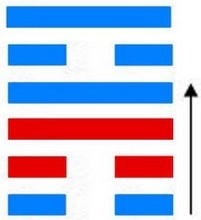

# 旅 ䷷ lǚ

- No.56

> 旅，小亨，旅貞吉。
>《彖》曰：旅，小亨，柔得中乎外而順乎剛，止而麗乎明，是以小亨，旅貞吉也，旅之時義大矣哉。
>《象》曰：山上有火，旅，君子以明慎用刑而不留獄。

> 初六，旅瑣瑣，斯其所取災。
>《象》曰：旅瑣瑣，志窮災也。

> 六二，旅即次，懷其資，得童僕貞。
>《象》曰：得童僕貞，終无尤也。

> 九三，旅焚其次，喪其童僕，貞厲。
>《象》曰：旅焚其次，亦以傷矣。以旅與下，其義喪也。

> 九四，旅于處，得其資斧，我心不快。
>《象》曰：旅于處，未得位也；得其資斧，心未快也。

> 六五，射雉，一矢亡，終以譽命。
>《象》曰：終以譽命，上逮也。

> 上九，鳥焚其巢，旅人先笑後號咷，喪牛于易，凶。
>《象》曰：以旅在上，其義焚也；喪牛于易，終莫之聞也。

阴中见阳，荡入阳中。阴阳二气交互，见本象。火居山上，为旅之义。
> 离为阴，初九为阳；艮为阳，初六为阴。二气交互，上下见本也。火在上，无止象，旅之义。

《易》曰：“旅人先笑后号啕。”又曰：“得其资斧。”仲尼为旅人，固可知矣。
> 旅卦为取象，火在山上，显露无止，五行入卦消息，去此还也。

与艮为飞伏。
> 丙辰土，己卯木。

其居初六元士，九四诸侯见应。建始己酉至甲寅，
> 秋分，立春。

积筭起甲寅至癸丑，周而复始。金入木土离艮。
> 金木土入卦起积筭。

五星从位起荧惑，
> 火星入卦见本象。

壁宿从位降丙辰，
> 二十八宿，壁宿入旅卦初六丙辰土位上起筭。

分气候三十六。
> 分三十六数起卦推筭。

火土同宫，二气合应，阴阳相对，吉凶分乎阴位。上九阳居宗庙，得丧于易。六五为卦之主，不系于一凶，其宜也。内象适变，荡阴入阳，巽顺于物，进退意器。外象明，应内为鼎。次降火从风入鼎。
> 初九之初六，六二之九二，巽为风，离象火，曰鼎。

# [Lǚ ䷷](e69785lv.md)
