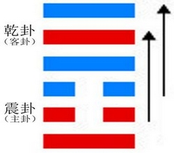
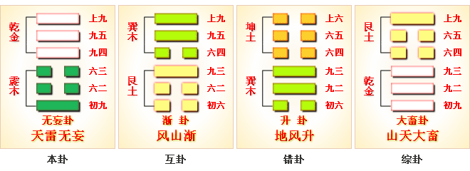
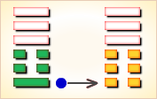
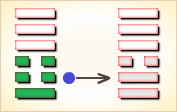
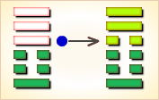

# 无妄 ䷘



无妄（wú wàng）卦，天雷无妄，无妄而得。

无妄是`4:7`卦的卦名，`4:7`是无妄卦的代号。
“妄”（wàng）胡乱，荒诞不合理：轻举妄动。“无妄”，不测，意外。

`4:7`卦的主卦是`4`卦震卦，卦象是雷，阳数是`4`，特性是运动，表明主方在积极主动地探索前进。
客卦是`7`卦乾卦，卦象是天，阳数是`7`，特性是力量和权威。

由于客方力量强大，可能不适当使用权力，给主方造成意想不到麻烦。
图中，红色表示当位的爻，天蓝色表示不当位的爻，箭头表示有应。

- 卦序：25

> 无妄，元亨利貞。其匪正有眚，不利有攸往。
>《彖》曰：无妄，剛自外來而為主於內，動而健，剛中而應，大亨以正，天之命也，其匪正有眚，不利有攸往。无妄之往，何之矣。天命不祐，行矣哉。
>《象》曰：天下雷行，物與无妄。先王以茂對，時育萬物。

> 初九，无妄往，吉。
>《象》曰：无妄之往，得志也。

> 六二，不耕穫，不菑畬，則利有攸往。
>《象》曰：不耕穫，未富也。

> 六三，无妄之災。或繫之牛，行人之得，邑人災也。
>《象》曰：行人得牛，邑人災也。

> 九四，可貞，无咎。
>《象》曰：可貞无咎，固有之也。

> 九五，无妄之疾，勿藥有喜。
>《象》曰：无妄之藥，不可試也。

> 上九，无妄行，有眚，无攸利。
>《象》曰：无妄之行，窮之災也。

### 传统解卦 下下卦

《象》曰：飞鸟失机落笼中，纵然奋飞不能腾，目下只宜守本分，妄想扒高万不能。

### 起卦

起卦前需要客观地、全面地、准确地分析主方和客方情况，必须至少符合下列条件之一，此卦才有参考价值：

1. 主方与雷很相似，客方与天很相似。
2. 主方阳数是`4`，客方阳数是`7`。
3. 主方的行动是阳，素质是阴，态度也是阴；客方的行动、素质和态度是阳、阳和阳。

切勿用任何随机数方式起卦，否则此卦不能用作决策工具。

### 结构和卦爻辞

图中有两个箭头。第一个箭头，从第二爻指向第五爻，这两条爻是主卦和客卦中爻，代表主方和客方素质，比如说，第二条阴，代表主方缺乏工作经验，第五条阳，代表客方经验丰富。这一对爻都是红色，表示当位，就是说位置适当，缺少经验的主方，正好可以得到经验丰富的客方的帮助，这是对主方有利的因素。第二个箭头，从第三爻指向第六爻，这两条爻代表主方态度和客方态度，主方态度是阴，表示主方对客方很随和，客方态度阳，表示客方态度很强硬，这个箭头，表示这二者之间和谐共处，主方对待态度强硬的客方很随和。这两条爻都是天蓝色，天蓝色表示不当位，就是说，位置不适当，也就是说，主方态度不应当随和，客方态度不应当强硬，有可能客方滥用权力，误导主方犯错误，受无妄之灾。第一爻与第四爻之间没有箭头，第一爻代表主方行动，第四爻代表客方行动。第一爻是阳爻，红色，表示主方行动是积极主动，例如，力图把工作做得很出色。这是主方应当做的，所以当位，主方应当坚持如此。第四爻是阳爻，天蓝色，表示客方行动也是积极主动，比如说，极力想控制主方，这并不是主方所希望的，与主方有矛盾，对主方不利，所以不当位。然而主方不能决定客方的行动，只得在现实中妥善处理这方面的矛盾。

事物自身是按螺旋型规律变化的，按阳数，其规律是4、5、6、7、3、2、1和0。主方处于发展起点，是新生事物，具有强大生命力，随着时间推移，主方状态将从4卦震卦变为5卦离卦，情况将有改善。所以主方应当维持现状，尽量利用良好机会从客方吸取收益，同时避免对客方过于随和，警惕客方过度行为。

卦爻辞以“无妄”为主题，分析了当前形势。第一、三、五和六爻中都有“无妄”，第二爻说明“无妄”的状态是可以利用的，第四爻说明“无妄”状态是可以坚持的。“无妄”，它是吉利的，也有灾难和疾病。

删去爻辞中的判断辞，可以看出六条爻辞就是一首完整的围绕主题“无妄”的散文诗，下面是其译文：
```
意想不到啊，
不耕种而有收获，不开荒而可种地。
意想不到的灾祸；就像是一条系着的牛，
被行路人牵走了，对于村里的人来说，是一场灾祸。
（尽管意想不到，还是）可以坚持下去，
意想不到的疾病，不用吃药就有喜事，
（如若）意想不到，进行中有灾祸，没有什么有利之处。
```

卦辞说明在“无妄”状态下主方应有的作为。

### 卦辞
```
〖原文〗元亨，利贞。
其匪正有眚，不利有攸往。
〖译文〗很顺利，利于坚持下去。
不正当的行为会带来灾祸，不利于向前发展。
〖解说〗这是4:7卦的卦辞。匪（fěi）非。
眚（shěng）眼睛长白翳；灾祸。
“元亨”是在坚持现有状态下才有的“元亨”，并且“不利有攸往”。
主方必须十分注意，不要有不适当的行为，
不然可能受到客方伤害，“其匪正有眚”。
```

### 一阳
```
〖原文〗无妄，往吉。
〖译文〗意想不到，往前进吉利。
〖解说〗这是第一爻的爻辞，
阳，表示主方积极主动地谋取和扩大自己的利益，
比如说，创新、创业、投资、进攻、求职、示爱，等等。
这里的“无妄”有“本来没有错”的意思，主方的积极主动是对的，
积极主动，可以改善自己的素质，可以得到客方的帮助。
“往吉”，只是指主方的积极主动而言，不是指与客方关系的发展。
在对待客方的态度上，主方要注意卦辞的“其匪正有眚”。

〖结构分析〗第一爻的位置是阳位，
这条爻是阳爻，阳爻在阳位，当位，然而与四阳不有应。
当位表明主方积极进取，努力改善自己的素质，这是正确的；
不有应表明主方的积极主动与客方有冲突，是对主方不利的潜在因素，
这不利的潜在因素来自客方，对于主方来说是“无妄”，
主方应当妥善处理这“无妄”的麻烦，继续保持积极主动，“往吉”。
```

### 二阴
```
〖原文〗不耕获，不菑畲，则利有攸往。
〖译文〗不耕种而有收获，不开荒而可种地，
利用这样的机会就有所发展。
〖解说〗这是第二爻的爻辞。
阴，表示主方素质不佳，比如说，
资金缺乏、地位低下、实力薄弱、教育程度低，等等。
“菑”（zī），开荒。“畲”（shē），火耕地，指粗放耕种的田地。
主方素质不佳，客方素质良好，主方积极主动争取客方帮助，
以弥补自己的不足，“不耕获，不菑畲”。
不过，可能取得的发展是有限的，仅仅是“攸往”而已。

〖结构分析〗第二爻的位置是阴位，
这条爻是阴爻，阴爻在阴位，当位，又与五阳有应。
当位表明主方素质不佳，
有从客方接受帮助的可能，是对主方有利的潜在因素；
有应表明客方良好素质正好可以满足主方的需要，
这有利的潜在因素成了真正的有利因素，“不耕获，不菑畲”。
尽管从客方得到的收益是有限的，主方还是应当利用，“则利用攸往”。
```

### 三阴
```
〖原文〗无妄之灾；或系之牛，行人之得，邑人之灾。
〖译文〗意想不到的灾祸；外乡人牵着一头牛，
不注意的时候被路人牵走了，外乡人认为这个村里所有人道德败坏。
不知情的本村人被别人看做道德低下，意为无妄之灾。
〖解说〗这是第三爻的爻辞，
阴，表示主方态度随和。
同时，第三爻是对第二条的补充，
第二条是阴，第三条也是阴，这表示主方素质很差。
“邑”（yì），古时候对县的别称：郡邑制。
这里的牛，指客方，因为客方被系在与主方的关系中；
“邑人”是主方，是系牛的人；“行人”指主方与客方之外的第三者，
这第三者利用这条牛被系的机会，把牛牵走了，得到了益处，
而主方遭受了意想不到的灾祸。
这也就是具体地说明了卦辞中“其匪正有眚，不利有攸往”的意思。
由于主方态度随和，过分迁就客方，以致于“匪正”，从而“有眚”。

〖结构分析〗第三爻的位置是阳位，
这条爻是阴爻，阴爻在阳位，不当位，不过与六阳有应。
主方对客方的随和态度，有可能被客方利用，从而受到客方控制，
所以，这条爻不当位，是对主方不利的潜在因素。
与第三爻对应的第六爻是阳爻，客方以强硬的态度控制态度随和的主方，
这种有应关系是对主方的不利因素，是“无妄之灾”。
由于客方的强硬态度是素质过强的表现，
遇到态度随和的主方，可能行动过分，不仅对主方不利，
也可能使客方自己受到损失，“或系之牛，行人之得，邑人之灾”。
```

### 四阳
```
〖原文〗可贞，无咎。
〖译文〗可以坚持下去，无可怪罪。
〖解说〗这是第四爻的爻辞，
阳，表示客方积极主动地谋取和扩大自己的利益，
比如说，创新、创业、投资、进攻、求职、示爱，等等。
客方积极主动，可以让主方容易接近客方，
容易得到客方帮助，主方应当维持当前状态，主方不应当受到怪罪。

〖结构分析〗第四爻的位置是阴位，
这条爻是阳爻，阳爻在阴位，不当位，并且和一阳不有应。
不当位表明客方积极主动是对主方不利的潜在因素；
不有应表明尽管客方积极主动地谋求从主方得益，
由于主方也是积极主动地谋取和扩充自己的利益，
主方没有完全被客方利用。
主方的积极主动是正确的，“可贞”。
主客双方的矛盾不一定归咎于主方，“无咎”。
```

### 五阳
```
〖原文〗无妄之疾，勿药有喜。
〖译文〗意想不到的疾病，不用治疗，有意外收获。
〖解说〗这是第五爻的爻辞，
阳，表示客方素质良好。
“疾“（jí）病：疾病。
在与客方相处过程中，
主方可能遇到意想不到的麻烦，“无妄之疾”。
由于客方素质良好，主方可能得到客方及时帮助，
主方的麻烦将可以消除，“勿药有喜”。

〖结构分析〗第五爻的位置是阳位，
这条爻是阳爻，阳爻在阳位，当位，又与二阴有应。
当位表明客方的良好素质是对主方有利的潜在因素；
有应表明素质不佳的主方正好利用客方的良好素质。
由于主客双方都积极主动，有矛盾，而且，主方态度随和，
客方态度强硬，在矛盾冲突中，
主方可能遇到来自客方的麻烦，有“无妄之疾”。
主方的素质不佳，客方的素质良好，
主方从客方的良好素质获益，这是自然而然的，是“勿药有喜”。
```

### 六阳
```
〖原文〗无妄，行有眚，无攸利。
〖译文〗意想不到，进行过程中有灾祸，没有什么有利之处。
〖解说〗这是第六爻爻辞，
阳，表示客方态度强硬。
“眚”（shěng），眼睛长白翳；灾祸。
客方态度强硬，主方态度随和，
主方受客方制约，加之主方素质不佳，
而客方素质良好，客方强，主方弱，主方可能被客方利用。
所以，“行有眚，无攸利”。
主方既不应当过于屈从客方，也不能不改善自己的素质。

〖结构分析〗第六爻的位置是阴位，
这条爻是阳爻，阳爻在阴位，不当位，不过与三阴有应。
不当位表明客方强硬态度是对主方不利的潜在因素；
有应表明客方态度强硬，主方受客方控制，
这种不利的潜在因素，是真正的对主方不利的因素。
而且，客卦的中爻，第五爻，也是阳爻，
第六爻是对第五爻的补充，第六爻是阳爻，表明客方素质不仅良好，
而且很好，实力超强，可能忘乎所以，作出过分举动，
使得在其控制下的主方“无妄，行有眚”，这对主方不利，“无攸利”。
主方必须注意客方态度可能过分强硬，不能对客方过分随和。
```

### 师徒问答
```
无妄：元，亨，利，贞。其匪正有眚，不利有攸往。
[译文] 无妄卦象征不妄为：至为亨通，利于坚守正道。
如果不守正道就是祸患，不利于有所前往。
（匪：非。眚：音 shěng，祸患。）
[提示] 守正才能无妄。
【师】回复于正道，当然就不会妄为了，所以复卦后面是无妄卦。
《序卦传》说：“复则不妄矣，故受之以无妄。”
“无妄”就是不轻举妄动、不胡作非为。
无妄卦上为乾、为天，下为震、为动，含有“回天而动”的意思。
因天而动，即遵循自然规律的正道而动，当然就不会妄为。
所以卦辞评断“无妄”为“元亨”，即至为亨通；
附加条件是“利贞”，要坚守正道才会有利。
反之，如果不守正道就不利，反而有祸，
这就是卦辞所说的“其匪正有眚，不利有攸往”，这是从反面设诫。
【徒】我们只要反省一下自己的日常行为，
违背正道而“妄为”的成份太多了，有时简直是浑浑噩噩地打发日子。
做到“守正”和“无妄”，又谈何容易！

《彖》曰：无妄，刚自外来而为主于内。动而健，刚中而应。
[译文]《彖传》说：无妄，阳刚从外卦来，成为内卦的主宰。
运动不息而又刚劲强健，阳刚居中而又应合于下。
[提示] 以卦象解释卦名和卦义。
【徒】这段话比较费解。
【师】无妄卦的内卦，下体为震，
它是由外卦，上体乾的一刚爻来与坤的初爻相交而形成，
所以称震的初爻是“刚自外来”；
又因为震的初爻处于内卦，按《易经》例以少统多的原则，
凡二柔一刚均以一刚为主，
所以外来的这一刚作为震之初爻，又是“为主于内”。
这就叫做“刚自外来而为主于内”。
在刚爻未来之前，坤属阴柔，阴柔为虚。
在“刚自外来而为主于内”之后，坤变为震，震属阳刚，阳刚为实。
阴虚转为阳实，这意味着真实取代了虚妄，所以称为“无妄”。
这是以卦象的形成来解释卦名。
【徒】“动而健，刚中而应”，大概是以卦象来解释卦义吧？
【师】是的。无妄卦形成后，呈下震上乾之象。
震为动，乾为健，包含着“动而健”之义。
运动不息而又刚劲强健，
这是以上下二体的象征意义来说明天道运动的永恒性。
再看上下二体的中爻，九五的阳刚居中与六二的阴柔居中，
上下相应，阴阳相合，万物由此而生生不息。
“刚中而应”就是指此而言，
这又是以二、五两爻的象征意义来说明天道运动的规律性。
这些都是真实无妄的大自然的法则。
【徒】这样看来，“无妄”首先要求遵守天道的规律、大自然的法则？
【师】这正是“不妄为”的根本含义。

大亨以正，天之命也。其匪正有眚，不利有攸往。
无妄之往，何之矣？天命不佑，行矣哉？
[译文] 由于守正而大为亨通，这是天之道啊。
如果不守正道，就有祸患，不利于有所前往。
处在无妄之时却要妄行，哪里有路可走呢？天道不保佑，能行得通吗？
[提示] 解释卦辞。
【徒】只有守正才能实现无妄，才能大为亨通，这是天道的体现。
如果不守正道，就必然是妄为，就无路可走，因为那样做是违背天道的。
【师】这里反复强调的“天命”(天道)，实际上就是客观的自然规律。
只有顺应客观规律行事，才是“守正”，才能“无妄”。

《象》曰：天下雷行物与，无妄。先王以茂，对时育万物。
[译文]《象传》说：雷声传行于天下，万物响应，象征不妄为。
先代君王因此以此勉励自己，顺应天时，养育万物。
(与：响应。茂：勉励。对：配合，顺应，适应。时：时机。)
[提示] 顺应天时则无妄。
【徒】无妄卦上为乾、为天，下为震、为雷，
正是“天下雷行”之象。这有什么象征意义呢？
【师】冬季处于潜藏冬眠状态的万物，
到春季都因雷震而苏醒，
应声而惊起，所以春天有“惊蛰”的节气。
由此可见天道的规律毫无差错，所以象征“无妄”。
统治者应该体会无妄卦象的精义，
把它用到国家治理上去，从而勉励自己，
一切举措都要像万物闻雷而奋起那样地顺天行事，
绝不违背客观规律。这样才能做到“无妄”，才能利国养民。

初九，无妄，往吉。
[译文] 初九，不妄为，前往是吉祥的。
《象》曰：无妄之往，得志也。
[译文] 《象传》说：不妄为而前往，一定能满足自己的意愿。
[提示] 起步无妄，前途吉祥。
【徒】初九为什么能够实现“无妄”？
【师】初九以刚爻居阳位，纯阳不杂，
实而不妄，在素质上有利于实现“无妄”。
这样，它就没有妄想妄行，一切按照天道规律行事，
当然就无往而不吉，能够得遂进取的心愿。
初九又象征事情开始的第一步，起步不妄，
就有了一个好的开端，就预示着吉祥的前途。

六二，不耕获，不菑畲，则利有攸往？
[译文] 六二，不耕种就想收获，
不开荒就想种熟地，难道这样做会有利吗？
(菑：音 zī，初开垦的瘠田，垦荒。
畲：音 shē，耕种多年的熟田。则：岂。)
《象》曰：不耕获，未富也。
[译文] 《象传》说：不耕种就想收获，说明六二阴虚而不实。
[提示] 寄希望于虚妄，无利可言。
[另注：也有解释为：六二柔正居中，上应九五，
不期望刚耕作就有收获，不期望刚开垦就得到良田，故利有攸往。]
【徒】企图不耕而获，这岂不是虚妄吗？
镜花水月，必然落空，无利可言。
这道理并不难懂，
但是这种违背常识的虚妄企求在社会生活中却并不少见。
六二的虚妄是怎么造成的呢？
【师】六二无求实之心，无视于实事求是的行为原则。
六二以阴爻居阴位，阴虚不实，因而产生虚妄之求。
所以《象传》说它企图不耕而获的原因是“未富也”。
在《易经》中，以阳为富、为实，
以阴为不富、不实。不富、不实即为虚妄。

六三，无妄之灾。或系之牛，行人之得，邑人之灾。
[译文] 六三，不妄为也有灾祸。有人栓系着一头牛，
被过路人顺手牵走了，当地居民却遭了殃。
(邑：众人聚居的村镇。)
《象》曰：行人得牛，邑人灾也。
[译文] 《象传》说：过路人牵去了牛，这就使得当地居民遭了殃。
[提示] 虽不妄为，也可能因偶然因素而遭灾。
【徒】六三爻辞好像说了生活中的一个小故事：
邻居把牛拴在路边，被过路人牵走了，我却被诬告成偷牛的嫌疑犯。
人在家中坐，祸从天上来。这真是“无妄之灾”，无缘无故而受灾。
这看来是偶然事故造成的，该倒霉的人即使不妄为也无法逃灾。
【师】前人对本爻辞往往也是这样理解，
如关朗在《关氏易传》中说：
“运数适然，非己妄故，乃无妄之灾。”
“运数”就是命运、气数。
倒霉的事正好让它碰上了，该他倒霉，这是“运数”所注定的。
这种说法虽然看到了在偶然性中隐藏的必然性，
但是把那种以偶然性表现出来的必然性，
归结为神秘不可知的“运数”，当然是不科学的。
【徒】那么应该怎样理解呢？
【师】在这里，偶然并非完全偶然，无妄也并非完全无妄。
让我们分析一下六三这一爻。
首先，六三处于上下体交接处的是非危惧之地，
这是很容易惹麻烦的地方，所以他被无端地怀疑株连而致祸。
六三本人虽然“无妄”，但他处于虚妄的人和事之中，
邻居的粗心大意和妄告无辜，路人的顺手牵“牛”，这都是“妄”。
与他人之“妄”相牵连，本人就难以完全“无妄”。
我们再看六三的主观因素，他以阴居阳而不正，处于下卦之终而不中。
既然本人原来行事就是不正不中，
又怎能避免在时间和地点上，偶然交叉的意外事件中涉嫌呢？
如果六三之为人一向道德高尚，难道会突然被怀疑为偷牛贼吗？
既然主观上本来就存在着“妄”，
又遇上了客观之“妄”，这样又怎能做到真正的“无妄”呢？
【徒】是啊。只有行正才不怕影子歪。

九四，可贞，无咎。
[译文] 九四，能够坚守正道，没有过错。
《象》曰：可贞无咎，固有之也。
[译文] 《象传》说：能够守正就没有过错，这是九四本身固有的品格所决定的。
[提示] 守正而不妄为，可以免过。
【师】九四爻下无所应，
又处于“近君”的危地，本来是很容易动辄得咎的。
但是它以阳爻居阴位，这象征着刚而能柔的品格，
有助于它正确地应付复杂的环境，坚守正道而不妄为，终于得以免过。
【徒】六三虽然“无妄”竟也遭灾，九四坚守正道仅能免过。
这样看来，三、四这两个爻位的确是危惧之地。
【师】处在这种情况下，在主观上自求无妄就够了，祸福只有听其自然。
历史上有一种“孤危之臣”，就是这类人物。

九五，无妄之疾，勿药有喜。
[译文] 九五，不妄为却得了病，不用服药就会有自愈之喜。
《象》曰：无妄之药，不可试也。
[译文] 《象传》说：不妄为而患病所用的药，是不可以试服的。
[提示] 无妄而有疾，不必服药攻治。
【徒】九五以阳刚居中得正，处于尊位，
这一爻从各方面看都是最优越的，
无可指责，当然是“无妄”的，怎么会出了毛病呢？
【师】九五本身确实是无懈可击，并无致疾之由；
出了毛病，原因一定来自外部。
从爻象上看，九五与六二相应，而六二有“不耕而获”的虚妄之求，
九五的毛病可能是受六二的牵连所造成。
【徒】既然有疾，又无须用药，这究竟是怎么一回事呢？
【师】既然无妄，就没有妄想、妄行需要纠正，
就意味着思想行为是合乎正道的；
如果用药攻治，岂不是否定和改变自己的正确行为吗？
所以，无端地得了无妄之疾，
应该坚持守正安常，泰然处之，疾病会不治自除。
这是以“勿药”为药，以不治为治。
换句话说，只要自己的思想行为是正确的，就不应改变初衷，
一切外来的诽谤和非议都会不攻自破的。
度过了难关，就会领略到最后胜利的喜悦。这就是“勿药有喜”。

上九，无妄，行有眚，无攸利。
[译文] 上九，不妄为，但行动会有祸患，无所利益。
《象》曰：无妄之行，穷之灾也。
[译文] 《象传》说：不妄为的行动，处于穷尽之时也会遭到灾祸。
[提示] 时穷难行，行则遭灾。
【师】“无妄之行”本来当然是好的，
但行动得不是时候仍不好，仍会遇祸。
上九处于全卦之终，这是终极之地、穷尽之时，已经无处可行。
这时就宜止不宜行，宜静不宜动。
上九以阳爻居阴位，刚躁易动，
在时穷难行、动则遭灾之时，仍然偏要前行，
这样无妄就变成有妄了，因此“有眚”而“无攸利”。
【徒】看来，任何事物发展到穷尽之时都不好，
即使是“无妄之行”，也会遭遇“穷之灾也”。
物极必反，无妄也将转为有妄，好事也将转为坏事。
这正如乾卦上九爻“亢龙有悔，穷之灾也”一样。
【师】真的，“好事”提倡到了极点，
就会变质，产生副作用，变成“坏事”了。
例如，过度地宣扬“好人好事”，
就会出现弄虚作假、沽名钓誉的“假典型”。
所以《老子》中说：“智慧出，有大伪。”
这样，“无妄”就转化为“有妄”了。
【徒】从本卦六爻的情况看，“无妄”这一命题并不简单。
【师】六爻虽然大都呈“无妄”之象，但具体情况和吉凶利咎却很不相同：
初九起步无妄而获吉，六二希求虚妄而无利，六三虽不妄为而遭灾，
九四守正不妄而免过，九五无妄有疾而自愈，上九时穷无妄而遇祸。
六爻所提供的行为类型虽然表现出复杂的变化，但其包容的基本精神是一致的。
就是说，欲达到行为无妄，要遵循两大原则：
一是“守正”。也就是卦辞所强调的“利贞”、“匪正有眚”。
任它情况千变万化，坚守正道不变，这样就能“以不变应万变。”
正如朱熹所说：“《无妄》一卦，虽云祸福之来也无常，然自家所守者，不可不利于正。”
二是“审时”。要审察时机和形势，以决定进退行止。
最要紧的是主观要符合客观，客观情况变了，主观对策要相应而变。
这样，才能在事物的动态变化中不断地作灵活的自我调整，才能确保行为的“无妄”。
```

### 白话解析
```
无孟①：元、亨、利、贞。非正有省②，不利有攸往。
【注释】
①无孟：不努力工作。孟：努力。
②非正有省：不正当，有毛病。省：假借为眚。眚，眼睛生毛病。
【白话】筮占得无孟卦，不努力工作，
虽然得到了“元亨利贞”的好占，
但毕竟不是正道而且有毛病，所以还是不利于有所往。
【讲解】无孟，通行本作无妄。
无妄，是很规矩，没有毛病。无孟，是不努力，有毛病。

初九：无孟往，吉。
【白话】筮得无孟卦，占得初九，
去掉那不努力工作的坏毛病，就吉善。

六二：不耕获①，不菑馀②，利有攸往。
【注释】
①不耕获：不种田而有收获。
②不菑馀：不插秧而能致富。菑：插秧苗于田中。
【白话】筮得无孟卦，占得六二，
其象为“不耕获，不菑馀”，其占为“利有攸往”。
【讲解】六二柔顺中正，朱熹以为因时顺理，
无所作为于前，无所希望于后。
程颐用理之所然者释为非妄，人所欲为者为妄。
本爻用耕田取象，反映了不耕而获、不种而富的社会现象。

六三：无孟之兹①，或击之牛，行人之得，邑人之兹。
【注释】①兹：假借为灾。
【白话】筮得无孟卦，占得六三，不努力工作是很危险的，
这样的人去放牛就会把牛打跑，过路人牵走了牛，城里人受了灾。
【讲解】不努力工作不仅个人带来灾害，
而且整个社区都遭殃。告诫人们努力工作。

九四：可贞①，无咎。
【注释】①可贞：可以占问。
【白话】筮得无孟卦，占得九四，其占语为“可贞，无咎”。
【讲解】本爻有占语而无卦象。

九五：无孟之疾，勿乐①有喜。
【注释】①勿乐：不淫乐。
【白话】筮得无孟卦，占得九五，
不努力工作的毛病，只要不淫乐就能杜绝，就能努力工作带来欢喜。
【讲解】九五阳刚中正，而居高位，又与下之六二相应，所以象占如此。

尚九：无孟之行有省①，无攸利。
【注释】①有省：有害。省，借为眚。
【白话】筮得无孟卦，占得尚九，不努力工作的行为有害，没有什么好处。
【讲解】尚九居于无孟卦之终，是不努力工作到了极点，所以占断为“无攸利”。
```

### 彖传解释
```
《彖传》说：
无妄卦的卦象表明，阳刚由外入内从而主导事物的活动，
象征运动而强健，刚毅居中上下应合。
这样极大的“亨通顺利”并坚守正道，这就是上天的使命啊。
“不能坚守正道必有祸害，不利于外出活动。”
是指在没有约束下妄为活动，哪有出路可言呢？
没有上天使命的护佑，怎能随意而行呢？
```

### 新解
```
无妄①：元亨，利贞。
其匪正，有眚。不利有攸往。
初九：无妄往，吉。
六二：不耕，获；不菑，畲③。则利有攸往？
六三：无妄之灾④。
或系之牛，行人之得，邑人之灾。
九四：可贞，无咎。
九五：无妄之疾，勿药有喜。
上九：无妄行。有眚，无攸利。

①无妄是本卦的标题。妄的意思是乱，不正。
无妄就是不要有不合正轨行为。
全卦的内容是讲行为修养要合于正轨，不能乱来。
无妄是卦中多见 词，又与内容有关，所以用作标题。
②菑（zī）：新开垦的荒地。
③畲（shē）：耕种了三年的熟地。
④无妄：意料之外。

【译文】 
无妄卦：大亨大通，吉利的占问。
如果思想行为不正当，就会有灾祸。不利于外出有所往。
初九：不要有不合正道的行为，吉利。
六二：不耕种就要收获，
不开垦荒地就想耕种熟地。妄想者的行为难道有利吗？
六三：意料之外的灾祸。
有人将牛拴住，过路的人顺手把牛牵走了，邑人丢牛得了意外之灾。
九四：利于占问，没有灾祸。
九五：得了病不胡思乱想，不吃药也会痊愈。
上九：不要妄行。妄行有灾，没有什么好处。
```

### 哲学易经

无妄：元亨，利贞。其匪正，有眚。不利有攸往。《彖》日：无妄，刚自外来而为主于内，动而健，刚中而应，大亨以正，天之命也。其匪正，有眚，不利有攸往，无妄之往何之矣？天命不祐，行矣哉。《象》曰：天下雷行物与，无妄。先王以茂对时，育万物。

往来归复，才能归正行为上的过错，故受之《无妄》。无妄，不妄自非为也。不妄自非为，是以元始、亨通、吉利、中正。因此我们要分清局势的变化从现实出发，不要做没有目标期望过高和没有把握的事，因为只有这样才能达到预期的目标和获得顺利的进展。如行为不正妄自非为就会带来灾难和麻烦，是以不利有攸往。

无妄讲的是实事求是和脚踏实地，而我们往往说理想它实际是可能而不是现实，是目标而不是必然。只有从实际和现实为之奋斗才有可能实现，只有从现实做起才能逐步接近，离开实际和现实那就叫幻想和空想。列宁说：“信口开河，妄说革命是无谓的忙碌，徒劳无益的。”因此我们“应当分清局势，从现实出发，不想凭空猜测和无法知道的事情。”我们当“用之天下，必量天下而用之；用之国，必量国而用之；用之家，必量家而用之；用之身，必量身材能气势而用之。”是以“无妄，元亨而利贞。”

《彖传》说：无妄就是不妄自非为。不妄自非为就当分清外界的客观条件作为行事的准则来度越事理，如此行动必然刚健，万物皆中而有所应，天下大正无所不亨，是以此乃天之命也。天之命总是按照时序规律至中至正发展的，而人类当认识这个规律不断地归正行为上的过错才能达到至中至正全面的发展。如行为不正，妄自非为，茂然行动，还能得到什么呢？上天是不保祐行为不端的人的，其行不可不慎啊！

《象传》说：天下雷动，顺天应时，从而形成了一个绿叶葱葱欣欣向荣的春色，这是《无妄》之象。上古的君主观此，思万物只有服从时序的变化和规律才能蓬勃发展，从而当对时育物，发布时令，繁荣天下。

1. 初九：无妄，往吉。《象》曰：无妄之往，得志也。不妄自非为，所往吉祥。原因是不妄自非为，驯至其道功必建矣。外界诱惑无可抗拒，美好理想总怀人心，但只有脚踏实地的人才能为成功创造条件。
2. 六二：不耕获，不菑畲，则利有攸往。《象》曰：不耕获，未富也。菑畲，播种的工具。无法耕获或者说根本不可能成功的事就当毫不犹豫地抛弃，决不做无谓牺牲。因此君子当言有物而行有据，如此行事则无往不利，否则则是枉费心机。《象传》说“无法耕获，怎会富有。”是以君子当为此而谋求其它出路。
3. 六三：无妄之灾，或系之牛。行人得之，邑人之灾。《象》曰：行人得牛，邑人灾也。《樵鱼问对》上说：“妄者欺也，欺天时地利必招祸也。顺天时而动，顺物性而行，有祸及者非祸，灾也。犹农有思丰而不勤稼穑者，其荒也不亦祸乎？农有勤稼穑而复败渚水旱者，其荒也不也灾乎？故先王以茂对时育物，贵不妄也。”可见，行为正确而招灾是外界的某种客观原因的巧合造成的，不是行为邪恶的缘故。就象牛系在路边，路人顺手牵羊偷走了，邑人也就灾了。
4. 九四：可贞，无咎。《象》曰：可贞无咎，固有之也。能够测算得到的，能够力所能及的行为不会有过失，是必然能做到的肯定能成功的，是“固有之”的，君子何忧，功必建矣。
5. 九五：无妄之疾，勿药有喜。《象》曰：无妄之药，不可试也。不妄自非为而招到变故的，是不用吃药而能治愈和改变的。原因是因为这不过是暂时的失利和小小的不幸，没有什么值得顾虑的和担心受怕的。如果为此而不知所以妄自非为的话就会适得其反无药可救了。
6. 上九：无妄。行有眚，无攸利。《象》曰：无妄之行，穷之灾也。绝对不要妄自非为，否则必招灾难，所往很不利。发展需要符合进程的条件，盲目的不合时宜的就会发生突如其来的死如焚如的可悲后果。因此要用科学代替幻想，要用计算框正行为，要用联系切务实际。



### 断易天机

无妄卦乾上震下，为巽宫四世卦。无妄卦为天雷震响之象，表示事与愿违，可能会有小的灾祸，但先凶后吉。

### 邵雍

不欺不妄，真实至诚；顺乎自然，福禄深宏。

得此卦者，顺其自然，守正道者，诸事皆宜。但行为不检者，必招灾祸。

### 傅佩荣

- 时运：正当好运，诸事皆宜。
- 财运：货到财来，自然开心。
- 家宅：屋运甚旺；门当户对。
- 身体：保持运动，自可消化。

```
这个卦是异卦，下震上乾，相叠。
乾为天为刚为健；震为雷为刚为动。
动而健，刚阳盛，人心振奋，必有所得，
但唯循纯正，不可妄行。无妄必有获，必可致福。

《象传》：雷动于天，阳气舒发，为真实无虚妄之意。
```

运势：凡事宜守正，若行为不检者，必招灾祸。

- 事业：贵自知之明，从个人实际出发，不抱非分之想，脚踏实地，勤奋努力，检点行为，防意外灾祸。不计较得失，诚心追求，待机而动，事业必成。
- 经商：切勿勉为其难，遵循市场规律，讲究商业道德，屏弃投机心理，勿贪暴利，经过辛勤努力，日积月累，必将成功。
- 求名：以良好的动机，刻苦努力，丢弃幻想，但问耕耘，不问收获，终将有所获。
- 婚恋：双方务以诚相待，绝不可抱以轻率的态度，亦不宜急于求成、顺其发展，水到渠成。
- 决策：精力充沛，富有上进心，可有作为。但务必勤勉努力，诚心诚恳，奋发向上，刻苦钻研。不可因小有成就而得意忘形。不必追求所得，而应追求实干。遵循规律办事，等待时机再行动。尤其应清除非份的念头。这样，可实现自己的理想。

### 张铭仁
```
无妄：表示不要有一些空幻的想法，
或是你的想法可能有点虚妄不切实际，主小凶。
建议凡事要务实、踏实一点。
也表示目前所处的状况，是有一厢情愿的心态，
或是有点「妄想症」的不切实际心理。

解释：无妄之灾。

特性：言词犀利，易生是非，
愤世嫉俗，不流俗，求知欲强，重精神层面。
```

运势：无妄的道理是提醒要真实无虚，踏实。故若做事操守而能坚贞固执者吉。若不行正道，行为不检点者，必然有灾祸至也。切忌沉醉于利、欲之中，慎之。

- 家运：有不和之情况，因受外界诱惑而心乱，须谨慎，否则导致破运。
- 疾病：不宜意气用事，应尽力疗养为宜，属呼吸系统，头、足之疾病。
- 胎孕：或有惊，终无碍。
- 子女：注意与其父不和而离家出走。
- 周转：诚心有望，不诚免谈。
- 买卖：若不要过份苛求，有利。
- 等人：一定会来。但有不欢而散之象，宜以和为贵。
- 寻人：已走远，不易寻找，东北或西北之向。
- 失物：找不到，似已遗失。
- 外出：不存妄想则平安无事。为谋私利或邪念而行则大为不利，不宜行。
- 考试：笔试有利，口试不利。
- 诉讼：因女人或死亡之事起纷争，宜和解，否则招凶。
- 求事：毫无头绪，勿过于草率为宜。
- 改行：不宜勉强。
- 开业：开业者可行。

### 初九。无妄，往吉。

《象》曰：无妄之往，得志也。


初九：不要妄行非正，吉利。

《象传》说：没有悖妄的行为，因为所有行动受到意志的控制。

### 邵雍

吉：得此爻者，营谋得利。做官的会得到上司的赞许，百姓的爱戴。

### 傅佩荣

- 时运：株守不宜，出而有为。
- 财运：行商有利，坐贾不宜。
- 家宅：迁居为宜；婿可入赘。
- 身体：出外就医。

### 初九变卦：天雷无妄 变卦 天地否



初九爻动变得[第12卦：天地否](e590a6pi_cn.md)。

这个卦是异卦，下坤上乾，相叠。

其结构同泰卦相反，系阳气上升，阴气下降。

天地不交，万物不通。

它们彼此为“综卦”，表明泰极而否，否极泰来，互为因果。

### 六二爻辞

六二。不耕获，不菑畲，则利有攸往。

《象》曰：不耕获，未富也。


六二：不耕种就想收获，不开荒地就想种熟地。这些妄谬的行径怎能有利?

《象传》说：不耕种而想收获，这种空妄的念头不能带来财富。

### 邵雍

吉：得此爻者，正当好运，不劳而获。富人进财多，商人出外获利。当官的会升官。读书人会取得佳绩。

### 傅佩荣

- 时运：适得正运，意外之财。
- 财运：不谋而获，大利到手。
- 家宅：承继家产；招赘之亲。
- 身体：自然痊愈。

### 六二变卦：天雷无妄 变卦 天泽履



六二爻动变得[第10卦：天泽履](e5b1a5lv_cn.md)。

这个卦是异卦，下兑上乾，相叠。

乾为天，兑为泽，以天喻君，以泽喻民。

原文：“履（踩）虎尾，不咥（咬）人”。

因此，结果吉利。君上民下，各得其位。

兑柔遇乾刚，所履危。履意为实践，卦义是脚踏实地的向前进取的意思。

### 六三。无妄之灾。或系之牛，行人之得，邑人之灾。

《象》曰：行人得牛，邑人灾也。


六三：意外的灾难。比喻说有人将牛系在不该系的地方，行人顺手牵牛获意外之得，邑人失牛受到意外之灾。

《象传》说：行人意外得牛，邑人意外蒙灾。

### 邵雍

凶：得此爻者，无妄之灾，破财损身。做官的不宜进取。

### 傅佩荣

- 时运：尴尬之期，小心意外。
- 财运：防备别人，以免耗财。
- 家宅：外人侵占；远人结亲。
- 身体：外人传染，小心防治。

### 六三变卦：天雷无妄 变卦 天火同人


六三爻动变得[第13卦：天火同人](e5908ce4babatongren_cn.md)。

这个卦是异卦，下离上乾，相叠。

乾为天，为君；离为火，为臣民百姓。

上天下火，火性上升，同于天，上下和同，同舟共济，人际关系和谐，天下大同。

### 九四爻辞

九四。可贞，无咎。

《象》曰：可贞无咎，固有之也。


九四：称心的占问，没有灾难。

《象传》说：具有贞正的品德，没有灾难，理应如此。

### 邵雍

平：得此爻者，宜守旧，图谋有实，不致虚浮。做官的宜守职，勿妄动。

### 傅佩荣

- 时运：气运平顺，妄动有咎。
- 财运：坚守旧业，可以获利。
- 家宅：保持祖业。
- 身体：安静调养，下月可愈。

### 九四变卦：天雷无妄 变卦 风雷益



九四爻动变得[第42卦：风雷益](e79b8ayi_cn.md)。

这个卦是异卦，下震上巽，相叠。

巽为风；震为雷。

风雷激荡，其势愈强，雷愈响，风雷相助互长，交相助益。

此卦与损卦相反。

它是损上以益下，后者是损下以益上。二卦阐述的是损益的原则。

### 九五爻辞

九五。无妄之疾，勿药有喜。

《象》曰：无妄之药，不可试也。


九五：患意外之病，不要忙乱服药，自可痊愈。

《象传》说：出人意外的药物，不可随便服用。

### 邵雍

平：得此爻者，营谋有成，病得愈，或有生育之喜。做官的纵有祸难，也会不辩自明，不解自释。

### 傅佩荣

- 时运：气运正好，不必介意。
- 财运：不忧物价，心平气和。
- 家宅：防备倾倒。
- 身体：不必担心。

### 九五变卦：天雷无妄 变卦 火雷噬嗑


九五爻动变得[第21卦：火雷噬嗑](e599ace59791shike_cn.md)。

这个卦是异卦，下震上离，相叠。

离为阴卦；震为阳卦。

阴阳相交，咬碎硬物，喻恩威并施，宽严结合，刚柔相济。

噬嗑为上下颚咬合，咀嚼。

### 上九爻辞

上九。无妄，行有眚，无攸利。

《象》曰：无妄之行，穷之灾也。


上九：不要胡作妄行！将有灾殃，没有好处。

《象传》说：谬妄的行为，是绝望无聊的表现。

### 邵雍

平：得此爻者，好运已过，不可妄动，否则是非迭生，唯有变通可免祸。做官的妄动有被贬职之忧。

### 傅佩荣

- 时运：好运已终，不可妄动。
- 财运：暂时静守，勿再投资。
- 家宅：慎勿迁移。
- 身体：年老颐养。

### 上九变卦：天雷无妄 变卦 泽雷随


上九爻动变得[第17卦：泽雷随](e99a8fsui_cn.md)。

这个卦是异卦，下震上兑，相叠。

震为雷，为动；兑为悦，动而悦就是“随”。

随指相互顺从，己有随物，物能随己，彼此沟通。

随必依时顺势，有原则和条件，以坚贞为前提。

# [Wú Wàng ䷘](e697a0e5a684wuwang.md)
