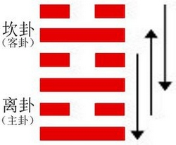

# Jì Jì ䷾

* After Completion

> Chinese: 既济 ䷾ jì jì

<a id="p-204"/>

**Jì Jì ䷾** intimates progress and success in small matters. There will be advantage in being firm and correct. There has been good fortune in the beginning; there may be disorder in the end.

<a id="p-205"/>

1.<a id="63.1"/> The first `NINE`, undivided, (shows its subject as a driver) who drags back his wheel, (or as a fox) which has wet his tail. There will be no error.

> **䷾** changing to [**䷦**](e8b987jian.md#39.1)

> Matching Line 1 in Adjacent Hexagram: [**䷿**](e69caae6b58eweiji.md#64.1)

2.<a id="63.2"/> The second `SIX`, divided, (shows its subject as) a wife who has lost her (carriage-)screen. There is no occasion to go in pursuit of it. In seven days she will find it.

> **䷾** changing to [**䷄**](e99c80xu.md#5.2)

> Matching Line 2 in Adjacent Hexagram: [**䷿**](e69caae6b58eweiji.md#64.2)

3.<a id="63.3"/> The third `NINE`, undivided, (suggests the case of) [Gāo Zōng](https://zh.wikipedia.org/zh-cn/高宗), who attacked the [Demon region](https://en.wikipedia.org/wiki/Guifang), but was three years in subduing it. Small men should not be employed (in such enterprises).

> **䷾** changing to [**䷂**](e5b1afzhun.md#3.3)

> Matching Line 3 in Adjacent Hexagram: [**䷿**](e69caae6b58eweiji.md#64.3)

<a id="p-206"/>

4.<a id="63.4"/> The fourth `SIX`, divided, shows its subject with rags provided against any leak (in his boat), and on his guard all day long.

> **䷾** changing to [**䷰**](e99da9ge.md#49.4)

> Matching Line 4 in Adjacent Hexagram: [**䷿**](e69caae6b58eweiji.md#64.4)

5.<a id="63.5"/> The fifth `NINE`, undivided, shows its subject (as) the neighbour in the east who slaughters an ox (for his sacrifice); but this is not equal to the (small) spring sacrifice of the neighbour in the west, whose sincerity receives the blessing.

> **䷾** changing to [**䷣**](e6988ee5a4b7mingyi.md#36.5)

> Matching Line 5 in Adjacent Hexagram: [**䷿**](e69caae6b58eweiji.md#64.5)

6.<a id="63.6"/> The topmost `SIX`, divided, shows its subject with (even) his head immersed. The position is perilous.

> **䷾** changing to [**䷤**](e5aeb6e4babajiaren.md#37.6)

> Matching Line 6 in Adjacent Hexagram: [**䷿**](e69caae6b58eweiji.md#64.6)

## Notes

The character called 既 (Jì) is used as a symbol of being past or completed. 济 (Jì) denotes primarily crossing a stream, and has the secondary meaning of helping and completing. The two characters, combined, will express the successful accomplishment of whatever the writer has in his mind. In dealing with this lineal figure, [king Wén](https://en.wikipedia.org/wiki/King_Wen_of_Zhou) was thinking of the condition of the kingdom, at length at rest and quiet. The vessel of the state has been brought safely across the great and dangerous stream. The distresses of the kingdom have been relieved, and its disorders have been repressed. Does anything remain to be done still? Yes, in small things. The new government has to be consolidated. Its ruler must, without noise or clamour, go on to perfect what has been wrought, with firmness and correctness, and ever keeping in mind the instability of all human affairs. That every line of the hexagram is in its correct place, and has its proper correlate is also supposed to harmonize with the intimation of progress and success.

Line 1, the first of the hexagram, represents the time immediately after the successful achievement of the enterprise it denotes; -- the time for resting and being quiet. For a season, at least, all movement should be hushed. Hence we have the symbolism of a driver trying to stop his carriage, and a fox who has wet his tail, and will not tempt the stream again.

Line 2 is weak, and in its proper place. It also has the strong correlate 5; and might be expected to be forward to act. But it occupies its correct and central place, and suggests the symbol of a lady whose carriage has lost its screen. She will not advance [p. 207](e69caae6b58eweiji.md#p-207) further so soon after success has been achieved; but keep herself hidden and retired. Let her not try to find the screen. When it is said that she will find this 'after seven days,' the meaning seems to be simply this, that the period of **Jì Jì ䷾** will then have been exhausted, the six lines having been gone through, and a new period, when action will be proper, shall have commenced.

The strong line 3, at the top of the lower trigram, suggests for its subject one undertaking a vigorous enterprise. The writer thinks of [Gāo Zōng](https://zh.wikipedia.org/zh-cn/高宗), the sacrificial title of [Wǔ Dīng](https://en.wikipedia.org/wiki/Wu_Ding), one of the ablest sovereigns of the [Shāng](https://en.wikipedia.org/wiki/Shang_dynasty) dynasty (B. C. 1364 - 1324), who undertook an expedition against the barbarous hordes of the cold and bleak regions north of the Middle States. He is mentioned again under the next hexagram. He appears also in the [Shū Jīng, IV, ix](https://ctext.org/shang-shu/day-of-the-supplementary-sacrifice-to), and in the [Shī Jīng, IV, iii, ode 5](https://ctext.org/book-of-poetry/yin-wu). His enterprise may have been good, and successful, but it was tedious, and the paragraph concludes with a caution.

Line 4 is weak, and has advanced into the trigram ☵ for water. Its subject will be cautious, and prepare for evil, as in the symbolism, suggested probably by the nature of the trigram.

'The neighbour in the East' is the subject of line 5, and 'the neighbour in the West' is the subject of the correlate 2, the former quarter being `yáng` and the latter `yīn`. Line 5 is strong, and 2 is weak; but weakness is more likely to be patient and cautious than strength. They are compared to two men sacrificing. The one presents valuable offerings; the other very poor ones. But the [p. 208](e69caae6b58eweiji.md#p-208) second excels in sincerity, and his small offering is the more acceptable.

The topmost line is weak, and on the outmost edge of **Kǎn ☵**, the trigram, of peril. His action is violent and perilous, like that one attempting to cross a ford, and being plunged overhead into the water.

# [既济 ䷾](e697a2e6b58ejiji_cn.md)
