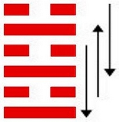
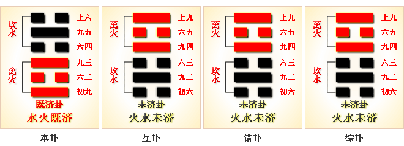

# 既济 ䷾ jì jì

- No.63

> 既濟，亨小，利貞，初吉終亂。
>《彖》曰：既濟亨，小者亨也。利貞，剛柔正而位當也。初吉，柔得中也，終止則亂，其道窮也。
>《象》曰：水在火上，既濟，君子以思患而豫防之。

> 初九，曳其輪，濡其尾，无咎。
>《象》曰：曳其輪，義无咎也。

> 六二，婦喪其茀，勿逐，七日得。
>《象》曰：七日得，以中道也。

> 九三，高宗伐鬼方，三年克之，小人勿用。
>《象》曰：三年克之，憊也。

> 六四，繻有衣袽，終日戒。
>《象》曰：終日戒，有所疑也。

> 九五，東鄰殺牛，不如西鄰之禴祭，實受其福。
>《象》曰：東鄰殺牛，不如西鄰之時也，實受其福，吉大來也。

> 上六，濡其首，厲。
>《象》曰：濡其首厲，何可久也。

二气无冲，阴阳敌体。世应分君臣，刚柔得位，曰既济。
> 离坎分子午，水上火下，性相交敌，不间隔。是曰既济也。

与离为飞伏。
> 己亥水，戊午火。

世上见三公，应上见宗庙。内外阴阳相应，坎离相纳上下交。
> 坎水润下，离火炎上，二气相交为既济。

五行相配，吉凶丽乎爻象。
> 吉凶之兆，见乎爻象。

建丙戌至辛卯，
> 寒露春分。

卦气分节气。始丙戌受气，至辛卯成正象。考六位，分刚柔，定吉凶。积筭起辛卯至庚寅，周而复始。
> 土木见运入卦。

五星从位起荧惑，
> 荧惑火星入卦。

危宿从位降己亥。
> 危宿入己亥。

分气候二十八。
> 定六爻之类，考吉凶之兆。

坎入兑，为积阴；二象分，具阴。上下反覆，卦变革。
> 坎入革，六四荡之，入阳变体为阴也。

# [Jì Jì ䷾](e697a2e6b58ejiji.md)
