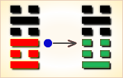

# 既济 ䷾


既济（jì jì）卦，水火既济盛极将衰。

坎为水，离为火，水火相交，水在火上，水势压倒火势，救火大功告成。

既，已经；济，成也。既济就是事情已经成功，但终将发生变故。 既济：亨小，利贞；初吉终乱。

《既济》卦象征成功：此时功德完满，连柔小者都亨通顺利，有利于坚守正道；开始时是吉祥的，但如有不慎，终久必导致混乱。

既济卦的代号是`5:2`，
表示其主卦是`5`卦离卦，卦象是火，
客卦是`2`卦坎卦，卦象是水，
这个卦是异卦，下离上坎相叠。

图中，红色表示当位的爻，箭头表示有应。

- 卦辞：亨，小利贞；初吉终乱。
- 卦序：63

《既济》卦展示形势恰好时各种变化的可能性。全名为水火既济，既济的本义是已经渡河，有一种正好条件合适的意思，主方应当顺应自然，充分利用这种大好形势。

### 结构与卦爻辞

既济卦的结构与卦爻辞中有三个箭头，表示三种有应。有应指主客和客卦的相应的爻之间阴阳对应，呈一阴一阳的和谐状态。和谐是否对主方有利？这还要看对应的爻是不是当位。在图中，当位以红色表示，既济卦的爻全部当位。既当位而又有应，是对主方有利的因素。既济卦结构图显示出当前形势完全对主方有利，没有不利因素。

三个箭头中，有两个向下，一个向上，方向不一致。为什么？因为当位与否决定于爻的位置和爻的阴阳属性，而爻的位置又决定于爻的意义。第一爻是主卦下爻，如果是阳，则表示主方积极主动，有利于创造和维护主方利益，这个位置被称作阳位，是对主方潜在的有利因素。第一爻是阳爻，阳爻在阳位，这潜在因素成了真正的对主方有利因素。第三爻是主卦上爻，如果主方态度强硬，有利于制约客方，为主方谋取利益，也是阳位，阳爻在阳位，既当位又有应是对主方有利因素。第二爻的情况与这两条爻相反，主方素质不佳时有可能取得客方帮助，所以，这是阴位，阴爻在阴位，也当位，当位而又有应，也是对主方有利因素。

箭头两端的极性相反，并且是否当位的情况相同，这是由于从主方的决定看，客方的利益正好与主方相反，也就是说，是阳位还是阴位，客卦的情况正好与主卦相反。主卦下爻是阳位，客卦下爻是阴位；主卦中爻是阴位，客卦中爻是阳位；主卦上爻是阳位，客卦上爻是阴位。客卦重在主卦之上，因此，就有常说的，卦的一、三、五位是阳位，二、四、六位是阴位，或者说奇数位是阳，偶数位是阴。

既济卦中主客双方三个要素全部和谐，主方应当充分利用这种大好形势，顺应自然，否则，好事会变成坏事。

卦名既济表示已经过河，“曳其轮，濡其尾”说明过河的是一个拉着车的动物，“濡其首”说明该动物在拉车过河时弄湿了头，爻辞用了一只小狐狸拉车过了一条将要枯干的河的寓言比喻主客双方关系，这是一个主方获得成果的难得机会。但是，拉车过河并不容易，并且有严峻的时候，“濡其首”。其余四条爻辞撇开了这个寓言，直接评述主方在处理双方关系中应当注意的事，要顺从自然，“勿逐”；要谨慎处人，“小人勿用”；要谨慎处事，“终日戒”；并且要讲究实效，“实受其福”。删去判断辞，六条爻辞就是一首完整的围绕主题“既济”的散文诗，下面是其译文。

```
（像只小狐狸）拉车轮子（过河），
沾湿了尾巴，尽了力（而为）。
（像）一位妇女丢了车门帘，
不用找，七日就重新得到（顺其自然）。
（像）高宗讨伐鬼方国，三年征服了鬼方国；
不要任用不称职的人（要善用人）。
（像）船有渗漏时，用破布一类东西塞，终日戒备。
（像）东邻杀牛，不如西邻之禴祭，实受其福（要诚恳）。
（警惕，像那只小狐狸）把头弄湿了，很不适宜。
```

从卦的结构看，这是一个完美无缺的卦，形势对主方非常有利，然而，事物总是变化的，这种完美无缺的形势只能是短暂的，所以卦辞告诫主方要注意未来发展，“初吉终乱”。下面逐条说明卦爻辞。

### 卦辞
```
〖原文〗亨，小利贞；初吉终乱。
〖译文〗顺利，坚持下去小见吉利；初始吉利，最终危乱。

〖解说〗这是既济卦的卦辞，概括地说明主客双方形势。
“亨”（hēng），通达，顺利，“万事亨通”。
“贞”（zhēn），坚持，“坚贞不屈”。
“利贞”，应当坚持下去。
古时候，《易》的卦爻辞没有标点符号，加上标点符号，
“亨小利贞”这四个字的用法可以有“亨，小利贞”
与“亨小，利贞”两种形式，
对这二种形式可以作出完全不同的解释。
到底是“亨，小利贞”还是“亨小，利贞”？
查看《易》的六十四卦的卦爻辞中“亨”与“贞”的用法，
“元亨”10次，“亨”33次，“光亨”1次，“利贞”20次，“小利贞”2次。
既济卦的六条爻全部既当位又有应，表明形势对主方有利，
具体地说，主方利用客方被动等有利条件，
主动对客方施压，进展是顺利的，
因此卦辞说的应当是“亨”，而不是“亨小”。
因此卦辞说的是“小利贞”，而不是“利贞”，
也就是说，坚持下去利益很小，不是很有利，
应当改变处境，而不是坚持保留处境。
“初吉终乱”四个字是对“亨，小利贞”的补充和对事态发展的说明。
“初吉”，开始阶段吉利，“亨”也是指开始阶段，
因为主方采取了主动行动，而客方被动，
从而主方能够顺利地达到自己的目的。
一旦主方行动以后，客方必然有所反应，
随之主客双方陷入混乱，卦辞说“终乱”。
“乱”不一定不吉，“乱”是事态的必然发展，
不乱几乎是不可能的，主方需要在乱中掌握主动，掌握事态的发展。

〖王氏周易〗“小利贞”，阴为小，阳称大，
既济三阴乘刚在三阳之上，
既济为阴之既济，而非阳之既济。
“利”阴之利，“贞”告诫阴要正。
“初吉终乱”，三阴都乘刚，没有不乱之理。
```

### 水火既济 盛极将衰 中上卦

## 爻辞
### 初九
```
〖原文〗曳其轮，濡其尾，无咎。
〖译文〗拉那个车轮前行，水沾湿了车尾巴，无所怪罪。

〖解说〗“曳”（yè），拉、牵引，“曳光弹”。
“濡”（rú），沾湿，润泽。“濡其尾”表明“曳其轮”，
能够沾湿车尾巴，表明这在泥泞的路上，
或即将枯干的河流底部拉这车子。
很多人认为这是一段关于小狐狸拉车过河的寓言。
这是既济卦第一爻爻辞，代表主方的行动，
阳爻，表示主方积极主动地谋取和扩大自己的利益，
比如说，创新、创业、投资、进攻、求职、示爱，等等。
这条爻既当位又有应，是对主方有利因素，
为了发挥这个有利因素的作用，主方必须努力奋斗，
就像一个小狐狸尽全力拉一个车的轮子渡过一条接近枯干的河流。
由于客方被动，有时可能给主方的主动行动带来困难，
“濡其尾”，虽然沾湿了车尾巴，但是尽力而为，无所怪罪。

〖结构分析〗第一爻位置是阳位，
这条爻是阳爻，阳爻在阳位，
当位，又与四阴有应。
既当位又有应，是对主方有利因素，
主方充分利用这个有利因素，
尽管“濡其尾”，也“曳其轮”，主方应当如此，“无咎”。

〖王氏周易〗六二欲升，初九以阳刚镇于下，
使其不行，如同拉住六二行走的车轮，
又如弄湿了六二的尾巴，使阴不能畅其淫邪。
```

### 六二
```
〖原文〗妇丧其茀，勿逐，七日得。
〖译文〗妇女丢了头饰，不用寻找，七日以内就会失而复得。

〖解说〗“茀”（fú），遮盖物，古时妇女头饰。
“逐”（zhú），追赶，“逐鹿”。
这是既济卦第二爻爻辞，代表主方素质，
阴，表示主方素质不佳，爻辞说“妇丧其茀”。
这条爻既当位又有应，
表示主方能够从主客双方关系中得到利益，
是对主方的有利因素。
“勿逐，七日得”，
告诉主方不要担心，仔细观察形势变化，
顺从自然，就可以避免损失。

〖结构分析〗第二爻位置是阴位，
这条爻是阴爻，阴爻在阴位，当位，又与五阳有应。
这是对主方有利的因素，有了这样的有利因素，
主方应当顺其自然，“勿逐”，
即使有些损失，也会弥补过来，“七日得”。

〖王氏周易〗六二位于下卦之中，又阴居偶位（柔位），
合于中道，不与其他阴爻畅其阴私。
```

### 九三
```
〖原文〗高宗伐鬼方，三年克之；小人勿用。
〖译文〗殷高宗征伐鬼方国，费时三年打败了鬼方国；
事关重大，不要任用不称职的人。

〖解说〗“高宗”，商代第23位帝王，名武丁，
在位时期约前1250年～前1192年，
“鬼方”是商的邻国，
武丁在位时期，曾攻打鬼方，
并任用贤臣傅说为相，其妻子妇好为将军，
商朝再度强盛，史称“武丁中兴”。
这是既济卦第三爻爻辞，阳，表示主方态度强硬。
这条爻既当位又有应，是对主方有利因素，告诉主方，
坚持下去就是胜利，不过要有耐心，
如“高宗伐鬼方”，攻打了三年，最终胜利。
“小人”是指行为轻率的人，不能轻率处事。

〖结构分析〗第三爻位置是阳位，
这条爻是阳爻，阳爻在阳位，当位，
又与六阴有应，这是对主方有利因素。
尽管条件有利，态度也得强硬适度，不能过分，“小人勿用”。

〖王氏周易〗九三阳居奇位（刚位），
以刚居刚，所以说高宗伐鬼方，控制不成，则出兵相伐，刚也。
三与上爻相应，小人仗其军功恃功而骄，告诫九三“小人勿用。”
```

### 六四
```
〖原文〗繻有衣袽，终日戒。
〖译文〗船有渗漏时，撑着用败絮塞罅漏的船，终日戒备。

〖解说〗这是既济卦第四爻爻辞，
第四爻是阴爻在阴位，当位。
同时，第一爻是阳爻，第四爻与第一爻有应。
第四爻既当位又有应，是对主方有利因素。
第四爻是阴爻，表示客方被动防守。
客方的被动防守，为主方主动进取提供了机会，有利于主方。
另一方面，客方虽然是被动防守，但是不能排除其中有诈。
爻辞提醒主方要有戒备。
“繻”（rú），应当是濡，渗漏。
“袽”（rú），旧絮，破布一类的东西。
这条爻辞，从字面上看，
是说船上的人应当终日戒备航行中沉船的危险，
如果船有渗漏，立即用破布一类东西堵塞。
就当前主客双方关系来说，主方应当有对意外事件的应急措施。
这里的“终日戒”是指主方终日戒备，而不是指客方终日戒备。
虽然处于被动防守状态的客方也会“终日戒”，
不过，爻辞是从主方角度说的，
“终日戒”是主方终日戒备自己预计不周可能遭受客方攻击，
也要戒备客方在防守中反扑。

〖结构分析〗第四爻位置是阴位，
这条爻是阴爻，阴爻在阴位，当位，又和一阳有应。
既当位又有应，是对主方有利因素，
然而，事物总是变化的，客方的行动决定于客方自己，
不是主方所能决定的，主方应当警惕客方可能有变化，“终日戒”。

〖王氏周易〗六四以柔居偶位，
以柔居柔，不敢轻进，
如同害怕船泄露而藏有治漏棉絮，
畏惧在心，不敢冒犯阳刚，所以说没有灾害。
```

### 九五
```
〖原文〗东邻杀牛，不如西邻之禴祭，实受其福。
〖译文〗东邻殷人杀牛举行盛大的祭祀，
不如西邻周人举行俭朴的祭祀，实实在在地享受天的福佑。

〖解说〗这是既济卦第五爻爻辞。第五爻是客卦中爻，
代表客方素质，阳爻表示客方素质良好。
爻辞中的“禴”（yuè），禴祭，
一种春季进行的祭祀，祭品菲薄，但心很诚。
爻辞以祭祀为比喻，说东邻杀牛的丰盛祭祀，
不如西邻的俭朴而意诚的祭祀，
能够实实在在地受到神与鬼的福佑。
在这个祭祀比喻中“实受其福”中的“其”指神和鬼。
运用于双方关系，“其”是指客方，
“实受其福”指主方实实在在地受到来自客方的福佑。
这里强调实际效果而不重形式。

〖结构分析〗第五爻位置是阳位，
这条爻是阳爻，阳爻在阳位，
当位，又与二阴有应。
当位，表明客方素质良好，
是潜在的对主方有利因素，主方有可能得到客方帮助；
有应，表明主方素质不佳，需要客方帮助，
那潜在因素成了真正的对主方有利因素。
尽管存在这样的有利因素，是否主方可能得到客方帮助，
还要看主方如何对待客方，爻辞建议主方实实在在地尊重客方，
从而能够得到客方帮助，“实受其福”。

〖王氏周易〗东邻指上爻，西邻指六四。
上爻阴私僭越九五阳刚之上，飞扬跋扈，
虽挥霍杀牛以侍奉九五，不如六四谨慎诚心薄祭。
```

### 上六
```
〖原文〗濡其首，厉。
〖译文〗涉水过河，水淹其头部，危险。

〖解说〗这是既济卦第六爻爻辞。
爻辞中“濡其首”显然又是关于小狐狸过河的寓言，
说是小狐狸把头弄湿了。
“厉”（lì），凶猛，“厉害”、“严厉”。
爻辞字面意思是：把头弄湿了，形势就将变得严厉。
这条爻代表客方态度，阴爻表示客方态度随和，
本来客方的随和态度有利于主方采取强硬措施，
然而，主方必须有度，不可对客方过于粗暴。
爻辞警告主方，要注意不要强硬过度了，不要“濡其首”。
有的时候，机会看来很好，
但是实际上是“初吉终乱”，需要有应付“乱”的准备。
要看到事物的发展和活动的限度，
注意不要行为过度以致“濡其首”，“濡其首”则“厉”。

〖结构分析〗第六爻位置是阴位，
这条爻是阴爻，阴爻在阴位，当位，又与三阳有应。
当位，表明客方态度随和是潜在的对主方有利因素，
主方有可能按自己的需要采取强硬措施；
有应，表明主方态度强硬，
的确采取了强硬措施扩大自己的利益，
那潜在因素成了真正的对主方有利因素。
不过，尽管客方态度随和，
主方应当考虑到客方的实力仍然比主方强大，
如果主方态度强硬过度，
对客方不尊重，则后果将很严峻，爻辞说“厉”。

〖王氏周易〗阴亢居上，侍其刚猛渡河，
水淹其头而不顾，故此爻凶险。
```

### 爻辞解释
```
《象》曰：“水在火上，既济；君子以思患而预防之。”
【白话】《象辞》说：
《既济卦》的卦象是离（火）下坎（水）上，
为水在火上之表象，
比喻用火煮食物，食物已熟，象征事情已经成功；
君子应有远大的目光，在事情成功之后，
就要考虑将来可能出现的种种弊端，
防患于未然，采取预防措施。

初九，曳其轮，濡其尾，无咎。
【白话】初九，拉住车的轮子，不使它快进，
小狐狸渡河时沾湿了尾巴，无法快游，没有灾祸。
《象》曰：“曳其轮”，义无咎也。
【白话】《象辞》说：“拉住车的轮子，不使它快进”，
说明事情成功之后，必须谨慎从事，小心防备，才没有灾祸。

六二，妇丧其茀，勿逐，七日得
【白话】六二，丢失了妇人乘车的遮帘，
不用去寻找，过不了七天就会物归原处。
《象》曰：“七日得”，以中道也。
【白话】《象辞》说：“丢失妇人乘车上的遮帘，
过不了七日就会物归原处”，
说明此时正处于中位，坚守正道，不偏不倚，
所以丢失了的东西可以失而复得。

九三，高宗伐鬼方，三年克之；小人勿用。
【白话】九三，
殷高宗武丁征伐地处西北的鬼方国，
经过三年的连续战斗才获得胜利；
不可任用急躁冒进的小人。
《象》曰：“三年克之”惫也。
【白话】《象辞》说：
“经过三年的连续战斗才攻克了鬼方国”，
说明战争非常激烈又持续了三年之久，
已经筋疲力尽了，胜利是来之不易的。

六四，繻有衣袽，终日戒。
【白话】六四，渡河的时候，
为了防止船漏水，事先要准备破布棉絮，
而且整天保持戒备，以防止发生灾祸。
《象》曰：“终日戒”有所疑也。
【白话】《象辞》说：
“整天保持戒备，以防止灾祸的发生”，
说明此时心中有所疑虑，感到恐惧。

九五，东邻杀牛，不如西郊之禴祭，实受其福。
【白话】九五，东边邻国杀牛羊来举行盛大祭礼，
不如西边的邻国举行简单而朴素的祭祀，
这样才能实在地得到神赐的福分。
《象》曰：“东邻杀牛”，
不如西邻之时也；“实受其福”，吉大来也。
【白话】《象辞》说：
“东边的邻国杀牛宰羊来举行盛大的祭礼”，
还不如西边邻国能按时举行虔诚简单的时祭；
西邻“实在地得到上天神灵降赐的福分”，
说明此是正当其位，吉祥福分将不断隆临，非常幸运。

上六，濡其道，厉。
【白话】上六，小狐狸渡河时弄湿了头，有危险。
《象》曰：“濡其道，厉”，何可久也！
```

### 《象》曰
```
水在火上，既济；
君子以思患而豫防之。
曳其轮，义无咎也。
七日得，以中道也。
三年克之，惫也。
终日戒，有所疑也。
东邻杀牛，不如西邻之时也。
实受其福，吉大来也。
濡其首厉，何可久也？
```

### 《彖》曰
```
既济亨，小者亨也。
利贞，刚柔正而位当也。
初吉，柔得中也。
终止则乱，其道穷也。
```


### 《断易天机》解

既济卦坎上离下，为坎宫三世卦。既济就是说已经成功，事情已经摆平。但还需谨慎，当心物极必反。

### 北宋易学家 邵雍 解

济助有成，坚忍自重；由大而小，确保盛运。

得此卦者，事业有成，成功之象，但谨防盛极必衰，宜退守为吉，再进则凶。

### 台湾国学家 傅佩荣 解

- 时运：盛极必衰，谨防后患。
- 财运：及时出手，可得利润。
- 家宅：大厦可居；百年好合。
- 身体：大病初愈，仍需自理。

### 传统解卦
```
这个卦是异卦（下离上坎）相叠。
坎为水，离为火，水火相交，水在火上，
水势压倒火势，救火大功告成。
既，已经；济，成也。
既济就是事情已经成功，但终将发生变故。

大象：坎水在离火之上，水性下注，
火势上炎，水火相济，完成之意。
```

运势：名利双收，成功之象，但须防物极必反，初吉后凶。

- 事业：处在顺利和兴旺的阶段，甚至大功已经告成。如何才能保住这种势头，是问题的关键。必须认识盛极将衰的真理，思患预防，防微杜渐，有备可无患。同时，一定要密切注意形势，抓住有利时机，继续奋发向上，推动事业发展。
- 经商：由于市场形势有利，已经赚得许多，但同时也预示着危机的随时出现。因此，务必小心在意，事未到，先预防，终日提防戒惧。同时，认真观察市场的变化，随时转向，开拓新市场。
- 求名：个人追求名利的基本条件已经具备。必须防止因此而变得僵化和保守，以致功亏一篑，半途而废。
- 婚恋：起初顺利，中途会出现挫折。
- 决策：各方面条件都很好，环境又有利于成长。但因此反而会使自己满足，停止前进，甚至变得颓废，趋向没落。一定要不断刻苦努力，保持谦虚美德，常怀不安之心，防止不测事件发生。

### 台湾 张铭仁 解卦
```
既济：表示水火阴阳调和，一时平安和乐之象。
水火本相克，因一时环境或人事所影响，
而暂时相安无事，但终非常久之象，必有所冲克而败。

解释：已经得到利益，不可贪得无厌。

特性：物质丰盛，但精神易空虚，外华内虚，
交际广，知心少，心思细腻，多愁善感，喜宁静的生活。
```

运势：功名双收。极盛之时，但须知物极必反，宜退守为吉，再进则凶。但得此卦者，皆有因一时顺利而忘本，大意失荆州，终有人不和、心迷乱之象。

- 家运：生在富家之象，受祖上恩泽而不知珍惜者多，终而破运之兆。
- 疾病：短期虽有好转，但好景不常。
- 胎孕：不安。
- 子女：初时幸福，长大后与双亲不和，慎之。
- 周转：短期可成，长期无望。
- 买卖：中途变卦不利。故初时见好就收，莫贪心拖延，否则不利。
- 等人：已中途折回，不必再等。
- 寻人：若是常出走之人，小时自回，长大再出走，难寻。甚或不回。
- 失物：应可寻回。
- 外出：利于出行，途中需注意安全。
- 考试：实力有，但需视考期之日吉凶而定，小吉。
- 诉讼：有理说不清，仍须把握最有利时机争取主动，迟则反见凶。
- 求事：紧急可，不宜长久。
- 改行：不宜。
- 开业：开业者最好慎重考虑，因此卦象好景不常。

## 初九爻详解
### 初九爻辞

初九。曳其轮，濡其尾，无咎。

《象》曰：曳其轮，义无咎也。

### 白话文解释

初九：提着腰带过河，打湿了衣尾。没有大问题。

《象辞》说：提着腰带过河，打湿了衣尾，理应无灾难。

### 北宋易学家 邵雍 解

平：得此爻者，时运未到，欲动未动，安保无虞。做官的有职未受，有位未登。

### 台湾国学家 傅佩荣 解

- 时运：奋勉有加，可以无咎。
- 财运：暂时稳住，将可脱困。
- 家宅：可以安居；初聘为吉。
- 身体：初病可治。

### 初九变卦：水火既济 变卦 水山蹇


 
初九爻动变得[第39卦：水山蹇](e8b987jian_cn.md)。

这个卦是异卦（下艮上坎）相叠。

坎为水，艮为山。

山高水深，困难重重。

人生险阻，见险而止，明哲保身，可谓智慧。蹇，跋行艰难。

## 六二爻详解
### 六二爻辞

六二。妇丧其茀，勿逐，七日得。

《象》曰：七日得，以中道也。

### 白话文解释

六二：妇人丢失了头巾，不用寻找，七日内可以不寻而得。

《象辞》说：七日内可以不寻而得，因为六二阴爻居阴位，位象既得，失物将还。

### 北宋易学家 邵雍 解

平：得此爻者，先难后易，做官的有先逆后顺之美。

### 台湾国学家 傅佩荣 解

- 时运：不计小利，得成大功。
- 财运：失而复得，不必担心。
- 家宅：七年可还；将可团聚。
- 身体：七日可愈。

### 六二变卦：水火既济 变卦 水天需


 
六二爻动变得[第5卦：水天需](e99c80xu_cn.md)。

这个卦是异卦（下乾上坎）相叠，

下卦是乾，刚健之意；上卦是坎，险陷之意。

以刚逢险，宜稳健之妥，不可冒失行动，观时待变，所往一定成功。

## 九三爻详解
### 九三爻辞

九三。高宗伐鬼方，三年克之。小人勿用。

《象》曰：三年克之，惫也。

### 白话文解释

九三：高宗讨伐鬼方，费时三年才打败它。筮遇此爻，不可重用小人。

《象辞》说：费时三年才打败它，因为鬼方这时已疲惫不堪。

### 北宋易学家 邵雍 解

凶：得此爻者，有结怨争诉之损。做官的多差遣征伐之举。

### 台湾国学家 傅佩荣 解

- 时运：努力工作，所谋必成。
- 财运：数年经营，才可获利。
- 家宅：三年后居；三年可婚。
- 身体：一时无恙，只保三年。

### 九三变卦：水火既济 变卦 水雷屯


 
九三爻动变得[第3卦：水雷屯](e5b1afzhun_cn.md)。

这个卦是异卦（下震上坎）相叠，

震为雷，喻动；坎为雨，喻险。

雷雨交加，险象丛生，环境恶劣。

“屯”原指植物萌生大地，万物始生，充满艰难险阻，然而顺时应运，必欣欣向荣。

## 六四爻详解
### 六四爻辞

六四。繻有衣袽，终日戒。

《象》曰：终日戒，有所疑也。

### 白话文解释

六四：撑着用败絮塞罅漏的船，整日里提心吊胆。

《象辞》说：整日里提心吊胆，说明心中疑虑重重。

### 北宋易学家 邵雍 解

平：得此爻者，时运平平，有备则无患。做官的须做好预防，则爵禄稳固。

### 台湾国学家 傅佩荣 解

- 时运：处顺思困，谨慎为宜。
- 财运：经营漏洞，早些修补。
- 家宅：修正屋宇；珍惜情谊。
- 身体：年老体弱。

### 六四变卦：水火既济 变卦 泽火革


六四爻动变得[第49卦：泽火革](e99da9ge_cn.md)。

这个卦是异卦（下离上兑）相叠。

离为火、兑为泽，泽内有水。

水在上而下浇，火在下而上升。

火旺水干，水大火熄。

二者相生亦相克，必然出现变革。变革是宇宙的基本规律。

## 九五爻详解
### 九五爻辞

九五。东邻杀牛，不如西郊之禴祭，实受其福。

《象》曰：东邻杀牛，不如西邻之时也。实受其福，吉大来也。

### 白话文解释

九五：殷人杀牛厚祭鬼神，不如周人簿祭鬼神，周人倒是得到鬼神的福佑。

《象辞》说：殷人杀牛厚祭鬼神，不如周人薄祭鬼神的用意美善，周人得到鬼神的福佑，将有重大的吉庆降临。

### 北宋易学家 邵雍 解

吉：得此爻者，近谋有实，远谋多虚，不利东方，利于西方。

### 台湾国学家 傅佩荣 解

- 时运：持盈保泰，吉凶自取。
- 财运：奢不如俭，实获其利。
- 家宅：向西吉宅；两邻订亲。
- 身体：最好祷告。

### 九五变卦：水火既济 变卦 地火明夷


九五爻动变得[第36卦：地火明夷](e6988ee5a4b7mingyi_cn.md)。

这个卦是异卦（下离上坤）相叠。

离为明，坤为顺；离为日；坤为地。

日没入地，光明受损，前途不明，环境困难。

宜遵时养晦，坚守正道，外愚内慧，韬光养晦。

## 上六爻详解
### 上六爻辞

上六。濡其首，厉。

《象》曰：濡其首厉，何可久也。

### 白话文解释

上六：涉水过河，水拍湿其头部，危险。

《象辞》说：水拍湿其头部，怎能呆很久的时间呢？

### 北宋易学家 邵雍 解

凶：得此爻者，小人侵扰，坐船者，防溺水之灾。做官的有过刚则折之忧。

### 台湾国学家 傅佩荣 解

- 时运：好运已过，小心危险。
- 财运：首次买卖，必难获利。
- 家宅：不利长房；元配有灾。
- 身体：头部有疾，危险可知。

### 上六变卦：水火既济 变卦 风火家人


上六爻动变得[第37卦：风火家人](e5aeb6e4babajiaren_cn.md)。

这个卦是异卦（下离上巽）相叠。

离为火；巽为风。

火使热气上升，成为风。

一切事物皆应以内在为本，然后伸延到外。

发生于内，形成于外。喻先治家而后治天下，家道正，天下安乐。

# [Jì Jì ䷾](e697a2e6b58ejiji.md)
