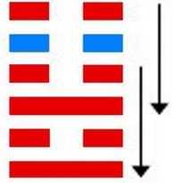

# 明夷 ䷣ míng yí

- No.36

> 明夷，利艱貞。
>《彖》曰：明入地中，明夷。內文明而外柔順，以蒙大難，文王以之。利艱貞，晦其明也。內難而能正其志，箕子以之。
>《象》曰：明入地中，明夷。君子以莅眾，用晦而明。

> 初九，明夷于飛，垂其翼，君子于行，三日不食，有攸往，主人有言。
>《象》曰：君子于行，義不食也。

> 六二，明夷，夷于左股，用拯馬壯吉。
>《象》曰：六二之吉，順以則也。

> 九三，明夷于南狩，得其大首，不可疾貞。
>《象》曰：南狩之志，乃得大也。

> 六四，入于左腹，獲明夷之心，于出門庭。
>《象》曰：入于左腹，獲心意也。

> 六五，箕子之明夷，利貞。
>《象》曰：箕子之貞，明不可息也。

> 上六，不明晦，初登于天，後入于地。
>《象》曰：初登于天，照四國也；後入于地，失則也。

积阴荡阳，六位相伤；外顺而隔于明，处暗不分；
> 一作明。

伤于正道，曰明夷。
> 夷者，伤也。

五行升降，八卦相荡，变阳入纯阴。
> 春夏之秋冬也。

阴道危，阳道安，故与震为飞伏。
> 癸丑土，庚午火。

伤于明而动乃见志，
> 震，动也。

退位入六四。诸侯在世，元士为应。君暗臣明不可止。
> 箕子与纣也。

建起六四癸巳至戊戌，
> 游魂及六四爻数起，小满至寒露。

积筭起戊戌至丁酉，周而复始。
> 土金入卦起筭数。

五星从位起太阴，
> 太阴水星入卦。

奎宿从位降癸丑，
> 奎宿入明夷，配六四癸丑土上。

分气候三十六。
> 三十六数入卦，起筭推吉凶。

地有火，明于内，暗于外。当世出处，为众所疑之，所及伤于明。《易》曰：“三日不食，主人有言。”阴阳进退，金水见火，气不相合。六位相荡，四时运动，静乃复本，故曰游魂。
> 本以宫入卦相荡，六位推迁也。

次降归魂入师卦。[䷆](e5b888shi_cn.md)

# [Míng Yí ䷣](e6988ee5a4b7mingyi.md)
