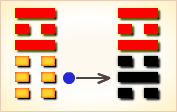
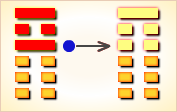

# 晋 ䷢


晋（jìn）是`0:5`卦的卦名，`0:5`是晋卦的代号。

坤卦是主卦，阳数是`0`；离卦是客卦，阳数是`5`。主卦的卦象是大地，客卦的卦象是火焰、太阳。

大地是被动的，主方是被动的，晋是被动的，不是自己要晋升就晋升，而是必须由客方来晋升。晋是好事，但又不一定是好事。

晋卦的主旨，在于论述如何上晋的为官之道。
卦辞以康侯受赐为喻，说明上晋之臣为君王所赏识，六爻爻辞分别讲述了上晋的几种情况，其三爻讲述的众允，

悔亡，说明求晋之人既注重求得君王赏识，也注重获得民众的拥护，只有获得民众的拥护，才不会有遭到民众反对的悔恨。
图中，红色表示当位的爻，天蓝色表示不当位的爻，箭头表示有应。

- 解释：晋升
- 主旨：论述如何上晋的为官之道。
- 上卦：离（火、日）
- 下卦：坤（地）
- 卦序：35

> 晉，康侯用錫馬蕃庶，晝日三接。
>《彖》曰：晉，進也。明出地上，順而麗乎大明，柔進而上行，是以康侯用錫馬蕃庶，晝日三接也。
>《象》曰：明出地上，晉。君子以自昭明德。

> 初六，晉如摧如，貞吉。罔孚，裕无咎。
>《象》曰：晉如摧如，獨行正也；裕无咎，未受命也。

> 六二，晉如愁如，貞吉，受茲介福，于其王母。
>《象》曰：受茲介福，以中正也。

> 六三，眾允，悔亡。
>《象》曰：眾允之，志上行也。

> 九四，晉如鼫鼠，貞厲。
>《象》曰：鼫鼠貞厲，位不當也。

> 六五，悔亡，失得勿恤，往，吉无不利。
>《象》曰：失得勿恤，往有慶也。

> 上九，晉其角，維用伐邑，厲吉无咎，貞吝。
>《象》曰：維用伐邑，道未光也。

### 火地晋 求进发展 中上卦

《象》曰：锄地锄去苗里草，谁想财帛将人找，一锄锄出银子来，这个运气也算好。

这个卦是异卦，下坤上离，相叠。离为日，为光明；坤为地。

太阳高悬，普照大地，大地卑顺，万物生长，光明磊落，柔进上行，喻事业蒸蒸日上。

### 爻辞解释
```
《彖》曰：晋，进也，明出地上。
顺而丽乎大明，柔进而上行，是以康侯用锡马蕃庶，昼日三接也。
【注释】明出地上：以卦象、卦德解释卦名。
明指上体离卦，离为日，为明；地指下体坤卦，坤为地为顺。
顺而丽乎大明：丽，依附；大明，太阳。
柔进而上行：柔进，指宽容的政策取得成功；
上行，指名望地位因事业成功而得到提高。
【译文】《彖辞》说：
《晋》，就是上进，好比太阳升到地面上。
地上万物顺从而依附于太阳而生长，柔和上进，
所以治国安民的康侯能得到众多车马的赏赐，在一天之内又得到三次接见。

《象》曰：明出地上，晋。君子以自昭明德。
【注释】自昭明德：自昭，
这里指用道德修养的方法来自我显示。明德，本来就有的美德。
【译文】《象辞》说：太阳升到地面上，象征上进。
君子因此领悟到要显示自己固有的美德。

初六，晋如，摧如，贞吉；罔孚，裕无咎。
《象》曰：晋如，摧如，独行正地。裕无咎，未受命也。

【译文】
初六：初六处晋长之初，阴柔在下，
前临重阴为敌，有始求进即受摧折阻隔之象。
此时应谨守正道，以待九四之应，则可获吉祥。
否则既受重阴之摧折阻隔，将难以孚信于众人，
故当从容行事，宽裕待时，终必能排除困难，而获无咎。
【注释】罔孚：得不到信任裕，犹言从容行事，宽裕待时。

六二，晋如愁如，贞吉；受兹介福，于其王母。
《象》曰：受兹介福，以中正也。
【译文】六二居两阴之间，上无应与，有晋途坎坷、忧惧以对之象。
惟其柔顺中正，能敬慎处事，谨守正道，则亦可获吉祥。
而六五高居尊位，与六二虽非阴阳正应，但同具有中正之德，如同其王母。
故六二承受此宏大的福泽，是来自六五王母之赐予。
【注释】介，大也。
王母：祖母也，阴之至尊者，指六五。

六三，众允，悔亡。
《象》曰：“众允”之志，上行也。
【注释】众允：同众人一道上进。允，前进。
【译文】六三不中不正，处非其位，本当有悔。
惟与下二阴有同进之心，又与上九有应，
故能为众所信允，且六五亦信之，故其悔亡。
【注释】允，信也。

九四，晋如鼫鼠，贞厉。
《象》曰：“鼫鼠贞厉”，位不当也。
【译文】九四失正不中，
窃据高位，贪婪而畏人，
犹如贪婪卑鄙、身无专技之鼫鼠。
以此晋长，必有危厉。
惟其上比六五，下应初六，
阳刚而谦居阴位，故勉其固守正道，可防危厉。
【注释】鼫鼠，即梧鼠，性贪婪卑鄙，
荀子劝学篇谓梧鼠五技而穷。
故以喻贪婪卑鄙、身无专技之人。
位不当：指九四以阳居于服位，不当位。

六五，悔亡，失得勿恤。往，吉。无不利。
《象》曰：失得勿恤，往有庆也。
【译文】六五以阴居阳，居位不当本有悔，
惟其柔得尊位，柔顺文明而下者顺从，故其悔亡。
且去其计功谋利之心，不忧虑个人之得失，
故无往而不吉，无所不利。
【注释】恤，忧也。失得勿恤，
谓不计较个人得失，以国计民生为念。

上九，晋其角，维用伐邑，厉吉，无咎，贞吝。
《象》曰：“维用伐邑”，道未光也。
【译文】上九处晋卦之终，有明岀地上，
盛极则衰之象，故有晋极而反、光明将损之意。
惟其刚动而有应，为安定其诸侯之国，
宜于征伐国内不服之私邑，
虽有危厉，终获吉祥，而无咎害。
然其有用武之憾，又居位不当，故应固守正道，以防憾惜。
【注释】维，语气词，无义。
用，宜也。
邑，国内城邑。
晋其角：指上九居晋卦顶点，
进无可进，好比钻进了牛角尖端。
维用伐邑：指上九此时只有靠讨伐叛逆建功，
言外之意是说晋极必反，靠德治已经无法建功了。
```

### 起卦

晋是`0:5`卦的卦名，`0:5`是晋卦的代号。

晋卦是由经卦坤卦和经卦离卦组成的，坤卦是主卦，阳数是`0`，主要性质是适应；离卦是客卦，阳数是`5`，性质是明亮而依附。
主方的力量远远小于客方，主方必须顺从客方，同时，客方又依附于主方。晋的意思是提拔、升级。如晋级，晋升，加官晋爵。主卦的卦象是大地，客方的卦象是火焰，太阳像火焰，照亮、温暖了大地。沉寂的大地，在阳光下充满生机。大地是被动的，主方是被动的，主方的晋是被动的，不是自己要晋升就晋升，而是必须由客方来晋升。晋是好事，但又不一定是好事。

起卦前必须客观地、全面地、准确地分析主方和客方的情况，必须至少符合下列条件之一，此卦才有参考价值：

1. 主方与地很相似，客方与火很相似。
2. 主方的阳数是`0`，客方的阳数是`5`。
3. 主方的行动是阴，素质是阴，态度也是阴；客方的行动、素质和态度是阳、阴和阳。

### 结构和卦爻辞

图左边是晋卦的结构，箭头表示有应关系，箭头方向是从阴爻到阳爻。晋卦的主卦的下爻和客卦的下爻有应，主卦的上爻和客卦的上爻也有应，这两对有应关系的爻都是不当位的爻，图中灰色表示不当位的爻，黑色表示当位的爻。这两对爻有应而不当位，说明，主方的消极被动和随和的态度都是不利于主方，受客方控制。还可以看到，主卦的第二爻与第三爻都是阴爻，第三爻是对第二爻的补充，第二爻是阴，表示主方的素质不佳，第三爻也是阴，表示主方的素质很差。因为主方的素质很差，没有对抗客方的实力，与其对抗客方的控制，主方不如顺应自然，接受客方的控制，与客方协调一致，这倒可能有利于主方改善自己的素质。

爻辞中有四次提到了晋。在当前双方关系形势中，主方顺从客方而行动，以柔和的态度服从客方，主方被“晋”了，而实际上双方的素质都不佳，主方从客方得不到实际好处，“晋如摧如”，“晋如愁如”。晋升了，主方力不从心，“晋如鼫鼠”；又被客方利用，没有回旋空间，“晋其角”。爻辞中的判断辞是根据爻在卦中的状态插入的，删除卦爻辞，可以看出六条爻辞是一首完整的围绕主题“晋”的散文诗，下面是其译文：

```
晋升了，如同受摧残，没有诚信，
晋升了，更是发愁，受到这个福分，来自王的母亲。
（晋升了，得到）众人允许，
晋升了，如同鼫鼠，能飞不能过屋，能缘不能穷木，
能游不能度谷，能穴不能掩身，能走不能先人。
不必考虑失和得，
晋升到了角尖，留着去攻打城邑。
```

卦辞则以“康侯用锡马蕃庶”为比喻，说明客方对主方的依附情况，并没有加判断词。下面逐条说明卦爻辞。

### 卦辞释义
```
〖原文〗康侯用锡马蕃庶，昼日三接。
〖译文〗康侯受赐很多车马，一日被接见三次。
〖解说〗这是晋卦的卦辞。
“康侯”，指周武王之弟卫康叔，“锡”是“赐”，
“蕃”是“繁多”，“庶”是“众多”，“接”是“接见”。
“用”的例子有“作用”、“功用”、“效用”、“利用”、“用于”等等。
古时侯没有标点符号，如果加逗号于“用”后，
则成“康侯用，锡马蕃庶，昼日三接”，意思是，
“为了让康侯发挥作用，赐了很多车马，一日接见三次”。
如果逗号在“用”前，则成“为了让康侯发挥作用，
用了赐于很多车马，一日接见三次的方法”。
不论逗号在前或在后，这个“用”字表明“康侯”受晋是被动的。
“三”，为什么一日之内要接见三次？
说明接见一次不行，接见二次不够，非得接见三次不可。
有求于康侯，依附于康侯，一次又一次加赐车马，
一日之内赐了三次车马，赐的车马已经很多，
康侯是否同意发挥作用呢？不知道，卦辞没有说。
康侯是个形象，用这个形象代表主方。
谁赐康侯车马？是王，在这里，指客方。
客方依附主方，给了主方很多好处，希望主方起更好的作用。
主方被客方所晋。晋对主方不一定是好事，
晋卦有五个爻不当位，表明形势不是很有利于主方。
从字面解释，卦辞的意思很简单：
康侯受赐很多车马，一日被接见三次。
但是，结合卦的结构，深入分析，
就可以看出深一层的意思，主方既要顺从客方，也要审时度势。
(一般，别卦的卦辞以判断词为主。
晋卦的卦辞中引用了历史典故，没有判断辞。
与其它卦的卦辞风格相比，很不一般，可能在周文王以后，有所修改)
```

### 初六
```
〖原文〗晋如摧如①，贞吉；罔孚，裕无咎。
【注释】①溍如浚如：疏通溍水河道。浚：疏导。
〖译文〗晋升如同受摧残，坚持下去吉利；没有诚信，富裕无咎。
〖另解〗疏通了溍水河床，排除了水涝等自然灾害，
人民又重新富裕起来了，没有灾难。

〖解说〗这是晋卦第一爻的爻辞，这个爻代表主方的行动，
主方消极被动，行动是阴，比如说，防守、退却、不想冒险、
不想探索或开辟新的发展领域、只求保持现状，等等。
“摧”是破坏，折断的意思，“摧残”。
“罔”是无，没有的意思，“置若罔闻”。
“孚”是信用，是为人所信赖的意思，“深孚众望”。
“裕”是丰富，宽绰的意思，“生活富裕”。
客方晋升了主方，要求主方积极主动，
这对于主方来说，不是愉快的事，“晋升像是摧残”。
但是，如果主方积极主动，改善素质，“坚持下去吉利”。
客方必须依赖主方才能获益，主方顺从客方也可以得到利益，
为了各自的目的，互相利用，没有诚信。
尽管没有诚信，主方为了得到利益，
为了生活得到改善，积极努力，
不应当受到怪罪，“罔孚，裕无咎”。

〖结构分析〗溍卦下体坤卦为顺，
初六阴柔之爻处顺的开始，
应上体离明的开端，卦德明顺合体，于此将开始隆兴，
进明退顺，不失其正，所以说“溍如浚如，贞吉”。
居于卦的开始，功业还没有彰著，
但有了好的开始，因而“悔亡”。
只要时刻洗涤灰尘，自然没有灾咎。
第一爻的位置是阳位，这条爻是阴爻，
不当位，不过与四阳有应。
有应而不当位，表明主方受客方控制。
尽管受客方控制，由于主方素质很差，
并且缺乏积极主动的动力与前进的力量，
接受客方控制，按客方意图去做，可能是比较现实的作法。
```

### 六二
```
〖原文〗晋如愁①如，贞吉；
受兹介福，于其王母。
【注释】①愁：假借为“湫”。湫：水流翻滚的样子。
〖译文〗晋升像是发愁，坚持下去吉利；
受到这个福分，来自王的母亲。
〖另解〗疏通以后的溍河水啊，浩浩荡荡翻滚流逝，
贞问吉善美好，从王母那里得到如此大的幸福。

〖解说〗这是晋卦第二爻的爻辞，第二爻是主卦中爻，
代表主方素质，阴，表示主方素质不佳，比如说，
资金缺乏、地位底下、实力薄弱、教育程度低，等等。
“兹”是“这里”，“这个”。
“介”是量词，用于人，相当于“个”，“一介武夫”。
“福”是“幸福”、“福气”，如“享福”。“于”是介词，
“在”、“向”、“求”、“对”、“给”、“由”、“从”、“自”。
“其”是代词，在这里表示指示，
“那”、“那个”、“那样”、“那些”等。
“王母”是个形象，这里是指客方，尽管客方的素质也不佳，
由于客方积极主动、态度强硬，主方受控于客方，
像是被晋升了，受到福佑，而实际上主方并没有得到什么。
所以，被晋升了，反而发愁。

〖结构分析〗六二阴柔之爻与上体六五阴柔之爻相敌不相应，
其品德还没有昭明，所以说“溍如愁如”。
但阴柔之爻居阴柔之位而且得中，履坤顺而得正位，
并不因没有阴阳相应而违背其履顺而正的志向，
处于逆境能够做到诚信的人就是如此。
修养道德能够达到这种程度，闻到幽昧之处，
是得正的吉善，所以贞吉。
第二爻的位置是阴位，这条爻是阴爻，
当位，然而与五阴不有应。
当位而不有应，说明主方需要客方的帮助而得不到客方的帮助。
自己的素质不佳，这是现实，财富靠积累，力量靠积蓄，
大树起于幼芽，主方应当鼓起精神，扭转消极被动状态，
积极行动起来，改善自己的素质。
```

### 六三
```
〖原文〗众允①，悔亡。
【注释】①允：诚信。
〖译文〗众人允许，悔恨消失。
〖另解〗大众能恪守诚信的道德原则，悔恨就能消失。

〖解说〗这是晋卦第三爻的爻辞。
第三爻是主卦上爻，代表主方态度，阴，表示主方态度随和。
同时，第三爻是对第二条的补充，
如果第二条是阴，第三条也是阴，则表示主方的素质很差。
“众”是“许多人”，“大家”。在此指主客双方。
“允”是“认可”，“答应”，如“允许”，“应允”，“允诺”等。
“众允”，主客双方都认可。“悔亡”是“悔恨消亡”。
主方态度随和，接受客方的晋升，主客双方相互认可，悔恨消亡。

〖结构分析〗六三阴柔之爻居于阳刚之位，
阴阳相济，又在坤顺的终点，上顺于离明，
下合于初六、六二的志愿，所以说“众允”。
万众一心，悔自消亡。
王弼说：“处非其位，悔也。志在‘上行’，
与众同信，顺而丽明，故得‘悔亡’。”
第三爻的位置是阳位，这条爻是阴爻，不当位。
这条爻与六阳有应。有应而不当位，说明主方屈从于客方。
主方对客方随和的态度，出于很差的素质，不得不如此。
不过，主方不宜过于随和，应当维护自己的利益。
```

### 九四
```
〖原文〗晋如鼫鼠①，贞厉。
【注释】①通行本作“鼫鼠”，
帛书本作“炙鼠”，亦作“石鼠”。炙：烧烤。
〖译文〗晋升了以后像鼫鼠，坚持下去形势严厉。
〖另解〗面对浩荡的溍水烧烤老鼠，贞问危厉。

〖解说〗这是晋卦第四爻的爻辞。这条爻是阳爻，
表明客方积极主动地谋取和扩大自己的利益，
比如说，创新、创业、投资、进攻、求职、示爱，等等。
客方的积极主动行动，推动主方前进，使得主方被晋升了。
但是，主方素质不佳，被晋升以后，工作能力不足，“晋如鼫鼠”。
“鼫（shí）鼠”，又名“五技鼠”，
按黄寿祺和张善文合撰的《周易译注》引证，
这种鼫鼠“能飞不能过屋，能缘不能穷木，
能游不能度谷，能穴不能掩身，能走不能先人。”
“鼫鼠”形容主方力不胜任晋升后的工作。
“贞厉”中的“贞”是“坚持下去”。
“厉”是“严格”，“切实”，如“厉行节约”；
是“严肃”，“猛烈”，如“严厉”。
综合起来，这条爻辞的意思是：
晋升以后像身无专技的鼫鼠，坚持下去，形势严厉。

〖结构分析〗九四阳刚之爻居于阴柔之位，不中不正，所以“贞厉”。
王弼说：“履非其位，上承于五，下据三阴，履非其位，
又负且乘，无业可安，志无所据，以斯为进，正之危也。”
第四爻的位置是阴位，这条爻是阳爻，不当位，不过与一阴有应。
不当位不当位有应而，表示客方以积极主动控制了消极被动的主方，
对主方不利，但是，在主方当前的状态下，
主方顺从客方的控制，不一定是坏事。
主方应当利用当前机会改善素质，
比如，学习技术、摸索经验、积累资本、结交朋友，等等。
```

### 六五
```
〖原文〗悔亡，矢得①勿恤；
往吉，无不利。
【注释】①矢得：读为“失得”。矢，乃“失”之误。
勿血：不忧愁。血，假借为“恤”。
〖译文〗悔恨消失，不必考虑失和得；
前进吉利，没有不利的事。
〖另解〗悔恨消失，无论是失还是得都不要忧愁，
前进则吉善美好，没有什么不利的。

〖解说〗这是晋卦第五爻的爻辞。
这是条阴爻，表示客方素质不佳，比如说，
资金缺乏、地位底下、实力薄弱、教育程度低，等等。
尽管客方开始积极主动，
然而素质仍然不佳，对主方还没有形成压力，
第四条爻辞中说的“晋如鼫鼠”还没有成为事实，
主方没有悔恨，“悔亡”。
“失得勿恤”，对照上下文可见，“失得”是针对晋升说的，
“得”指得到晋升，“失”指失去晋升机会。
没有晋升机会而维持现状，主方没有压力；
有晋升机会，主方可能受益。
有失有得，主方不必为失得忧虑。
“往吉”中的“往”指前往，前进，指响应客方而积极行动起来。
如果这么做，主方的素质将有所改善，“往吉”。
同时这两个字也暗示，如果不积极行动起来，
而维持现状，则没有吉利的事发生，但是也不等于有坏事。
“无不利”，没有不利的事，但是并不是说一定有有利的事。
否定了不利，并没有肯定有利。联系前面的“往吉”，
“往吉，无不利”的意思是说前进是吉利的，前进或不前进都不是不利的。

〖结构分析〗六五阴柔之爻得尊位，
阴爻为离明之主，能够不用明察之智代替下面的职责，
虽然不当位，但也能消弥其悔恨。
第五爻的位置是阳位，这条爻是阴爻，不当位，并且和二阴不有应。
既不当位又不有应，说明客方的不佳素质对主方没有多少影响。
爻辞提到“往吉”，同时又说“无不利”，就是说往或不往都可以。
虽然从字面上“往吉，无不利”也可以理解为“前进吉利，
前进中没有不利的事”，不过，如果这样理解，
那么既然前进中吉利，前进中也就当然没有不利的事，
“无不利”这三个字就成了多余的，而且，这条爻既不当位又不有应，
也表示并不是只有吉利一个方面，而没有平常的方面。
所以，结合爻的结构分析可以看出，
“往吉，无不利”理解为“前进吉利，
不前进也不是不利的坏事”比较恰当，
这与“失得勿恤”的思想一致，也与整个卦爻辞的思想一致。
```

### 上九
```
〖原文〗溍其角①，维用伐邑；厉吉，无咎；贞吝。
【注释】①溍其角：溍河的水奔流。
〖译文〗晋升到角的尖锐顶端，留着用于攻打城邑；
严厉吉利，无所怪罪，坚持下去过分。
〖另解〗浩浩荡荡的溍水竞相奔流，
只有用汹涌的河水来伐讨城邑危险，
其它都是吉善美好，没有灾难的，贞问吝难。

〖解说〗这是晋卦第六爻的爻辞。
第六爻是客卦上爻，代表客方态度，阳，客方态度强硬。
“晋其角”，被晋升到像兽角那样的尖锐顶端，
感到位置高得不能再高，没有一点回旋余地，只好听候别人使用。
“维”是“保持”、“保全”，如“维护”、“维持”、“维修”等。
“伐”是“攻打”、“声讨”，如“北伐战争”、“讨伐”等等。
“邑”是“城市”，“都城”，如“城邑”。
“厉”是“严格”，“切实”，如“厉行节约”；
是“严肃”，“猛烈”，如“严厉”。“咎”是“怪罪”。
“贞”是“坚持下去”。“吝”是“过分爱惜”，“舍不得”，如“吝啬鬼”。
这条爻辞的意思是：主方被晋升到像兽角那样的尖锐顶端，
感到位置高得不能再高，没有一点回旋余地，只好听候客方使用。
客方留着主方，用于攻打他国的城邑。
主方处于严厉的控制下，不过吉利。
这是被迫如此，不应怪罪主方。坚持下去，客方是吝啬的。

〖结构分析〗王弼说：“处进之极，过明之中，
明将夷焉，已在乎角，而犹进之，非亢如何？
失夫道化无为之事，必须攻伐，然后服邑，
危乃得吉，吉乃无咎。用斯为正，亦以贱矣。”
第六爻的位置是阴位，这条爻是阳爻，不当位，不过与三阴有应。
有应而不当位，表明主方屈从于客方，这对主方不利。
不过，主方不可能改变客方的态度，
而且，主方没有足够的力量，可以支持自己的态度强硬起来。
所以，主方只能以柔克刚，巧妙应对，从而维护自己的利益。
```

### 《彖》曰
```
晋，进也，明出地上，
顺而丽乎大明，柔进而上行，
是以康侯用锡马蕃庶，昼日三接也。

【白话文】《彖传》中说：
晋卦意味着德才的长进，犹如太阳升出地面，
大地万物顺从并依附于太阳那般，循着柔顺之道不断发展。
这就是“就像德才兼备的诸侯能人得到了天子的赏识，
不仅赐予他许多车马并在一天之内多次会见他。”那样的道理啊！
```

### 《象》曰
```
明出地上，晋；
君子以自昭明德。
晋如摧如，独行正也。
裕无咎，未受命也。
受兹介福，以中正也。
众允之志，上行也。
鼫鼠贞厉，位不当也。
失得勿恤，往有庆也。
维用伐邑，道未光也。
```

### 新解
```
【原文】
（坤下离上）晋①：康侯用锡马蕃庶②，昼日三接③。
初六：晋如摧如④，贞吉。罔孚裕⑤，无咎。
六二：晋如愁如⑥，贞吉。受兹介福⑦，于其王母⑧。
六三：众允⑨，悔亡。
九四：晋如鼫鼠⑩，贞厉。
六五：悔亡，失得勿恤⑪。往，吉。无不利。
上九：晋其角⑫，维用伐邑⑬。厉，吉，无咎，贞吝。

【注释】
①晋是本卦的标题。
晋的意思是前进，指作战中的进攻。
全卦的内容主要讲战争。
“晋”字既与内容有关，又是卦中多见词，所以用作标题。
②康侯：指周武王的弟弟康叔封。
锡：用作“赐”，意思是赐予。蕃庶：繁育，繁殖。
③昼日：终日，一整天。三接:指多次交配。
④摧：摧毁，打垮。
⑤罔：无。孚：抓，抢夺。裕：这里指财物。
⑥愁：用作“遒”，意思是迫使投降。
⑦兹：此。介：大。
⑧王母：祖母。
⑨允：用作“郓”，意思是进，这里指进攻。
⑩鼫（shí）鼠：这里用来形容胆小如鼠。
⑪失得：失败，失利。恤:担忧，气馁。
⑫其：则。角：较量。
⑬维：考虑。

【译文】
晋卦：康侯用周成王赐予他的良种马来繁殖马匹，
一天配种多次。
初六：进攻打垮敌人、占得吉兆。
没有抢夺财物，没有灾祸。
六二：进攻迫降敌人，占得吉兆。
获得这样的福祐，是受了祖母的庇护。
六三：万众进攻，没有悔恨。
九四：进攻时胆小如鼠，占得凶兆。
六五：没有悔恨，即使战败也不气馁。前进，吉利。没有什么不利。
上九：进攻敌人必须较量力量，可以考虑攻打敌方城邑。
凶险，吉利，没有灾祸，占得险兆。

【读解】
一而再，再而三地写战争，除了证明这一“王者之事”的重要外，
也说明远古战争的频繁，几乎就像家常便饭，只要心血来潮，
就可以大动干戈，不顾百姓奴隶的死活，不管对生产生活造成的劫难。
战争的动因和目的，在那时不外乎攻城掠地，抢劫财物，
抓获俘虏作奴隶和献祭的牺牲品，或者是镇压统治集团内部的异己势力。
这种带有原始暴力色彩的战争，很难说有什么正义和非正义之分，
全是“肉食者谋之”的事情，给平民百姓带来的结果除了灾难之外，没有任何好处。
可是，后来的所谓“史家”总要为某某君王讨伐某人的战争找出种种赞美的理由，
竭力夸大某些并非真实的因素。
“成者为王，败者为寇”，几乎成了中国传统史家的心理定势。
这个逻辑的实质，便是对强权、暴力和专制的顶礼膜拜，
为战争贩子带上胜利的花冠。
今天来思考战争，应当完完全全跳出这种巢臼，
站在平民百姓的立场上，从社会经济稳定繁荣的全方位角度来提出问题，
才符合人类社会发展的大趋势。
```


### 《断易天机》解

晋卦离上坤下，为乾宫游魂卦。晋取前进、晋见、晋升之意，上离下坤，为太阳普照大地，万物和顺之象，多主吉。

### 北宋易学家 邵雍 解

日出地上，万物进展；赏赐隆重，百谋皆遂。

得此卦者，如旭日东升，气运旺盛，收入颇丰，谋事可成，百事如意。

### 台湾国学家 傅佩荣 解

- 时运：好运新来，步步高升。
- 财运：光亮之业，最有利润。
- 家宅：阳光之屋。
- 身体：自知之明。

### 传统解卦
```
这个卦是异卦，下坤上离，相叠。
离为日，为光明；坤为地。
太阳高悬，普照大地，大地卑顺，万物生长，
光明磊落，柔进上行，喻事业蒸蒸日上。

大象：日出地面，普照大地，有光明上进之象。
```

运势：事业、名望、财运皆吉，所谓有加官晋爵之兆。

- 事业：顺利。应遵守正道，迎难而上，克敌制胜，因势利导。树立良好的人际关系，深得人心。全力以赴，不得有丝毫犹豫不决，更忌优柔寡断，而应败不馁，勇往直前。注意和衷共济，共同前进。
- 经商：行情好，市场竞争顺利。但也会遇到一些困难，要迎难而上，因势利导，克敌制胜，争取众人支持。前进中的挫折不可免，只要动机纯正，必可转危为安。
- 求名：经过刻苦努力与奋斗，已具备开拓事业的基础，却因无人引荐，暂时不得志，决不可因此自暴自弃，须耐心等待时机。同时，更加积极地创造条件。
- 婚恋：吉星高照。会有理想的结果，但决不可自恃条件优越而抱无所谓的态度或过于挑剔。
- 决策：处于不断上升的形势，不会有过大的阻力。但务必争取众人信任，获取人心，再接再厉，只要动机纯正，克服侥幸心理，必有喜从天降。

### 台湾 张铭仁 解卦
```
晋：表示进取也，主吉象。
火为太阳，所以是「日出于大地、光明乍现」，
阳光准备要照耀大地，一片欣欣向荣之象。
事业投资、升迁、婚姻、感情均是有雨过天晴，奋发向上的吉象。

解释：很明白，很明亮。

特性：荣誉心重，固执，爱面子，外华内虚，喜领导他人。
```

运势：事业繁荣，声誉渐高，于人、事、物均获宏利之际，与人共事者吉。但要知进德虚怀，即是诸凡对人、事宜谨守德操，不可傲溢心怀，否则有破象也。但财运旺。

- 家运：虽如日中天，切不可过于骄纵、蛮横，若为人不行正道，虽然光明就在眼前，且兴隆幸福，又难免夫妇失和，家运不振。
- 疾病：久病者凶，近病无妨，注意胃肠、心脏之疾。
- 胎孕：平。
- 子女：多才智，聪明而贤孝。
- 周转：可获得强大资金。
- 买卖：进取得利，并获得巨财。
- 等人：女者会来，男者不一定会来。
- 寻人：见于西南方或南方。
- 失物：动作快，可以寻回来。似是在地上的箱子之类藏着。
- 外出：克服犹豫心理，大胆前进，可无往而不顺。
- 考试：科甲登榜。
- 诉讼：最终能圆满解决。
- 求事：受人提拔，可有成就。
- 改行：可行。
- 开业：吉利。

## 初六爻详解
### 初六爻辞

初六。晋如，摧如，贞吉。罔孚，裕，无咎。

《象》曰：晋如摧如，独行正也。裕无咎，未受命也。

### 白话文解释

初六：攻击敌人，打垮敌人，卜问得吉兆。胜利之师没有捕捉俘虏，没有抢掠财物，不会有灾难。

《象辞》说：攻击敌人，打垮敌人，这是因为将帅能遵循正道，所以取得了胜利。从容部署，克敌制胜，没有灾难，说明将帅能因势制宜，独断于心。

### 北宋易学家 邵雍 解

平：得此爻者，忧愁参半，静则吉，动则凶。做官的不宜进取，须防流言。

### 台湾国学家 傅佩荣 解

- 时运：耐心等待，不必急进。
- 财运：稍待时日，可获大利。
- 家宅：吉屋可居；婚姻缓成。
- 身体：宽心解怀。

### 初六变卦：火地晋 变卦 火雷噬嗑


初六爻动变得[第21卦：火雷噬嗑](e599ace59791shike_cn.md)。

这个卦是异卦，下震上离，相叠。

离为阴卦；震为阳卦。

阴阳相交，咬碎硬物，喻恩威并施，宽严结合，刚柔相济。
噬嗑为上下颚咬合，咀嚼。

## 六二爻详解
### 六二爻辞

六二。晋如，愁如，贞吉。受兹介福，于其王母。

《象》曰：受之介福，以中正也。

### 白话文解释

六二：攻击敌人，压倒敌人，卜问得吉兆。因为得到了先祖母的庇佑获得大福。

《象辞》说：之所以受此大福，因为六二之爻居下卦中位，像人得中正之道。

### 北宋易学家 邵雍 解

吉：得此爻者，求谋称意，多得母亲扶助，或得妻财。做官的守正者会进取。

### 台湾国学家 傅佩荣 解

时运：所求多阻，守正必亨。
财运：守住低潮，自然受福。
家宅：迁居与老人同住；婚姻稍待。
身体：多听老人言。

### 六二变卦：火地晋 变卦 火水未济



六二爻动变得[第64卦：火水未济](e69caae6b58eweiji_cn.md)。

这个卦是异卦，下坎上离，相叠。

离为火，坎为水。

火上水下，火势压倒水势，救火大功未成，故称未济。

《周易》以乾坤二卦为始，以既济、未济二卦为终，充分反映了变化发展的思想。

## 六三爻详解
### 六三爻辞

六三。众允，悔亡。

《象》曰：众允之，志上行也。

### 白话文解释

六三：万众一心，全力进攻，无所悔恨。

《象辞》说：众人信任，其志向就会实现。

### 北宋易学家 邵雍 解

平：得此爻者，得朋友之助，营谋遂意，但谨防意外之险。做官的有升迁之机。

### 台湾国学家 傅佩荣 解

- 时运：众人悦服，自无懊恼。
- 财运：双方和睦，买卖皆利。
- 家宅：气氛和谐；两性融洽。
- 身体：团体运动；讼事调解。

### 六三变卦：火地晋 变卦 火山旅


六三爻动变得[第56卦：火山旅](e69785lv_cn.md)。

这个卦是异卦，下艮上离，相叠。

此卦与丰卦相反，互为“综卦”。

山中燃火，烧而不止，火势不停地向前蔓延，如同途中行人，急于赶路。因而称旅卦。

## 九四爻详解
### 九四爻辞

九四。晋如鼫鼠，贞厉。

《象》曰：鼫鼠贞厉，位不当也。

### 白话文解释

九四：攻击敌人而胆小如鼠，卜问得凶兆。

《象辞》说：攻击敌人而胆小如鼠，卜问得凶兆，因为九四阳爻而居阴位，像人处于不利的地位。

### 北宋易学家 邵雍 解

凶：得此爻者，时运不佳，或有争诉。做官的不宜进取，有阻力，须守正。

### 台湾国学家 傅佩荣 解

- 时运：守正为宜，耍诈必凶。
- 财运：贪财必败，见好就收。
- 家宅：耗失过多；婚姻不正。
- 身体：疥疮或呕血，皆危。

### 九四变卦：火地晋 变卦 山地剥



九四爻动变得[第23卦：山地剥](e589a5bo_cn.md)。

这个卦是异卦，下坤上艮，相叠。

五阴在下，一阳在上，阴盛而阳孤；高山附于地。

二者都是剥落象，故为“剥卦”。

此卦阴盛阳衰，喻小人得势，君子困顿，事业败坏。

## 六五爻详解
### 六五爻辞

六五。悔亡，失得勿恤，往吉，无不利。

《象》曰：失得勿恤，往有庆也。

### 白话文解释

六五：无所悔恨，吃了败仗，不要气馁。只要再接再厉，终必转败为胜。无所不利。

《象辞》说：受到挫失，不要气馁，勇往直前，定有喜庆降临。

### 北宋易学家 邵雍 解

吉：得此爻者，好运到来，营谋获利。做官的有升迁之喜。

### 台湾国学家 傅佩荣 解

- 时运：灾去福来，无意得之。
- 财运：前有小失，今可大得。
- 家宅：屋运转好；婚姻吉祥。
- 身体：已无大碍。

### 六五变卦：火地晋 变卦 天地否


六五爻动变得[第12卦：天地否](e590a6pi_cn.md)。

这个卦是异卦，下坤上乾，相叠，

其结构同泰卦相反，系阳气上升，阴气下降。

天地不交，万物不通。

它们彼此为“综卦”，表明泰极而否，否极泰来，互为因果。

## 上九爻详解
### 上九爻辞

上九。晋其角，维用伐邑，厉吉无咎，贞吝。

《象》曰：维用伐邑，道未光也。

### 白话文解释

上九：攻击敌人，必须较量敌我双方的力量，可以考虑攻击敌人的城邑。但其结局难料：或许危险，或许吉利，或许没有灾难，或许正践凶兆。

《象辞》说：考虑到攻击敌人的城邑，这说明王道未能广泛实行，以致属邑叛乱。

### 北宋易学家 邵雍 解

平：得此爻者，有修屋宇之喜，不良者有争诉之忧。做官的有食邑之荣。

### 台湾国学家 傅佩荣 解

- 时运：好运将终，防有事故。
- 财运：同业纷争，幸可无咎。
- 家宅：邻里不安；始争终和。
- 身体：保养头部；罢讼为吉。

### 上九变卦：火地晋 变卦 雷地豫


上九爻动变得[第16卦：雷地豫](e8b1abyu_cn.md)。

这个卦是异卦，下坤上震，相叠，

坤为地，为顺；震为雷，为动。

雷依时出，预示大地回春。

因顺而动，和乐之源。

此卦与谦卦互为综卦，交互作用。
　　　
# [Jìn ䷢](e6998bjin.md)
