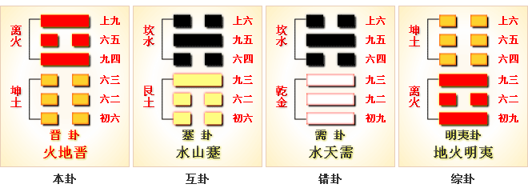

# 晋 ䷢ jìn

- No.35

> 晉，康侯用錫馬蕃庶，晝日三接。
>《彖》曰：晉，進也。明出地上，順而麗乎大明，柔進而上行，是以康侯用錫馬蕃庶，晝日三接也。
>《象》曰：明出地上，晉。君子以自昭明德。

> 初六，晉如摧如，貞吉。罔孚，裕无咎。
>《象》曰：晉如摧如，獨行正也；裕无咎，未受命也。

> 六二，晉如愁如，貞吉，受茲介福，于其王母。
>《象》曰：受茲介福，以中正也。

> 六三，眾允，悔亡。
>《象》曰：眾允之，志上行也。

> 九四，晉如鼫鼠，貞厲。
>《象》曰：鼫鼠貞厲，位不當也。

> 六五，悔亡，失得勿恤，往，吉无不利。
>《象》曰：失得勿恤，往有慶也。

> 上九，晉其角，維用伐邑，厲吉无咎，貞吝。
>《象》曰：維用伐邑，道未光也。

阴阳返复，进退不居，精粹气纯，是为游魂。
> 为阴极剥尽，阳道不可尽灭，故返阳道。道不复本位，为归魂例入卦。

金方以火、土运用事，与艮为飞伏。
> 己酉金，丙戌土。

诸侯居世，反应元士。建己卯至甲申，阴阳继候。
> 春分立秋。

积筭起甲申金至癸未土，周而复始。
> 游魂取象，配于正位，吉凶同矣。

五星从位起太白，
> 卦配金星入用。

翼宿从位降己酉金。
> 翼宿北方，入晋卦行事。

二象分候二十八运，配金土积筭。气候无差于晷刻，吉凶列陈，象在其中矣；天地运转，气在其中矣；乾道变化，万物通矣。
> 乾分八卦，至大有复卦。 

六爻交通，至于六卦，阴阳相资、相返、相克、相生，至游魂，复归本位为大有。故曰：“火在天上。”大有为归魂卦。定吉凶，配人事，五行。象乾为指归地。
> 凡八卦分为八宫，每宫八卦，八八六十四卦。定吉凶，配人事。天地、山泽、草木、日月、昆虫，包含气候，足矣。
　　　
# [Jìn ䷢](e6998bjin.md)
