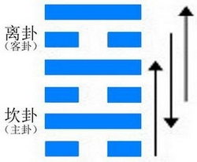
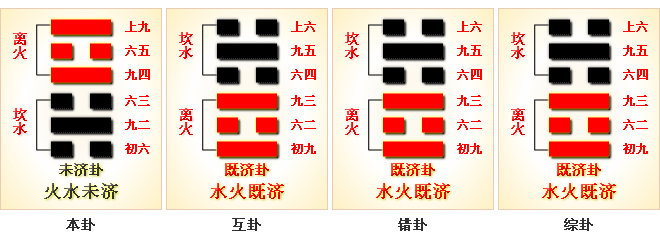
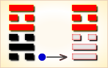
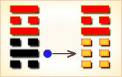
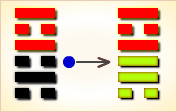
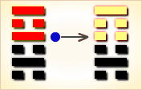
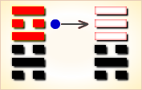
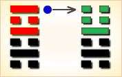

# 未济 ䷿



未济（wèi jì）卦，以未能渡过河为喻，阐明“物不可穷”的道理。

未济卦是既济的综卦，下坎上离，离为火，坎为水。火向上炎，水往下润，两两不相交。

卦中也是三阴三阳，两两相应，有同舟共济之象，故此卦“亨”。
但六爻均位不正，阴差阳错，若“小狐汔济，濡其尾，无攸利”。
小狐过河尾向上舒，可刚要到河边尾巴就被沾湿了，没有过去，以此喻事情尚未完结，还要向前发展。
未济是`2:5`卦的卦名，`2:5`是未济卦的代号。`2:5`卦的主卦是`2`卦坎卦，卦象是水，阳数是`2`；客卦是`5`卦离卦，卦象是火，阳数是`5`。

未济卦说明主方处境困难，受客方制约，为客方服务，在这种形势下应当做什么。
图中，天蓝色表示不当位的爻，箭头表示有应。未济卦中没有当位的爻。

- 寓意：物不可穷，穷则变，变则通，通则达。
- 卦象：下坎上离
- 代号：`2:5`
- 卦序：64

## 总述
### 起卦

未济卦是`2:5`卦的卦名，`2:5`是未济卦的代号。

`2:5`卦的主卦是`2`卦坎卦，卦象是水，特性是危险和困难；
客卦是`5`卦离卦，卦象是火，特性是明亮和依赖，全称：火水未济，“未济”的意思是“没有渡过”，

未济卦说明主方失败以后，处境困难，受客方制约，为客方服务，在这种形势下应当做什么。
起卦前必须客观地、全面地、准确地分析主方和客方的情况，必须至少符合下列条件之一，此卦才有参考价值：

1. 主方与水很相似，客方与火很相似。
2. 主方的阳数是`2`，客方的阳数是`5`。
3. 主方的行动是阴，素质是阳，态度是阴；客方的行动、素质和态度也是阳、阴和阳。

## 结构和卦爻辞

未济卦下部三条爻是主卦，代表主方；上部三条爻是客卦，代表客方。
箭头从阴爻指向阳爻，表示这一对爻是一阴一阳，有应，处于和谐状态。
一共有三个箭头，表示六条爻全部有应。图下是卦名和卦辞，卦辞从总体上说明当前主方的处境。
图右是爻辞，与爻一一对应，从下到上排列，比较形象地具体地说明完全抽象的爻的含义。

第一个箭头，从主卦下爻指向客卦下爻。下爻代表行动，主卦下爻阴，表示主方消极被动；客卦下爻阳，表示客方积极主动。积极主动的客方利用主方消极被动的机会取得发展，对客方有利，对主方不利。图中这两条爻都是灰色，表示不当位，就是说阴阳属性的位置不恰当。从主方利益考虑，应当是主方积极主动，客方消极被动，所以说不当位。不当位而又有应，对主方不利。从这点说主方应当极力扭转消极被动状态，但是，主方已经历了一段衰落过程，从乾卦衰落到巽卦，再从巽卦衰落到如今的坎卦，这是事物自身变化的规律，很难逆转。不过主方可以阴中有阳，在客方允许的情况下，采取积极行动，维护和改善自己的素质，保护自己的利益。

第二个箭头，从客卦中爻指向主卦中爻。中爻代表素质，比如说资金、教育程度、健康状况、实力等等。客卦中爻阴，表示客方素质不佳；主卦中爻阳，表示主方素质良好。在这种和谐状态下，尽管主方是阳，然而并不是对主方有利，而是对客方有利，因为素质不佳的客方可以从素质良好的主方获取补益。不过，由于素质是实力所在，是利益所在。

第三个箭头，从主卦上爻指向客卦上爻。上爻代表态度，主方阴，表示态度随和；客方阳表示态度强硬。态度强硬的客方可以制约态度随和的主方，这种和谐关系对客方有利，对主方不利。尽管对主方不利，不过主方很难改变它，因为上爻是对下爻的补充，主方阴，是因为实力虽然强大，但还表示非常强，没有足够的力量支持强硬态度，只好态度随和。另一方面，客方态度强硬，尽管没有实力支持，但是由于客方积极主动而素质得到改善，态度显得强硬。所以主方也很难改变目前状态，只得阴中有阳，在不触犯客方的情况下，采取适当的强硬态度维护自己的权益。

这三种和谐状态都对主方不利，这三对爻都不当位，因此未济卦的爻全部示以灰色。

维护自己的权益，维持稳定环境，避免情况进一步恶化。

删去爻辞中的判断词就可以看出，六条爻辞是一首完整的围绕主题“未济”的散文诗。下面是其译文：

```
（像小狐狸一样）弄湿了尾巴，
拖曳着车的轮子（过河），没有渡过河。
（被大国的国王）派用征伐鬼方国，
三年之后得到了国王奖赏，
依靠他的才能和力量，
取得了（国王的）信任。
受到信任饮些酒，无所怪罪；
（像小狐狸）弄湿了头，
（忘记了自己的危险处境），
有了信任也没用。
```

下面逐条说明卦爻辞。

## 卦辞
```
〖卦辞原文〗亨；小狐汔济，濡其尾，无攸利。

〖译文〗顺利；小狐狸将涉越过干涸的小河，
却打湿了尾巴，看来此行无所利。

〖解说〗2:5卦的六条爻全部有应，所以“亨”。
主方顺从于客方，把利益让于客方，
像“小狐汔济，濡其尾”，这对主方没有好处，“无攸利”。
“亨”是顺利的意思，事情虽然进展顺利，
但是，这并不对主方有利，而是“无攸利”。
“汔”（qì），接近，庶几，水涸。
```

## 爻辞
### 上九
```
〖原文〗有孚于饮酒，无咎；濡其首，有孚失是。

〖译文〗信任体现在饮酒上，无所怪罪；
酗酒弄湿了头，信任就体现错了，失掉了正道。

〖解说〗第六爻是客卦的上爻，
代表客方的态度，阳，表示客方态度强硬。
同时，主方态度随和，主方以谦让的态度，取得了客方的信任。
如果只是在一定范围内谦让，吃吃喝喝，主方不一定受到怪罪；
如果主方谦让过度，以致牺牲自己的首要利益，
弄湿了自己的头，就不对了。

〖结构分析〗第六爻的位置是阴位，
这条爻是阳爻，阳爻在阴位，
不当位，并且与三阴有应。
不当位表明客方态度强硬，
有可能制约主方，是潜在的对主方不利的因素；
有应表明主方态度随和，受到客方制约，
这潜在因素成了真正的对主方不利的因素。
这种状态是主方衰落的现实，
不应当受到怪罪，所以爻辞说“无咎”。
主方的素质优于客方，实力强于客方，
主方不需要对客方过于随和，所以爻辞说“濡其首，有孚失是”。

【象传】饮酒濡首，亦不知节也。
```

### 六五
```
〖原文〗贞吉，无悔；君子之光，有孚吉。

〖译文〗坚持下去吉利，没有悔恨；
依靠君子诚实守信的光辉，获得信任吉利。

〖解说〗第五爻是客卦的中爻，
代表客方的素质，阴，表示客方素质不佳，
比如说，资金缺乏、地位底下、
实力薄弱、教育程度低，等等，客方需要主方帮助。
主方坚持发挥自己素质上的优势，就吉利，没有悔恨。
“君子”指主方，主方素质上的优势是主方的光辉，
坚持发挥素质上的优势，取得客方信任，形势就对主方吉利。

〖结构分析〗第五爻的位置是阳位，
这条爻是阴爻，阴爻在阳位，
不当位，并且与二阳有应。
不当位表明客方素质不佳，
需要从主方的良好素质获取利益，
是潜在的对主方不利的因素；
有应表明主方素质良好，正好可以满足客方需要，
这潜在因素成了真正的对主方不利的因素。
由于客方依赖主方，主方为客方作贡献，
受到客方信任，可能维持比较安定的环境，
所以爻辞说“贞吉，无悔”，又说“吉”。

【象传】君子之光，其晖吉也。
```

### 九四
```
〖原文〗贞吉，悔亡；震用伐鬼方，三年有赏于大国。

〖译文〗坚持下去吉利，悔恨消失；
兴兵助殷讨伐鬼方，费时三年打败了鬼方，获得殷国的封赏。

〖解说〗第四爻是客卦的下爻，代表客方的行动，
阳，表示客方积极主动地谋取和扩大自己的利益，
比如说，创新、创业、投资、进攻、求职、示爱，等等。
客方积极主动地利用消极被动的主方为自己的利益服务，
在这种情况下，如果主方坚持适当地顺从客方的作法，
对主方是吉利的，主方的悔恨将消失。
就像是古时候周文王被纣王释放以后，
突然被任用征伐西部的鬼方国，三年后受到纣王的奖赏。
震，兴兵征战。

〖结构分析〗第四爻的位置是阴位，
这条爻是阳爻，阳爻在阴位，
不当位，并且与一阴有应。
不当位表明客方积极主动，
有可能损害主方利益，
是潜在的对主方不利的因素；
有应表明主方消极被动，
正好是客方积极主动发展的好机会，
这潜在因素成了真正的对主方不利的因素。
由于素质不佳的客方依赖素质良好的主方，
主方可以利用客方的依赖，顺从客方，
维持安定的环境，所以爻辞说“贞吉，悔亡”。

【象传】贞吉悔亡，志行也。
```

### 六三
```
〖原文〗未济，征凶，利涉大川。

〖译文〗没有渡过，征伐有凶险，利于涉越大江大河。

〖解说〗第三爻是主卦的上爻，
代表主方的态度，阴，表示主方态度随和。
而客方态度强硬，主方受制于客方，
难于达到自己的目的，“未济”。
如果采取强硬态度，则与客方的强硬态度冲突，“征凶”。
主方应当多与客方沟通，避免矛盾，改善自己的处境，“利涉大川”。

〖结构分析〗第三爻的位置是阳位，
这条爻是阴爻，阴爻在阳位，
不当位，并且与六阳有应，
在这种有应的和谐关系中，主方受客方制约，
有利于客方，不利于主方，所以爻辞说“征凶”。
由于主方素质良好，客方依赖主方，主方对客方随和，
可以保持比较安定的环境，所以爻辞说“利涉大川”。

【象传】未济征凶，位不当也。
```

### 九二
```
〖原文〗曳其轮，贞吉。

〖译文〗向后拖曳车轮不使急进，坚持下去吉利。

〖解说〗第二爻是主卦的中爻，
代表主方的素质，阳，表示主方素质良好，
比如说，主方有资金、有地位、有权力、有实力、有技术，等等。
主方安份守纪不急进，隐藏自己的良好素质，防止受损，“曳其轮”。
坚持保持良好素质，最终会有利于主方，“贞吉”。

〖结构分析〗第二爻的位置是阴位，
这条爻是阳爻，阳爻在阴位，不当位，并且与五阴有应。
这种有应关系，反映出在主客双方的素质方面是和谐协调的，
通过这种和谐协调关系，客方得益，主方受到损失，对于主方不利。
另一方面，由于素质不佳的客方从主方的良好素质获益，
客方依赖主方，主方可以利用客方的依赖，
保护和扩充自己的利益，对主方有利，所以爻辞说“贞吉”。

【象传】九二贞吉，中以行正也。
```

### 初六
```
〖原文〗濡其尾，吝。

〖译文〗弄湿了尾巴，难受，前进有困难。

〖解说〗第一爻是主卦的下爻，代表主方的行动，
阴，表示主方消极被动，
比如说，防守、退却、不想冒险、
不想探索或开辟新的发展领域、只求保持现状，等等。
同时，客方积极主动，主方受制于客方，“濡其尾”。
主方有困难，“吝”。

〖结构分析〗第一爻的位置是阳位，
这条爻是阴爻，阴爻在阳位，
不当位，并且与四阳有应。
不当位表明主方消极被动，
有可能受到客方攻击，是潜在的对主方不利的因素；
有应表明客方积极主动，正好可以利用主方的消极被动取得发展，
这潜在因素成了真正的对主方不利的因素。所以爻辞说“吝”。

【象传】濡其尾，亦不知极也。
```

## 释义

1. “初六，濡其尾，吝”，可既济卦“初九”“濡其尾”却“无咎”。这是因为，既济卦阴阳各得其位，而未济卦是阴阳失位；既济是成功之时，而未济是未成之时；既济初爻是处于离火之下，而未济初爻是处坎险之始，两卦的主客观条件不同，所以其占的结果就不一样。
2. “九二”以刚居坎险之中，虽上应“六五”，但在未济之时，“曳其轮，贞吉”。既济卦“曳其轮”只得到个“无咎”，而未济“曳其轮”却获“吉”，何也？他俩所处的时间不同，一个是已成之时，一个是未成之时；他们各居的爻位也不同，一个以阴居下，一个以阳得中，所以占卜的结果是有区别的。
3. “六三”以阴柔之质失正居险，上应“初九”。力不能自济，却要上进，故诫之“未济，征凶”。既然“征凶”为什么又“利涉大川”呢？这是从正面勉励之辞。三下乘“九二”上承“九四”两阳，互为离卦，有离火通明之象，故勉之与“九二”共进可排除险难，渡过大江大河。
4. “九四”之所以“贞吉”（占卜的结果吉祥），是因为三是“未济”，至此已经向既济转化。四以阳处阴则有悔，但已脱离坎险进入上离，下应“初六”，故“，悔亡”。“震用伐鬼方”与既济卦“高宗伐鬼方”说的不是同一个历史事件。这里说的是周公季历伐鬼戎。“三年有赏于大国”是说季历受到了殷王的奖赏。“高宗伐鬼方”是殷自己的事情，平定鬼方后事已完成，故说“既济”。而季历“伐鬼方”是为殷做事，只得到了一个“赏”，就灭商大计来说尚没有完成，故设在《未济》卦中。
5. “六五”以阴柔居尊而有悔，但下应“九二”，并有“九四”之佐，有同舟共济之象，故“贞吉，无悔”。处离卦之中，为文明之主，闪耀着“君子之光”，以诚相待，俟时可济，故“有孚，吉。”
6. “上九”处卦之极，物极则必反，由未济将转化为既济，可信于下，“我有好酒，吾与尔靡之”也无妨，故“有孚，于饮酒。”但又诫之“濡其首，有孚，失是”，如安逸过度，不能审时度势，一味信任于人而贸然前进，就会有既济卦上六“濡其首”之象，那就危险了。

未济卦是六十四卦最后一卦，事物至此好像是要终结了。但既济却从积极的角度阐发了“未济”之中必有“可济”之理。卦中下三爻皆在坎险之中，均尚不能“济”；上三爻处离明之中，可以“行”，但均诫之要“慎”。“祸兮福之所倚，福兮祸之所伏”（《老子·道德经》），事物是对立的又是统一的，福可转为祸，祸亦可转为福；既济可转为未济，未济也可转为既济，事物就在这否定之否定的对立统一中发展，永无止境。

### 彖传
```
未济亨，柔得中也；
小狐汔济，未出中也；
濡其尾，无攸利，不续终也。
虽不当位，刚柔应也。
```

### 象传
```
火在水上，未济；
君子以慎辨物居方。
```

## 卦意
### 火水未济（未济卦）事业未竟
### 中下卦

象曰：离地着人几丈深，是防偷营劫寨人，后封太岁为凶煞，时加谨慎祸不侵。

这个卦是异卦（下坎上离）相叠。离为火，坎为水。火上水下，火势压倒水势，救火大功未成，故称未济。《周易》以乾坤二卦为始，以既济、未济二卦为终，充分反映了变化发展的思想。



### 《断易天机》解

未济卦离上坎下，为离宫三世卦。未济就是未完成，此卦爻位不正，形象上极端恶劣，但变化在酝酿之中，未来充满希望。

### 北宋易学家 邵雍 解

不能资助，待时而动；由小而大，不可躁进。

得此卦者，运势不通，诸事不能如愿，宜由小及大，稳步进取，要耐心去突破难关，则终可成功。

### 台湾国学大儒 傅佩荣 解

- 时运：运势颠倒，务必谨慎。
- 财运：诸事不顺，步步为营。
- 家宅：改变方向；门户不合。
- 身体：血脉不顺，用药谨慎。

### 传统解卦
```
这个卦是异卦（下坎上离）相叠。
离为火，坎为水。
火上水下，火势压倒水势，救火大功未成，故称未济。
《周易》以乾坤二卦为始，以既济、未济二卦为终，
充分反映了变化发展的思想。

大象：水性下注，火势向上，水火不交，
阴阳不得正位，未能完成和未能成功之意。
```

运势：运气欠佳，但必须耐心突破难关，终可成功，有初凶后吉之象。

- 事业：处于最后的关键时刻，成功与否就在眼前，因此务必不可掉以轻心。自我节制非常重要，坚持到底，必要时也可能慎重地进行适度冒险，以成就事业。
- 经商：市场处于大变动的前夕，前景如何尚不明显。这是最为艰苦的时期，头脑必须冷静，切勿冒险，不可行动过度，适度节制，观察动向，决定行动。
- 求名：长期的努力和追求即会有结果。在成败的关键时刻应泰然自若，听天由命，顺其自然。
- 婚恋：已经渡过了困难阶段，再慎重地加把劲，会有美满的结果。
- 决策：此卦的意思是“未完成”，表明前途无量，有充分发展的可能。因此，必须坚持中正的原则，以明智、中庸、诚信、谦逊的态度，成就事业。面对人生，唯有勤勤恳恳，极力尽人事，听天命，不必过分计较成功与否。

### 台湾 张铭仁 解卦
```
未济：表示阴阳不调和，气血不顺。
人事情绪不顺应是最大的影响主因，
幸好此卦会有否极泰来之变化，
一切均会雨过天晴，值的等待。

解释：快要获利。

特性：思想高远，又缺乏耐性，
神经质，情绪不稳定，内心易有冲突感，
孤独感，悲观，感性。
宜往艺术哲学宗教发展。
```

运势：气运不通，诸事不能如愿，有初衰后盛之象。凡事要有耐心去突破难关，前途将大有可望。与人共谋事者，终有大利，可为之。

- 家运：初运不振，耐心熬过辛苦的路，可得幸福。
- 疾病：病情不稳定，注意心肾不交、失眠、血液等病。
- 胎孕：平安。
- 子女：子女迟得，但终有繁荣之象，将来都能振奋家声，以慰祖德。
- 周转：有不少困难，成败各半。
- 买卖：初限不佳，渐有好转之象。
- 等人：虽迟到，但有吉兆。
- 寻人：负气出走，会自己回来。
- 失物：不能寻回。
- 外出：积极行动，十分有利。
- 考试：不错，有好成绩。
- 诉讼：宜拖延时间，日久可得贵人之助，和解了事。
- 求事：枉费心机，无希望，再等候时机。
- 改行：可进行。
- 开业：勿因初时不佳而灰心，生意会转兴隆。

## 初六爻详解
### 初六爻辞

初六。濡其尾，吝。

象曰：濡其尾，亦不知极也。

### 白话文解释

初六：涉水渡河，沾湿了衣尾，前进有困难。

《象辞》说：涉水渡河，沾湿了衣尾，见微知巨，再冒险前进，是不知儆戒。

### 北宋易学家 邵雍 解

凶：得此爻者，经营不利，涉水行舟者，谨防溺水之患。做官的仕途有阻，不能前进。

### 台湾国学大儒 傅佩荣 解

- 时运：鲁莽行事，无路可走。
- 财运：不记教训，谋财无方。
- 家宅：门户方位不正；团聚不易。
- 身体：病在下身。

### 初六变卦：火水未济 变卦 火泽睽



初六爻动变得[第38卦：火泽睽](e79dbdkui_cn.md)。

这个卦是异卦（下兑上离）相叠。

离为火；兑为泽。

上火下泽，相违不相济。

克则生，往复无空。

万物有所不同，必有所异，相互矛盾。睽即矛盾。

## 九二爻详解
### 九二爻辞

九二。曳其轮，贞吉。

象曰：九二贞吉，中以行正也。

### 白话文解释

九二：提着腰带涉水过河。卜问得吉兆。

《象辞》说：九二爻辞讲贞吉，因为九二阳爻处下卦中位，像人行事遵循正道。

### 北宋易学家 邵雍 解

吉：得此爻者，安份守纪者，谋望遂意。做官的克服困难者，晋升有望。

### 台湾国学大儒 傅佩荣 解

- 时运：上下相得，无往不利。
- 财运：用心经营，满载而归。
- 家宅：美善之家；必得贤妇。
- 身体：胸腹阻滞。

### 九二变卦：火水未济 变卦



九二爻动变得[第35卦：火地晋](e6998bjin_cn.md)。

这个卦是异卦（下坤上离）相叠。

离为日，为光明；坤为地。

太阳高悬，普照大地。

大地卑顺，万物生长，光明磊落，柔进上行，喻事业蒸蒸日上。

## 六三爻详解
### 六三爻辞

六三。未济，征凶，利涉大川。

象曰：未济征凶，位不当也。

### 白话文解释

六三：渡不了河，出行有凶险。不利于涉水渡河。

《象辞》说：渡不了河，出行有凶险，因为六三阴爻居阳位，像人处境不利。

### 北宋易学家 邵雍 解

凶：得此爻者，宜见机行事，不宜妄动。做官的有因人成事之美。在商旅则涉川历险而利可获。

### 台湾国学大儒 傅佩荣 解

- 时运：见机而作，妄动则凶。
- 财运：把握良机，船运有利。
- 家宅：安居为宜；迎娶为吉。
- 身体：预防祸祟，渡川以解。

### 六三变卦：火水未济 变卦



六三爻动变得[第50卦：火风鼎](e9bc8eding_cn.md)。

这个卦是异卦（下巽上离）相叠。

燃木煮食，化生为熟，除旧布新的意思。

鼎为重宝大器，三足稳重之象。

煮食，喻食物充足，不再有困难和困扰。在此基础上宜变革，发展事业。

## 九四爻详解
### 九四爻辞

九四。贞吉，悔亡，震用伐鬼方。三年有赏于大国。

象曰：贞吉悔亡，志行也。

### 白话文解释

九四：吉利的贞卜，没有悔恨。大动干戈，助殷讨伐鬼方，费时三年，打败了它，获得殷国的奖赏。

《象辞》说：吉利的卜问，没有悔恨，说明志得意行。

### 北宋易学家 邵雍 解

吉：得此爻者，会得好人提举，获利丰厚。做官的会受到重用，名利双全。读书人会取得佳绩。

### 台湾国学大儒 傅佩荣 解

- 时运：志得意满，名利双全。
- 财运：远方经营，利润可观。
- 家宅：安居乐业；二年成婚。
- 身体：可保三年。

### 九四变卦：火水未济 变卦



九四爻动变得[第4卦：山水蒙](e89299meng_cn.md)。

这个卦是异卦（下坎上艮）相叠，

艮是山的形象，喻止；坎是水的形象，喻险。

卦形为山下有险，仍不停止前进，是为蒙昧，故称蒙卦。

但因把握时机，行动切合时宜，因此，具有启蒙和通达的卦象。

## 六五爻详解
### 六五爻辞

六五。贞吉，无悔，君子之光。有孚，吉。

象曰：君子之光，其晖吉也。

### 白话文解释

六五：吉利的贞卜，没有悔恨。打了胜仗，捕获了俘虏，这是君子的光荣，吉利。

《象辞》说：君子光荣，君子光明正大，自然吉利。

### 北宋易学家 邵雍 解

吉：得此爻者，谋望有成，财利丰厚。做官的能得到升迁。

### 台湾国学大儒 傅佩荣 解

- 时运：运势正旺，诸事皆吉。
- 财运：官方业务，获利稳定。
- 家宅：大吉之家；婚姻必成。
- 身体：神清气爽。

### 六五变卦：火水未济 变卦


 
六五爻动变得[第6卦：天水讼](e8aebcsong_cn.md)。

这个卦是异卦（下坎上乾）相叠。

同需卦相反，互为“综卦”。

乾为刚健，坎为险陷。

刚与险，健与险，彼此反对，定生争讼。争讼非善事，务必慎重戒惧。

## 上九爻详解
### 上九爻辞

上九。有孚于饮酒，无咎。濡其首，有孚失是。

象曰：饮酒濡首，亦不知节也。

### 白话文解释

上九：捕获了俘虏，饮酒庆贺。没有灾难，但酗酒闹事，头发都淋湿了。俘虏乘机作乱，将他们杀了。

《象辞》说：酗酒闹事头发都淋湿，也太不知节制了。

### 北宋易学家 邵雍 解

平：得此爻者，行险而顺，不良者有溺水之厄，纵酒之灾。做官的有望升迁。

### 台湾国学大儒 傅佩荣 解

- 时运：能知节俭，可保无虞。
- 财运：量入为出，永享其富。
- 家宅：勤俭持家；相敬如宾。
- 身体：饮食失节，不可不慎。

### 上九变卦：火水未济 变卦


 
上九爻动变得[第40卦：雷水解](e8a7a3xie_cn.md)。

这个卦是异卦（下坎上震）相叠。

震为雷、为动；坎为水、为险。

险在内，动在外。

严冬天地闭塞，静极而动。

万象更新，冬去春来，一切消除，是为解。

# [Wèi Jì ䷿](e69caae6b58eweiji.md)
