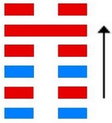
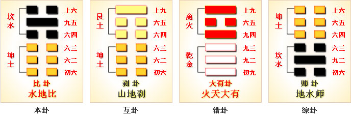
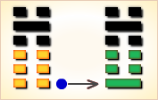
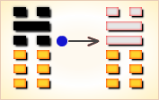

# 比 ䷇



“比”指比较。

比（bǐ）卦的代号是`0:2`，主卦是坤卦，卦象是地，阳数是`0`；客卦是坎卦，卦象是水，阳数是`2`。

主卦和客卦的下爻和上爻都相同，中爻是一阴一阳，主方素质不佳，客方素质良好。
在休闲状态下，主方比较一下自己和客方，适当采取一些主动，可能对主方有益。

图中，红色表示当位的爻，天蓝色表示不当位的爻，箭头表示有应。

比卦卦象为五条阴爻系于九五，象征团结一心。

《杂卦传》：“比乐，师忧。”
比者亲也，其字形为两人并坐，因为亲近，所以乐；师自争讼起，兵者凶器，所以忧。
比卦，水地比，诚信团结。

- 卦序：8

> 比，吉。原筮，元永貞，无咎。不寧方來，後夫凶。
>《彖》曰：比，吉也。比，輔也，下順從也。原筮元永貞，无咎，以剛中也。不寧方來，上下應也。後夫凶，其道窮也。
>《象》曰：地上有水，比。先王以建萬國，親諸侯。

> 初六，有孚比之，无咎；有孚盈缶，終來有它，吉。
>《象》曰：比之初六，有它吉也。

> 六二，比之自內，貞吉。
>《象》曰：比之自內，不自失也。

> 六三，比之匪人。
>《象》曰：比之匪人，不亦傷乎。

> 六四，外比之，貞吉。
>《象》曰：外比於賢，以從上也。

> 九五，顯比，王用三驅，失前禽。邑人不誡，吉。
>《象》曰：顯比之吉，位正中也；舍逆取順，失前禽也；邑人不誡，上使中也。

> 上六，比之无首，凶。
>《象》曰：比之无首，无所終也。

### 简介
```
水地比：坤为地，坎为水，地上有水。
水得地而蓄而流，地得水而柔而润，水与地亲密无间。
比者，辅也，密也。故比象征亲密比辅自然吉祥，
但应比辅于守持正固而有德的长者，择善而从。
【注解】
比：卦名，亲比，亲密的辅佐。
【释义】
此卦的卦名为比。
比卦展示“比”的形势下各种变化的可能性。
甲骨中的“比”字像两人步调一致，比肩而行的样子。
所以本义为为并列，并排之意。
前一卦为师，是打仗的意思，打仗胜利后，该开始治理国家了，
治理国家需要贤臣的辅佐，所以这一卦也有辅佐意思。
```

### 卦辞解释
```
比：吉。原筮①，元永贞，无咎。
不宁方来②。后夫凶。
彖曰：比，吉也，比，辅也，下顺从也。
原筮，元永贞，无咎，以刚中也。
不宁方来，上下应也③。后夫凶。其道穷也。
《象》曰：地上有水，比。先王以建万国，亲诸侯。
【注解】
①原筮：原来的筮辞。
②不宁：不安宁。
③上下应：指九五爻与六二爻相应。
【释义】
经文意思是：
比卦是一个吉祥的卦。
原来的筮辞是从开始便永远坚守正道，不会有灾难。
表示从不安宁的状态刚刚走出来，迟迟不来新比的人凶。
彖辞的意思是：比卦吉祥，比是辅佐、下顺的意思。
“原筮，元永贞，无咎”是因为九五刚健而中正。
刚刚从不安宁中走出来，是因为六二与九五相应。
迟迟不来亲比归顺的人凶险，是因为会无路可走。
象传的意思是：
上卦为坎为水，下卦为坤为地，
地上有水便是比卦的卦象。
先王在这样的时势下，卦建万国，亲近诸侯。
这一卦反映了武王登基后，群臣辅佐治理天下的史实。
武王分封各诸侯后，与诸侯相亲，诸侯也与武王相亲，
武王有姜子牙、周公、南宫括等一班贤人佐助，使四海归顺，
而不来归顺的则会有凶险，因为会得不到武王的亲比，
如果武王兴师问罪，自然是有灭国的危险了。 
```

### 初六
```
有孚比之，无咎。有孚盈缶，终来有它，吉。
《象》曰：比之初六，有它吉也。
经文意思是：有诚信结交朋友不会有灾难。
有诚信就好比美酒满缸，诚信会吸引更多的众来与你交往，吉祥。
象传意思是：处在最下层的初六广交朋友，会得到意外的吉祥。
初六处于比卦的最下层，严格来讲他还不能辅佐谁，
他只能广泛结交一些朋友，由于他的这些朋友与他一样，
都能一心辅佐九五，所以他会得到外的吉祥。
```

### 六二
```
比之自内，贞吉。
《象》曰：比之自内，不自失也。
经文的意思是：亲善内部人员，坚守正道吉祥。
象传意思是：亲善内部人员，会使自已不会受到损失。
六二处于下卦的中部得中又得位，又与九五相应，所以会吉祥。
作为大夫级别的他能够搞好统治阶级内部的团结，
并且坚守正道，一心辅佐九五的君王，所以不会有任何损失。
```

### 六三
```
比之匪人。
《象》曰：比之匪人，不亦伤乎。
经文意思是：与盗匪结交。
象传意思是：与盗匪结交，怎能不受到伤害呢？
六三则与六二不一样了，他无法与九五相应，因为有六四阻隔，
又无法与上六相应，因为同性相斥，而他面前的是一个坎卦，
坎卦为险为盗匪，所以六三有“比之匪人”的爻辞，
而其结果便可想而知了 —— 不亦伤乎！
```

### 六四
```
外比之，贞吉。
《象》曰：外比于贤，以从上也。
经文意思是：结交外面的朋友，守正道则吉祥。
象传意思是：结交外面贤明的人，是为了一起顺从九五君王。
六四位于君王之侧，得君王的信任，又以阴爻居于偶位，
他能够与下面的贤臣交往，并共同辅佐九五的君王，所以吉祥。
```

### 九五
```
显比，王用三驱，失前禽，邑人不诫，吉。
《象》曰：显比之吉，位正中也。
舍逆取顺，失前禽也。邑人不诫，上使中也。
经文意思是：光明正大的交往，
君王用三驱之礼狩猎，结果失去前面的禽兽。
老百姓不惧怕君王，吉祥。
象传意思是：光明正大的交往之所以会吉祥，
是因为九五保持中正。
舍弃叛离，客纳归顺，所以失去前面的禽兽；
百姓不惧怕君王，是因为君王以中正治国，平易近人。
君王亲比普天下的民众，以仁义之心治理天下。
他打猎时用三驱之礼，三驱之礼是说，
打猎时得到了一等猎物送到宗庙进行祭祀，
二等的猎物招待宾客，三等的猎物君王自已享用。
君王这样善待群臣，连老百姓见到他也不感到害怕，
这么贤明的君王，怎么会不吉祥呢？
```

### 上六
```
比之无首，凶。
《象》曰：比之无首，无所终也。
经文意思是：结交不到首领，凶。
象传意思是：结交不到首领，不会有善终。
上六处于比卦的最上面的位置，
可是下面的众阴爻都比亲于九五，
所以上六得不到众阴爻的比亲。
而他本为最上位，
又不能下来比亲九五，所以他的处境很凶险。
```

### 卦象

比卦上卦为坎为水，下卦为坤为地，地上有水便是比卦的卦象。

水在大地上流动，泥土因为有了水而湿润可以养育万物，这就像君王巡视四方，恩泽四方，群民与君王一条心，共同辅佐君王，而君王居安思危，能够严谨治国。

可见，这一卦确实是充满了喜悦与欢乐的。

### 卦画

比卦的卦画为一个阳爻五个阴爻，与师卦的卦画相似，只是排列顺序正好相反，师卦中的九二阳爻在比卦中来到了九五君位，象征君临天下，群臣辅佐。下面便通过卦象来对卦画进行具体的分析。

### 白话解析
```
比：吉。原筮①，元永贞，无咎。
不宁方②来后，夫凶。
【白话】筮得比卦，占断为吉善。
初筮得到了元始长久之占，没有灾咎。
但不宁方迟到，这就要遭殃了。
【注释】
①原筮：初筮，第一次筮占。
②不宁方：不安宁的邦国。方，邦国。
【讲解】比卦告诫君主要与民亲善，
和睦相处，只有安定团结，才能吉善美好。

初六：有复比之，无咎。有复盈缶①，终来有它②，吉。
【白话】筮得比卦，占得初六，
只要诚心诚意与民亲比，终归没有灾害。
只要诚心诚意地装满盛酒的器皿，
就能积少成多，杯水积成池塘，终于吉善。
【注释】
①盈缶：盈，满；缶，瓦器，
圆腹小口，用以盛酒浆等。
②有它：有意外的事。
【讲解】这条爻辞告诫君主诚心诚意与民亲比，
亲比的方法是一个一个地亲近团结，由近及远，由少到多。

六二：比之自内①，贞吉。
【白话】筮得比卦，占得六二，
从内部开始亲密，就能团结一致，贞问吉善。
【注释】①内：内部。
【讲解】“比之自内，贞吉”道出了亲比的程序和效果。

六三：比之匪①人。
【白话】筮得比卦，占得六三爻，没有人可以亲比。
【注释】①匪人：指行为不正当的人。
比之匪人 又可写成 比之非人，非：无。
【讲解】六三为阴爻居阳位。阴爻居阳位为失位。
六三与尚六无应，所以说“比之非人”。

六四：外①比之，贞吉。
【白话】筮得比卦，占得六四爻，
注意外部的团结，贞问吉善。
【注释】①外：外部。
【讲解】六四爻辞与六二爻辞分别从内外两个方面，
阐明了内外亲比的重要性。

九五：显比，王用三驱，失前禽①，邑人不戒，吉。
【白话】筮得比卦，占得九五，
突出团结的重要性，象君王田猎用三驱礼那样，
来者不拒，去者不追，邑人不杀，就一定能够吉善。
【注释】①王用三驱，失前禽：
比喻君王宽洪大量，降者不杀，奔者不禁，背敌不杀，
用仁爱恩惠建立起威信，是最好的亲比团结方法。
【讲解】这条爻辞告诫人们要宽洪大量，用仁爱恩惠团结教育人们。

尚六：比无首①，凶。
【白话】筮得比卦，占得尚六，
亲比而没有头脑，终归凶险。
【注释】①首：头脑。
【讲解】比卦卦爻辞告诫人们要团结、亲善，
团结要有方法，要有头脑，否则同样会遭遇凶险。
```

### 彖传解释
```
《彖传》说：
比，指亲密无间，团结互助，
吉祥的象征，下属顺从上级。
只要有诚意，不管怎么卜筮占问，能够辅佐有德行的长者，
长久不变地坚守正道，就不会有祸害。
如果没有诚意或有意不诚，必然凶多吉少，前途穷尽。
```

### 新解
```
比①：吉。
原筮②，元永贞，无咎。
不宁方③来， 后夫凶④。
初六：有孚比之⑤，无咎。
有孚盈缶⑥，终来有它⑦，吉。
六二：比之自内⑧，贞吉。
六三：比之匪人⑨。
六四：外比之⑩，贞吉。
九五：显比⑪。
王用三驱⑫，失前禽。
邑人不诫⑬，吉。
上六：比之无首⑭，凶。

【注释】
①比是本卦标题。
比的本义是亲密，在本卦中为一词多义。
由于“比”字 多次出现，本卦用它来作标题。
全卦的内容主要讲交往和团结。
②原筮： 再筮，指三人同时再占问。
③不宁方：不安宁的邦国，不愿臣服的邦国。
④后夫：迟到的诸侯。
⑤比：亲近、安抚。
⑥缶（fǒu）：瓦盆。 盈缶：用瓦盆装满酒饭。
⑦终来：即使。有它：有变故，有意外。
⑧比：团结一致。自内：自己内部。
⑨比：结党营私。匪人：不正派的人。
⑩外：外部，外国。
⑪显：外，这里表示广泛。
⑫王用三驱：君王打猎时让卫队从左右后三面，
把猎物驱赶到中间以便射猎。
⑬诫： 用作“骇”，惊吓。
⑭比：互相倾轧。无首：没有头脑，指没有核心。

【译文】
比卦：吉利。三人同时再占问，占问长久吉凶，没有灾祸。
不愿服从的邦国来了，迟迟不来的诸侯要受罚。
初六：抓到俘虏，安抚他们。没有灾祸。
抓到俘虏，装满酒 饭款待他们。即使有变故，结果吉利。
六二：自己内部团结一致，贞兆吉利。
六三：与不正派的人结党营私。
六四：与外国结盟亲善，贞兆吉利。
九五：广泛亲善。君王打猎时三面包围，只留一面让猎物逃走。
邑中百姓毫不惊骇，吉利。
上六：小人互相倾轧，不能团结一心，凶兆。

【读解】
讲了战争，紧接着讲团结、外交。
古人真是聪明无比，深谙 “胡萝卜加大棒”的真谛。
真正能王天下的人，必定能抓住时机，
恰到好处地施展软硬两招，绝不会四面树敌，
把自己逼到火山口上，也不会不以实力为后盾而盲目亲善妥协。
团结和外交也是一门大学问。
上下左右，圈内圈外，国内国外，东西南北中，都要纳入视线之中。
对弱者，为其撑腰打气。
对叛逆，三面合围，给一条出路。
对强者，谦恭又不失节。
对君子，彬彬有礼，动口不动手。
对小人，威胁加利诱。
手腕众多，可操作性很强，可借鉴的历史经验也不少，
反正，要随机应变，灵活机动，
因时制宜，因地制宜，因人制宜，才能立于不败之地。
四海之内皆兄弟，普天之下皆王土。
讲团结，搞外交，请不要忘了这个道义上的准则。
```



比卦坎上坤下，为坤宫归魂卦。比为相亲相依附之意，长期如此，就会无咎，所以吉祥。

水行地上，亲比欢乐；人情亲顺，百事无忧。得此卦者，可获朋友之助，众人之力，谋事有成，荣显之极。

- 时运：众人相贺，荣显之极。
- 财运：善人相扶，大发利市。
- 家宅：百年好合。
- 身体：心腹水肿，宜早求治。

```
这个卦是异卦，下坤上坎，相叠。坤为地，坎为水。
水附大地，地纳河海，相互依赖，亲密无间。
此卦与师卦完全相反，互为综卦。
它阐述的是相亲相辅，宽宏无私，精诚团结的道理。

《象传》：一阳统五阴，比邻相亲相辅，和乐之象。
```

运势：平顺，可得贵人提拔，凡事宜速战速决，不可过份迟疑。

- 事业：顺利能够成功，向前发展，可以得到他人的帮助和辅佐，以诚实、信任的态度去做事。待人宽厚、正直，主动热情，向才德高尚的人士学习，听取建议。
- 经商：愿望能够实现，且有较丰厚的利润，但需要与他人密切合作，真诚交往，讲究商业道德，遵守信义，如唯利是图，贪心不足，或自以为是，会导致严重损失。
- 求名：有成功的希望，不仅要靠个人的努力，更为重要的是他人的赏识和栽培。
- 婚恋：美好姻缘，相亲相爱，彼此忠诚，白头到老。
- 决策：心地善良，待人忠诚、厚道，乐于帮助他人，也能得到回报。工作勤恳，对自己要求严格，可以实现自己的理想，但要多动脑筋，多思考，善于判断是非，尤其要注意选择朋友，一旦结上品行不端的人，会成为自己的祸患。如果与比自己高明的人交朋友，并取得帮助，会终身受益。

```
比：表示兄友比肩而站，一片融合互持、比和之意。
主吉象。水溶入土中，胶和在一起，
是个很亲密的卦象，尤其是论男女之情。
事业投资有亲密的伙伴相助，
共同扶持打拼，事事当然顺利进行。

解释：平等、比合。

特性：勤劳，认真，善良，谦恭，务实，踏实，
重生活享受。异性缘多，感情烦恼也多。
```

运势：平顺可得贵人提拔，凡事宜速战速决，不可过份迟疑。

- 家运：合家和乐，家运亨通。
- 疾病：新病宜速就医，久病则危，为腹、肾、耳等疾。
- 胎孕：孕安。
- 子女：儿女温顺且侍亲至孝，亲情融合之象。
- 周转：必成、找同年之兄弟、朋友可成。
- 买卖：莫太贪心。交易反覆难成，勿贪则有利可成。
- 等人：会来。
- 寻人：不在杏花处，则是有妇人相留，不可寻，恐生不测之祸。此人会自己回来。
- 失物：不会再现。通常均已遭损毁。
- 外出：旅途平安，一路顺风。
- 考试：金榜题名。
- 诉讼：宜以和解态度面对，虽小人多，但可胜诉。
- 求事：有贵人帮助，可成。
- 改行：有利，可得友人支持。
- 开业：可大发利市，但须注意有人背叛。

### 初六：有孚比之，无咎。有孚盈缶，终来有它吉。《象》曰：比之初六，有它吉也。

捕获俘虏，安抚他们，没有灾难。捕获俘虏，满盆满罐的酒饭招待他们。虽然可能有意外之患，但最后是吉利的。《象传》说：筮遇初六之爻，虽有意外之患，但最后是吉利的。

吉：得此爻者，会遇到知己，谋事称心如意。做官的会有意外之喜。

- 时运：诚信交往，声名日隆。
- 财运：信用卓著，利益自来。
- 家宅：社区和睦；亲事亦谐。
- 身体：平安无事。



初六爻动变得[第3卦：水雷屯](e5b1afzhun_cn.md)。

这个卦是异卦，下震上坎，相叠。震为雷，喻动；坎为雨，喻险。雷雨交加，险象丛生，环境恶劣。“屯”原指植物萌生大地，万物始生，充满艰难险阻，然而顺时应运，必欣欣向荣。

### 六二：比之自内，贞吉。《象》曰：比之自内，不自失也。

内部和睦团结，卜问得吉兆。《象传》说：内部和睦团结，就不会失掉民心。

吉：得此爻者，得贵人之助，营谋遂意。做官的会无过失，安然而吉亨。读书人或能成名。女命则会得贤夫。

- 时运：实至名归，自然吉祥。
- 财运：同心协力，获利可期。
- 家宅：亲上加亲。
- 身体：心平气和，疾病可愈。


六二爻动变得[第29卦：坎为水](e59d8ekan_cn.md)。

这个卦是同卦，下坎上坎，相叠。坎为水、为险，两坎相重，险上加险，险阻重重。一阳陷二阴。所幸阴虚阳实，诚信可豁然贯通。虽险难重重，却方能显人性光彩。

### 六三：比之匪人。《象》曰：比之匪人，不亦伤乎。

跟败类狼狈为奸。《象传》说：跟败类狼狈为奸，不是很可悲吗？

凶：得此爻者，交友不慎，或有争诉，破财刑伤。做官的要谨防同僚不睦而造成不顺。女子则所嫁并非良人，破家丧身之象，不然则会争诉破财。

- 时运：交友不正，声名破败。
- 财运：所托非人，损耗难免。
- 家宅：戒慎嫁娶，以免遗憾。
- 身体：改求良医。


六三爻动变得[第39卦：水山蹇](e8b987jian_cn.md)。

这个卦是异卦，下艮上坎，相叠。坎为水，艮为山。山高水深，困难重重。人生险阻，见险而止，明哲保身，可谓智慧。
蹇，跋行艰难。

### 六四。外比之，贞吉。《象》曰：外比于贤，以从上也。

跟外邦联盟亲善，卜问得吉兆。《象传》说：外部亲附于贤明的国君，像臣下服从君上。

吉：得此爻者，出外有利，多得知己之力，事事顺利。做官的会有升迁之喜。

- 时运：得人赏识，功名可期。
- 财运：货物流通，利润自来。
- 家宅：一家和睦；外地定亲，吉。
- 身体：多做户外运动。



六四爻动变得[第45卦：泽地萃](e89083cui_cn.md)。

这个卦是异卦，下坤上兑，相叠。坤为地、为顺；兑为泽、为水。泽泛滥淹没大地，人众多相互斗争。危机必四伏，务必顺天任贤，未雨绸缪，柔顺而又和悦，彼此相得益彰，安居乐业。萃，聚集、团结。

### 九五：显比，王用三驱，失前禽。邑人不诫，吉。《象》曰：显比之吉，位正中也。舍逆取顺，失前禽也。邑人不诫，上使中也。

普遍的和洽。君王采用三面包围的方法狩猎，网开一面，有意放走逃奔的野兽。老百姓对君王狩猎毫不惊惧。筮遇此爻吉利。《象传》说：普遍的和洽是吉利的，因为九五之爻处于上卦中位，像人守中正之道。放走向前奔逃的，猎取迎面奔窜的，这就是“失前禽”的缘故。老百姓对君王狩猎毫不惊惧，因为君王平时行事端正。

吉：得此爻者，会先逆后顺，谋事有成，无往不利。做官的会有大的荣耀。读书人会考的佳绩。

- 时运：善待别人，后仍有吉。
- 财运：不贪小利，后有盈余。
- 家宅：和顺为宜。
- 身体：服药生效，不必过虑。


九五爻动变得[第2卦：坤为地](e59da4kun_cn.md)。

这个卦是同卦，下坤上坤，相叠。阴性。象征地（与乾卦相反），顺从天，承载万物，伸展无穷无尽。坤卦以雌马为象征，表明地道生育抚养万物，而又依天顺时，性情温顺。它以“先迷后得”证明“坤”顺从“乾”，依随“乾”，才能把握正确方向，遵循正道，获取吉利。

### 上六。比之无首，凶。《象》曰：比之无首，无所终也。

小人朋比为奸，勾心斗角，无法形成一个团结的中心，这是非常危险的事。《象传》说：小人朋比为奸，勾心斗角，无法形成一个团结的中心，当然没有好下场。

凶：得此爻者，刑克有灾，人情淡薄，甚者恐有性命之忧。做官的会失去下属的支持，处境危难。

- 时运：六神无主，恐有凶祸。
- 财运：白费心机，一无所获。
- 家宅：恐丧家主；婚嫁来历不明。
- 身体：小心头部疾病。


上六爻动变得[第20卦：风地观](e8a782guan_cn.md)。

这个卦是异卦，下坤上巽，相叠。风行地上，喻德教遍施。观卦与临卦互为综卦，交相使用。在上者以道义观天下；在下者以敬仰瞻上，人心顺服归从。

# [Bǐ ䷇](e6af94bi.md)
