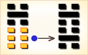
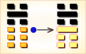

# 比 ䷇

比（䷇ bǐ）卦的代号是`0:2`，主卦是坤卦，卦象是地，阳数是`0`；客卦是坎卦，卦象是水，阳数是`2`。“比”，比较。主卦和客卦的下爻和上爻都相同，中爻是一阴一阳，主方素质不佳，客方素质良好。在休闲状态下，主方比较一下自己和客方，适当采取一些主动，可能对主方有益。比卦卦象为五条阴爻系于九五，象征团结一心。《杂卦传》：“比乐，师忧。”比者亲也，其字形为两人并坐，因为亲近，所以乐；师自争讼起，兵者凶器，所以忧。比卦，水地比，诚信团结。

图中，红色表示当位的爻，天蓝色表示不当位的爻，箭头表示有应。

- 卦序：8

> 比，吉。原筮，元永貞，无咎。不寧方來，後夫凶。
>《彖》曰：比，吉也。比，輔也，下順從也。原筮元永貞，无咎，以剛中也。不寧方來，上下應也。後夫凶，其道窮也。
>《象》曰：地上有水，比。先王以建萬國，親諸侯。

> 初六，有孚比之，无咎；有孚盈缶，終來有它，吉。
>《象》曰：比之初六，有它吉也。

> 六二，比之自內，貞吉。
>《象》曰：比之自內，不自失也。

> 六三，比之匪人。
>《象》曰：比之匪人，不亦傷乎。

> 六四，外比之，貞吉。
>《象》曰：外比於賢，以從上也。

> 九五，顯比，王用三驅，失前禽。邑人不誡，吉。
>《象》曰：顯比之吉，位正中也；舍逆取順，失前禽也；邑人不誡，上使中也。

> 上六，比之无首，凶。
>《象》曰：比之无首，无所終也。

> 比（䷇ bǐ）卦是异卦，下坤上坎，相叠。坤为地，坎为水。水附大地，地纳河海，相互依赖，亲密无间。此卦与师卦完全相反，互为综卦。它阐述的是相亲相辅，宽宏无私，精诚团结的道理。

>《象传》：一阳统五阴，比邻相亲相辅，和乐之象。

> 平顺，可得贵人提拔，凡事宜速战速决，不可过份迟疑。

- 事业：顺利能够成功，向前发展，可以得到他人的帮助和辅佐，以诚实、信任的态度去做事。待人宽厚、正直，主动热情，向才德高尚的人士学习，听取建议。
- 经商：愿望能够实现，且有较丰厚的利润，但需要与他人密切合作，真诚交往，讲究商业道德，遵守信义，如唯利是图，贪心不足，或自以为是，会导致严重损失。
- 求名：有成功的希望，不仅要靠个人的努力，更为重要的是他人的赏识和栽培。
- 婚恋：美好姻缘，相亲相爱，彼此忠诚，白头到老。
- 决策：心地善良，待人忠诚、厚道，乐于帮助他人，也能得到回报。工作勤恳，对自己要求严格，可以实现自己的理想，但要多动脑筋，多思考，善于判断是非，尤其要注意选择朋友，一旦结上品行不端的人，会成为自己的祸患。如果与比自己高明的人交朋友，并取得帮助，会终身受益。

比卦，坎上坤下，为[坤宫归魂卦](jing/kun.md#8)。比为相亲相依附之意，长期如此，就会无咎，所以吉祥。水行地上，亲比欢乐；人情亲顺，百事无忧。得此卦者，可获朋友之助，众人之力，谋事有成，荣显之极。

- 时运：众人相贺，荣显之极。
- 财运：善人相扶，大发利市。
- 家宅：百年好合。
- 身体：心腹水肿，宜早求治。

> 比：表示兄友比肩而站，一片融合互持、比和之意。主吉象。水溶入土中，胶和在一起，是个很亲密的卦象，尤其是论男女之情。事业投资有亲密的伙伴相助，共同扶持打拼，事事当然顺利进行。

> 解释：平等、比合。

> 特性：勤劳，认真，善良，谦恭，务实，踏实，重生活享受。异性缘多，感情烦恼也多。

> 运势：平顺可得贵人提拔，运势好转，凡事宜速战速决，不可过份迟疑，切忌孤军作战。

- 家运：合家和乐，家运亨通。
- 疾病：新病宜速就医，久病则危，为腹、肾、耳等疾。
- 胎孕：孕安。
- 子女：儿女温顺且侍亲至孝，亲情融合之象。
- 周转：必成、找同年之兄弟、朋友可成。
- 买卖：莫太贪心。交易反覆难成，勿贪则有利可成。
- 等人：会来。
- 寻人：不在杏花处，则是有妇人相留，不可寻，恐生不测之祸。此人会自己回来。
- 失物：不会再现。通常均已遭损毁。
- 外出：旅途平安，一路顺风。
- 考试：金榜题名。
- 诉讼：宜以和解态度面对，虽小人多，但可胜诉。
- 求事：有贵人帮助，可成。
- 改行：有利，可得友人支持。
- 开业：可大发利市，但须注意有人背叛。

### 初六：有孚比之，无咎。有孚盈缶，终来有它吉。《象》曰：比之初六，有它吉也。

捕获俘虏，安抚他们，没有灾难。捕获俘虏，满盆满罐的酒饭招待他们。虽然可能有意外之患，但最后是吉利的。《象传》：筮遇初六之爻，虽有意外之患，但最后是吉利的。

吉：得此爻者，会遇到知己，谋事称心如意。做官的会有意外之喜。

- 时运：诚信交往，声名日隆。
- 财运：信用卓著，利益自来。
- 家宅：社区和睦；亲事亦谐。
- 身体：平安无事。

初六爻动变得[第3卦：水雷屯](e5b1afzhun_cn.md)。

水雷屯䷂是异卦，下震上坎，相叠。震为雷，喻动；坎为雨，喻险。雷雨交加，险象丛生，环境恶劣。“屯”原指植物萌生大地，万物始生，充满艰难险阻，然而顺时应运，必欣欣向荣。

### 六二：比之自内，贞吉。《象》曰：比之自内，不自失也。

内部和睦团结，卜问得吉兆。《象传》：内部和睦团结，就不会失掉民心。

吉：得此爻者，得贵人之助，营谋遂意。做官的会无过失，安然而吉亨。读书人或能成名。女命则会得贤夫。

- 时运：实至名归，自然吉祥。
- 财运：同心协力，获利可期。
- 家宅：亲上加亲。
- 身体：心平气和，疾病可愈。

六二爻动变得[第29卦：坎为水](e59d8ekan_cn.md)。

坎为水䷜是同卦，下坎上坎，相叠。坎为水、为险，两坎相重，险上加险，险阻重重。一阳陷二阴。所幸阴虚阳实，诚信可豁然贯通。虽险难重重，却方能显人性光彩。

### 六三：比之匪人。《象》曰：比之匪人，不亦伤乎。

跟败类狼狈为奸。《象传》：跟败类狼狈为奸，不是很可悲吗？

凶：得此爻者，交友不慎，或有争诉，破财刑伤。做官的要谨防同僚不睦而造成不顺。女子则所嫁并非良人，破家丧身之象，不然则会争诉破财。

- 时运：交友不正，声名破败。
- 财运：所托非人，损耗难免。
- 家宅：戒慎嫁娶，以免遗憾。
- 身体：改求良医。

六三爻动变得[第39卦：水山蹇](e8b987jian_cn.md)。

水山蹇䷦是异卦，下艮上坎，相叠。坎为水，艮为山。山高水深，困难重重。人生险阻，见险而止，明哲保身，可谓智慧。
蹇，跋行艰难。

### 六四。外比之，贞吉。《象》曰：外比于贤，以从上也。

跟外邦联盟亲善，卜问得吉兆。《象传》：外部亲附于贤明的国君，像臣下服从君上。

吉：得此爻者，出外有利，多得知己之力，事事顺利。做官的会有升迁之喜。

- 时运：得人赏识，功名可期。
- 财运：货物流通，利润自来。
- 家宅：一家和睦；外地定亲，吉。
- 身体：多做户外运动。

六四爻动变得[第45卦：泽地萃](e89083cui_cn.md)。

泽地萃䷬是异卦，下坤上兑，相叠。坤为地、为顺；兑为泽、为水。泽泛滥淹没大地，人众多相互斗争。危机必四伏，务必顺天任贤，未雨绸缪，柔顺而又和悦，彼此相得益彰，安居乐业。萃，聚集、团结。

### 九五：显比，王用三驱，失前禽。邑人不诫，吉。《象》曰：显比之吉，位正中也。舍逆取顺，失前禽也。邑人不诫，上使中也。

普遍的和洽。君王采用三面包围的方法狩猎，网开一面，有意放走逃奔的野兽。老百姓对君王狩猎毫不惊惧。筮遇此爻吉利。《象传》：普遍的和洽是吉利的，因为九五之爻处于上卦中位，像人守中正之道。放走向前奔逃的，猎取迎面奔窜的，这就是“失前禽”的缘故。老百姓对君王狩猎毫不惊惧，因为君王平时行事端正。

吉：得此爻者，会先逆后顺，谋事有成，无往不利。做官的会有大的荣耀。读书人会考的佳绩。

- 时运：善待别人，后仍有吉。
- 财运：不贪小利，后有盈余。
- 家宅：和顺为宜。
- 身体：服药生效，不必过虑。

九五爻动变得[第2卦：坤为地](e59da4kun_cn.md)。

坤为地䷁是同卦，下坤上坤，相叠。阴性。象征地（与乾卦相反），顺从天，承载万物，伸展无穷无尽。坤卦以雌马为象征，表明地道生育抚养万物，而又依天顺时，性情温顺。它以“先迷后得”证明“坤”顺从“乾”，依随“乾”，才能把握正确方向，遵循正道，获取吉利。

### 上六。比之无首，凶。《象》曰：比之无首，无所终也。

小人朋比为奸，勾心斗角，无法形成一个团结的中心，这是非常危险的事。《象传》：小人朋比为奸，勾心斗角，无法形成一个团结的中心，当然没有好下场。

凶：得此爻者，刑克有灾，人情淡薄，甚者恐有性命之忧。做官的会失去下属的支持，处境危难。

- 时运：六神无主，恐有凶祸。
- 财运：白费心机，一无所获。
- 家宅：恐丧家主；婚嫁来历不明。
- 身体：小心头部疾病。

上六爻动变得[第20卦：风地观](e8a782guan_cn.md)。

风地观䷓是异卦，下坤上巽，相叠。风行地上，喻德教遍施。观卦与临卦互为综卦，交相使用。在上者以道义观天下；在下者以敬仰瞻上，人心顺服归从。

# [Bǐ ䷇](e6af94bi.md)
