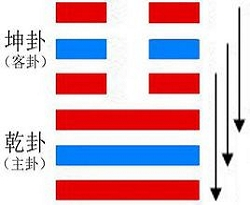

# ䷊ Tài

* The Great Arrives

> Chinese: tài 泰 ䷊

<a id="p-81"/>

In **䷊ Tài** (we see) the little gone and the great come. (It indicates that) there will be good fortune, with progress and success.

1.<a id="11.1"/> The first `NINE`, undivided, suggests the idea of grass pulled up, and bringing with it other stalks with whose roots it is connected. Advance (on the part of its subject) will be fortunate.

> **䷊** changing to [**䷭**](e58d87sheng.md)

> Matching Line 1 in Adjacent Hexagram: [**䷋**](e590a6pi.md#12.1)

2.<a id="11.2"/> The second `NINE`, undivided, shows one who can bear with the uncultivated, will cross the [Hé](https://zh.wikipedia.org/wiki/河) (河) without a boat, does not forget the distant, and has no (selfish) friendships. Thus does he prove himself acting in accordance with the course of the due Mean.

> **䷊** changing to [**䷣**](e6988ee5a4b7mingyi.md)

> Matching Line 2 in Adjacent Hexagram: [**䷋**](e590a6pi.md#12.2)

3.<a id="11.3"/> The third `NINE`, undivided, shows that, while there is no state of peace that is not liable to be disturbed, and no departure (of evil men) so that they shall not return, yet when one is firm and correct, as he realises the distresses that may arise, he will commit no error. There is no occasion for sadness at the certainty (of such recurring changes); and in this mood the happiness (of the present) may be (long) enjoyed.

> **䷊** changing to [**䷒**](e4b8b4lin.md)

> Matching Line 3 in Adjacent Hexagram: [**䷋**](e590a6pi.md#12.3)

<a id="p-82"/>

4.<a id="11.4"/> The fourth `SIX`, divided, shows its subject fluttering (down); -- not relying on his own rich resources, but calling in his neighbours. (They all come) not as having received warning, but in the sincerity (of their hearts).

> **䷊** changing to [**䷡**](e5a4a7e5a3aedazhuang.md)

> Matching Line 4 in Adjacent Hexagram: [**䷋**](e590a6pi.md#12.4)

5.<a id="11.5"/> The fifth six, divided, reminds us of (king) [Dì Yǐ](https://en.wikipedia.org/wiki/Di_Yi)'s (rule about the) marriage of his younger sister. By such a course there is happiness and there will be great good fortune.

> **䷊** changing to [**䷄**](e99c80xu.md)

> Matching Line 5 in Adjacent Hexagram: [**䷋**](e590a6pi.md#12.5)

6.<a id="11.6"/> The sixth six, divided, shows us the city wall returned into the moat. It is not the time to use the army. (The subject of the line) may, indeed, announce his orders to the people of his own city; but however correct and firm he may be, he will have cause for regret.

> **䷊** changing to [**䷙**](e5a4a7e89384daxu.md)

> Matching Line 6 in Adjacent Hexagram: [**䷋**](e590a6pi.md#12.6)

## Notes

The language of the [Tuàn](https://ctext.org/book-of-changes/tuan-zhuan) has reference to the form of **䷊ Tài**, with the three strong lines of **☰ Qián** below, and the three weak lines of **☷ Kūn** above. The former are `the great`, active and vigorous; the latter are `the small`, inactive and submissive. But where have the former `come` from, and whither are the latter gone? In many editions of the [Yì Jīng](https://en.wikipedia.org/wiki/I_Ching) beneath the hexagram of **䷊ Tài** here, there appears that of [**䷵ Guī Mèi**](e5bd92e5a6b9guimei.md), the 54th in order, which becomes **䷊ Tài**, if the third and fourth lines exchange places. But in the notes on the [Tuàn](https://ctext.org/book-of-changes/tuan-zhuan), in the [first Appendix, on hexagram 6](appendix01s1.md#fn_130), I have spoken of the doctrine of `changing figures`, and intimated my disbelief of it. The different hexagrams arose necessarily by the continued manipulation of the undivided and divided lines, and placing them each over itself and over the other. When [king Wén](https://en.wikipedia.org/wiki/King_Wen_of_Zhou) wrote these [Tuàn](https://ctext.org/book-of-changes/tuan-zhuan), he was taking the 64 hexagrams, as they were ready to his hand, and not forming one from another by any process of divination. The `gone` and `come` are merely equivalent to `below` and `above`, in the lower trigram **☰** or in the upper **☷**.

A course in which the motive forces are represented by the three strong, and the opposing by the three weak lines, must be progressive and successful. **䷊ Tài** is called the hexagram of the first month of the year, the first month of the natural spring, when for six months, through the fostering sun and genial skies, the processes of growth will be going on.

The symbolism of paragraph 1 is suggested by the three strong lines of **☰ Qián** all together, and all possessed by the same instinct to advance. The movement of the first will be supported by that of the others, and be fortunate.

The second line is strong, but in an even place. This is supposed to temper the strength of its subject; which is expressed by the first of his characteristics. But the even place is the central; and it is responded to by a proper correlate in the fifth line above. Hence come all the symbolism of the paragraph and the auspice of good fortune implied in it.

Beneath the symbolism in paragraph 3 there lies the persuasion of the constant change that is taking place in nature and in human affairs. As night succeeds to day, and winter to summer, so calamity may be expected to follow prosperity, and decay the flourishing of a state. The third is the last of the lines of **Qián ☰**, by whose strength and activity the happy state of **䷊ Tài** has been produced. Another aspect of things may be looked for; but by firmness and correctness the good estate of the present may be long continued.

According to the treatise on the [Tuàn](https://ctext.org/book-of-changes/tuan-zhuan), the subjects of the fourth and other upper lines are not 'the small returning' as opponents of the strong lines below, as is generally supposed; but as the correlates of those lines, of one heart and mind with them to maintain the state of **䷊ Tài**, and giving them, humbly but readily, all the help in their power.

[Dì Yǐ](https://en.wikipedia.org/wiki/Di_Yi), the last sovereign but one of the [Yīn](https://en.wiktionary.org/wiki/殷代) dynasty, reigned from B. C. 1191 to 1155; but what was the history of him and his sister here referred to we do not know. P. Regis assumes that he gave his sister in marriage to the lord of [Zhōu](https://en.wikipedia.org/wiki/Zhou_dynasty), known in subsequent time as [king Wén](https://en.wikipedia.org/wiki/King_Wen_of_Zhou), and that she was the famous [Tài Sì](https://en.wikipedia.org/wiki/Tai_Si); -- contrary to all the evidence I have been able to find on the subject. According to [Guǎn Zǐ](https://en.wikipedia.org/wiki/Guanzi_(text)), [Dì Yǐ](https://en.wikipedia.org/wiki/Di_Yi) was the first to enact a law that daughters of the royal house, in marrying princes of the states, should be in subjection to them, as if they were not superior to them in rank. Here line 5, while occupying the place of dignity and authority in the hexagram, is yet a weak line in the place of a strong and its subject, accordingly, humbly condescends to his one, strong and proper correlate in line 2.

The course denoted by **䷊ Tài** has been run; and will be followed by one of a different and unhappy character. The earth dug from the moat had been built up to form a protecting wall; but it is now again fallen into the ditch. War will only aggravate the evil; and however the ruler may address good proclamations to himself and the people of his capital, the coming evil cannot be altogether averted.

# [泰 ䷊](e6b3b0tai_cn.md)
